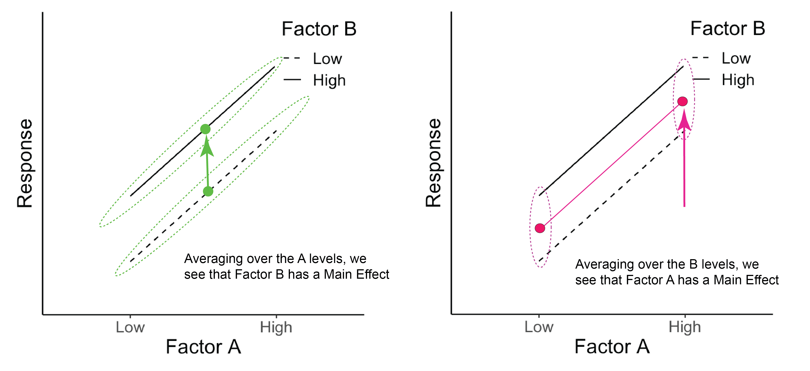
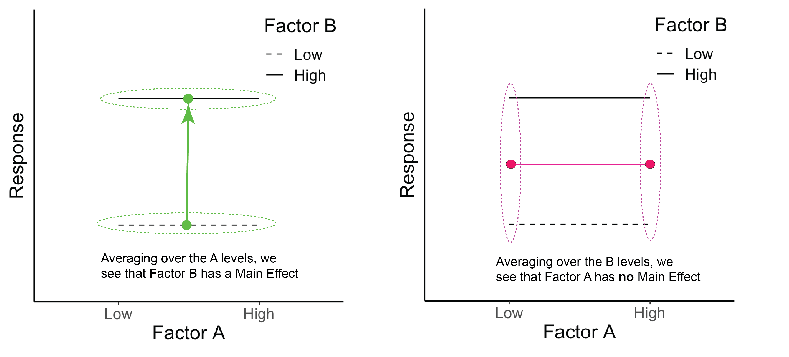
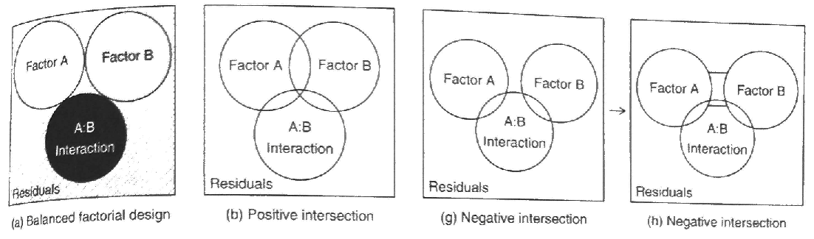
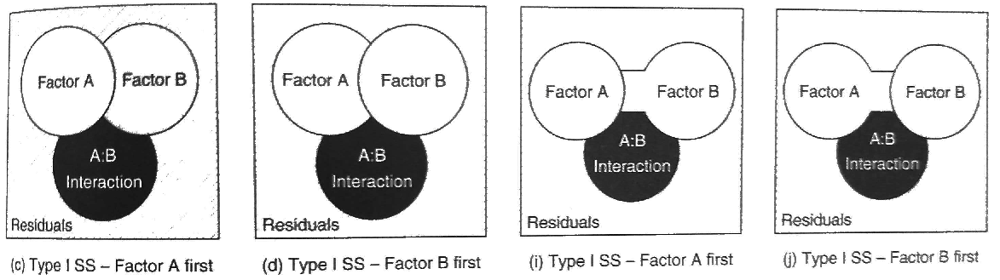
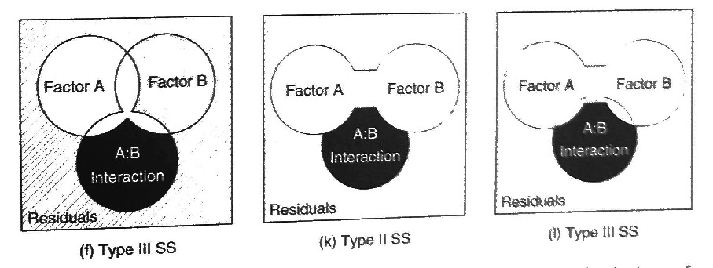
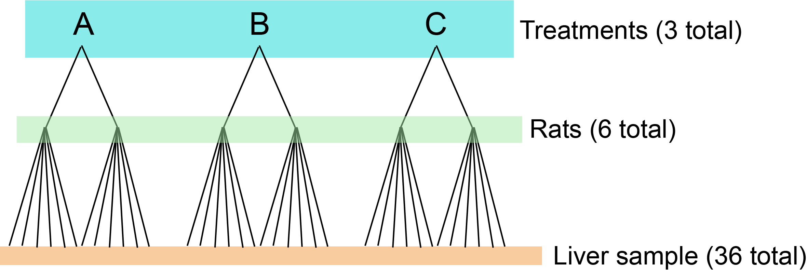
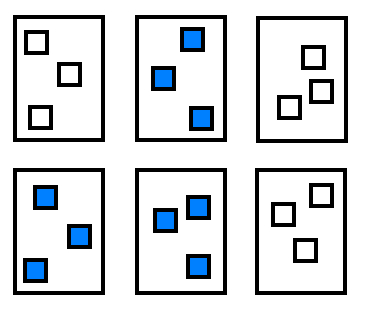

Week 12 Lecture
=============

```{r include=FALSE, warning=FALSE}
library(ggplot2)
text.size <- 16
```

## Week 12 Readings

For this week, I suggest reading Aho Sections 7.65 and 10.8-10.14, as well as Logan Chapters 11-12. You will also need to read [Hurlbert (1984)](https://github.com/hlynch/Biometry2022/tree/master/_data/Hurlbert_1984.pdf). Note that I have long considered eliminating this paper because Hurlbert has made statements in the public sphere that many find offensive (regarding politics, not statistics), I continue to assign this paper because the paper itself is so well known that it would be a disservice not to familiarize everyone with the topics and terminology introduced here. We will discuss this paper at length in class and while it is a bit long, I would encourage you to read it carefully. Here is a nice simple overview on [two factor designs](https://github.com/hlynch/Biometry2022/tree/master/_data/Krzywinski_Altman_2014d.pdf) worth reading as well. There are several other (very short) papers that may help clarify some of the more nuanced issues of this week, on ['blocking' in ANOVA](https://github.com/hlynch/Biometry2022/tree/master/_data/Krzywinski_Altman_2014c.pdf), [split plot designs](https://github.com/hlynch/Biometry2022/tree/master/_data/Altman_Krzywinski_2015b.pdf), and [nested designs](https://github.com/hlynch/Biometry2022/tree/master/_data/Krzywinski_etal_2014.pdf).

## Week 12 outline

1. ANOVA for two-way factorial design

2. 

   (a) Dealing with unbalanced design – unequal sample sizes: Type I, II, and III SS

   (b) Dealing with unbalanced design- missing cells
    
3. ANOVA for two-way nested design

4. Some more experimental design

Review: ANOVA with one factor
----------------

With single factor ANOVA, we compared multiple levels of a factor. Another way to say this is that we only had one categorical covariate in our linear model (e.g., the effect of zinc concentration on diatom diversity).

```{r echo=FALSE, fig.height=4, fig.width=4}
medley <- read.csv("_data/medley.csv", header = TRUE)
medley$ZINC <- factor(medley$ZINC, levels = c("HIGH", "MED", "LOW", "BACK"))
ggplot(data = medley, aes(x = ZINC, y = DIVERSITY)) + geom_boxplot() +
  labs(x = "Zinc level", y = "Diatom diversity") + theme_classic() + 
  theme(text = element_text(size = text.size))
```

## ANOVA with more than one factor

With two-way (and higher) ANOVA, we look at more than one factor at a time (e.g., the effect of density and season on limpet egg production). There are different ways in which multiple factors can be modeled, and this depends on the design of your study. We will focus our discussion primarily on two ways in which multiple factors can be applied in an experimental design: Nested vs Factorial. Note that in some complicated experiments, there may be elements that are nested and others that are factorial. This will become clear as we work through some examples.

In this example below, the factors are crossed (two-way factorial design).

```{r echo=FALSE, fig.height=4, fig.width=5.5}
quinn <- read.csv("_data/quinn.csv", header = TRUE)
quinn$DENSITY <- factor(as.character(quinn$DENSITY), levels = c("8", "15", "30", "45"))
ggplot(data = quinn, aes(x = DENSITY, y = EGGS)) + 
  facet_grid(. ~ SEASON) + geom_boxplot() +
  labs(x = "Density", y = "Num. egg masses/limpet") + theme_classic() + 
  theme(text = element_text(size = text.size))
```

The two factors are fully crossed, or all combinations of factors are included in the design and every level of every factor occurs in combination with every level of the other factors.

We will start with factorial designs because these are the most logical extension of the one-way analyses we discussed last week.

## Two-way ANOVA factorial designs

In the previous example, the number of egg masses per limpet was measured at different densities (factor A) and in different seasons (factor B). Two-way factorial designs can be represented in a table, where each cell is a combination of factor A and factor B. Each cell has multiple replicates.

| Factor level | $B_1$        | $B_2$       |
| ------------------- |:---------:|:---------:|
| $A_1$ | 8 animals/enclosure, spring | 8 animals/enclosure, summer |
| $A_2$ | 15 animals/enclosure, spring | 15 animals/enclosure, summer |
| $A_3$ | 30 animals/enclosure, spring | 30 animals/enclosure, summer |
| $A_4$ | 45 animals/enclosure, spring | 45 animals/enclosure, summer |

In a two-way factorial design, adding in an additional factor gives us a new issue to contend with. We are trying to measure the effect of factor A, marginalizing across factor B, or the effect of factor B, marginalizing across factor A. The marginal means for density (averaged across both seasons) and for season (averaged across all densities) are shown:

```{r echo=FALSE, fig.height=3, fig.width=3}
ggplot(data = quinn, aes(x = DENSITY, y = EGGS)) + 
  geom_boxplot() +
  labs(x = "Density", y = "Num. egg masses/limpet") + theme_classic() + 
  theme(text = element_text(size = text.size))
ggplot(data = quinn, aes(x = SEASON, y = EGGS)) + 
  geom_boxplot() +
  labs(x = "Season", y = "Num. egg masses/limpet") + theme_classic() + 
  theme(text = element_text(size = text.size))
```

But, what if season has an effect on density, or, the two factors influence one another? With two-way designs we need to account for this. We call this potential $\text{factor} \times \text{factor}$ influence an **interaction**, which we include in our model as a parameter that allows for the effect of factor A to depend on factor B.

For a hypothetical example, let's say we are measuring plant biomass in different fertilizer treatments (factor A, levels 1-3: low N, ambient N, and high N) and  watering treatments (factor B, levels 1-4: no water, low water, ambient water, excess water), where $Y_{ijk}$ is the $k^{\text{th}}$ individual with fertilizer treatment $i$ and watering treatment $j$. All possible combinations of treatments were measured. Interaction term ${AB}_{ij}$ allows for the effect of watering treatment to depend on fertilizer treatment (and vice versa).

$$
Y_{ijk} = \mu + A_i + B_j + {AB}_{ij} + \epsilon_{ijk} \text{, where } \epsilon_{ijk} \sim \mathrm{N} ( 0, \sigma^2 )
$$

**Question: What is $A_i$?**

<details>
  <summary>Click for Answer</summary>
<span style="color: blueviolet;">
The effect of fertilizer treatment $i$, $\mu_i - \mu$. The effect of treatment $i$ is the mean for factor A, level $i$, pooling across all levels for factor B.
</span>
</details> 

<p>&nbsp;</p>

**Question: How do we write the model for the 2nd individual plant in the fertilizer treatment "low N" and the watering treatment "excess water"?**

<details>
  <summary>Click for Answer</summary>
<span style="color: blueviolet;">
$Y_{142} = \mu + A_1 + B_4 + {AB}_{14} + \epsilon_{142} \text{, where } \epsilon_{142} \sim \mathrm{N} ( 0, \sigma^2 )$
</span>
</details> 

<p>&nbsp;</p>

Each level of one factor is applied to all levels of the other factor, and all combinations are replicated.

Factor A, fertilizer treatment, has 3 levels and factor B (watering treatment) has 4 levels, so we have 12 possible combinations of factor A and B that must be represented. In a balanced design, you would have the same number of samples in each of the 12 combinations of factors A and B.

| Factor level | $B_1$        | $B_2$       | $B_3$        | $B_4$         |
| ------------------- |:---------:|:---------:|:---------:|:---------:|
| $A_1$ | $A_1 ,  B_1 = Y_{111}$ <br> $A_1 ,  B_1 = Y_{112}$ <br> $A_1 ,  B_1 = Y_{113}$| $A_1 ,  B_2 = Y_{121}$ <br> $A_1 ,  B_2 = Y_{122}$ <br> $A_1 ,  B_2 = Y_{123}$ | $A_1 ,  B_3 = Y_{131}$ <br> $A_1 ,  B_3 = Y_{132}$ <br> $A_1 ,  B_3 = Y_{133}$ | $A_1 ,  B_4 = Y_{141}$ <br> $A_1 ,  B_4 = Y_{142}$ <br> $A_1 ,  B_4 = Y_{143}$ |
| $A_2$ | $A_2 ,  B_1 = Y_{211}$ <br> $A_2 ,  B_1 = Y_{212}$ <br> $A_2 ,  B_1 = Y_{213}$ | $A_2 ,  B_2 = Y_{221}$ <br> $A_2 ,  B_2 = Y_{222}$ <br> $A_2 ,  B_2 = Y_{223}$ | $A_2 ,  B_3 = Y_{231}$ <br> $A_2 ,  B_3 = Y_{232}$ <br> $A_2 ,  B_3 = Y_{233}$ | $A_2 ,  B_4 = Y_{241}$ <br> $A_2 ,  B_4 = Y_{242}$ <br> $A_2 ,  B_4 = Y_{243}$ |
| $A_3$ | $A_3 ,  B_1 = Y_{311}$ <br> $A_3 ,  B_1 = Y_{312}$ <br> $A_3 ,  B_1 = Y_{313}$ | $A_3 ,  B_2 = Y_{321}$ <br> $A_3 ,  B_2 = Y_{322}$ <br> $A_3 ,  B_2 = Y_{323}$ | $A_3 ,  B_3 = Y_{331}$ <br> $A_3 ,  B_3 = Y_{332}$ <br> $A_3 ,  B_3 = Y_{333}$ | $A_3 ,  B_4 = Y_{341}$ <br> $A_3 ,  B_4 = Y_{342}$ <br> $A_3 ,  B_4 = Y_{343}$ |


**Question: How would you find the mean biomass for factor B, level 1 (no water)?**

<details>
  <summary>Click for Answer</summary>
<span style="color: blueviolet;">
$\bar{Y}_j = \bar{Y}_1$ = mean of all biomass values in column 1
</span>
</details> 

<p>&nbsp;</p>

**Question: What about the mean for factor A, level 3 (high N)?**

<details>
  <summary>Click for Answer</summary>
<span style="color: blueviolet;">
$\bar{Y}_i = \bar{Y}_3$ = mean of all biomass values in row 3
</span>
</details> 

<p>&nbsp;</p>

**Question: What about the mean for factor A, level 2 AND factor B, level 4 (ambient N, excess water)?**

<details>
  <summary>Click for Answer</summary>
<span style="color: blueviolet;">
$\bar{Y}_{ij} = \bar{Y}_{24}$ = mean of all biomass values in the cell in row 2 and column 4
</span>
</details> 

<p>&nbsp;</p>

Interactions occur when: 

$$
\text{Effect of factor A alone} + \text{Effect of factor B alone} \neq \text{Effect of A and B together}
$$ 

Let's go through multiple examples of hypothetical two-way factorial ANOVA results to interpret the main effects and interactions in each outcome.

<p>&nbsp;</p>

**<span style="color: red;">Example #1</span>**

```{r echo = FALSE, fig.width=4, fig.height=4}
response <- c(1.5, 0.5, 1, 0.4)
factorA <- c("High", "Low", "High", "Low")
factorB <- c("High", "High", "Low", "Low")
dat <- data.frame(response, factorA, factorB)
dat$factorA <- factor(dat$factorA, levels = c("Low", "High"))
dat$factorB <- factor(dat$factorB, levels = c("Low", "High"))
ggplot(dat, aes(x = factorA, y = response, group = factorB)) + geom_line(aes(linetype = factorB)) +
  coord_cartesian(ylim = c(0, 2.1)) + labs(y = "Response", x = "Factor A") +
  scale_linetype_manual(name = "Factor B", values = c("dashed", "solid")) +
  theme_classic() +
  theme(text = element_text(size = text.size), axis.ticks.y = element_blank(), axis.text.y = element_blank(),
        legend.justification = c(1, 1), legend.position = c(1, 1))
```

A large positive value for factor A is associated with an increase in the response variable, a large positive value for factor B is associated with an increase in the response variable, and there is an interaction of A $\times$ B, showing that B has little effect at low A, but a large effect at high A. We can see this more clearly in the diagram below. For evaluating the main effect of factor B (left panel), we average across ('marginalize out') all the A levels and see the impact of changing the B level. Likewise, evaluating the main effect of factor A (right panel) requires us to average across all the B levels. In both cases, when we average across the levels of the other factor, we see that both A and B are associated with a change in the mean response. (There is also an interaction here as well.)

```{r echo=FALSE, fig.align='center', fig.cap='The green dots represent the average across Factor A for each B level. The pink dots represent the average across Factor B for each A level.', out.width='100%'}
knitr::include_graphics('Two_Way_Main_Effects_1.png')
```

<p>&nbsp;</p>

**<span style="color: red;">Example #2</span>**

```{r echo = FALSE, fig.width=4, fig.height=4}
response <- c(1.8, 0.8, 1.3, 0.3)
factorA <- c("High", "Low", "High", "Low")
factorB <- c("High", "High", "Low", "Low")
dat <- data.frame(response, factorA, factorB)
dat$factorA <- factor(dat$factorA, levels = c("Low", "High"))
dat$factorB <- factor(dat$factorB, levels = c("Low", "High"))
ggplot(dat, aes(x = factorA, y = response, group = factorB)) + geom_line(aes(linetype = factorB)) +
  coord_cartesian(ylim = c(0, 2.1)) + labs(y = "Response", x = "Factor A") +
  scale_linetype_manual(name = "Factor B", values = c("dashed", "solid")) +
  theme_classic() +
  theme(text = element_text(size = text.size), axis.ticks.y = element_blank(), axis.text.y = element_blank(),
        legend.justification = c(1, 1), legend.position = c(1, 1))
```

Once again, we can see the main effects by averaging across the levels of the other factor. Here both A and B have a main effect on the response, but there is no interaction because the effect of factor A is the same for both levels of factor B (and vice versa).

```{r echo=FALSE, fig.align='center', fig.cap='The green dots represent the average across Factor A for each B level. The pink dots represent the average across Factor B for each A level.', out.width='100%'}

```

<p>&nbsp;</p>

**<span style="color: red;">Example #3</span>**

```{r echo = FALSE, fig.width=4, fig.height=4}
response <- c(1.5, 1.5, 0.5, 0.5)
factorA <- c("High", "Low", "High", "Low")
factorB <- c("High", "High", "Low", "Low")
dat <- data.frame(response, factorA, factorB)
dat$factorA <- factor(dat$factorA, levels = c("Low", "High"))
dat$factorB <- factor(dat$factorB, levels = c("Low", "High"))
ggplot(dat, aes(x = factorA, y = response, group = factorB)) + geom_line(aes(linetype = factorB)) +
  coord_cartesian(ylim = c(0, 2.1)) + labs(y = "Response", x = "Factor A") +
  scale_linetype_manual(name = "Factor B", values = c("dashed", "solid")) +
  theme_classic() +
  theme(text = element_text(size = text.size), axis.ticks.y = element_blank(), axis.text.y = element_blank(),
        legend.justification = c(1, 1), legend.position = c(1, 1))
```

Below we can see that there is no main effect for Factor A because when we average over the levels of B, A has no effect on the response (right panel). There is, however, a main effect of B (left panel). There is no interaction of A $\times$ B.

```{r echo=FALSE, fig.align='center', fig.cap='The green dots represent the average across Factor A for each B level. The pink dots represent the average across Factor B for each A level.', out.width='100%'}

```

<p>&nbsp;</p>

**<span style="color: red;">Example #4</span>**

```{r echo = FALSE, fig.width=4, fig.height=4}
response <- c(2, 1, 1, 2)
factorA <- c("High", "Low", "High", "Low")
factorB <- c("High", "High", "Low", "Low")
dat <- data.frame(response, factorA, factorB)
dat$factorA <- factor(dat$factorA, levels = c("Low", "High"))
dat$factorB <- factor(dat$factorB, levels = c("Low", "High"))
ggplot(dat, aes(x = factorA, y = response, group = factorB)) + geom_line(aes(linetype = factorB)) +
  coord_cartesian(ylim = c(0, 2.1)) + labs(y = "Response", x = "Factor A") +
  scale_linetype_manual(name = "Factor B", values = c("dashed", "solid")) +
  theme_classic() +
  theme(text = element_text(size = text.size), axis.ticks.y = element_blank(), axis.text.y = element_blank(),
        legend.justification = c(1, 1), legend.position = c(1, 1))
```

Below we see that Factor A has no main effect (right panel) and Factor B also has no main effect (left panel). There is, however, an interaction of A $\times$ B. In fact, the effect of A is negative for B=Low and positive for B=High. 


```{r echo=FALSE, fig.align='center', fig.cap='The green dots represent the average across Factor A for each B level. The pink dots represent the average across Factor B for each A level.', out.width='100%'}
knitr::include_graphics('Two_Way_Main_Effects_4.png')
```

Let's continue interpreting two-way ANOVA plots of main effects and interactions with Aho Fig. 10.9. The response variable is biomass. Factor A, water level, is shown on the x-axis, and factor B, nutrient level, is shown with the line type, where a solid line represents added N, and a dashed line represents the control.

```{r echo = FALSE, fig.width=6, fig.height=6}
library(asbio)
Fig.10.9 <- function() {
par(mfrow=c(2,2))
par(mar=c(1.5,4.2,2.2,0.5))
##(a)
biomass<-c(12.7,13.7,14.7,15.7,16.7,17.7,13,14,15,16,17,18)
Fert<-rep(c("Co","Co","Co","N+","N+","N+"),2)
Water<-rep(c("Dry","Mesic","Wet"),4)
interaction.plot(x.factor=Water,trace.factor=Fert,
response=biomass,ylab="Mean biomass",xlab="",xaxt="n",legend=FALSE, cex.lab=1.5)
##(b)
par(mar=c(1.5,2.5,2.2,1.2))
biomass<-c(14.6,15.1,14.7,16.2,16.7,16.6,14.8,15.2,15,16.6,17,17.2)
Fert<-rep(c("Co","Co","Co","N+","N+","N+"),2)
Water<-rep(c("Dry","Mesic","Wet"),4)
interaction.plot(x.factor=Water,trace.factor=Fert,
response=biomass,ylab="Mean biomass",legend=FALSE,xlab="",xaxt="n", cex.lab=1.5)
##(c)
par(mar=c(4.2,4.2,0,0.5))
biomass<-c(14.6,15.1,14.7,16.2,16.7,12.6,14.8,15.2,15,16.6,17,12.2)
Fert<-rep(c("Co","Co","Co","N+","N+","N+"),2)
Water<-rep(c("Dry","Mesic","Wet"),4)
interaction.plot(x.factor=Water,trace.factor=Fert,
response=biomass,ylab="Mean biomass",legend=FALSE, cex.lab =1.5)
##(d)
par(mar=c(4.2,2.5,0,1.2))
biomass<-c(14.6,15.1,12.4,16.2,16.7,17.6,14.8,15.2,12,16.6,17,17.2)
Fert<-rep(c("Co","Co","Co","N+","N+","N+"),2)
Water<-rep(c("Dry","Mesic","Wet"),4)
interaction.plot(x.factor=Water,trace.factor=Fert,
response=biomass,ylab="Mean biomass",legend=FALSE,cex.lab=1.5)

mtext("(a)",3,outer = TRUE, at = .025, line = -1.8, cex = 1.6)
mtext("(b)",3,outer = TRUE, at = .52, line = -1.8, cex = 1.6)
mtext("(c)",3,outer = TRUE, at = .025, line = -18, cex = 1.6)
mtext("(d)",3,outer = TRUE, at = .52, line = -18, cex = 1.6)
}

Fig.10.9()
```

**Question: How would you interpret these results for each scenario (a,b,c, and d)?**

<details>
  <summary>Click for Answer</summary>
<span style="color: blueviolet;">
a) Water has a positive effect on biomass, Fertilization has a positive effect on biomass, and there is no significant interaction. b) There is no effect of water on biomass, Fertilization has a positive effect on biomass and there is no significant interaction. c) A significant interaction obscures the main effects. In wet conditions, Fertilizer has a negative effect on biomass. In dry conditions, Fertilizer has a positive effect on biomass. d) There is still an interaction, but it doesn't change (or obscure) the main effects. Ferilizer always has a positive effect on biomass. In wet conditions, this effect is more extreme. 
</span>
</details> 

<p>&nbsp;</p>

Let's come back to the equation for a two-factor factorial design:

$$
Y_{ijk} = \mu + A_i + B_j + {AB}_{ij} + \epsilon_{ijk} \text{, where } \epsilon_{ijk} \sim \mathrm{N} ( 0, \sigma^2 )
$$

In the two-way factorial ANOVA model, there are separate null hypotheses for the two main effects and for the interaction term. The null hypotheses for the main effects (factors A and B) are: 

$$
H_0 (A): \mu_1 = \mu_2 = ... = \mu_i \text{ or } A_1 = A_2 = \dots = A_i = 0
$$

$$
H_0 (B): \mu_1 = \mu_2 = ... = \mu_j \text{ or } B_1 = B_2 = \dots = B_j = 0
$$

**Question: What's the difference between writing the null hypothesis as all $\mu_i$ equal vs. all $A_i = 0$?**

<details>
  <summary>Click for Answer</summary>
<span style="color: blueviolet;">
First way: all population group means are equal, second way: all treatment effects (differences between group means and overall mean) are zero.
</span>
</details> 

<p>&nbsp;</p>

Null hypothesis for interaction (factors A and B)

$$
H_0 (AB): {AB}_{11} = {AB}_{12} = {AB}_{13} = \dots = {AB}_{ij} = 0
$$

Under the null hypothesis for the interaction term, the effects of factors A and B are additive. Another way to say this is, the effect of having factor A level 1 (low N treatment) and factor B level 3 (ambient water treatment) is equal to the sum of the effect of factor A and the effect of factor B.

| Source of variation | SS        | DOF       | MS        |
| ------------------- |:---------:|:---------:|:---------:|
| Among groups (factor A) | $\sum^a_{i = 1} \sum^b_{j = 1} \sum^n_{k = 1} (\bar{Y}_{i} - \bar{Y})^2$ | $a - 1$ | $\frac{\text{SS}_{A}}{\text{DOF}_{A}}$ |
| Among groups (factor B) | $\sum^a_{i = 1} \sum^b_{j = 1} \sum^n_{k = 1} (\bar{Y}_{j} - \bar{Y})^2$ | $b - 1$ | $\frac{\text{SS}_{B}}{\text{DOF}_{B}}$ |
| Interaction | $\sum^a_{i = 1} \sum^b_{j = 1} \sum^n_{k = 1} (\bar{Y}_{ij} - \bar{Y}_{i} - \bar{Y}_{j} + \bar{Y})^2$ | $(a - 1) (b - 1)$ | $\frac{\text{SS}_{AB}}{\text{DOF}_{AB}}$ |
| Within groups (residual) | $\sum^a_{i = 1} \sum^b_{j = 1} \sum^n_{k = 1} (Y_{ijk} - \bar{Y}_{ij})^2$ | $ab (n - 1)$ | $\frac{\text{SS}_{\text{within}}}{\text{DOF}_{\text{within}}}$ |
| Total | $\sum^a_{i = 1} \sum^b_{j = 1} \sum^n_{k = 1} (Y_{ijk} - \bar{Y})^2$ | $abn - 1$ | |

Given our example of plant biomass ($Y$) under different fertilizer (factor A) and watering treatments (factor B).

**Question: What is $\bar{Y}$?**

<details>
  <summary>Click for Answer</summary>
<span style="color: blueviolet;">
The overall mean biomass, including all factors and levels.
</span>
</details> 

<p>&nbsp;</p>

**Question: What is $\bar{Y}_i$?**

<details>
  <summary>Click for Answer</summary>
<span style="color: blueviolet;">
The mean biomass in fertilizer (factor A) $i$, averaged across all watering treatments (factor B).
</span>
</details> 

<p>&nbsp;</p>

**Question: What is $\bar{Y}_j$?**

<details>
  <summary>Click for Answer</summary>
<span style="color: blueviolet;">
The mean biomass in watering treatment (factor B) $j$, marginalized across fertilizer treatments (factor A).
</span>
</details> 

<p>&nbsp;</p>

**Question: What is $\bar{Y}_{ij}$?**

<details>
  <summary>Click for Answer</summary>
<span style="color: blueviolet;">
The mean biomass in treatment combination fertilizer (factor A) $i$ and water level (factor B) $j$. We will refer to this as the **cell mean**.
</span>
</details> 

<p>&nbsp;</p>

**Question: What is going on with the sums of squares for factor A? There are no $k$ or $j$ subscripts in the formula $(\bar{Y}_{i} - \bar{Y})^2$, yet the summations $\sum^b_{j = 1}$ and $\sum^n_{k = 1}$ are included in the equation.**

<details>
  <summary>Click for Answer</summary>
<span style="color: blueviolet;">
You end up multiplying the same value, $(\bar{Y}_{i} - \bar{Y})^2$ multiple times. The sums of squares for factor A is equal to $n b \sum^a_{i = 1} (\bar{Y}_{i} - \bar{Y})^2$ when you have a balanced design (equal number of replicates in each cell).
</span>
</details> 

<p>&nbsp;</p>

**Question: Why is $\text{DOF}_{A} = a - 1$ and  $\text{DOF}_{B} = b - 1$?**

<details>
  <summary>Click for Answer</summary>
<span style="color: blueviolet;">
We estimate $a$ or $b$ group means, minus one for the overall mean.
</span>
</details> 

<p>&nbsp;</p>

**Question: Why is $\text{DOF}_{AB} = (a - 1) (b - 1)$?**

<details>
  <summary>Click for Answer</summary>
<span style="color: blueviolet;">
Multiply this out. $ab$ = number of combinations, we estimate $ab$ cell means, minus $a$, minus $b$ for each of the factor means, and minus one for the overall mean.
</span>
</details> 

<p>&nbsp;</p>

**Question: Why is $\text{DOF}_{\text{within}} = a b (n - 1)$?**

<details>
  <summary>Click for Answer</summary>
<span style="color: blueviolet;">
Multiply this out. $abn$ = total number of data points. Subtract $ab$ for the cell means.
</span>
</details> 

<p>&nbsp;</p>

The confusing sums of squares for the interaction can be rearranged to make more sense:

$$
\sum^a_{i = 1} \sum^b_{j = 1} \sum^n_{k = 1} (\bar{Y}_{ij} - \bar{Y}_{i} - \bar{Y}_{j} + \bar{Y})^2 = \sum^a_{i = 1} \sum^b_{j = 1} \sum^n_{k = 1} ((\bar{Y}_{ij} - \bar{Y}) - (\bar{Y}_{i} - \bar{Y}) - (\bar{Y}_{j} - \bar{Y}))^2
$$

The interaction term represents the difference between the cell mean and overall mean relative to the difference between the main effects mean and the overall mean. This tells us how "special" this cell is relative to being in factor A alone or factor B alone.

To test the null hypothesis that factor A has no effect ($H_0(A): A_i = 0$), we find the probability of obtaining an F ratio greater than the F ratio we calculated with our data: $P ( X \ge F^*), X \sim F_{[\text{DOF}_{A}, \text{DOF}_{\text{within}}]}$.

To test the null hypothesis that factor B has no effect ($H_0(B): B_j = 0$), $P ( X \ge F^*), X \sim F_{[\text{DOF}_{B}, \text{DOF}_{\text{within}}]}$.

Last, to test the null hypothesis that there is no interaction ($H_0(AB): AB_{ij} = 0$), $P ( X \ge F^*), X \sim F_{[\text{DOF}_{AB}, \text{DOF}_{\text{within}}]}$.

In our data, there is some total amount of variation:

$$
\text{SS}_{\text{total}} = \sum^a_{i = 1} \sum^b_{j = 1} \sum^n_{k = 1} (Y_{ijk} - \bar{Y})^2
$$

We have partitioned the variance into the variance explained by factor A ($\text{SS}_{A}$), the variance explained by factor B ($\text{SS}_{B}$), the variance explained by the interaction between factor A and factor B ($\text{SS}_{AB}$), and the unexplained (residual) variance ($\text{SS}_{\text{within}}$).

So, **if our ANOVA is balanced**:

$$
\textbf{SS}_{\text{total}} = \textbf{SS}_{A} + \textbf{SS}_{B} + \textbf{SS}_{AB} + \textbf{SS}_{\text{within}}
$$
What if factors A and B are both random effects? Our null hypotheses would be:

$$
H_0: \sigma^2_A = 0 \text{ and } \sigma^2_B = 0
$$

These null hypotheses mean that there is no added variance due to the levels within factors A or B, respectively.

What about the interaction in this case?

$$
H_0: \sigma^2_{AB} = 0
$$

This means that there is no added variance due to the *combination* of A and B.

If both effects are random, most of the ANOVA table is exactly the same, however, the **F-ratio is calculated differently**.

| Source of variation | F ratio for fixed effects only  | F ratio for random effects only | F ratio for A random / B fixed |
| ------------------- |:-------------------------------:|:-------------------------------:|:-------------------------------:|
| Factor A | $\frac{\text{MS}_{A}}{\text{MS}_{\text{within}}}$ | $\frac{\text{MS}_{A}}{\text{MS}_{AB}}$ | $\frac{\text{MS}_{A}}{\text{MS}_{\text{within}}}$ |
| Factor B | $\frac{\text{MS}_{B}}{\text{MS}_{\text{within}}}$ | $\frac{\text{MS}_{B}}{\text{MS}_{AB}}$ | $\frac{\text{MS}_{B}}{\text{MS}_{AB}}$ |
| Interaction | $\frac{\text{MS}_{AB}}{\text{MS}_{\text{within}}}$ |  $\frac{\text{MS}_{AB}}{\text{MS}_{\text{within}}}$ | $\frac{\text{MS}_{AB}}{\text{MS}_{\text{within}}}$ |

The F ratio is the mean squared error (MS) of the factor of interest divided by the mean squared error for the term that has everything *but* the factor of interest. When you have factor A and are considering interactions with a random effects variable B, that adds a new component to the expected variance of A (remember the new variance term, $\sigma_{AB}^2$ with random effects). Therefore, the appropriate comparison for the F ratio test is the mean squared error for the interaction term, which includes both the within group error and this additional variance component associated with the random factor.

Remember from last week:

$$
\text{Among group variance (group effect + error)}
$$

When factors A and B are random, the estimate of $\text{MS}_{A}$ can be described as:

$$
\text{Among group variance component}_A \text{(group A variance + interaction variance + residual variance)}
$$

And when factors A and B are random, the estimate of $\text{MS}_{AB}$ can be described as:

$$
\text{Interaction variance component}_{AB} \text{(interaction variance + residual variance)}
$$

So, the F ratio is the mean squares of the factor of interest divided by the MS for the term that has everything but the factor of interest.

**Review question: How did we estimate the F ratio with a single factor ANOVA with a random effect?**

<details>
  <summary>Click for Answer</summary>
<span style="color: blueviolet;">
The F ratio was exactly the same as for fixed effects (denominator was mean square within groups). Only your interpretation of the test changes with a single factor random effects ANOVA.
</span>
</details> 

<p>&nbsp;</p>

Why bother with random effects?
---------------

You have a study measuring the effect of different levels of zinc contamination on diatom diversity, measured in multiple streams. You could model the data with or without stream as a random effect. The model without a random effect (pooling all data from different streams), where $A_i$ is the effect of zinc level $i$, would be:

$$
Y_{ij} = \mu + A_i + \epsilon_{ij} \text{, where } \epsilon_{ijk} \sim \mathrm{N} ( 0, \sigma_{\epsilon1}^2 )
$$

The model with stream as a random effect, where $B_j$ is the random effect of stream, and $AB_{ij}$ is also a random effect describing whether the effect of zinc is consistent across streams, would be:

$$
Y_{ijk} = \mu + A_i + B_j + {AB}_{ij} + \epsilon_{ijk} \text{, where } \epsilon_{ijk} \sim \mathrm{N} ( 0, \sigma_{\epsilon2}^2 ) \\
B_j \sim \mathrm{N}(0, \sigma^2_B) \\
{AB}_{ij} \sim \mathrm{N}(0, \sigma^2_{AB})
$$

Your data is exactly the same in both cases, but **in the model with stream as a random effect, you have decided to let the random effect of stream absorb some of the residual/unexplained variation in the model**. Therefore, $\sigma_{\epsilon2} \leq \sigma_{\epsilon1}$. In the case where you ignored the effect of stream, the unexplained variation included some variation that could have been explained by stream. By lumping these together, you lose statistical power to test the null hypothesis on $A_{i}$.

Mixed model
--------------

What if we have one fixed effect and one random effect. Models with both fixed and random effects are called mixed models. Our null hypothesis in this case is:

Factor A (fixed effect) $H_0: A_1 = A_2 = \dots = 0$

**Question: How can we interpret this null hypothesis?**

<details>
  <summary>Click for Answer</summary>
<span style="color: blueviolet;">
The means of each population of factor A, pooled over all levels of random factor B, are equal.
</span>
</details> 

<p>&nbsp;</p>

Factor B (random effect) $H_0: \sigma^2_B = 0$

**Question: How can we interpret this null hypothesis?**

<details>
  <summary>Click for Answer</summary>
<span style="color: blueviolet;">
There is no added variance due to the levels within factor B.
</span>
</details> 

<p>&nbsp;</p>

Interaction $H_0: \sigma^2_{AB} = 0$

Important: The interaction between a fixed factor and a random factor is a random factor.

**Question: How can we interpret this null hypothesis?**

<details>
  <summary>Click for Answer</summary>
<span style="color: blueviolet;">
There is no added variance due to the combinations of factor A or B.
</span>
</details> 

<p>&nbsp;</p>

Unbalanced designs
--------------

Unbalanced designs have a surprising influence on our estimates in ANOVA.

Earlier, we discussed partitioning the total variance in our data into many components:

$$
\text{SS}_{\text{total}} = \text{SS}_{A} + \text{SS}_{B} + \text{SS}_{AB} + \text{SS}_{\text{within}}
$$

When we have an unbalanced design, the assignment of the variance to different components becomes ambiguous, and depends on the order that we assign variance. There is no longer a simple way to partition the variance into components of $\text{SS}_{\text{total}}$. The formulae in the two-way factorial ANOVA table are no longer applicable. Were we to calculate these variance components:

$$
\text{SS}_{\text{total}} \ne \text{SS}_{A} + \text{SS}_{B} + \text{SS}_{AB} + \text{SS}_{\text{within}}
$$

There are multiple ways that a design can be unbalanced, for example, having different sample sizes in different treatments:

| Factor level | $B_1$        | $B_2$       | $B_3$        | $B_4$         |
| ------------------- |:---------:|:---------:|:---------:|:---------:|
| $A_1$ | $A_1 ,  B_1 = Y_{111}$ <br> $A_1 ,  B_1 = Y_{112}$ <br> $A_1 ,  B_1 = Y_{113}$| $A_1 ,  B_2 = Y_{121}$ <br> $A_1 ,  B_2 = Y_{122}$ <br> $A_1 ,  B_2 = Y_{123}$ | $A_1 ,  B_3 = Y_{131}$ <br> $A_1 ,  B_3 = Y_{132}$ <br> $A_1 ,  B_3 = Y_{133}$ | $A_1 ,  B_4 = Y_{141}$ <br> $A_1 ,  B_4 = Y_{142}$ <br> $A_1 ,  B_4 = Y_{143}$ |
| $A_2$  | $A_2 ,  B_1 = Y_{211}$ <br> $A_2 ,  B_1 = Y_{212}$ | $A_2 ,  B_2 = Y_{221}$ <br> $A_2 ,  B_2 = Y_{222}$ <br> $A_2 ,  B_2 = Y_{223}$ | $A_2 ,  B_3 = Y_{231}$ <br> $A_2 ,  B_3 = Y_{232}$ <br> $A_2 ,  B_3 = Y_{233}$ | $A_2 ,  B_4 = Y_{241}$ <br> $A_2 ,  B_4 = Y_{242}$ <br> $A_2 ,  B_4 = Y_{243}$ |
| $A_3$ | $A_3 ,  B_1 = Y_{311}$ <br> $A_3 ,  B_1 = Y_{312}$ <br> $A_3 ,  B_1 = Y_{313}$ | $A_3 ,  B_2 = Y_{321}$ <br> $A_3 ,  B_2 = Y_{322}$ <br> $A_3 ,  B_2 = Y_{323}$ | $A_3 ,  B_3 = Y_{331}$ <br> $A_3 ,  B_3 = Y_{332}$ | $A_3 ,  B_4 = Y_{341}$ <br> $A_3 ,  B_4 = Y_{342}$ <br> $A_3 ,  B_4 = Y_{343}$ |

Or, one or more cells (factor A B combination) may be missing entirely:

| Factor level | $B_1$        | $B_2$       | $B_3$        | $B_4$         |
| ------------------- |:---------:|:---------:|:---------:|:---------:|
| $A_1$ | $A_1 ,  B_1 = Y_{111}$ <br> $A_1 ,  B_1 = Y_{112}$ <br> $A_1 ,  B_1 = Y_{113}$| $A_1 ,  B_2 = Y_{121}$ <br> $A_1 ,  B_2 = Y_{122}$ <br> $A_1 ,  B_2 = Y_{123}$ | $A_1 ,  B_3 = Y_{131}$ <br> $A_1 ,  B_3 = Y_{132}$ <br> $A_1 ,  B_3 = Y_{133}$ | $A_1 ,  B_4 = Y_{141}$ <br> $A_1 ,  B_4 = Y_{142}$ <br> $A_1 ,  B_4 = Y_{143}$ |
| $A_2$ | | $A_2 ,  B_2 = Y_{221}$ <br> $A_2 ,  B_2 = Y_{222}$ <br> $A_2 ,  B_2 = Y_{223}$ | $A_2 ,  B_3 = Y_{231}$ <br> $A_2 ,  B_3 = Y_{232}$ <br> $A_2 ,  B_3 = Y_{233}$ | $A_2 ,  B_4 = Y_{241}$ <br> $A_2 ,  B_4 = Y_{242}$ <br> $A_2 ,  B_4 = Y_{243}$ |
| $A_3$ | $A_3 ,  B_1 = Y_{311}$ <br> $A_3 ,  B_1 = Y_{312}$ <br> $A_3 ,  B_1 = Y_{313}$ | $A_3 ,  B_2 = Y_{321}$ <br> $A_3 ,  B_2 = Y_{322}$ <br> $A_3 ,  B_2 = Y_{323}$ | $A_3 ,  B_3 = Y_{331}$ <br> $A_3 ,  B_3 = Y_{332}$ <br> $A_3 ,  B_3 = Y_{333}$ | $A_3 ,  B_4 = Y_{341}$ <br> $A_3 ,  B_4 = Y_{342}$ <br> $A_3 ,  B_4 = Y_{343}$ |

### Unbalanced design -- Different sample sizes

We'll look into the first situation first. Again, when you have an unbalanced design, not only is your ANOVA more sensitive to deviations from the assumptions of ANOVA (i.e., cells with different sample sizes might have different variances), but the sum of squares can no longer be neatly partitioned as we have assumed in the past:

$$
\text{SS}_{\text{total}} \neq \text{SS}_{A} + \text{SS}_{B} + \text{SS}_{AB} + \text{SS}_{\text{within}}
$$

Because the partitioning of variance is ambiguous and depends on the order in which we estimate the components, there are three different ways to calculate the sums of squares for the main effects terms. **These are called Type I, Type II, and Type III sums of squares**.

Why does unbalanced design change estimates of SS?

In a two-way ANOVA, there are two ways to interpret the main effects:

1. What is the effect of factor A on $Y$, **IGNORING** factor B?

2. What is the effect of factor A on $Y$, **CONTROLLING** for factor B?

It turns out that if you have equal numbers of observations in each cell, then these are the same question, but if you have an unbalanced design, then these are actually different questions. Why?

Let’s say that we have unbalanced data. In our sample, men are more likely to have PhDs than women. Also, PhDs make more money than non-PhDs. In this case, if you just considered the influence of gender on salary, you might conclude that men make more money than women even if there is actually no influence of gender. 

In other words, the factors gender and education are correlated, and there is some amount of overlap in the variance explained by each predictor.


```{r echo=FALSE, fig.align='center', fig.cap='Source: Logan (2010)', out.width='100%'}

```

In our previous example, **“ignoring”** education would mean that you let gender “take credit” for all of the variance it explains, even the variance that it shares with education. *Note that this is implicitly the case with all variables not included in your study (hidden explanatory variables).*

**“Controlling”** for education would mean that you are testing the effect of gender only after the effect of education had already been taken into account.

Another way of looking at it:

These two approaches actually address different hypotheses. “Ignoring” education tests whether men make more money than women in a population that has the same proportions of advanced degrees as the ones in the sample. “Controlling for” education tests whether men make more money than women in a population in which all educational levels are equally likely. 

Usually, we are interested in inference where we are controlling for the other variables. When we have unbalanced designs, this is the only approach that makes much sense. But a word of warning (that will be often repeated), this is not the default in some major ANOVA functions in R!

We will now define each of the types of sums of squares. Note that each definition assumes the two-way factorial design: $Y \sim A + B + A \times B$.

### Type I (sequential) sums of squares

$\text{SS}(A)$ for factor A

$\text{SS}(B | A)$ for factor B

With sequential sums of squares, we first test the main effect A. Then, we estimate the main effect of B AFTER the main effect of A has "taken up" the shared variation. Bringing this back to our earlier example, with Type I SS, we would be “ignoring” education by testing whether men make more money than women in a population that has the same proportions of advanced degrees as the ones in the sample.

The order in which you add factors in a model has a huge influence. This is the default in R's function `anova()`, despite often not being what you are interested in!

```{r echo=FALSE, fig.align='center', fig.cap='Source: Logan (2010)', out.width='100%'}

```

The sums of squares for factors A and B in Type I models are estimated using the differences in the sums of squares error for a model with just the overall mean, to a model with just factor A, to a model with factor A and factor B (but no interaction). To estimate the sums of squares for factor A, we compare the difference in the sums of squares error between the model with just the overall mean to the model with just factor A:

$$
Y_{ijk} = \mu + \epsilon_{ijk} \longrightarrow Y_{ijk} = \mu + A_i + \epsilon_{ijk}
$$

Notice that the variance associated with $\epsilon_{ijk}$ on the left hand side gets divided up: some will be 'assigned' to factor $A$ and some will still be left over in $\epsilon_{ijk}$ on the right hand side. 

In other words,

$$
\epsilon_{ijk} \sim N(0,\sigma^2_{\epsilon1}) \longrightarrow \epsilon_{ijk} \sim N(0,\sigma^2_{\epsilon2})
$$

where $\sigma^2_{\epsilon_2} < \sigma^2_{\epsilon_1}$ because some of that variation is now explained by factor $A$. We use that difference in residual variation as a measure of how much variation is 'taken up' or 'explained' by the factor $A$. 

$$
\text{SS}_{A} = \text{SSE}(\mu) - \text{SSE}(A)
$$

In the above equation, $SS_{A}$ is the sum of squares associated with the factor A. In other words, it is the sum of squares error that factor A "takes credit for". SSE is the sum-of-squares error, or the residual sum-of-squares variation left over after the model. The model with no factors is comparing each data point to the grand mean $\mu$, so here $SSE(\mu)$ is just the total sum-of-squares variation. (In other words, with no covariates, *all* variation is residual.) $SSE(A)$ is the residual sum-of-squares variation with $A$ in the model.

To estimate the sums of squares for factor B, we compare the difference in the sums of squares error between the model with factor A to the model with factor A and factor B (but no interaction). In other words, we add the factor $B$

$$
Y_{ijk} = \mu + A_i + \epsilon_{ijk} \longrightarrow Y_{ijk} = \mu + A_i + B_i + \epsilon_{ijk}
$$

and calculate the decrease in the residual variation in going from an A-only model to an (A+B) model.

$$
\text{SS}_{B} = \text{SSE}(A) - \text{SSE}(A + B)
$$

### Type II (hierarchical) sums of squares

$\text{SS}(A | B)$ for factor A

$\text{SS}(B | A)$ for factor B

With hierarchical sums of squares, we assume no significant interaction. This does not depend on the order that factors are input. This can be done using the `Anova()` function in the package `car`.

```{r echo=FALSE, fig.align='center', fig.cap='Source: Logan (2010)', out.width='50%'}
knitr::include_graphics('Logan_TypeIISS.png')
```

The sums of squares for each main effect are calculated by comparing the sums of squares error in a model with the factor of interest to a model without it (including all other terms at the same or lower level). To estimate the sums of squares for factor A, we compare the difference in the sums of squares error between the model with factor A to the model without it (notice the missing interaction):

$$
Y_{ijk} = \mu + B_i + \epsilon_{ijk} \longrightarrow Y_{ijk} = \mu + A_i + B_i + \epsilon_{ijk}
$$

$$
\text{SS}_{A} = \text{SSE}(B) - \text{SSE}(A + B)
$$

To estimate the sums of squares for factor B, we compare the difference in the sums of squares error between the model with factor B to the model without it:

$$
Y_{ijk} = \mu + A_i + \epsilon_{ijk} \longrightarrow Y_{ijk} = \mu + A_i + B_i + \epsilon_{ijk}
$$

$$
\text{SS}_{B} = \text{SSE}(A) - \text{SSE}(A + B)
$$

### Type III (marginal) sums of squares

$\text{SS}(A | B, AB)$ for factor A

$\text{SS}(B | A, AB)$ for factor B

With marginal sums of squares, we are estimating the marginal effect of a factor after the effect of the other factors (and interactions) have been taken into account. Back to our earlier example, we would be “controlling for” education, by testing whether men make more money than women in a population in which all educational levels are equally likely, or “controlling” for education by estimating the effect of gender only after the effect of education had already been taken into account.  This can be done using the `Anova()` function in the package `car`.

```{r echo=FALSE, fig.align='center', fig.cap='Source: Logan (2010)', out.width='100%'}

```

The sums of squares are estimated in Type III models by comparing the difference in the sums of squares between the full model and the model without the main effect being measured. To estimate the sums of squares for factor A, we compare the difference in the sums of squares error between the full model and the model missing factor A:

$$
Y_{ijk} = \mu + B_i + (AB)_{ij} + \epsilon_{ijk} \longrightarrow Y_{ijk} = \mu + A_i + B_i + (AB)_{ij} + \epsilon_{ijk}
$$

$$
\text{SS}_{A} = \text{SSE}(B + A:B) - \text{SSE}(A + B + A:B)
$$

To estimate the sums of squares for factor B, we compare the difference in the sums of squares error between the full model and the model missing factor B:

$$
Y_{ijk} = \mu + A_i + (AB)_{ij} + \epsilon_{ijk} \longrightarrow Y_{ijk} = \mu + A_i + B_i + (AB)_{ij} + \epsilon_{ijk}
$$

$$
\text{SS}_{B} = \text{SSE}(A + A:B) - \text{SSE}(A + B + A:B)
$$


### Comparing type I, II, and III SS

When the design is balanced (equal sample sizes in each category), the factors are “orthogonal," and Types I,II, and III all give equivalent results. When the interaction AB is not significant, then Type II and III SS estimates are equivalent. Aho 10.14 contains more detail.

Note that $\text{SS}_{AB}$ and $\text{SS}_{\text{within}}$ are the same for all three ways of calculating SS. $\text{SS}_{\text{within}}$ is the sum of squared deviations between each fitted data point $\hat{Y}_{ijk} = \bar{Y}_{ij}$ and the overall mean for the full model $Y_{ijk} = \mu + A_i + B_i + (AB)_{ij} + \epsilon_{ijk}$ and $\text{SS}_{AB}$ is calculated as the difference in sums of squares between the full model and the model without the interaction term. There are only differences in estimates of SS for the main effects terms for the three different SS methods because it depends on the way you calculate **marginal** means.

Unbalanced design -- Missing cell
-----------

When an entire cell (a combination of factors) is missing, it is not possible to test all the main effects and interactions. One solution is to fit a large single factor ANOVA with as many levels as there are cells, and then compare combinations using specific contrasts to tests hypotheses of interest. This is like treating each factor combination like a dummy coded variate. This is called a “cell means model.” This approach is worked out in Logan 12.6. 

Two factor nested ANOVA
-----------------

In nested designs, the categories of the nested factor within each level of the main factor are unique. Usually this happens because 1) you have unique organisms within each treatment, or 2) you have unique plots within each treatment. The nested factors are usually random effects (but not always). Nested designs refer to any design in which there is subsampling within the replicates. Nested designs, or hierarchical designs, can have many levels. For example, if you were interested in barnacle diversity, you could have subsamples within replicates, replicates nested within intertidal zones, intertidal zones nested with shores, shores nested within regions, etc. 

Let's imagine we are measuring the amount of glycogen in rat livers. We have **three treatments** that we gave rats. We included **two rats in each treatment**. We took six liver samples from each rat and measured each one of those liver samples once. (We will tackle a slightly more complex nested version in the lab.) There are 36 total measurements.

```{r echo=FALSE, fig.align='center', fig.cap='Nested design of the rat experiment.', out.width='100%'}

```

What would our model equation look like?

$$
Y_{ijk} = \mu + A_i + B_{j(i)} + \epsilon_{ijk} \text{, where } \epsilon_{ijk} \sim \mathrm{N} ( 0, \sigma^2)
$$

$A_i$ is the effect of treatment, and $B_{j(i)}$ is the nesting factor (rats within treatment). $Y_{ijk}$ is the $k^{th}$ liver sample from rat $j$ nested in treatment $i$. It would be impossible to have a crossed design for this experiment, for example, rat 1 cannot be in treatment 1, 2, and 3.

Why use a nested structure?

Nested designs are actually quite powerful. Single units in an experimental design may not adequately represent the populations. By only measuring the response in single units in an experiment, this can actually **increases** the unexplained variation in the system, which can mask the true differences.

**<span style="color: read;">By subsampling within each sample, we get a more precise estimate of the mean response within each sampling unit (think: Central Limit Theorem).</span>** If we estimate the response in three subsamples, we can get a more precise estimate of the treatment mean than if we only had one sample per replication. This way, we reduce unexplained variability.

Now we know why subsampling is helpful, but why not just average among the subsamples? A nested analysis allows you to partition the variance into the amount of variation at each level of the hierarchy. Why not just *ignore* the nestedness of the data? Because by ignoring the nestedness of the data, you would treat all the data as being independent, but because of the nested samping design, this is inappropriate.


| Source of variation | SS        | DOF       | MS        | F         |
| ------------------- |:---------:|:---------:|:---------:|:---------:|
| Among groups (factor A) | $\sum^a_{i = 1} \sum^b_{j = 1} \sum^n_{k = 1} (\bar{Y}_{i} - \bar{Y})^2$ | $a - 1$ | $\frac{\text{SS}_{\text{among grp.}}}{\text{DOF}_{\text{among grp.}}}$ | $\frac{\text{MS}_{\text{among grp.}}}{\text{MS}_{\text{among rep.}}}$ |
| Among replicates within groups (nesting factor B) | $\sum^a_{i = 1} \sum^b_{j = 1} \sum^n_{k = 1} (\bar{Y}_{j(i)} - \bar{Y}_{i})^2$ | $a (b - 1)$ | $\frac{\text{SS}_{\text{among rep.}}}{\text{DOF}_{\text{among rep.}}}$ | $\frac{\text{MS}_{\text{among rep.}}}{\text{MS}_{\text{residual}}}$ | 
| Subsamples within replicates (residual) | $\sum^a_{i = 1} \sum^b_{j = 1} \sum^n_{k = 1} (Y_{ijk} - \bar{Y}_{j(i)})^2$ | $ab (n - 1)$ | $\frac{\text{SS}_{\text{residual}}}{\text{DOF}_{\text{residual}}}$ | |
| Total | $\sum^a_{i = 1} \sum^b_{j = 1} \sum^n_{k = 1} (Y_{ijk} - \bar{Y})^2$ | $abn - 1$ | | |

In the above table, the notation is as follows:

$\bar{Y}$ is the grand mean (i.e. the average across all 36 measurements)

$\bar{Y}_{i}$ is the mean within each group. In the rat example, this is the mean for each treatment.

$\bar{Y}_{j(i)}$ = is the mean within of the subsets within that group. In the rat example, this would be the mean within each rat.

Notice that there are 6 measurements for each rat and there is variation *within* these measurements. Given this experimental set-up, this is the residual variation. The mean squared error at this bottom level of the model is $\text{MS}_{residual}$. **Large residual variation is going to make it difficult to say that variation between groups higher in the hierarchy are actually statistically significant.**

To test the null hypothesis that factor A has no effect ($H_0(A): A_i = 0$), we find the probability of obtaining an F ratio greater than the F ratio we calculated with our data: $P ( X \ge F^*), X \sim F_{[\text{DOF}_{\text{among grp.}}, \text{DOF}_{\text{among rep.}}]}$. To test the null hypothesis that nesting factor B has no effect ($H_0(B): B_j = 0$), $P ( X \ge F^*), X \sim F_{[\text{DOF}_{\text{among rep.}}, \text{DOF}_{\text{residual}}]}$. Again, there is no interaction term with nested designs.

Finally, nested design arise frequently in a spatial context, where you might have multiple plots within fields receiving different treatments. The most common scenario would look like this:

```{r echo=FALSE, fig.align='center', fig.cap='Nested ANOVA with sub-sampling', out.width='60%'}

```

### Potential issues with nested designs

Nested designs are often mis-analyzed, because people often incorrectly treat subsamples as independent replicates. This ignores correlation among subsamples and artificially boosts sample size. As a result, the chance of Type I error increases dramatically. 

Nested designs are difficult if not impossible to analyze correctly if sample sizes are not the same in each group.

The power of ANOVA designs is more sensitive to the number of independent replicates than it is to the precision with which you can estimate the mean of each replicate, which means that you should never divert resources away from more independent replicates in favor of subsampling the replicates you have.

**All of these potential issues can be resolved with careful experimental design.**

Experimental design
---------------

Experimental design is a very important part of statistics that deals with the structure of an experiment or sampling scheme (experimental design is still important even with observational studies). Proper experimental design is essential to correctly be able to make inferences. More on this topic in Aho Ch. 7 and the Hurlbert (1989) paper.

### Completely randomized design

We didn’t say so explicitly, but when we discussed single-factor ANOVA before we assumed a **completely randomized design**. In a completely randomized design, treatments are assigned at random to experimental units (plots, organisms, patients). A negative of completely randomized design is that if there is an environmental gradient, or “noise,” then the completely randomized design will have low power. This is because differences among treatments will be swamped by background “noise” not accounted for in the model.

```{r echo=FALSE, fig.align='center', fig.cap='Environmental gradient', out.width='50%'}
knitr::include_graphics('EnvGradient.png')
```

### Randomized block design

A “block” is a unit of space or time within which conditions are considered to be relatively homogeneous. Blocks may be placed randomly or systematically, but they should be arranged so that **environmental conditions are more are more similar within blocks than between them**.Within each block, treatments are assigned randomly. Each treatment is assigned once per block. Blocks should be placed far enough apart that blocks can be considered independent.

```{r echo=FALSE, fig.align='center', fig.cap='Randomized block design', out.width='50%'}
knitr::include_graphics('RandomizedBlockDesign.png')
```

Randomized block designs **can account for some of the background heterogeneity that completely randomized designs miss**. When environmental heterogeneity is present, the randomized block design is more efficient than a completely randomized layout and will need fewer replicates for the same statistical power. A negative of randomized block design is that we assume no interaction between the block and the treatments (in other words, it assumes that the ranking of treatment responses will be the same in each block).

Randomized block design models are very similar to two-way factorial designs, but **without an interaction term**. $Y_{ijk}$ is the $k^{\text{th}}$ observation from the $j^{\text{th}}$ level in blocking factor B and the $i^{\text{th}}$ level in factor A (a fixed effect). 

$$
Y_{ijk} = \mu + A_i + B_j +\epsilon_{ijk}, \text{where } \epsilon_{ijk} \sim \mathrm{N} (0, \sigma^2)
$$

Our null hypotheses are the effect of treatment factor A is zero ($H_0(A): \text{all } A_i = 0$), and the effect of blocking factor B is zero ($H_0(B): \text{all } B_i = 0$). If we reject the null hypothesis that block effects are significant, we know that using blocks as replicates was effective in addressing the homogeneity among replicates. We fully expect that the block effect will be significant, since this was our rationale for using a randomized block design!

| Source of variation | SS        | DOF       | MS        | F         |
| ------------------- |:---------:|:---------:|:---------:|:---------:|
| Among treatments (factor A) | $\sum^a_{i = 1} \sum^b_{j = 1} (\bar{Y}_{i} - \bar{Y})^2$ | $a - 1$ | $\frac{\text{SS}_{A}}{\text{DOF}_{A}}$ | $\frac{\text{MS}_{A}}{\text{MS}_{\text{within}}}$ |
| Among blocks (factor B) | $\sum^a_{i = 1} \sum^b_{j = 1} (\bar{Y}_{j} - \bar{Y})^2$ | $b - 1$ | $\frac{\text{SS}_{B}}{\text{DOF}_{B}}$ | $\frac{\text{MS}_{B}}{\text{MS}_{\text{within}}}$ |
| Within groups (residual) | $\sum^a_{i = 1} \sum^b_{j = 1} (Y_{ij} - \bar{Y}_{j} - \bar{Y}_{i} + \bar{Y})^2$ | $(b - 1)(a - 1)$ | $\frac{\text{SS}_{\text{within}}}{\text{DOF}_{\text{within}}}$ | |

There is no $\sum^n_{k = 1}$ because there is only one replicate of each treatment in each block. Also notice the similarity of the residual SS to the interaction mean squares in other designs.

### Latin square design

A Latin square design is a special case of a randomized block design for cases where environmental heterogeneity may occur along two dimensions (east-west and north-south for example). In this case you want each treatment to occur exactly once in each row and in each column (like Sudoku).

```{r echo=FALSE, fig.align='center', fig.cap='Latin square design. Source: Wikipedia', out.width='40%'}
knitr::include_graphics('LatinSquare.png')
```

### Split plot design

With a split plot design, we have an experimental design that exists at two scales: a large unit (which has a whole plot treatment assigned), and smaller units within the large unit (which have split plot treatments). This is a hierarchical design in that the large unit treatments are pseudoreplicates, but the split plots have informative factor levels that mean exactly the same thing in other plots (unlike rat individuals in nested designs). For example, the large unit could be "pond," to which you apply different nutrient addition treatments, and the smaller unit could be "predation treatment" where you multiple different cage setups within each pond. The predation treatments mean the same thing in the other ponds.

Often one factor is applied at the block level because of logistical constraints. One example might be an experiment to test insecticide application vs. grass seed type. If insecticides are being applied by airplane, then it is easier to apply one insecticide treatment to a whole field instead of just to a portion of field, in which case insecticide might be applied at the field level but grass variety might vary among subplots within the larger field (“block”).  

