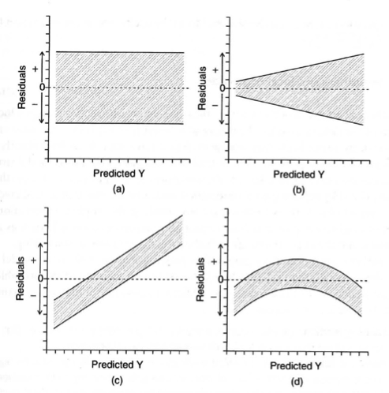
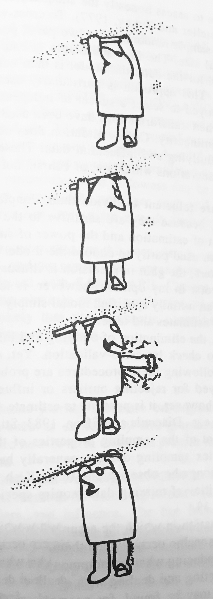
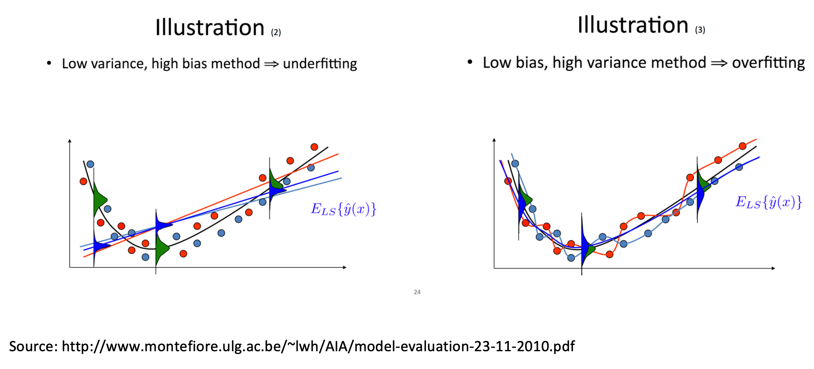

Week 13 Lecture
=============

```{r include=FALSE, warning=FALSE}
library(ggplot2)
library(carData)
text.size <- 16
```

## Week 13 Readings

The topic covered this week is huge, and here I provide a number of readings that might be helpful to your understanding: [Aho et al. (2014)](https://github.com/hlynch/Biometry2022/tree/master/_data/Aho_etal_2014.pdf), [Burnham et al. (2011)](https://github.com/hlynch/Biometry2022/tree/master/_data/Burnham_etal_2011.pdf), [Fox (2002)](https://github.com/hlynch/Biometry2022/tree/master/_data/Fox_Chapter6.pdf), [Grueber et al. (2011)](https://github.com/hlynch/Biometry2022/tree/master/_data/Grueber_etal_2011.pdf), [Hutto (2012)](https://github.com/hlynch/Biometry2022/tree/master/_data/Hutto_2012.pdf), [Johnson and Omland (2004)](https://github.com/hlynch/Biometry2022/tree/master/_data/Johnson_Omland_2004.pdf), [Nakagawa and Cuthill (2007)](https://github.com/hlynch/Biometry2022/tree/master/_data/Nakagawa_Cuthill_2007.pdf), [Tong (2019)](https://github.com/hlynch/Biometry2022/tree/master/_data/Tong_2019.pdf), and [Zuur et al. (2010)](https://github.com/hlynch/Biometry2022/tree/master/_data/Zuur_etal_2010.pdf).

## Model criticism

Before we can decide on what the “best” model is, we need to decide what we mean by the best model. There are two reasonable definitions of the best model based on the two separate and distinct goals of *testing a mechanism* and *making predictions*.

$$
Y = f(X) + \epsilon
$$

Models are always imperfect representation of reality (“All models are wrong but some are useful”). However, when you fit a model, you need to show that the model is a good representation of the data. This is important because if your data do not fit the assumptions of the model, the model can misrepresent the data. Model criticism and selection involves three parts:

1. **Assumptions/Robustness:** Are any of the assumptions of the model violated? Are any model assumptions having an undue impact on the results? 

2. **Assessment:** Does the model provide adequate fit to the data? 

3. **Selection:** Which model (or models) should we choose for final inference or prediction? 

The difference between the predicted value (based on the regression equation) and the actual, observed value. Remember that a lot of the assumptions for linear regression have to do with the residuals, (e.g., we often assumed $\epsilon_i \sim \mathrm{N} (0, \sigma^2)$).

```{r, fig.width=5, fig.height=4, echo=FALSE, message=FALSE}
library(asbio)
library(ggplot2)
text.size <- 16
data(webs)
y.bar <- mean(webs[, 2])
web.fit <- lm(formula = length ~ temp.C, data = webs)
x.i <- webs[12, 3]
y.i.hat <- web.fit$coefficients[1] + web.fit$coefficients[2] * x.i
y.i <- webs[12, 2]
ggplot(data = webs, aes(x = temp.C, y = length)) + geom_point(col = "gray37") + 
  geom_point(x = x.i, y = y.i, col = "firebrick1", size = 3) + 
    geom_point(x = x.i, y = y.i.hat, col = "palegreen3", size = 3) + 
  annotate(geom = "text", x = x.i + 1.5, y = y.i.hat, label = "hat(Y[i])", parse = TRUE, col = "palegreen3", size = 5) +
  annotate(geom = "text", x = x.i + 1, y = y.i - 0.0001, label = "Y[i]", parse = TRUE, col = "firebrick1", size = 5) +
  geom_hline(aes(yintercept = mean(length)), col = "dodgerblue1") + 
  geom_abline(intercept = web.fit$coefficients[1], slope = web.fit$coefficients[2], col = "palegreen1") +
  annotate("text", x = 12, y = 0.9987, label = "bar(Y)", parse = TRUE, size = 5, col ="dodgerblue1") +
  labs(x = "Temperature (in C)", y = "Relative length of spider webs") + theme_classic() + theme(text = element_text(size = text.size))
```

Plots of residuals should not change with the fitted values. Sometimes, systematic features in residual plots can suggest specific failures of model assumptions.

We will look at a past Biometry exam question to both practice for the exam and link what we are talking about today to past lectures.

Below are four plots depicting the residuals of a linear model plotted as a function of $\hat{Y}$. For each panel, state whether the model violates any of the assumptions of linear regression and, if yes, which assumption(s) of linear regression are violated. 



a. No apparent violations

b. Variance is heteroscedastic (not constant). Larger fitted values have larger variance. Depending on your data, what type of regression may be more appropriate here? Poisson regression (why? mean = variance). You could also consider transforming the data or fitting a weighted regression to resolve this pattern.

c. Linear pattern in the residuals, the errors are not independent

d. Nonlinear pattern in the residuals (consider transforming data or fitting the predictor quadratically).


## Residuals

In linear regression, an outlier is an observation with a **large residual**. In other words, it is an observation whose dependent-variable value is unusual given its value on the predictor variables. An outlier may indicate a sample peculiarity, a data entry error, or other problem.

```{r fig.width=5, fig.height=4, echo=FALSE}
outliers <- which(Duncan$education < 60 & Duncan$income > 60)
Duncan.fit <- lm(formula = income ~ education, data = Duncan)
x.i <- Duncan[outliers[1], 3]
y.i.hat <- Duncan.fit$coefficients[1] + Duncan.fit$coefficients[2] * x.i
y.i <- Duncan[outliers[1], 2]
ggplot(data = Duncan, aes(x = education, y = income)) + geom_point() +
  geom_point(x = x.i, y = y.i, col = "firebrick1", size = 3) + 
  geom_point(x = x.i, y = y.i.hat, col = "palegreen3", size = 3) + 
  annotate(geom = "text", x = x.i + 3, y = y.i.hat, label = "hat(Y[i])", parse = TRUE, col = "palegreen3", size = 5) +
  annotate(geom = "text", x = x.i + 3, y = y.i - 0.0001, label = "Y[i]", parse = TRUE, col = "firebrick1", size = 5) +
  geom_abline(intercept = Duncan.fit$coefficients[1], slope = Duncan.fit$coefficients[2], col = "palegreen1") +
  labs(x = "Percent high-school graduates", y = "% earning $3500 or more in 1950") + theme_classic() + 
  theme(text = element_text(size = text.size))
```

## Leverage

An observation with an extreme value for a **predictor variable/independent variable/covariate** (often $X$) is a point with high leverage. Leverage for a point is high when $(X - \bar{X})^2$ is large. X-values further from $\bar{X}$ influence $\hat{Y}_i$ more than those close to $\bar{X}$. High leverage points may have a large effect on the estimate of regression coefficients.

The leverage of the $i^{\text{th}}$ point is called $h_{ii}$ (the $i^{\text{th}}$ diagonal element in the hat matrix). The hat matrix relates the response $Y$ to the predicted response $\hat{Y}$. This hat value, $h_{ii}$ thus is a measure of the contribution of data point $Y_i$ to all fitted values $\hat{Y}$. 

Average leverage is considered to be equal to $p / n$, or the number of parameters divided by the sample size. Twice the average leverage is considered high.

## Influence

An observation is said to be influential if removing the observation substantially changes the estimate of the regression coefficients. Influence can be thought of as the **product of leverage and outlierness**.

We assess influence by looking at the effect of deleting that data point. We compare the least squares estimate of coefficient $\beta$ for the full dataset to the least squares estimate of coefficient $\beta$ when the $i^{\text{th}}$ data point is removed.

$$
\text{Influence} \propto \hat{\beta} - \hat{\beta}_{-i}
$$

## Comparing residuals, leverage, and influence

```{r, echo=FALSE, fig.width=6, fig.height=5}
Y <- rnorm(n = 10, mean = 5, sd = 2)
X <- Y + rnorm(n = 10)
xy.fit <- lm(Y ~ X)
X.1 <- c(X, 13)
Y.1 <- c(Y, 3)
xy.fit.1 <- lm(Y.1 ~ X.1)
X.2 <- c(X, 3)
Y.2 <- c(Y, 10)
xy.fit.2 <- lm(Y.2 ~ X.2)
X.3 <- c(X, 14)
Y.3 <- c(Y, 12)
xy.fit.3 <- lm(Y.3 ~ X.3)
par(mar = c(2, 2, 2, 2))
plot(X, Y, ylab = NA, xlab = NA, xaxt = "n", yaxt = "n", ylim = c(0, 15), xlim = c(0, 15), pch = 19)
  abline(a = xy.fit$coefficients[1], b = xy.fit$coefficients[2], lwd = 2)
  points(x = 13, y = 3, col = "indianred2", pch = 19, cex = 2)
  abline(a = xy.fit.1$coefficients[1], b = xy.fit.1$coefficients[2], col = "indianred2", lwd = 2, lty = "dashed")
  points(x = 3, y = 10, col = "dodgerblue2", pch = 19, cex = 2)
  abline(a = xy.fit.2$coefficients[1], b = xy.fit.2$coefficients[2], col = "dodgerblue2", lwd = 2, lty = "dashed")
  points(x = 14, y = 12, col = "seagreen3", pch = 19, cex = 2)
  abline(a = xy.fit.3$coefficients[1], b = xy.fit.3$coefficients[2], col = "seagreen3", lwd = 2, lty = "dashed")
```

The red and the blue points have large residuals.

The red and the green points have high leverage (large X values).

Only the red point here has high influence. Note that in your own work you would support these claims with statistics (which we will go over next).

Important:

1.	Outliers might not be influential. (Depends on the $X$ value)

2.	High leverage values may not be influential. (May fit right in with predicted line)

3.	Influential observations may not be outliers. (May just have high leverage)

We will use our two linear regressions of spider web length as a function of temperature, `web.fit`, and percent of males earning $3500 or more as a function of high school graduation rate, `Duncan.fit`, to go through the process of diagnosing a model. Do these models meet the assumptions of linear regression? Do they fit the data well?

Remember that certain analyses have certain assumptions. With a Poisson regression, you need to check for overdispersion or an abundance of zeros, and use the appropriate model.

If you have more than one covariate, you need to assess collinearity, which inflates Type II error and may mask covariate significance. We will go through this process in more detail in lab.

Are the residuals normally distributed? Histogram the residuals. They should be centered on zero and approximately normal (assuming a basic linear regression). Remember that with some analyses, like ANOVA, you assume normality within each group, so you would not look at all residuals together in that case. Also note that some analyses are fairly robust to non-normality.

```{r, fig.width=5, fig.height=4}
hist(web.fit$residuals)
```

Are the residuals normally distributed? Look at a Q-Q plot comparing the quantiles of the residuals against the quantiles of the distribution we expect them to match (usually normal).

```{r, fig.width=5, fig.height=4}
plot(web.fit, which = 2)
```

Are the residuals independent and homoscedasctic? Plot the residuals vs. the fitted values. The residuals should be uncorrelated with the fitted values and the variance of the residuals should not change as a function of the fitted values. 

```{r, fig.width=4, fig.height=4}
plot(web.fit, which = 1)
```

Are the residuals normally distributed? We can formally check the residuals are normally distributed using the Kolmogorov-Smirnov test (null hypothesis is that the two vectors come from the same distribution). In this case, we would check against a normal distribution with mean of 0 and standard deviation of $\sigma$ from the regression.

```{r, fig.width=4, fig.height=4}
ks.test(web.fit$residuals, y = "pnorm", mean = 0, sd = summary(web.fit)$sigma)
```

**Question: How do we interpret the results of this hypothesis test?**

<details>
  <summary>Click for Answer</summary>
  <span style="color: blueviolet;">
We have insufficient evidence to reject the null hypothesis that the residuals are normally distributed (both samples come from the same distribution).
</span>
</details>

<p>&nbsp;</p>

Are the residuals independent? Use the Durbin-Watson test, where the null hypothesis is that there is no correlation among residuals. If errors are correlated, we cannot assume that our errors are independent (an assumption of regression). These kind of correlations may be temporal or spatial, and can be controlled for with different modeling approaches. See Zuur et al. (2010) "Step 8" for details on how to deal with correlated errors.

$$d = \frac{\sum_{i = 2}^n (\epsilon_i - \epsilon_{i - 1})^2}{\sum_{i = 1}^n (\epsilon_i)^2}$$

```{r}
library(car)
durbinWatsonTest(web.fit)
```

**Question: How do we interpret the results of this hypothesis test?**

<details>
  <summary>Click for Answer</summary>
  <span style="color: blueviolet;">
We have insufficient evidence to reject the null hypothesis that the residuals are independent.
</span>
</details>

<p>&nbsp;</p>

Also be sure to look for outliers and points with high influence. There are a couple of ways you can determine if a point really is an outlier. We will use the Duncan regression to assess outliers, `Duncan.fit`.

What do you do with an outlier? 

Well...

```{r echo=FALSE, fig.align='center', fig.cap='One possible solution to outliers. (No!! Just kidding!! Do not do this.) Source: John Fox, Regression Diagnostics (1991)', out.width='25%'}

```

Don't remove it unless you can verifiably say it was recorded or measured in error.

1. Present the model with and without outliers, providing an explanation for the outliers (is there a potential unmeasured covariate that could explain the outlier?)

2. Use a robust method (tests based on rank, weighted models, etc.).

Calculate the leave-one-out residuals for each data point and scale them by the standard deviation of the leave-one-out residuals. Data points with $t_i > 2$ are potential outliers, $t_i > 3$ are more serious outliers.

$$
t_i = \frac{Y_i - \hat{Y}_{i, (-i)}}{\sqrt{\mathrm{Var} (Y_i - \hat{Y}_{i, (-i)})}}
$$

```{r}
library(MASS)
Duncan[outliers, ]
studres(Duncan.fit)[which(studres(Duncan.fit) > 2)]
```

Cook’s distances are related to the studentized residuals in that both use leave-one-out residuals:

$$
D_i = \frac{\sum_{j = 1}^n (\hat{Y}_j - \hat{Y}_{j, (-i)})^2}{p \times \mathrm{MSE}}
$$

where *p* is number of parameters in the model, and MSE is the mean squared error. There are different cut-offs for what might be considered significant, but *D* > 1 would be a basic guideline. Another guideline from Chatterjee and Hadi is to adjust *D* for sample size, $4 / (n - p - 1)$. Cook's distance describes the **influence** of a point (a function of both leverage and outlierness).

```{r}
cutoff <- 4 / (nrow(Duncan) - 3 - 1)
cooks.distance(Duncan.fit)[which(cooks.distance(Duncan.fit) > cutoff)]  # in car package
```

## Residuals for GLMs

Note that the definition of residuals for GLMs is a bit different. Residuals can be defined as $\hat{Y}_i - Y_i$. For normally distributed linear models, this is equal to the statistical error $\epsilon_i = \mathrm{E}(Y_i) - Y_i$. Remember that $\mathrm{E}(Y_i)$ or $\hat{Y}_i$ for a binomial or Poisson GLM is $\hat{p_i}$ or $\hat{\lambda_i}$, respectively, so not on the same scale as the data ($Y_i$ for binomial or Poisson is an integer 0 through *n*). Also, nonconstant variance is an inherent part of GLMs.

We can use different types of residuals for model criticism of GLMs. We can look at the residuals on the scale of the fitted values or response (using the inverse link function): `residuals.glm(crab.glm, type = "response")`, or residuals that are scaled by the variance inherent to the GLM: deviance residuals `type = "deviance"` or Pearson residuals `type = "pearson"` (see 9.20.7.1 in Aho for details). R provides these in diagnostic plots.

```{r fig.height=3, fig.width=4}
crabs <- read.csv(file = "_data/crabs.csv")
crab.glm <- glm(satell ~ width,  family = "poisson", data = crabs)
plot(crab.glm, which = 1)
```

```{r fig.height=3, fig.width=4}
crab.glm <- glm(satell ~ width,  family = "poisson", data = crabs)
plot(crab.glm, which = 2)
```

```{r fig.height=3, fig.width=4}
crab.glm <- glm(satell ~ width,  family = "poisson", data = crabs)
plot(crab.glm, which = 5)
```


## Model selection vs. model criticism

Before we move on to model selection, let's review the difference between model selection and model criticism: Model criticism involves determining whether the model is appropriate, meets assumptions, and accurately represents the data. Model selection gives us the best model, the best suite of models, or the best averaged model.

Your analyses should always involve model criticism, and may also additionally involve model selection.

To decide what model is best, we first need to determine what our goal was in modeling. If our goal was to make predictions, or definition of what makes a model the best is different from if our goal was to test a mechanism.

We will revisit some ideas from the Shmueli (2010) paper that was assigned Week 8. 

If our goal is to explain, then we are interested in the amount of variation in the response variable that is explained by each of the covariates.

With mechanism-based, explanatory models, we use Occam's razor—the law of **parsimony**. By applying this principle, we identify models that are simple but effective, and we do not consider models that are needlessly complex. In other words, given two models, **we prefer the smaller model unless the larger model is significantly better**. 

Additionally, all parameters should be **biologically important**, as identified by the modeler.

If our goal is to predict, then we want to **minimize the expected prediction error**, or our expectation of the difference between a new predicted value and the fitted value. For a model:

$$
Y = f(X) + \epsilon, \text{ where } \epsilon \sim \mathrm{N} (0, \sigma^2 )
$$

our expected prediction error of new data point $(X^\ast, Y^\ast)$ is:

$$
\text{EPE} = \mathrm{E} [ (Y^\ast - \hat{Y})^2] = \mathrm{E} [ (Y^\ast - f(X^\ast))^2]
$$

The expected prediction error boils down to three components of variance:

$$
\sigma^2 + (\text{bias}_{\text{prediction}})^2 + \mathrm{Var} (\text{prediction})
$$

$\sigma^2$ represents the variation inherent to the process. This error is irreducible.

**Bias**, $(\text{bias}_{\text{prediction}})^2$, represents the difference between the expected prediction of our model (if we could repeat the process of collecting data and building the model many times) and the underlying true value we are trying to predict. 

**Variance**, $\mathrm{Var} (\text{prediction})$, represents the variability of model predictions for a given data point, if we could repeat the data-gathering and model building process many times.

If we had both: 1) the true model (an exact picture of the true mean behavior of the mechanism), and 2) infinite data (no random fluctuations due to finite sampling), we could theoretically minimize both bias and variance. However, that's not the case in reality, and we tend to find a trade-off between bias and variance.

$$
\sigma^2 + (\text{bias}_{\text{prediction}})^2 + \mathrm{Var} (\text{prediction})
$$


## Comparing two models

If we are generating models to test mechanisms, we can use the following three criteria to decide which is best. All three use the likelihood of the models.

1. Likelihood ratio test (LRT)

2. Akaike's Information Criterion (AIC)

3. Bayesian Information Criterion (BIC)

The likelihood ratio test is one way of comparing two nested models. Before we get into the details of the LRT, let's review for a second what we mean by *nested*.

### Nested or not?

**Question: Are these models nested?**

$$
Y \sim X_1 + X_2 + X_3 \\
Y \sim X_1 + X_2 + X_4
$$

<details>
  <summary>Click for Answer</summary>
  <span style="color: blueviolet;">
No, neither model is a subset of the other
</span>
</details>

<p>&nbsp;</p>

**Question: What about these models?**

$$
Y \sim X_1 + X_2 + X_3 \\
Y \sim X_1 + X_2
$$

<details>
  <summary>Click for Answer</summary>
  <span style="color: blueviolet;">
Yes, the second model is a subset of the first model
</span>
</details>

<p>&nbsp;</p>

Note that this usage of "nested" is completely different from the way we used it with nested ANOVAs.

**Question: Nested?**

$$
Y = a \\
Y = a + b X
$$
<details>
  <summary>Click for Answer</summary>
  <span style="color: blueviolet;">
Nested. The second model is equal to the first model with $b = 0$.
</span>
</details>

<p>&nbsp;</p>

**Question: Nested?**

$$
Y = a + b X \\
Y = a + b X + c X^2
$$
<details>
  <summary>Click for Answer</summary>
  <span style="color: blueviolet;">
Nested. The second model is equal to the first model with $c = 0$.
</span>
</details>

<p>&nbsp;</p>

**Question: Nested?**

$$
Y = r \left ( 1 - \frac{N_t}{K} \right ) \\
Y = r \left ( 1 - \left ( \frac{N_t}{K} \right ) ^\gamma \right )
$$

<details>
  <summary>Click for Answer</summary>
  <span style="color: blueviolet;">
Nested. The second model is equal to the first model with $\gamma = 1$. This model is called the Ricker model (top model is the usual form and the bottom model is the generalized version). It's used in ecology to model the abundance of animal populations with density dependence.
</span>
</details>

<p>&nbsp;</p>

### Likelihood Ratio Test (LRT)

Likelihoods are crucial for model selection, they can be used generally for a wide variety of models. We'll start with a brief review of likelihood.

When we were fitting statistical distributions to data, we assumed that each data point was independent. Therefore, for independent events $X_1$, $X_2$, and $X_3$:

$$
\mathrm{P}(X_1 \cap X_2 \cap X_3) = \mathrm{P}(X_1) \times \mathrm{P}(X_2) \times \mathrm{P}(X_3)
$$

We then calculate the joint density of the data as a function of the unknown parameters (multiplying the probability of each data point given the PDF and as a function of the unknown parameters): 

$$
\mathcal{L}(\text{parameters} | \text{data}) = \prod^N_{i = 1} \text{PDF} (X_i | \text{parameters})
$$

Last we find the value(s) of the parameter(s) that maximize the likelihood (in practice, by minimizing the log-likelihood).

Now we are using the same idea to fit models to data:

$$
\mathcal{L}(\text{model parameters} | \text{data}) = \prod^N_{i = 1} \text{PDF} (X_i | \text{model parameters})
$$

**Question: What are the parameters in a linear regression with one continuous predictor?**

<details>
  <summary>Click for Answer</summary>
  <span style="color: blueviolet;">
$\beta_0$, $\beta_1$, and $\sigma$
</span>
</details>

<p>&nbsp;</p>

**Question: What are the parameters in a linear model with one categorical predictor (which has four levels)?**

<details>
  <summary>Click for Answer</summary>
  <span style="color: blueviolet;">
$\mu$, $\alpha_1$, $\alpha_2$, $\alpha_3$ (depends on how you code the model, but there will be four parameters describing the mean behavior if the model is not overparameterized), and $\sigma$
</span>
</details>

<p>&nbsp;</p>

**Question: What are the parameters in a Poisson generalized linear model with one continuous predictor?**

*Hint:* $Y_i \sim \mathrm{Pois} (\lambda_i), \quad log(\lambda_i) = \beta_0 + \beta_1 X_i$

<details>
  <summary>Click for Answer</summary>
  <span style="color: blueviolet;">
$\beta_0$ and $\beta_1$
</span>
</details>

<p>&nbsp;</p>

Remember the deviance difference from Week 10? Under the null hypothesis that the larger model fits no better than the smaller model, the deviance difference goes as a chi-square distribution.

$$D = 2 * \log \frac{\mathcal{L}_{\text{larger model}}}{\mathcal{L}_{\text{smaller model}}} = 2 (\ell_{\text{larger model}} - \ell_{\text{smaller model}}) \\
D | H_0 \sim \chi^2_{\text{additional parameters in larger model}}$$

This is called a likelihood ratio test. A large value for $D$ (likelihood ratio), unexpected under the null distribution, would indicate a significant **improvement** in using the larger model. In this case, we would prefer the larger model over the smaller model. Note that we can only do this for nested models.

**Question: Will the likelihood be larger for the larger model or for the smaller model?**

<details>
  <summary>Click for Answer</summary>
  <span style="color: blueviolet;">
The likelihood will always be larger for the larger model (more parameters = more ability to fit the data).
</span>
</details>

<p>&nbsp;</p>

**Question: Will the deviance difference, D, be positive or negative?**

<details>
  <summary>Click for Answer</summary>
  <span style="color: blueviolet;">
Because the likelihood will always be larger for the larger model, D will always be positive. This makes sense because the $\chi^2$ distribution is always positive.
</span>
</details>

<p>&nbsp;</p>

```{r}
Duncan.smaller <- lm(formula = prestige ~ income, data = Duncan)
Duncan.larger <- lm(formula = prestige ~ income + education, data = Duncan)
logLik(Duncan.larger)
logLik(Duncan.smaller)
Duncan.D <- 2 * (logLik(Duncan.larger) - logLik(Duncan.smaller))
Duncan.D
pchisq(q = Duncan.D, df = 1, lower.tail = FALSE)
```

```{r, fig.height=4, fig.width=5}
xvals <- seq(0, 40, by = 0.1)
par(mar = c(2, 2, 2, 2))
plot(x = xvals, y = dchisq(x = xvals, df = 1), type = "l", xlab = "Quantiles of chi-square[DOF = 1]", ylab = "Probability")
abline(v = qchisq(0.95, df = 1), col = "indianred2")
  text(x = qchisq(0.95, df = 1) + 4, y = 0.5, col = "indianred2", labels = "Critical value")
abline(v = Duncan.D, col = "dodgerblue2")
    text(x = Duncan.D + 6, y = 0.5, col = "dodgerblue2", labels = "Observed test stat.")
```

**Question: How do we interpret the results of our likelihood ratio test?**

<details>
  <summary>Click for Answer</summary>
  <span style="color: blueviolet;">
The larger model explains significantly more variation in the data than we would expect.
</span>
</details>

<p>&nbsp;</p>

### Akaike's Information Criterion (AIC)

AIC is just one of the many **information theoretic** alternatives that have been developed to compare the “divergence” between our particular model (which is an approximation of the true mechanism) and the “true” model (the mechanism that's actually going on in the real world). We always lose some information when approximating the truth using a model.

If you have a set of models that you could consider different alternative hypotheses, information theoretic methods allow you to rank them.

In practice, all information theoretic methods reduce to finding the model that minimizes some criterion that includes the sum of two terms: one is based on the **likelihood** and the other is a **penalty term** which penalizes for increasing model complexity. For AIC:

$$
\mathrm{AIC} = -2 \ell + 2 k
$$

where $\ell$ is the log-likelihood and $k$ is the total number of parameters in the model (including variance as a parameter when appropriate,  $\sigma^2$). **Smaller AIC means better model fit**.

```{r}
-2 * logLik(Duncan.smaller) + 2 * 3
-2 * logLik(Duncan.larger) + 2 * 4
```

**Question: Which model fits best?**

<details>
  <summary>Click for Answer</summary>
  <span style="color: blueviolet;">
The larger model.
</span>
</details>

<p>&nbsp;</p>

$$
\mathrm{AIC} = -2 \ell + 2 k
$$

The penalty term in AIC enforces parsimony, because adding an additional parameter will increase AIC by 2 unless the more complex model considerably increases the log-likelihood. 

When you have small sample size, or $n / k < 40$, use the small sample corrected AIC (AICc). This converges to AIC when sample size is large.

$$
\mathrm{AICc} = \mathrm{AIC} + \frac{2 k (k + 1)}{n - k - 1}
$$

```{r}
AIC(Duncan.smaller) + (2 * 3 * (3 + 1)) / (nrow(Duncan) - 3 - 1)
AIC(Duncan.larger) + (2 * 4 * (4 + 1)) / (nrow(Duncan) - 4 - 1)
```

**Question: Which model fits best?**

<details>
  <summary>Click for Answer</summary>
  <span style="color: blueviolet;">
The larger model.
</span>
</details>

<p>&nbsp;</p>

We can calculate the AIC of all possible candidate models and compare by calculating the difference in AIC between model *i* and the AIC of the best candidate model:

$$
\Delta \mathrm{AIC}_i = \mathrm{AIC}_i - \mathrm{AIC}_{\min}
$$

Information Criterion methods **do not allow us say that one model is significantly better**. We do not have a sampling distribution for differences in AIC, and we cannot use AIC to calculate a *P*-value for the significance of a model term. That said, there are some rules of thumb:

$\Delta \mathrm{AIC} < 2$ are considered equivalent

$4 < \Delta \mathrm{AIC} < 7$ are considered clearly different

$\Delta \mathrm{AIC} > 10$ are definitely different

**Question: Given this definition, is the larger model definitely still the better model?**

<details>
  <summary>Click for Answer</summary>
  <span style="color: blueviolet;">
Yes, $\Delta \mathrm{AIC} > 10$.
</span>
</details>

<p>&nbsp;</p>

### Bayesian Information Criterion (BIC)

BIC uses the same idea as AIC, but with a different penalty for model complexity. This is sometimes called the Schwarz criterion. **Smaller BIC means better model fit**.

$$
\mathrm{BIC} = -2 \ell + 2 k \times \ln(n)
$$

```{r}
-2 * logLik(Duncan.smaller) + 2 * 3 * log(nrow(Duncan))
-2 * logLik(Duncan.larger) + 2 * 4 * log(nrow(Duncan))
```

**Question: Which model fits best?**

<details>
  <summary>Click for Answer</summary>
  <span style="color: blueviolet;">
The larger model.
</span>
</details>

<p>&nbsp;</p>

The penalty for BIC is different than for AIC. For AIC, the probability of Type I error (in this case, choosing the larger model erroneously, that is, when the smaller model is the true model) depends on $k$ but does not depend on sample size. This means that as sample size goes to infinity, you still choose the larger model with some probability (the Type I error rate). When this happens, we say that an estimator is not “consistent”. The BIC corrects for this by increasing the penalty term as sample size, $n$, gets large. Proponents of BIC like that it tends to select simpler models (fewer parameters) relative to AIC, because it is a consistent estimator of model fit.

However, Johnson and Omland (2004) include a strong critique of BIC. They state that it is not based in KL information theory, and it relies on the assumption that there is one true model and it is contained in the set of candidate models.

### Comparing LRT and AIC/BIC

1. LRT allows you to put a p-value on model terms. Because you have a sampling distribution for the difference in deviances, you can compare the difference in deviance to the quantiles on the chi-squared distribution to get a p-value.

2. AIC/BIC values do not allow you to refer to one model as being significantly different than another. No p-values.

3. LRT require nested models and Information Theoretic Criterion like AIC do not. This is a major advantage for AIC/BIC!

Information theoretic critera (AIC, AICc, BIC) allows you to compare all candidate models at once. We'll go through the process of model seelction and model averaging using AIC as an example, though you could use the same approach with any criterion.

1. Decide on your candidate set of models

2. Compute the likelihood and AIC for each of the candidate models

3. Rank the models in order of increasing AIC

After that, you have three options:

**Option 1:** Choose the model with the lowest AIC.
This is not recommended! You may have several models that are very close in AIC, so it is arbitrary to select the lowest AIC model as the unambiguously best model.

**Option 2:** Report all the models with $\Delta \mathrm{AIC} = 2$ of the best model.
This is better, because you are reporting all models that are basically indistinguishable from the best model, but there is no way to say how much better one model is from another.

**Option 3:** Model weighting. You consider the parameter estimates from all candidate models, where the better models are weighted more than the worse models.

Burnham and Anderson define model weights from the AIC values, where the weight is the proportion of times under repeated sampling that the $i^{\text{th}}$ model would be the best model.

$$
\Delta_i = \mathrm{AIC}_i - \min (\mathrm{AIC}) \\
w_i = \frac{\mathrm{e}^{-\Delta_i / 2}}{\sum_{i = 1}^M \mathrm{e}^{-\Delta_i / 2}}
$$

The denominator is summed over all candidate models. Burnham et al. (2011) describe the model weight as the strength of evidence, or the probability of model $i$ given the data and all $M$ models. 

## Model weighting

Model weights provide a number of benefits:

1. They explicitly address the fact that you don’t know the best model, so it is a straightforward way of presenting the relative strength of evidence for each of the models in the set of candidate models.

2. The model weights present the possibility of calculating weighted parameter estimates. This is the idea behind AIC **model averaging**. With AIC model averaging, we use the Akaike weights to weight the parameter estimates and variances (i.e., standard errors) from each model and combine those. Thus, we incorporate model selection uncertainty directly into the parameter estimates via the Akaike weights.

Model weighting and model averaging account for two types of uncertainty: the uncertainty about the parameters themselves, and the uncertainty about the model.

Let’s work through an example. Let’s say we have four possible candidate models – note that they are linear but not nested. Weighted parameters only work with linear models because the parameters have the same interpretation across the models.

$$
\text{Model 1}: Y = a, \quad \hat{a} = 1 \\ 
\text{Model 2}: Y = a + b X_1, \quad \hat{a} = 2, \hat{b} = 3 \\ 
\text{Model 3}: Y = a + b X_1 + c X_2, \quad \hat{a} = 1.5, \hat{b} = 2, \hat{c} = 7 \\ 
\text{Model 4}: Y = a + b X_1 + d X_3, \quad \hat{a} = 1.2, \hat{b} = 4, \hat{d} = 4
$$

Let’s say we calculated the following model weights:

$$
\Delta_i = \mathrm{AIC}_i - \min (\mathrm{AIC}) \\
w_i = \frac{\mathrm{e}^{-\Delta_i / 2}}{\sum_{i = 1}^M \mathrm{e}^{-\Delta_i / 2}}
$$

Model 1: *w* = 0.6,
Model 2: *w* = 0.1,
Model 3: *w* = 0.15,
Model 4: *w* = 0.15,

The model averaged estimate of parameter $a$ would be calculated by 

$$
0.6(1) + 0.1(2) + 0.15(1.5) + 0.15(1.2) = 1.205
$$

How do we calculate the model averaged estimate of $b$? This is a little trickier, because $b$ only appears in models 2, 3, 4. 

One method we can use is to calculate new weights for the only set of models in which $b$ appears, so our new model weights are: 

$$
\text{Model 2}: w = 0.1 / (0.1 + 0.15 + 0.15) = 0.25 \\
\text{Models 3 and 4}:w = 0.15 / (0.1 + 0.15 + 0.15) = 0.375
$$

and our model averaged estimate for $b$ is:

$$
0.25(3) + 0.375(2) + 0.375(4) = 3
$$

However, this doesn't take into account that $b$ may not appear in a model because it doesn't explain much variation in the response. We could also set $b$ to zero in models where it isn't included. This essentially "shrinks" the parameter estimate for $b$ if it doesn't appear in many models, bringing it closer to zero.

$$
0.6(0) + 0.1(3) + 0.15(2) + 0.15(4) = 1.2
$$

Be sure to explicitly state which of these two methods you used to weight parameter estimates in a report/thesis/manuscript.

What happens if all of your models are pretty bad, and you use model selection methods like the ones we've been discussing?

You'll still get a best/most parsimonious model!

You need to also provide evidence of model explanatory power using metrics like the coefficient of determination $R^2$ (or adjusted $R^2$, or marginal/conditional $R^2$ for mixed/hierarchical models, or goodness-of-fit tests) in addition to model fit diagnostics like AIC. Also don't forget about your coefficient hypothesis tests! See Mac Nally et al. (2017) for more on comparing model fit and model explanatory power.

$$
R^2 = \frac{\mathrm{SSR}}{\mathrm{SST}} = \frac{\sum_{i = 1}^n (Y_i - \hat{Y}_i)^2}{\sum_{i = 1}^n (Y_i - \bar{Y})^2}
$$

Which models to include in model selection?

In many situations, you might have a large number of potential covariates to include in a model, all of which could have biological significance to your system. You have many choices to make as the investigator. You could:

1. **Generate a subset of biologically reasonable models to test**. In this case you would support your selections by whatever theory is reasonable for your system.

2. **Test all possible subsets of models**. In this case, you would calculate AIC/BIC for models with all possible combinations of covariates. This becomes computationally expensive as the list of predictors increases in length, especially if you are testing for interactions as well as main effects.

3. **Use stepwise regression**. Here, you would add in or remove variables one at a time to find the best model based on some criterion.

## Stepwise regression

With stepwise regression, you add in or remove parameters one at a time, then a test is done to check whether some variables can be deleted without appreciably increasing the residual sum of squares (RSS) or some other criterion (for example, AIC can be used). The procedure stops when the available improvement falls below some critical value. Using this approach, you do not test all possible models, because the algorithm only compares models to the optimal model from the previous step.

The main approaches are:

* Forward selection, which involves starting with no variables in the model, trying out the variables one by one and including them if they are 'statistically significant'.

* Backward elimination, which involves starting with all candidate variables and testing them one by one for statistical significance, deleting any that are not significant.

* Methods that are a combination of the above, testing at each stage for variables to be included or excluded.

### Criticism of stepwise regression

A sequence of F-tests is often used to control the inclusion or exclusion of variables, but these are carried out on the same data and so there will be problems of multiple comparisons for which many correction criteria have been developed. It is therefore difficult to interpret the *P*-values associated with these tests, since each is conditional on the previous tests of inclusion and exclusion (see "dependent tests" in false discovery rate). When estimating the degrees of freedom, the number of the candidate independent variables from the best fit selected is smaller than the total number of final model variables, causing the fit to appear better than it is when adjusting the $R^2$ value for the number of degrees of freedom. It is important to consider how many degrees of freedom have been used in the entire model, not just count the number of independent variables in the resulting fit.

### Criticism of data dredging

Automated model selection can be considered data dredging (methods 2 and 3). Critics regard data dredging as substituting intense computation for subject area expertise. You may have many predictors even in a carefully thought out model because biological systems are complex and we may want to know which predictors, from a set of reasonable predictors, best explain the variation in the data. However, we should be careful to recognize that we don't really understand the Type I error rate for the entire model selection process and our findings should be considered exploratory; where automated model selection has been used to find the best set of predictors, you may need to use that information to propose new hypotheses to be tested more rigorously with a new dataset.

### Final thoughts on model selection

If the goal is hypothesis testing, think carefully about the models ahead of time and consider a smaller set of candidate models, all of which make biological sense.

If the goal is prediction, you can start with a wider set of candidate models, and you are less worried that the correlations stem from true causation.

**Don’t let the computation drive the biology.** It is OK and often appropriate to leave covariates in the model even if they are not statistically significant if you believe them to be biologically significant.

## Week 13 FAQ

**Question: How to we calculate explanatory power?**

$$
r^{2} = \frac{SSR}{SST} = \frac{1-SSE}{SST} = \frac{1-\mbox{sum-of-squares error}}{\mbox{sum-of-squares total}}
$$

Going back to Week 9, we note that the sum-of-squares total is given by

$$
SST = \sum_{i=1}^{n}(Y_{i}-\bar{Y})^{2}
$$
and the sum-of-squares error

$$
SSE = \sum_{i=1}^{n}(Y_{i}-\hat{Y_{i}})^{2}
$$

**Question: How exactly does Mallow's Cp work?**

Mallows Cp is used when you are comparing models with different numbers of parameters. If the model with p parameters is correct than Cp will tend to be close to or smaller than p. Mallows Cp will be close to p if the model is unbiased and so Mallows Cp is used if unbiasedness is a criteria of particular interest.

**Question: What is the rational behind the penalty factor in BIC and why does the penalty grow with n?**

If you are comparing two nested models, AIC is equivalent to using a cutoff for the difference in -2LogLik between the two models equal to 2*k, where k is the difference in the number of parameters between the two models. (Note that AIC does not require nested models, but the case of nested models allows us to understand the penalty factor for BIC.) The probability of Type I error (in this case, choosing the larger model erroneously, that is, when the smaller model is the true model) depends on “k” but does not depend on sample size. This means that as sample size goes to infinity, you still choose the larger model with some probability (the Type I error rate). When this happens, we say that an estimator is not “consistent”. The BIC corrects for this by increasing the penalty term as n gets large.

**Question: How do we do model averaging when the parameter in question is not included in all models?**

In these cases, we have to restrict attention to the models that include the parameter of question, and recalculate the AIC weights within that subset. For example, in the example presented in lecture, “b” only appears in Models 2,3, and 4.

Step 1 therefore is to recalculate AIC weights as follows:

$$
w_{AIC, model2} = \frac{0.1}{0.1+0.15+0.15} = 0.25
$$
$$
w_{AIC, model3} = \frac{0.15}{0.1+0.15+0.15} = 0.375
$$

$$
w_{AIC, model4} = \frac{0.15}{0.1+0.15+0.15} = 0.375
$$

The weighted parameter estimate for “b” would then be

$$
\hat{b} = (0.25 \times 3) + (0.375 \times 2) + (0.375 \times 4) = 3
$$

