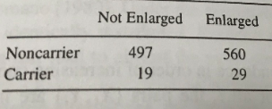

Week 2 Lab
=============

Confidence intervals
-----------------------

Before getting too far, we need to formally define a confidence interval. 

A 95th percentile confidence interval say “If I repeat this procedure 100 times using 100 different datasets, 95% of the time my confidence intervals will capture the true parameter”. It does NOT say that there is a 95% chance that the parameter is in the interval.

**Quiz time! (Don't worry, not a real quiz)**

*Important note*: This is an area where Aho is **WRONG**. Aho is correct on only one point. It is true that *once the 95th CI has been constructed*, it is no longer possible to assign a $\%$ to the probability that that CI contains the true value or not. Because that CI, once created, either DOES or DOES NOT contain the true value. However, we often talk about the interval in the abstract. **<span style="color: orangered;">When we say "There is a 95$\%$ chance that the interval contains the true value" what we mean is that there is a 95$\%$ probability that a CI created using that methodology would contain the true value.</span>**

Do not let Week 2 pass by without fundamentally understanding the interpretation of a confidence interval. 

So now we know the general idea behind confidence intervals but we don't yet know how to calculate them. To do that, we'll actually walk through an example of bootstrap using pennies. Each of you should have gathered the ages of five pennies. (If a penny was made in 2021, that penny would be 1 year old, etc.)

*Data*: 5 pennies that the students have

*Test statistic*: Median

Lets say we are trying to find the median age of all pennies in circulation. We can't figure this out exactly, because we can't collect all the pennies in circulation, but we each have a sample of 5 pennies. The median age of the pennies in our sample is a reasonable estimate for the median age of all pennies in circulation. 

What is our uncertainty about that number? How far might our estimate of the median age be from the true median age? In this case, we don't know the underlying distribution of penny ages. (Let's brainstorm this for a bit. Do we have any guesses what this distribution might look like? What might be a reasonable distribution to describe the shape of penny age?) 

Let’s use bootstrapped samples to calculate the s.e. associated with that estimate.

Procedure: 
1. Sample WITH REPLACEMENT a group of 5 pennies. (To sample with replacement you will have to sample one penny, write down the age, and repeat that 5 times.)
2. Calculate the median age from that sample of pennies.
3. Repeat

Do this a few times with your actual physical pennies, and then once you get the idea, you can make a vector in R of your penny ages and use R to speed up the sampling. Don't forget to sample with replacement.

Gather a collection of 100 median estimates, each one calculated using a different bootstrapped dataset. Calculate the Bias and the Variance of the estimator for the Median.

We now want to take this one step further and estimate the confidence intervals for the median age of a penny in circulation. We actually have two primary mechanisms for generating confidence intervals for the statistic.

**Method #1**: Simply take the quantiles directly from the distribution of $\hat{\theta}^{*}$:

$$
\theta_{LL} = \mbox{2.5th percentile of } \hat{\theta}^{*}
$$
$$
\theta_{UL} = \mbox{97.5th percentile of } \hat{\theta}^{*}
$$

Notice that (by construction) 95$%$ of the $\hat{\theta}^{*}$ values fall in the interval $(\theta_{LL},\theta_{UL})$. <span style="color: orangered;">This is the very definition of the 95th percentile confidence interval.</span>

**OR** 

**Method #2**: We can use the Normal approximation:

We have a second method that won't make 100\% sense until next week, but it turns out that if we assume the bootstrapped estimates follow a Normal distribution, 

$$
\hat{\theta^{*}} \sim N(\hat{\theta},\hat{se}^{2})
$$

we can use the fact that the 95th percentile confidence interval is approximately given by:

$$
\hat{\theta}_{LL}=\hat{\theta}-1.96*\hat{se}
$$
$$
\hat{\theta}_{UL}=\hat{\theta}+1.96*\hat{se}
$$

It turns out that 95$\%$ of the probability for a Standard Normal distribution lies between (-1.96$\sigma$,+1.96$\sigma$). (We will show this more formally next week.) 

NB: If you are going to go through the trouble of doing the bootstrap sampling, I don’t know why you would make a Normal approximation at the very end to construct the CIs. I recommend Method #1.

**<span style="color: green;">Checkpoint #1: Use your penny data to calculate the 95th percentile confidence interval using Method #1 and Method #2. What did you get?</span>**

Testing hypotheses through permutation
------------------------------------

These examples use data on the speeds of the top 20 racing pigeons from a race in Alma, GA on February 7,2021. 

**Example #1**: Use permutation methods to test whether Cock or Hen birds fly at different speeds (speeds are in meters-per-minute) (in other word: $H_{0}$: No difference in speeds between the C and H groups):

C=$\{1359.8,1355.3,1355.1,1353.0,1349.8,1348.8,1345.2\}$

H=$\{1357.5,1356.4,1355.1,1353.5,1353.2,1352.5,1350.0,1349.8,1346.2,1344.9,1344.4,1343.9,1342.6\}$

**<span style="color: green;">Checkpoint #2: Is this a one-tailed or a two-tailed test?</span>**

Make sure that you understand what is being done here, as this example is very closely related to the problem set.


**Example #2**: Using the same data, provide a 95% confidence interval for the difference in mean speed based on 1000 bootstrap samples

Note that these two approaches are very closely related. Do you see why either approach can be used to test the null hypothesis? **<span style="color: green;">Checkpoint #3: What is the null hypothesis here?</span>**

**Example #3**: Now we will do one slightly more complicated example from Phillip Good's book "Permutation tests: A practical guide to resampling methods and testing hypotheses":

Holmes and Williams (1954) studied tonsil size in children to verify a possible association with the virus \textit{S. pyrogenes}. Test for an association between \textit{S. pyrogenes} status and tonsil size. (Note that you will need to come up with a reasonable test statistic.)

```{r echo=FALSE, fig.align='center', fig.cap='Data on tonsil size and S. pyrogenes status. Source: Good (1994)', out.width='40%'}

```

Now lets consider the full dataset, where tonsil size is divided into three categories. How would we do the test now? **<span style="color: green;">Checkpoint #4: What is the new test statistic? (There are many options.)</span>** What 'labels' do you permute?

```{r echo=FALSE, fig.align='center', fig.cap='Fill dataset on tonsil size and S. pyrogenes status. Source: Good (1994)', out.width='50%'}
knitr::include_graphics('Table3categories.png')
```

Basics of bootstrap and jackknife
------------------------------------

To get started with bootstrap and jackknife techniques, we start by working through a very simple example. First we simulate some data

```{r}
x<-seq(0,9,by=1)
```

This will constutute our "data". Let's print the result of sampling with replacement to get a sense for it...

```{r}
table(sample(x,size=length(x),replace=T))
```

Now we will write a little script to take bootstrap samples and calculate the means of each of these bootstrap samples

```{r}
xmeans<-vector(length=1000)
for (i in 1:1000)
  {
  xmeans[i]<-mean(sample(x,replace=T))
  }
```

The actual number of bootstrapped samples is arbitrary *at this point* but there are ways of characterizing the precision of the bootstrap (jackknife-after-bootstrap) which might inform the number of bootstrap samples needed. *In practice*, people tend to pick some arbitrary but large number of bootstrap samples because computers are so fast that it is often easy to draw far more samples than are actually needed. When calculation of the statistic is slow (as might be the case if you are using the samples to construct a phylogeny, for example), then you would need to be more concerned with the number of bootstrap samples. 

First, lets just look at a histogram of the bootstrapped means and plot the actual sample mean on the histogram for comparison


```{r}
hist(xmeans,breaks=30,col="pink")
abline(v=mean(x),lwd=2)
```

Calculating bias and standard error
-----------------------------------

From these we can calculate the bias and standard deviation for the mean (which is the "statistic"):

$$
\widehat{Bias_{boot}} = \left(\frac{1}{k}\sum^{k}_{i=1}\theta^{*}_{i}\right)-\hat{\theta}
$$

```{r}
bias.boot<-mean(xmeans)-mean(x)
bias.boot
hist(xmeans,breaks=30,col="pink")
abline(v=mean(x),lwd=5,col="black")
abline(v=mean(xmeans),lwd=2,col="yellow")

```

$$
\widehat{s.e._{boot}} = \sqrt{\frac{1}{k-1}\sum^{k}_{i=1}(\theta^{*}_{i}-\bar{\theta^{*}})^{2}}
$$

```{r}
se.boot<-sd(xmeans)
```

We can find the confidence intervals in two ways:

Method #1: Assume the bootstrap statistics are normally distributed

```{r}
LL.boot<-mean(xmeans)-1.96*se.boot #where did 1.96 come from?
UL.boot<-mean(xmeans)+1.96*se.boot
LL.boot
UL.boot
```

Method #2: Simply take the quantiles of the bootstrap statistics

```{r}
quantile(xmeans,c(0.025,0.975))
```

Let's compare this to what we would have gotten if we had used normal distribution theory. First we have to calculate the standard error:

```{r}
se.normal<-sqrt(var(x)/length(x))
LL.normal<-mean(x)-qt(0.975,length(x)-1)*se.normal
UL.normal<-mean(x)+qt(0.975,length(x)-1)*se.normal
LL.normal
UL.normal
```

In this case, the confidence intervals we got from the normal distribution theory are too wide.

**<span style="color: green;">Checkpoint #6: Does it make sense why the normal distribution theory intervals are too wide?</span>** Because the original were were uniformly distributed, the data has higher variance than would be expected and therefore the standard error is higher than would be expected.

There are two packages that provide functions for bootstrapping, 'boot' and 'boostrap'. We will start by using the 'bootstrap' package, which was originally designed for Efron and Tibshirani's monograph on the bootstrap. 

To test the main functionality of the 'bootstrap' package, we will use the data we already have. The 'bootstrap' function requires the input of a user-defined function to calculate the statistic of interest. Here I will write a function that calculates the mean of the input values.

```{r}
library(bootstrap)
theta<-function(x)
  {
    mean(x)
  }
results<-bootstrap(x=x,nboot=1000,theta=theta)
results
quantile(results$thetastar,c(0.025,0.975))
```

Notice that we get exactly what we got last time. This illustrates an important point, which is that the bootstrap functions are often no easier to use than something you could write yourself.

You can also define a function of the bootstrapped statistics (we have been calling this theta) to pull out immediately any summary statistics you are interested in from the bootstrapped thetas.

Here I will write a function that calculates the bias of my estimate of the mean (which is 4.5 [i.e. the mean of the number 0,1,2,3,4,5,6,7,8,9])

```{r}
bias<-function(x)
  {
  mean(x)-4.5
  }
results<-bootstrap(x=x,nboot=1000,theta=theta,func=bias)
results
```

Compare this to 'bias.boot' (our result from above). Why might it not be the same? Try running the same section of code several times. See how the value of the bias ($func.thetastar) jumps around? We should not be surprised by this because we can look at the jackknife-after-bootstrap estimate of the standard error of the function (in this case, that function is the bias) and we can see that it is not so small that we wouldn't expect some variation in these values.

Remember, everything we have discussed today are estimates. The statistic as applied to your data will change with new data, as will the standard error, the confidence intervals - everything! All of these values have sampling distributions and are subject to change if you repeated the procedure with new data.

Note that we can calculate any function of $\theta^{*}$. A simple example would be the 72nd percentile:

```{r}
perc72<-function(x)
  {
  quantile(x,probs=c(0.72))
  }
results<-bootstrap(x=x,nboot=1000,theta=theta,func=perc72)
results
```

On Tuesday we went over an example in which we bootstrapped the correlation coefficient between LSAT scores and GPA. To do that, we sampled pairs of (LSAT,GPA) data with replacement. Here is a little script that would do something like that using (X,Y) data that are independently drawn from the normal distribution

```{r}
xdata<-matrix(rnorm(30),ncol=2)
```

Everyone's data is going to be different. With such a small sample size, it would be easy to get a positive or negative correlation by random change, but on average across everyone's datasets, there should be zero correlation because the two columns are drawn independently.

```{r}
n<-15
theta<-function(x,xdata)
  {
  cor(xdata[x,1],xdata[x,2])
  }
results<-bootstrap(x=1:n,nboot=50,theta=theta,xdata=xdata) 
#NB: xdata is passed to the theta function, not needed for bootstrap function itself
```

Notice the parameters that get passed to the 'bootstrap' function are: (1) the indexes which will be sampled with replacement. This is different that the raw data but the end result is the same because both the indices and the raw data get passed to the function 'theta' (2) the number of bootrapped samples (in this case 50) (3) the function to calculate the statistic (4) the raw data.

Lets look at a histogram of the bootstrapped statistics $\theta^{*}$ and draw a vertical line for the statistic as applied to the original data.

```{r}
hist(results$thetastar,breaks=30,col="pink")
abline(v=cor(xdata[,1],xdata[,2]),lwd=2)
```

Parametric bootstrap
---------------------

Let's do one quick example of a parametric bootstrap. We haven't introduced distributions yet (except for the Gaussian, or Normal, distribution, which is the most familiar), so lets spend a few minutes exploring the Gamma distribution, just so we have it to work with for testing out parametric bootstrap. All we need to know is that the Gamma distribution is a continuous, non-negative distribution that takes two parameters, which we call "shape" and "rate". Lets plot a few examples just to see what a Gamma distribution looks like. (Note that the Gamma distribution can be parameterized by "shape" and "rate" OR by "shape" and "scale", where "scale" is just 1/"rate". R will allow you to use either (shape,rate) or (shape,scale) as long as you specify which you are providing.

```{r, echo=FALSE}

library(ggplot2)

y1 <- dgamma(seq(0,20,0.1), shape=1, rate = 0.5)
y2 <- dgamma(seq(0,20,0.1), shape=2, rate = 0.5)
y3 <- dgamma(seq(0,20,0.1), shape=9, rate = 2)
y4 <- dgamma(seq(0,20,0.1), shape=7.5, rate = 1)

n.data <- data.frame(y = c(y1,y2,y3,y4),
                     x = rep(seq(0,20,0.1), times = 4),
                     type = rep(c("shape = 1, rate = 0.5",
                                  "shape = 2, rate = 0.5",
                                  "shape = 9, rate = 0.5",
                                  "shape = 7.5, rate = 1"), each = length(y1)))

theme_set(theme_bw())
ggplot(n.data, aes(x=x, y=y)) + 
  geom_line(aes(color = type)) +
  labs(y = "f (x | alpha, beta)", x = "x") +
  theme(legend.title = element_blank(),
        legend.position = c(0.5, 0.8))
```


Let's generate some fairly sparse data from a Gamma distribution

```{r}
original.data<-rgamma(10,3,5)
```

and calculate the skew of the data using the R function 'skewness' from the 'moments' package. 

```{r}
library(moments)
theta<-skewness(original.data)
head(theta)
```

What is skew? Skew describes how assymetric a distribution is. A distribution with a positive skew is a distribution that is "slumped over" to the right, with a right tail that is longer than the left tail. Alternatively, a distribution with negative skew has a longer left tail. Here we are just using it for illustration, as a property of a distribution that you may want to estimate using your data.

Lets use 'fitdistr' to fit a gamma distribution to these data. This function is an extremely handy function that takes in your data, the name of the distribution you are fitting, and some starting values (for the estimation optimizer under the hood), and it will return the parameter values (and their standard errors). We will learn in a couple weeks how R is doing this, but for now we will just use it out of the box. (Because we generated the data, we happen to know that the data are gamma distributed. In general we wouldn't know that, and we will see in a second that our assumption about the shape of the data really does make a difference.)

```{r}
library(MASS)
fit<-fitdistr(original.data,dgamma,list(shape=1,rate=1))
# fit<-fitdistr(original.data,"gamma")
# The second version would also work.
fit
```

Now lets sample with replacement from this new distribution and calculate the skewness at each step:

```{r}
results<-c()
for (i in 1:1000)
  {
  x.star<-rgamma(length(original.data),shape=fit$estimate[1],rate=fit$estimate[2])
  results<-c(results,skewness(x.star))
  }
head(results)
hist(results,breaks=30,col="pink",ylim=c(0,1),freq=F)
```

Now we have the bootstrap distribution for skewness (the $\theta^{*}$ s), we can compare that to the equivalent non-parametric bootstrap:

```{r}
results2<-bootstrap(x=original.data,nboot=1000,theta=skewness)
results2
hist(results,breaks=30,col="pink",ylim=c(0,1),freq=F)
hist(results2$thetastar,breaks=30,border="purple",add=T,density=20,col="purple",freq=F)
```

What would have happened if we would have fit a normal distribution instead of a gamma distribution?

```{r}
fit2<-fitdistr(original.data,dnorm,start=list(mean=1,sd=1))
fit2
results.norm<-c()
for (i in 1:1000)
  {
  x.star<-rnorm(length(original.data),mean=fit2$estimate[1],sd=fit2$estimate[2])
  results.norm<-c(results.norm,skewness(x.star))
  }
head(results.norm)
hist(results,breaks=30,col="pink",ylim=c(0,1),freq=F)
hist(results.norm,breaks=30,col="lightgreen",freq=F,add=T)
hist(results2$thetastar,breaks=30,border="purple",add=T,density=20,col="purple",freq=F)
```

All three methods (two parametric and one non-parametric) really do give different distributions for the bootstrapped statistic, so the choice of which method is best depends a lot on the situation, how much data you have, and what you might already know about the underlying distribution.

Jackknifing is just as easy at bootstrapping. Here we will do a trivial example for illustration. We will write a little function for the mean even though you could put the function in directly with 'jackknife(x,mean)'

```{r}
theta<-function(x)
  {
  mean(x)
  }
x<-seq(0,9,by=1)
results<-jackknife(x=x,theta=theta)
results
```

**<span style="color: green;">Checkpoint #7: Why do we not have to tell the 'jackknife' function how many replicates to do?</span>**

Let's compare this with what we would have obtained from bootstrapping

```{r}
results2<-bootstrap(x,1000,theta)
mean(results2$thetastar)-mean(x)  #this is the bias
sd(results2$thetastar)  #the standard deviation of the theta stars is the SE of the statistic (in this case, the mean)
```


Everything we have done to this point used the R package 'bootstrap' - now lets compare that with the R package 'boot'. To avoid any confusion (a.k.a. masking) between the two packages, I recommend detaching the bootstrap package from the workspace with

```{r}
detach("package:bootstrap")
```


The 'boot' package is now recommended over the 'bootstrap' package, but they give the same answers and to some extent it is personal preference which one prefers to use.

We will still use the mean as the statistic of interest, but we will have to write a new function for it because the syntax of the 'boot' package is slightly different:

```{r}
library(boot)
theta<-function(x,index)
  {
  mean(x[index])
  }
boot(x,theta,R=999)
```

One of the main advantages to the 'boot' package over the 'bootstrap' package is the nicer formatting of the output.

Going back to our original code, lets see how we could reproduce all of these numbers:

```{r}
table(sample(x,size=length(x),replace=T))
xmeans<-vector(length=1000)
for (i in 1:1000)
  {
  xmeans[i]<-mean(sample(x,replace=T))
  }
mean(x)
bias<-mean(xmeans)-mean(x)
se.boot<-sd(xmeans)
bias
se.boot
```

Why do our numbers not agree exactly with those of the boot package? This is because our estimates of bias and standard error are just estimates, and they carry with them their own uncertainties. That is one of the reasons we might bother doing jackknife-after-bootstrap.

The 'boot' package has a LOT of functionality. If we have time, we will come back to some of these more complex functions later in the semester as we cover topics like regression and glm.

