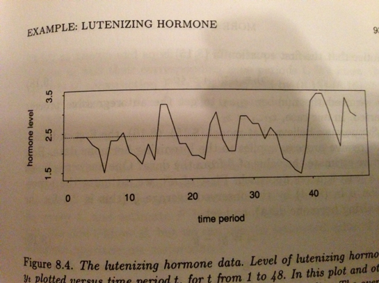
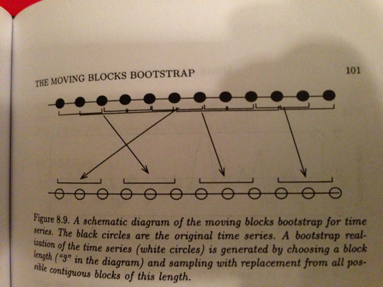

Week 2 Lecture
========================================================

## Week 2 Readings

For this week, I suggest reading Aho Sections 5.4 and 6.6.1 and [Johnson (1995)](https://github.com/hlynch/Biometry2023/tree/master/_data/Johnson_1995.pdf). Those interested in a historical but still relevant perspective on how we learn from data should check out [Tukey (1969)](https://github.com/hlynch/Biometry2023/tree/master/_data/Tukey_1969.pdf).

Today's Agenda
--------------------

This week we will learn about two concepts: 1) Hypothesis testing, and 2) Parameter estimation. You can think of these two concepts as two sides of the same coin, since they each allow us to learn from data.

Hypothesis testing is a bit like the game 50-questions (Are you red? Are you blue? Each question is a null hypothesis to be rejected...). One example would be estimating the change in infection rate for patients receiving a Covid vaccine. The null hypothesis is: The vaccine provides no benefit. The test statistic would be the infection rate, and a mathematical way to state the null hypothesis would be $H_{0}: Rate_{Unvaxxed} - Rate_{Vaxxed}=0$. A hypothesis test would allow us to potential *reject* that null hypothesis. 

Parameter estimation is more direct, it just asks "What are you?". In the example provided above, we would estimate the parameter of interest, which is $Rate_{Unvaxxed} - Rate_{Vaxxed}$, and our uncertainty about that parameter of interest. If our estimate of that parameter was so large (or the uncertainty so small) that we could be sure that the parameter was not zero, then this would be equivalent to rejecting the null hypothesis.

Hypothesis testing 
--------------------

There are few topics in statistics more controversial than the various philosophies behind null hypothesis testing. Over the next two weeks we will learn about the two paradigms (Fisher vs. Neyman-Pearson), the hybrid approach mostly commonly used in ecology, and criticisms of the whole enterprise. Bayesian statistics takes an entirely different approach than either Fisher or Neyman-Pearson, and the Bayesian approach resolves many of the inconsistencies involved with frequentist statistics, but at the expense of increased computation (and the use of prior information…). 

We frame decision-making in terms of a null and an alternative hypothesis.

$H_{0}$  vs. $H_{A}$

To take Karl Popper’s famous example:

$H_{0}$: There are no vultures in the park.

$H_{A}$: There are vultures in the park.

Note that the data may reject the null hypothesis (for example, finding vultures in the park), or the data may fail to reject the null hypothesis, but it can never prove the null hypothesis. **We cannot prove there are no vultures in the park.** We can only say that we were not able to find any vultures in the park, and therefore cannot reject the null hypothesis.

Fisher’s original context for developing significance testing was agricultural experiments that could be easily replicated. Fisher’s threshold of 0.05 was an arbitrary threshold for an effect to be considered worthy of continued experimentation. Any experiment that failed to reach this threshold would not be pursued. Experiments that gave “significant” results would be subject to additional experiments. These additional experiments may prove the original effect to be a fluke (and experiments would cease) or the additional experiments may provide confirmatory evidence that the effect was real. 

<a id="6steps"></a><span style="color: teal;">**Null hypothesis testing (as I will teach it) involves 6 steps.**</span>

**Step #1**: Specify a null hypothesis $H_{0}$
(Note that I do not include specification of the alternative hypothesis $H_{A}$ here. While the alternative hypothesis is useful as a mental construct, the basic approach deals only with $H_{0}$ and does not require a $H_{A}$.)

*Example*: In an experiment on vaccine efficacy, the null hypothesis would be that the probability of coronovirus infection is the same in the vaccinated group as in the control group that received only a placebo. Mathematically, this could be stated:

$H_{0}: P_{\small{\mbox{infection}}}^{\small{\mbox{vaccinated}}}=P_{\small{\mbox{infection}}}^{\small{\mbox{control}}}$

**Step #2**: Specific an appropriate test statistic T.
A test statistic is some summary of your data that pertains to the null hypothesis. For testing simple hypotheses, there are test statistics known to be ideal in certain situations. However, even in these simple cases, there are other test statistics that could be used. In more complex situations, YOU will have to determine the most appropriate test statistic. 

generic $T=f(X)$

specific $T^{*}$=T($X_{1}$,$X_{2}$,…,$X_{n}$)

We will introduce many more test statistics in the weeks to come.

*Example*: In our example with the vaccine trial, a reasonable test statistic would be 

$T=P_{\small{\mbox{infection}}}^{\small{\mbox{vaccinated}}}-P_{\small{\mbox{infection}}}^{\small{\mbox{control}}}$.

(This would be the best test statistic if probabilities were Normally distributed, but they are not. However, this test statistic is reasonable and highly intuitive and illustrates the basic point.)

**Step #3**: Determine the distribution of the test statistic under the null hypothesis $H_{0}$.
A test statistic is a statistical quantity that has a statistical distribution. 

$f(T│H_{0})$

Notice that this is the probability of obtaining the test statistic T **given** the null distribution, it is **not**
$f(H_{0}│T)$.

The test statistic and its distribution under the null hypothesis is the statistical test.

Test = Test statistic + Distribution of test statistic under $H_{0}$

**Step #4**: Collect data and calculate T*
Collect data by taking random samples from your population and calculate the test statistic from the sample data.

**Step #5**: Calculate a p-value

Calculate the probability that you would get a value for the test statistic as large or larger than that obtained with the data under the null hypothesis 

$P(T^{*}│H_{0})$=p-value

**Step #6**: Interpret the p-value

Use the p-value to determine whether to reject the null hypothesis (or, alternatively, to decide that the null hypothesis cannot be rejected)

*Example*: In our vaccination example, we would look at the difference in these two populations (control vs. vaccinated) and if the difference between those two probabilities was larger than we would expect to occur under the null hypothesis (which, but assuming that the vaccine is no better than a placebo, assumes that these two groups are equivalent and therefore that any differences are due to random chance alone), then we would reject the null hypothesis that the vaccine is equivalent to the placebo. (Note that I haven't said anything about whether the vaccine lowers infection rates; in a few minutes we'll discuss one-tailed vs. two-tailed tests.)

**These steps apply for both parametric and non-parametric statistics.** Here we are introducing hypothesis testing through the lens of randomization procedures, but the same steps will be used again when we get into statistics involving parametric distributions (i.e. statistical distributions of known form and described by a finite number of parameters) and their properties. As you will see in a few weeks, most standard statistical tests involve a test statistic with a known distribution under the null hypothesis; here the distribution under the null hypothesis needs to be generated by randomization (randomization test). (We are starting with the randomization-based procedures because there is no math involved and it is more intuitive.)

The basic idea underlying all statistical tests: <span style="color: teal;">**What is the probability that I would get a test statistic as large or larger (as produced by the data) if the null hypothesis was true (this is the “p-value”). To answer this question we need (1) a test statistic and (2) a distribution under the null hypothesis.**</span>

p-value = $P(data|H_{0})$

<a id="pvalint"></a><span style="color: teal;">**Remember – the p-value is a statement about the probability of getting your data if the null hypothesis were true. It is not a statement about the probability that the null hypothesis is true.**</span> This logic can go wrong!!

Example:
	If a person is an American, he is probably not a member of Congress.
	This person is a member of Congress.
	Therefore he is probably not an American.

Let's draw a null distribution. In order to interpret the statistical test, we need to know whether we want a one-tailed test or a two-tailed test. <a id="tails"></a>In a one-tailed test, we would reject the null hypothesis only if the test statistic is larger than expected under in the null in one direction (5$%$ in one tail). In a two-tailed test, we would reject the null if the test statistic is larger in either direction (2.5$%$ in both tails).

**Example**: Let’s say I’m looking at the change in auto accident mortalities after a ban is enacted on driving while texting. We would expect that auto accident mortality would decrease after a ban on texting while driving. Let’s say, for arguments sake, that our test statistic T is the change in accident deaths

$H_{0}$: T=0 (no change in deaths)

$H_{A}$: T<0 (decline in deaths)

Another possible formulation of the null and alternative hypotheses is

$H_{0}$: T=0 (no change in deaths)

$H_{A}$: T $\neq$ 0 (increase or decline in deaths)

Why does it matter?

Consider the first case. To reject the null hypothesis, you would have to show that the measured decline $T^*$ was so large as to be very unlikely to have occurred by random chance assuming there was no true change in death rate. Therefore, you would require

$P(T \geq T^{*}│H_{0})<0.05$

to be true for you to decide to reject the null hypothesis. This is a one-tailed test. 

Consider the second case. To reject the null hypothesis, you would accept values of $T^{*}$ as significant if they were either very large or very small, and would divide the 5% critical region between the two tails

$P(T \geq T^{*}│H_{0})<0.025$

$P(T \leq T^{*}│H_{0})<0.025$

Notice that it now becomes a *more stringent test*. If $T^{*}$ is large, it now has to be even larger to qualify as "significant". This is a two-tailed test.

**<span style="color: indigo;">TWO KEY POINTS:</span>**

<span style="color: indigo;">1. If you are using a one-tailed test, you have to be willing to accept a result that is opposite in sign of what was expected as being PURELY BY CHANCE!! In other words, if traffic deaths went UP after the texting ban, you would have to be willing to accept that that was by pure chance and you would then fail to reject the null hypothesis of NO CHANGE. This is in fact what happened, by the way: Texting bans actually increase traffic deaths – WHY?</span>

<span style="color: indigo;">2. Before using the more “lenient” one-tailed test, make sure you really believe that results opposite to what you expect are only random</span>
	
You cannot do a one-tailed test, find the answer to have the wrong sign and then do a two-tailed test. While probably quite common, this is not statistically valid. You cannot use the data to generate the test!
Not all tests are created equal!! Tests differ in their power to detect differences, and their efficiency. The balance between power and efficiency depends on the specific situation; we will discuss this more next week.

We are going to introduce the idea of hypothesis testing through the practice of permutation tests, because it allows us to get into the flow of testing hypotheses without the burden of a lot of complicated mathematics. Moreover, in doing so, we introduce the more general concept of "generative models", which generate outcomes through simulation. For example, we can think of the statement $X \sim Pois(\lambda)$ as a generative model because it allows us to generate datasets that follow the distribution $Pois(\lambda)$. If we had a dataset and we wanted to know whether it came from a Poisson distribution, we could imagine generating lots of datasets using a generative model (i.e. drawn from $Pois(\lambda)$) and asking ourselves whether any of the generated datasets look anything like the dataset we have. In the same way, we can think about testing a null hypothesis $H_{0}$ by generating data under that null hypothesis, calculating some test statistics from that generated data, and asking whether our geneterated test statsitics "look like" the test statistic obtained from our real data. If not, then we can reject the null hypothesis. Simulations like this are enormously powerful tools for testing hypotheses and are often far more intuitive than the alternative "parametric" statistical tests we will learn in Weeks 3 and 4.

Permutation tests 
------------------------
<a id="permmethods"></a>

Let’s say we have two random samples drawn from possibly different probability distributions F and G,

$F \rightarrow z=\{z_{1},z_{2},...,z_{n}\}$

$G \rightarrow y=\{y_{1},y_{2},...,y_{m}\}$

Having observed z and y, we wish to test the null hypothesis $H_{0}$ of no difference between F and G, $H_{0}:F=G$.
Note that the equality F=G means that the two distributions are exactly the same across their entire distribution, not just that their means are the same. If $H_{0}$ is true, than there is no probabilistic difference between drawing random values from F and drawing random values from G.

*What are some possible test statistics that we might use in this case?*

There are many test statistics that we could use to test this null hypothesis but lets use the difference in means as the test statistic. If there is a large difference in their means, than we can probably reject the null hypothesis that they represent the same underlying distribution.

$T=E[F]-E[G]=\bar{z}-\bar{y}$ 

The way to do this is to lump all the data together and to randomly permute the labels so that data are randomly assigned to a group (z vs. y). **<span style="color: orangered;">Important: We are not sampling with replacement here. We are simply permuting the labels to "erase" any possible correlation between group and the values of the data.</span>**

We then calculate the mean of the "fake z" group and the mean of the "fake y" group and take the difference. That is the result of ONE permutation. If we do that many many times (say, 10000 times) then the distribution of those differences reflects the distribution under the null hypothesis of no difference between F and G.

We will do an example like this in the problem set.

Parameter estimation
-------------------------

Hypothesis testing answers a very direct question relating to the probability of the data under the null hypothesis, and this can be used to judge whether the data are consistent with the null hypothesis or whether the data are inconsistent with the null hypothesis (in which case we would "reject" it).

Parameter estimation represents a more direct approach by directly estimating the parameter of interest.

First, a bit of vocabulary:

**Estimators are tools that produce estimates of population statistics from sample statistics.** 

The basic outline of "statistical inference":
Data = sample $\rightarrow$ sample statistics $\rightarrow$ ESTIMATOR $\rightarrow$ population parameters

We generally use the word "statistic" when discussing the data, and "parameter" when discussing the underlying distribution.

**An "estimator" or "point estimate" is a statistic (that is, a function of the data) that is used to infer the value of an unknown parameter in a statistical model. If the parameter is denoted $\theta$ then the estimator is typically written by adding a "hat" over the symbol: $\hat{\theta}$. Being a function of the data, the estimator is itself a random variable; a particular realization of this random variable is called the "estimate".** Sometimes the words "estimator" and "estimate" are used interchangeably, but I will try and be consistent in using the word "estimator" for the function in the generic, and the word "estimate" for the result of applying that function to the data at hand.

We have not been formally introduced to statistical distributions yet, but the Normal (a.k.a. Gaussian) distribution is the classic "bell-shaped" curve you may be familiar with. It has two parameters, $\mu$ (the location of the center of the bell curve) and $\sigma$ (the width of the bell curve). 

Let's say we have a random variable X that follows a Normal distribution:

$$
X \sim N(\mu,\sigma^{2})
$$
Parameter estimation involves using the data to estimate the true value of $\mu$ and $\sigma$. 

<a id="estimator"></a>We define the "estimator" for $\mu$ as

$$
\frac{1}{n}\sum_{i=1}^{n}X_{i} 
$$

Therefore, the "estimate" $\hat{\mu}$ is

$$
\hat{\mu}=\bar{X} =\frac{1}{n}\sum_{i=1}^{n}X_{i} 
$$

Estimators are imperfect tools, and they can suffer from *bias* and/or *variance* (or, equivalently, standard error). 

1. Bias: As $n \rightarrow \infty$, sample statistic does not converge to the population parameter

2. Standard error: Each individual estimate may be too low or too high from the true value (this can occur even if the long run average value is correct, i.e. unbiased). In other words, there is sample-to-sample variance in the estimates obtained from a given sample. 

It turns out that bias and variance trade-off, and this trade-off is controlled by the complexity of the model you are trying to fit. We will return to these ideas in Week 13 but I suggest reading through [this](https://towardsdatascience.com/understanding-the-bias-variance-tradeoff-165e6942b229) nice (and short) explanation of bias and variance (written from the perspective of machine learning, which is just another kind of model building enterprise).

**Why are estimators associated with a standard error? <span style="color: orangered;">If you were to do your experiment all over again, say 1000 times, the value of your estimate would be different each time.</span> Your 1000 estimates would have a statistical distribution with some spread, and the spread of these 1000 estimates is quantified by the standard error.**

(A good example of this from the Week 1 problem set is the question asking you the probability of getting *your* bag of M&Ms from a random sample of M&Ms. Let's say you calculated this probability by sampling 100,000 times and you got 4 "matches". This gives you an estimate of 0.00004. But if you repeated this experiement a second time, with *another* sample of 100,000 bags, you might get 7 matches or 2 matches or none at all! So 0.00004 is your estimate of the probability, but it is an estimate with some uncertainty because you don't know how variable that probability would be if you did the experiment multiple times. This "spread" of the estimates is the standard error of your estimate. Computationally, we can calculate the standard error by doing lots of experiments, but in practice, this is not always possible. Therefore, as we'll see in the next few weeks, we usually use the properties of statistical distributions to calculate the standard error of an estimate.)

How do we estimate the bias and variance (related to standard error) of an estimator?

While there are other methods that we will discuss in a few weeks, now we are going to introduce the idea through two non-parametric approaches: bootstrap and jackknife.

First we need to stop and discuss what it means to sample from an empirical distribution.

Let’s say I have a bunch of lotto balls in an urn

$X=\{X_{1},X_{2},X_{3},...,X_{n}\}$

and I want to draw sets of 5 lotto numbers from that urn. I can sample with replacement or without replacement.

If you sample with replacement, we may get some numbers more than once. It also means that if you draw n balls out of an urn with n numbers, there are some numbers you will never draw.

**STOP: Do you understand sample-with-replacement and sample-without-replacement?**
                 
Method #1: Non-parametric bootstrap
-----------------------------------

The basic idea behind bootstrap sampling is that even if we don’t know what the distribution is that underlies the data, we can “pull ourselves up by our bootstraps” and generate the distribution by resampling WITH REPLACEMENT from the data itself.

Say we have original data drawn from an unknown distribution G

$X=\{X_{1},X_{2},X_{3},...,X_{n}\}$

$$
X \sim G()
$$

We don’t know the underlying distribution, but we can substitute the empirical distribution $\hat{G}$ which is defined by $\{X_{1},X_{2},X_{3},...,X_{n}\}$. In other words, we model the underlying "true" unknown distribution as a multinomial where every value in X is given a probability $\frac{1}{n}$ of occurring.

Let’s say we want to compute a statistic of the probability distribution $\theta=f(G)$, which could be the mean or the median or the standard error of the standard deviation (anything at all!!). 

BTW: $\theta$ is analogous to the test statistic T used for hypothesis testing, and it will be used in the same way. However, I will use the symbol $\theta$ to be consistent with the Efron and Tibshirani and other literature on the bootstrap.

The "plug-in" principle states that for every parameter of the underlying distribution, we can estimate that function by simply plugging in the empirical distribution

$$
\hat{\theta}=f(\hat{G})=f(X)
$$

This is exactly what we would do intuitively. If we have a bunch of numbers and we want to know the mean of the distribution from whence they came, we would use as the best estimate the mean of those numbers. The "plug-in" principle simply formalizes the idea that these summary statistics can be used to make inference about the generating distribution.

In the development to follow, we will assume that we have NO other information about a distribution other than a single sample from that distribution.

Summary statistics are easy enough to compute, but we don’t have any way of knowing how accurate those summary statistics might be. The bootstrap gives us a way to calculate the accuracy of our summary statistics $\hat{\theta}$.

The bootstrap works NO MATTER HOW COMPLICATED THE FUNCTION, IT IS COMPLETELY AUTOMATIC, AND REQUIRES NO THEORETICAL CALCULATIONS. (I'm simplifying a little. The bootstrap fails in rare cases, which we won't get into.)

First we need the idea of a bootstrap sample. A bootstrap sample is any sample drawn randomly WITH REPLACEMENT from the empirical distribution.

BOOTSTRAP = SAMPLE WITH REPLACEMENT

$X^{*}=\{\mbox{n values drawn with replacement from } X\}$

n = size of the bootstrap sample = size of the original dataset

We draw k such bootstrap samples:

$$
X_{1}^{*}=\{\mbox{n values drawn with replacement from } X\}
$$
$$
X_{2}^{*}=\{\mbox{n values drawn with replacement from } X\}
$$

etc.

$$
X_{k}^{*}=\{\mbox{n values drawn with replacement from } X\}
$$

**Important**: Because we are sampling WITH REPLACEMENT, some of the original values will be represented more than once in any given bootstrap sample and others not at all. 

We calculate our statistic of interest on each bootstrap sample:

$$
\theta_{1}^{*}=f(X_{1}^{*})
$$
$$
\theta_{2}^{*}=f(X_{2}^{*})
$$

etc.

$$
\theta_{k}^{*}=f(X_{k}^{*})
$$

We will number the different bootstrap sample statistics as

$$
\theta_{1}^{*},θ_{2}^{*},θ_{3}^{*},...,θ_{k}^{*}
$$

k = number of bootstrap samples, you can choose the number of bootstrap samples, more sample = better estimates

Now that we have our collection of k bootstrapped estimates of the statistic, what do we do with them?

Remember: The goal was to calculate the bias and standard error of our estimator.

$$
\widehat{Bias_{boot}}=\left( \frac{1}{k}\sum_{i=1}^{k}\theta_{i}^{*}\right)-\hat{\theta}
$$

In other words, the <a id="bias"></a>Bias of our estimator is simply the mean of the bootstrapped sample statistics minus the statistic as calculated for the original data. (For unbiased estimators, our estimate of bias goes to zero as the sample size n gets very large.)

We can also use these bootstrapped statistics to calculate the standard error of the estimator:

$$
\widehat{se_{boot}}=\sqrt{\frac{1}{k-1}\sum_{i=1}^{k}(\theta_{i}^{*}-\bar{\theta^{*}})^{2}}
$$

*This is just the standard deviation of the distribution of $\theta$.* This is a really important point that is worth dwelling on for a bit. Our uncertainty about the value is captured by how much variation there is when I draw a different sub-sample of the data, which mimics re-doing the experiment altogether. In this case, I call the standard deviation of those $\theta^{*}$ values a standard error, because they represent my uncertainty (my potential error) about $\hat{\theta}$. Do not confuse standard deviation and standard error. A standard deviation is a statistic (something calculated from data) about the spread of the data. <a id="se"></a>A standard error is the standard deviation of my estimates, and therefore is a measure of how uncertain I am about my estimate.   

We will work through  a few examples in the lab. 

Knowing how to draw bootstrap replicates gets more complicated when you have multivariate datasets.
For example, lets start with a dataset comparing average LSAT scores and GPA for the incoming classes for 15 law schools 

```{r echo=FALSE, fig.align='center', fig.cap='Source: Efron and Tibshirani (1994)', out.width='40%'}
knitr::include_graphics('LSAT_info.png')
```

Lets say we want to estimate the true correlation coefficient between LSAT scores and GPA. We haven’t covered this yet, but one estimator for the true correlation coefficient is Pearson’s product moment correlation coefficient r

$$
r=\frac{cov(a,b)}{\sqrt{var(a)×var(b)}}
$$

Therefore, in this case

$$
\hat{r} = \frac{cov(LSAT,GPA)}{\sqrt{var(LSAT)*var(GPA)}}
$$

(In R, we would write this as r.est = cor.test(LSAT,GPA)$estimate.)

If LSAT and GPA both come from a normal distribution, then we could use the theory of normal distributions to calculate the standard error of $\hat{r}$. (We will learn this in Week 9.) But, we know LSAT and GPA can’t be from  normal distributions. At the very least, GPA is bounded on (0,4), so it cannot be Normally distributed. So, how do we calculate the standard error of $\hat{r}$?

Here we sample with replacement from the bivariate PAIRS of data. In other words, we sample

$$
X_{1}^{*}=(LSAT_{i},GPA_{i}), \mbox{where i=sample with replacement 1...n}
$$
$$
X_{2}^{*}=(LSAT_{i},GPA_{i}), \mbox{where i=sample with replacement 1...n}
$$

and so forth, and then calculate the correlation of each simulated dataset.

**Question**: Why not sample with replacement from the two datasets independently? What question would that be answering?

If we do this many times, say k=10,000 times, then we can draw a histogram of these bootstrapped correlation coefficients.

 We can calculate the standard error of our estimate for the correlation coefficient 

$$
\hat{se}_{boot} = \sqrt{\left(\frac{1}{k-1}\right)\sum_{i=1}^{k}(r_{i}^{*}-\bar{r^{*}})^{2}}
$$


Therefore, using R, we would calculate the parametric correlation coefficient as: r.est ± 1.96*s.e.boot (VERSION 1)

Even better, we can calculate the 95th percentile confidence interval of this distribution: quantile(all.cor,c(0.025,0.975)) (VERSION 2)

Note that while VERSION 1 is common, VERSION 2 is preferred because there is no guarantee that the distribution of bootstrap statistics is even vaguely Normal.

Bootstrapping can deal with even more complex cases, and is particularly useful when dealing with spatial or temporal autocorrelation. Take for instance a time series of hormone levels:

```{r echo=FALSE, fig.align='center', fig.cap='Source: Efron and Tibshirani (1994)', out.width='40%'}

```

If you wanted to do some time series analysis of this data, say to calculate the correlation between each datapoint and the last datapoint, you would have a difficult time doing so because of the complex temporal autocorrelation. Bootstrap can help in this case, but its not at all obvious how to bootstrap from this time series and preserve the essential temporal autocorrelation structure of the data. One approach would be to do a “moving blocks” bootstrap. 

```{r echo=FALSE, fig.align='center', fig.cap='Source: Efron and Tibshirani (1994)', out.width='40%'}

```

This is more advanced, but it makes the point that a) bootstrap can be enormously useful in a variety of complicated analyses and b) you have to think carefully about what to sample in order to preserve the essential element of the data.

R has numerous functions for doing bootstrapping, although bootstrapping is so easy its often just as easy (and more transparent) to simply write your own code to do it. We will go over some examples in lab.

Note that the procedure we have described is called the non-parametric bootstrap estimate because it is based only on the non-parametric empirical distribution G ̂. If we had assumed some kind of distributional form for G, it would be considered a parametric bootstrap. 

Parametric bootstrap
---------------------

The parametric bootstrap is similar to the non-parametric bootstrap except that instead of drawing our bootstrap samples from the original data, we fit a distribution to the data first, and then draw our samples from that. 
We haven’t covered how to fit a distribution to data yet, nor have we introduced any of the univariate distributions, so I won’t show you how to do a parametric bootstrap now but we’ll get some practice in the Week 3 problem set.

Why would we ever do a parametric bootstrap? We might use a parametric distribution if our original sample size was so small that we did not think it could "stand in" for the underlying parametric distribution. For example, if your dataset for coin age just so happens not to have any coins made in 1990, you may be uncomfortable having all your bootstrapped datasets also be missing coins made in 1990. (Remember: Bootstrapping is, in some way, supposed to mimic redoing your experiment. Do you really think that you'd never get a coin made in 1990?) To get around this problem, you might do a parametric bootstrap. Note that, if you use MLEs to get the parameters for the parametric bootstrap, those parameter estimates assume large sample sizes (the formula are asymptotically correct for large sample sizes) and so you have to be a little caution that your parametric bootstrap might not be capturing the true underlying distribution. While parametric bootstrap is often done when sample sizes are too small, occasionally it may also be used when you have some strong theoretical justification for a particular distribution but the statistics you are interested in have no simple formula. (In other words, maybe the distribution is known, but the statistical properties of the specific parameter you are interested in is not known but could be derived through parametric bootstrapping.)

Jackknife
---------------

<a id="jackknife"></a>Jackknifing is another method of assessing bias and standard error of sample statistics. Jackknife can also be used to establish the influence of each datapoint in your dataset. The procedure simply involves leaving out each datapoint and recalculating the statistic of interest. 

If your dataset involves the set 

$$
\{x_{1},x_{2},x_{3}\}
$$

then the jackknife samples are

$$
\{x_{1},x_{2}\},\{x_{1},x_{3}\},\{x_{2},x_{3}\}
$$

The traditional notation is that the estimate based on the dataset when the ith element is removed is ($\widehat{\theta_{(i)}}$).

The jackknife estimate of bias is given by

$$
\widehat{Bias_{jack}}=(n-1)(\hat{\theta_{(.)}}-\hat{\theta})
$$
where

$$
\hat{\theta}_{(.)}=\frac{1}{n}\sum_{i=1}^{n}\hat{\theta}_{(i)}
$$

You can convince yourself of this formula by working out the case where $\hat{\theta}$ is the mean. You can also see intuitively why you would have to multiply the jackknife estimate of bias by (n-1) since the deviation of the jackknifed samples from the full sample is much smaller than the standard deviation of the bootstrapped samples. (**DOES EVERYONE SEE WHY?**)

The jackknife estimate of standard error is given by

$$
\hat{se}_{jack}=\sqrt{\frac{n-1}{n}\sum_{i=1}^{n}(\hat{\theta}_{(i)}-\hat{\theta}_{(.)})^{2}}
$$

With the pennies example we will do in lab, we have 5 pennies and we have only 5 possible jackknifed samples. Do you see why? Note that while bootstrapping can involve simulating an arbitrarily large number of pseudosamples (k), there are only n possible jackknife replicates for a dataset of size n.

**Exercise**: Use your pennies to calculate $\widehat{Bias}_{jack}$ and $\widehat{se}_{jack}$.

Both bootstrap and jackknife can estimate the standard error of a statistic, and in this way, their use can often be interchangeable. However, the jackknife can ONLY compute the bias and standard error whereas the bootstrap calculates the entire distribution of the statistic from which the standard error can be inferred. Bootstrapping is often more computer intensive, but with modern computers this is hardly a drawback.

Jackknife-after-bootstrap 
---------------------------

Jackknife-after-bootstrap is one method of assessing the standard error of bootstrap statistics.
For example, jackknife-after-bootstrap can give us the standard error of the bootstrap standard error: 

$$
\widehat{se}_{jack}(\widehat{se}_{boot})
$$

To do this there are two steps:

1. Leave out data point i and use the remaining data in a bootstrap analysis to calculate (s.e.) ̂_(boot(i))
2. Define 

$$
\widehat{se}_{jack}(\widehat{se}_{boot})=\sqrt{\left(\frac{n-1}{n}\right)\sum_{i=1}^{n}(\hat{se}_{boot(i)}-\hat{se}_{boot(.)})^{2}}
$$

Notice that because there are always some bootstrap samples that do not include i, you do not actually have to do any extra computation to do jackknife-after-bootstrap, but the precise details of using the bootstrap samples you already have are a bit complicated. 

In R, this can be done using the ‘jack.after.boot’ function in the package “boot”.

**Discuss: Why are hypothesis testing and parameter estimation two sides of the same coin?**

By the end of Week 2, you should understand...
---------------------

- the 6 steps of Null Hypothesis Significance Testing [here](#6steps)
- the interpretation of a [p-value](#pvalint) (hint: it is *not* the probability that the null hypothesis is correct)
- the difference between [a one-tailed and two-tailed test](#tails)
- how to use [permutation-based methods](#permmethods) to test a statistical hypothesis
- the relationship between testing a hypothesis and estimating an [effect size](#effectsize)
- the definition of an [estimator](#estimator)
- how to use bootstrapping (both parametric and non-parametric) to estimate a test statistic and calculate the [bias](#bias) and [standard error](#se) of your estimate
- when to use parametric bootstrap vs. non-parametric bootstrap (hint: rarely) 
- how to use [jackknife](#jackknife) to estimate bias and standard errors of an estimate

