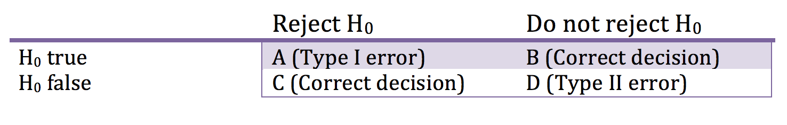
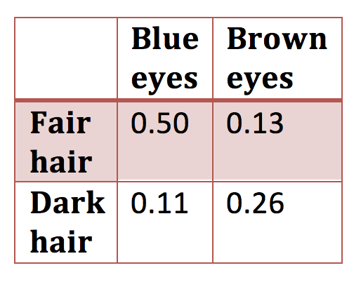
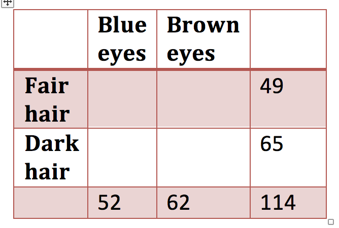

Week 5 Lecture
========================================================

## Week 5 Readings

For this week, I suggest reading Aho Sections 6.1-6.5 and Logan Chapter 6. I also strongly recommend reading [Johnson (2002)](https://github.com/hlynch/Biometry2023/tree/master/_data/Johnson_2002.pdf), [Simberloff (1990)](https://github.com/hlynch/Biometry2023/tree/master/_data/Simberloff_1990.pdf), and [Brosi and Biber (2009)](https://github.com/hlynch/Biometry2023/tree/master/_data/Brosi_Biber_2009.pdf). 

There are additional readings that I highlight here because they may be of interest, or may provide additional perspectives on the themes of the week, including [this paper on the irreproducibility of results based on p-values](https://github.com/hlynch/Biometry2023/tree/master/_data/Halsey_etal_2015.pdf), [this article on p-values from The Scientist Magazine](https://github.com/hlynch/Biometry2023/tree/master/_data/ScientistMagazine.pdf), [this paper on p-hacking](https://github.com/hlynch/Biometry2023/tree/master/_data/Head_etal_2015.pdf), and [the official statement on p-values by the American Statistical Association](https://github.com/hlynch/Biometry2023/tree/master/_data/ASA_statement.pdf).

Statistical power
----------

In any hypothesis test, there are 4 possible outcomes.

```{r echo=FALSE, fig.align='center', fig.cap='Type I and Type II errors', out.width='100%'}

```

B and C are the **correct answer**. If $H_{0}$ is false, we want to reject the null hypothesis.

A = Probability of rejecting $H_{0}$ when $H_{0}$ is true = Type I error = This is your $\alpha$!

D = Probability of not rejecting $H_{0}$ when $H_{0}$ is false = Type II error

The power of a statistical test is defined as

$$
\mbox{Power} = \frac{C}{C+D}
$$
In words, **power is the probability of correctly rejecting the null hypothesis**.

Power calculations boil down to this unavoidable fact: When variance is high, you need larger samples. When the differences are small, you need larger samples. There is a tradeoff between Type I and Type II errors. As a general rule of thumb, people aim for Type I errors of 0.05 and Power = 0.80.
Question for the class: Why do we worry more about Type I errors than Type II errors? When would a Type II error be really serious? (For example, failing to detect a disease agent...)

Power calculations only make sense before an experiment, not after. If you found a significant effect, then clearly you had enough power, and if no significant effect, you clearly do not enough power. The main utility of power calculations is to get some intuition for the necessary sample size required while designing an experiement.

In order to plan a study, you need to know how many samples you need to detect as significant difference of a certain magnitude. For a single sample comparison (against a fixed value)

$$
n = \left(\frac{\sigma(z_{1-\alpha}+z_{1-\beta})}{\delta}\right)^{2}
$$

You will be derive this as a group in lab this week but for now its enough to note that in the very common case that $\alpha$=0.05 and power=1-$\beta$=0.80, this can be approximated by

$$
n = \frac{8\sigma^{2}}{\delta^{2}}
$$
Note that some authors use the symbol $\sigma^{2}$ under the assumption that this is known (or assumed) prior to calculation, whereas others substitute $s^{2}$ for $\sigma^{2}$ in recognition that this is calculated from the data, although they leave the formula unchanged. As long as you understand what is meant by the symbol, than it is not important which you use here.

*Example*: If you want to be able to detect a change of 2.0 in a population with variance $\sigma^{2}$=10.0, then we would need 8x10/$2^{2}$ = 20 replicates.

For a two sample comparison, the sample size (for each group!) required is simply twice

$$
n = 2\left(\frac{\sigma(z_{1-\alpha}+z_{1-\beta})}{\delta}\right)^{2}
$$
or

$$
n = \frac{16\sigma^{2}}{\delta^{2}}
$$
I won’t say a lot more about power calculations because I think that these calculations typify the old way of thinking because they depend so heavily on the arbitrary cut-off of “significance” that is so problematic in null hypothesis testing. Such power calculations can give you some general rules of thumb for whether an experiment is well designed, but even then it required some major assumptions about the size of the unknown variance that I’m not sure how helpful they are.

**A bit of review: What have we done so far this semester?**

1.	We learned a bit about probability theory (joint probability, union and intersection, etc.).
2.	We learned about hypothesis testing and parameter estimation, using two randomization-based procedures that gave us the main idea behind these two key concepts
3.	We learned a suite of discrete and continuous probability distributions. These probability distributions allow us to describe the relative probability of various outcomes. We often use probability distributions to model our data. We learned various ways of expressing probability distributions (e.g., cumulative distributions, quantiles, etc.), and we learned how to calculate various properties of a distribution (e.g., the expected value E[X] and the variance Var[X]).
4. We learned two different ways to estimate the parameters of a parametric distribution given data: A) Using the Central Limit Theorem and other "theory" about distributions; B) Using maximum likelihood. While we discussed four special cases where we can use Method A, Method B is MUCH more general, and can be used under all circumstances. Maximum likelihood is the "go-to" approach for fitting models to data if you wish to fit a parametric distribution to your data.

*An important sidebar*: Now that we’ve covered maximum likelihood estimation, and we know how to use ML to estimate a parameter and its confidence intervals, lets cycle back to what we learned about randomization-based procedures in Week 2. In Week 2, we use bootstrap and jackknife to estimate the confidence intervals (or the standard error, if you prefer to think of it that way) for a parameter estimate. So why might we prefer one approach (ML or bootstrap/jackknife) over the other? ML is the standard approach if you know the joint likelihood of your data, as it is computationally much more efficient and it has well known properties because you have specified the distribution of your data using well described distributions. However, sometimes you don’t know the joint distribution of your dataset? Why not?

a)	It may be that each individual data point does not come from a known distribution (or, put another way, none of the known paramteric distributions fit your data well)
b)	It may be that each individual data point does come from a known distribution but your data are not independent and you are not able to describe the JOINT distribution of your data
In these cases, we tend to fall back on non-parametric methods like bootstrap and jackknife, such as what was covered in Week 2. 

We will now learn how to combine our knowledge of all the univariate distributions with our understanding of hypothesis testing to test hypotheses about the parameters of a distribution. (In other words, we will learn how to use statistics to pose and answer quantitatively rigorous questions about our data.) 

*First, a few reminders about statistical hypothesis testing...*

We frame decision-making in terms of a null and an alternative hypothesis: $H_{0}$  vs. $H_{A}$. Let's say that we are measuring the growth rates of bird colonies, and as before, we use a Normal distribution $N(\mu,\sigma^2)$. One reasonable null hypothesis might be $H_{0}:\mu=0$. So we collect data on several bird colonies, and we might find that our confidence interval for $\mu$ contains 0. In this case, we cannot reject the null hypothesis that $\mu=0$. But we also cannot affirmatively prove the null hypothesis. We simply "cannot reject" the null hypothesis. There are two reasons we "cannot reject" the null hypothesis. It might be that $\mu$ really is equal to 0. It is also possible that $\mu \neq 0$ but we did not have enough data to shrink the confidence intervals sufficiently to reject the null hypothesis. In this latter scenario, we would say that we did not have enough "statistical power" to reject the null hypothesis. 

**The six steps of null hypothesis testing are**:

**Step #1**: Specify a null hypothesis $H_{0}$.

**Step #2**: Specify an appropriate test statistic T. A test statistic is some summary of your data that pertains to the null hypothesis. For testing simple hypotheses, there are test statistics known to be ideal in certain situations. However, even in these simple cases, there are other test statistics that could be used. In more complex situations, YOU will have to determine the most appropriate test statistic. 

generic=$T$=f(X)
specific=$T^{*}$=$T(X_{1},X_{2},...,X_{n})$

We are familiar with some test statistics already, for example the use of $\bar{X}$ as a measure of the mean of a normally distributed population.

**Step #3**: Determine the distribution of the test statistic under the null hypothesis $H_{0}$. A test statistic is a statistical quantity that has a statistical distribution ($f(T│H_{0})$). Remember that this is the probability of obtaining the test statistic T GIVEN the null distribution, it is NOT
$f(H_{0}│T)$. The test statistic and its distribution under the null hypothesis form the statistical test. Test = Test statistic + Distribution of test statistic under $H_{0}$.

**Step #4**: Collect data and calculate $T^{*}$. Collect data by taking random samples from your population and calculate the test statistic from the sample data.

**Step #5**: Calculate a p-value. Calculate the probability that you would get a value for the test statistic as large or larger than that obtained with the data under the null hypothesis 
$P(T^{*}│H_{0})$=p-value.

**Step #6**: Interpret the p-value. Use the p-value to determine whether to reject the null hypothesis (or, alternatively, to decide that the null hypothesis cannot be rejected).

Note that these steps apply for both parametric and non-parametric statistics. The same basic steps also apply whether the test statistic follows a known distribution under the null hypothesis or whether the distribution under the null hypothesis needs to be generated by randomization (randomization test).

The basic idea underlying all statistical tests: What is the probability that I would get a test statistic as large or larger (as produced by the data) if the null hypothesis was true (this is the ''p-value''). To answer this question we need (1) a test statistic and (2) a distribution under the null hypothesis.

p-value = P(data|H0)

**Remember – the p-value is a statement about the probability of getting your data if the null hypothesis were true. It is NOT a statement about the probability that the null hypothesis is true.** 

Not all tests are created equal!! Tests differ in their power to detect differences and their "efficiency". The balance between power and efficiency depends on the specific situation; we will discuss this more next week. 

To get some practice in constructing and executing hypothesis tests, we are going to go over 4 classic and frequently used hypothesis tests:

1.	The t-test
2.	The F-test
3.	Test of binomial proportions
4.	Test of two distributions

The t-test is used to make inference on the means of normally distributed variables. There are three varieties of the t-test – one to test whether the mean of some normally distributed variable is equal to some hypothesized value, one to test whether the means of two unpaired samples are equal, and one to test whether the means of two paired samples are equal.

The single sample t test
---------------

(The t-test is often called the Student's t-test, as it is named after the pseudonym under which the original paper was submitted. However, I will refer to it as just the t-test for simplicity.)

The single sample t-test is used when you want to compare the mean of a distribution to a prescribed value. $H_{0}: \mu = c$

Let’s say we have normally distributed data:

$$
X \sim N(\mu,\sigma^{2})
$$

The Central Limit Theorem says:

$$
\bar{X} \sim N(\mu,\sigma^{2}/n)
$$

which means that

$$
\frac{\bar{X}-\mu}{\sqrt{\sigma^{2}/n}} \sim N(0,1)
$$

and if we do not know $\sigma^{2}$, that

$$
\frac{\bar{X}-\mu}{\sqrt{s^{2}/n}} \sim t_{n-1}
$$

Remember that:

$$
H_{0}: \mu=c
$$
$$
H_{A}: \mu \neq c
$$
Therefore, under the NULL HYPOTHESIS

$$
\frac{\bar{X}-c}{\sqrt{s^{2}/n}} \sim t_{n-1}
$$

**<span style="color: orangered;">In this case, our “test statistic” is $T=\frac{\bar{X}-c}{\sqrt{s^{2}/n}}$ and this test statistics follow the $t_{n-1}$ distribution. In other words, under the null hypothesis (if $\mu$ really is c), the value of the test statistic for any particular dataset of size n will be drawn from this distribution.</span>**

Let’s say when I actually calculate T for the data I have, I get $T^{*}$.

$$
P(T \leq (-|T^{*}|) \mbox{ OR } T \geq (|T^{*}|)|H_{0}) = p-value
$$

If p<0.05, we say that there is $<5\%$ probability that we would obtain something as or more ‘extreme’ than $T^{*}$ if the null hypothesis was true, we therefore REJECT the null hypothesis

If p>0.05, we say that there is a $>5\%$ probability we would obtain something as or more ‘extreme’ than $T^{*}$ if the null hypothesis is true, and therefore we DO NOT REJECT the null hypothesis.

Note that the t-test assumes that the data are Normally distributed, but it turns out that the t-test is fairly robust to violations of this assumption. In fact, the Central Limit Theorem says that (with a few minor requirements) the means of data have as their limit (for large sample sizes) the Normal distribution, so the t-test is often valid even if the original data is not Normally distributed.

Keep in mind that the t-test is intimately connected to the idea of calculating a confidence interval for the mean of a Normally distributed population. Last week, we derived this formula:

$$
P(\bar{X}-\sqrt{\frac{s^{2}}{n}}t_{(1-\alpha/2)[dof]} \leq \mu \leq \bar{X}+\sqrt{\frac{s^{2}}{n}}t_{(1-\alpha/2)[dof]}) = 1-\alpha
$$

So we now can test a hypothesis regarding the value of the mean *and* we can generate confidence intervals on the true (but unknown) mean of the population we are studying.

The unpaired two sample t test
---------------

The unpaired two-sample t test is used when you have data from two groups and you want to test whether these groups have the same mean value (i.e. $H_{0}: \mu_{A} = \mu_{B}$. As before, we will assume that the data are at least approximately Normally distributed. 

$$
X_{A} \sim N(\mu_{A},\sigma_{A}^{2})
$$

$$
X_{B} \sim N(\mu_{B},\sigma_{B}^{2})
$$

If datasets A and B are independent (in other words, each draw from A is not correlated to a corresponding draw from B), then the difference between these two datasets is given by

$$
X_{A}-X_{B} \sim N(\mu_{A}-\mu_{B},\sigma_{A}^{2}+\sigma_{B}^{2})
$$
Why? It's worth going back to review the Algebra of Expectations, but in brief, when you add or subtract independent variables, their variances add.

It follows (but I leave the few steps of algebra for you):

$$
\bar{X_{A}}-\bar{X_{B}} \sim N(\mu_{A}-\mu_{B},\frac{\sigma_{A}^{2}}{n_{A}}+\frac{\sigma_{B}^{2}}{n_{B}})
$$

Note that in addition to making no assumption about sample variances, we make no assumption of equal sample sizes between the two datasets being compared.

Therefore,the standard error of the difference between means is given by

$$
SE = \sqrt{\frac{\sigma_{A}^{2}}{n_{A}}+\frac{\sigma_{B}^{2}}{n_{B}}}
$$

which we have to estimate from the data using the sample variances $s^{2}$:

$$
SE = \sqrt{\frac{s_{A}^{2}}{n_{A}}+\frac{s_{B}^{2}}{n_{B}}}
$$

So our test statistic in this case is

$$
T = \frac{\bar{X_{A}}-\bar{X_{B}}}{\sqrt{\frac{s_{A}^{2}}{n_{A}}+\frac{s_{B}^{2}}{n_{B}}}}
$$

Now all we need is the distribution of the test statistics under the null hypothesis which is, by definition (this is a t-test after all) the t distribution. The degress of freedom for this distribution is a bit complicated:

$$
dof = \frac{\left(\frac{s_{A}^{2}}{n_{A}}+\frac{s_{B}^{2}}{n_{B}}\right)^{2}}{\frac{\left[\frac{s_{A}^{2}}{n_{A}}\right]^2}{n_A-1}+\frac{\left[\frac{s_{B}^{2}}{n_{B}}\right]^2}{n_B-1}}
$$

Note that there are some simpler formulas that apply if you assume equal sample size and/or equal variances. In the case of equal variances, you can pool the data to find a pooled estimate of the common variance $s^{2}$, but I will not go into the details here. Note that the default for R is to assume unequal sample sizes and unequal variances.


Pooling the variances {#pooledvar}
---------------

If the variances are assumed equal, this simplifies somewhat 

$$
T = \frac{\bar{X_{A}}-\bar{X_{B}}}{SE_{diff}} = \frac{\bar{X_{A}}-\bar{X_{B}}}{\sqrt{s^{2}_{pooled}\left(\frac{1}{n_{A}}+\frac{1}{n_{B}}\right)}}
$$

How do we calculate $s^{2}_{pooled}$?

$$
s^{2}_{pooled} = \frac{1}{n_{A}+n_{B}-2}(SS_{A}+SS_{B})
$$

where $SS_{A}$ is the sums-of-squares for dataset A and $SS_{B}$ is the sums-of-squares for dataset B.

Why bother assuming the variances are equal? By combining the data in the estimate of their pooled variance, we get a better estimate of $s_{pooled}^{2}$ than either $s_{A}^{2}$  or $s_{B}^{2}$. 

The paired two sample t test 
-----------------

Paired data occurs when each datapoint in set A corresponds to a datapoint in set B. Examples might be the strength of the left vs. right leg in a sample of individuals, or the blood sugar of husbands vs. wifes in a sample of married couples. In these cases, the question at hand is whether the difference between the two datasets is equal to some value or not. In other words, the null hypothesis is $H_{0}: X_{A}-X_{B} = c$. The test statistic is the same as with the unpaired test

$$
T = \frac{\bar{X_{A}}-\bar{X_{B}}}{SE_{diff}}
$$
but now our calculation of the $SE_{diff}$ changes because we are no longer assuming the two datasests are independent. In this case, the variances do not simply add, and the correct expression is

$$
X_{A}-X_{B} \sim N\left(\mu_{A}-\mu_{B},\sigma^{2}_{A}+\sigma^{2}_{B}-2Cov(A,B)\right)
$$
(Remember that $\sigma^{2}_{A}$ is just Var(A) or, put another way, the Cov(A,A). So this is the more general formula for the difference between two random Normally distributed variables, because if the two datasests are in fact independent, Cov(A,B)=0 and we end up with the simpler formula we introduced earlier. If you want more information on how to calculate the Covariance, you can jump ahead to the notes in Week 9.

Working through the algebra a little

$$
\bar{X_{A}}-\bar{X_{B}} \sim N(\mu_{A}-\mu_{B},\frac{\sigma^{2}_{A}+\sigma^{2}_{B}-2Cov(A,B)}{n})
$$

So now the test statistic looks like

$$
T = \frac{\bar{X_{A}}-\bar{X_{B}}}{SE_{diff}}
$$

as before, but the $SE_{diff}$ is given by

$$
SE_{diff} = \sqrt{\frac{\sigma^{2}_{A}+\sigma^{2}_{B}-2Cov(A,B)}{n}}
$$

The last term represents the covariance between sample A and sample B. When this covariance is positive, the variance of the difference is reduced, which means that any given difference found between the two samples is actually *more significant*. Therefore, if the data are paired, a paired t-test will yield more significant results because it is a *more powerful test* for paired data. We will see this in action in lab on Wednesday.

Note that a paired two-sample t-test is equivalent to a one-sample t-test where you create the one sample dataset by subtracting the paired data. In other words, 

$$
Y = X_{A}-X_{B}
$$
Now you can do a one-sample t-test on Y just as we did before. This is usually the easiest way to deal with paired data.

The t-test does assume that the data are Normally distributed and, depending on the form we choose to use, we may be assuming that the variances are the same. Given a real dataset, you wouldn't know for sure whether the variance are the same, and so you would need to first test whether the variances are the same (or, rather, whether you can reject the null hypothesis that they are the same). How do we test whether two datasests come from populations with the same variance - the F-test! (That's coming now...)

The F test
---------------

(This is often referred to as Fisher's F test, but I will just stick with F test.)

Its fairly obvious why someone would want to compare two means, but less obvious why you would want to compare two variances. As mentioned just a second ago, one of the biggest uses of the F-test is to determine whether two samples violate the equal-variances assumption underlying the t-test. Another major use is when comparing two nested models to determine which model fits a dataset better. (We will see this again when we cover ANOVA.)

The null hypothesis for the F test is $H_{0}: \sigma^{2}_{A} = \sigma^{2}_{B}$. Here I assume the dataset with the larger sample variance is sample A, so the implied alternative is $H_{A}: \sigma^{2}_{A} > \sigma^{2}_{B}$. In this case, I am testing whether we can reject the null hypothesis that the two parametric variances are actually the same (even if the sample variance of A is larger) [this is the one-tailed test, we will discuss the two-tailed test at the end].

Remember from last week:

$$
\frac{s_{A}^{2}/\sigma_{A}^{2}}{s_{B}^{2}/\sigma_{B}^{2}} \sim \frac{\chi^{2}_{n-1}/(n-1)}{\chi^{2}_{m-1}/(m-1)} \sim F_{n-1,m-1}
$$

Therefore, under the null hypothesis, we get

$$
\frac{s_{A}^{2}}{s_{B}^{2}} \sim F_{n-1,m-1}
$$
The left hand side of this equation, the ratio of the sample variances, is the test statistic for the F test and we call it the F statistic. Under the null distribution

$$
(F_{s}=\frac{s_{A}^{2}}{s_{B}^{2}}|H_{0}) \sim F_{n-1,m-1}
$$
That that (by convention) the larger variance is placed in the numerator.

Under the null hypothesis that the two samples are drawn from populations with the same variance, the F-statistic $F_{s}$ is distributed as the F-distribution. The F-distribution is peaked around 1.0 because the two variances are samples estimates of the same quantity. The only difference between $s_{1}^{2}$ and $s_{2}^{2}$ is the sample size. The F-distribution depends on two degrees of freedom, n-1 and m-1. There exists a separate F-distribution for each combination of n and m.

As before, we would reject the null hypothesis is our test statistic is an ‘extreme’ (and hence unlikely) value to get from the null distribution. What should we use as the critical value for this test? If you are testing 

Case 1: $H_{0}:  \sigma_{A}^{2}= \sigma_{B}^{2}$ vs. $H_{A}:\sigma_{A}^{2} \neq \sigma_{B}^{2}$

then you need a two-tailed test and you use the $\alpha/2$ quantile for the F distribution.

If you are testing

Case 2: $H_{0}:  \sigma_{A}^{2}= \sigma_{B}^{2}$ vs. $H_{A}:\sigma_{A}^{2} > \sigma_{B}^{2}$

then you need a one-tailed test and you use the $\alpha$ quantile for the F distribution.

The R function for testing whether the variances of two samples are different is ''var.test''. We will be using this function in lab this week.

Comparing two proportions
---------------

There are a number of different ways to do the proportion test, but I will only expect you to know one. I will call the true underlying proportion $\theta$. In this case, $H_{0}: \theta = \theta_{0}$, and for the two-tailed test, $H_{A}:\theta \neq \theta_{0}$.

The approach we will go over is called the Wald test (see also 9.10), and it uses the large sample normal approximation to the Binomial distribution.

Recall that

$$
\mbox{lim}_{n \rightarrow \infty} Binom(n,\theta) \rightarrow N(n\theta,n\theta(1-\theta))
$$
from which it follows ([details below](#binomialproof))

$$
\mbox{lim}_{n \rightarrow \infty} \hat{p} \rightarrow N(\theta,\frac{\theta(1-\theta)}{n})
$$

So under the null hypothesis that $\theta=\theta_{0}$

$$
\frac{\hat{p}-\theta_{0}}{\sqrt{\frac{\hat{p}(1-\hat{p})}{n}}} \sim N(0,1)
$$

(Technically, since we estimated the s.e. using the data, this is t-distributed, but since we are already assuming $n \rightarrow \infty$, then we typically use the standard normal here.)

Therefore, we can compare out test statistic against the standard normal to decide if the observed value is EXTREME, i.e. (if $T^{*}$ is positive [see handout])

$$
P(T \geq T^{*}│H_{0})+P(T \leq (-T^{*}) │H_{0}) = \mbox{p-value for 2-tailed test}
$$

Correspondingly, we can derived confidence intervals on the true proportion $\theta$.

$$
P\left(\hat{p}-z_{1-\alpha/2}\sqrt{\frac{\hat{p}(1-\hat{p})}{n}} \leq \theta \leq  \hat{p}+z_{1-\alpha/2}\sqrt{\frac{\hat{p}(1-\hat{p})}{n}}\right) = 1-\alpha
$$

This approximation works if $\theta \sim 0.5$, and sample size is large. 

Side note: Another test for proportions is called the “score” test, defined as

$$
\frac{\hat{p}-\theta_{0}}{\sqrt{\frac{\theta_{0}(1-\theta_{0})}{n}}} \sim N(0,1)
$$

Notice that the s.e. here is a function of value $\theta_{0}$ in our null hypothesis. It turns out this is a “better test” (coverage more closely 1-$\theta$) but it is less commonly used because the expression for the confidence interval is very complicated.

Question: What can go wrong with the Wald test if $\theta \sim$ 0 or 1?

Answer: We can easily get confidence intervals that extend beyond (0,1). We can truncate the CIs at 0 or 1, but the “coverage” of the CI is no longer 1-$\alpha$.

There are MANY methods statisticians have devised to obtain true 1-$\alpha$ CIs that do not go outside of (0,1) and which work for all $\theta$. I have posted a paper under “Interesting statistics papers” that address 7 methods, including the Wald approximation, but I will only expect you to know the Wald approximation.

Comparing two distributions
--------------

There are many ways that we might compare two distributions. Many of these methods focus on the difference between the empirical cumulative density functions (i.e. $P(X \leq X^{*})$), and they differ in the loss function (that is, the function used to weight differences of different magnitudes) used when comparing the CDFs.

Here I introduce the Kolmogorov-Smirnov test (or the K-S test), which is one of the most common. The K-S test can be used to compare two empirical distributions OR an empirical distribution against a parametric distribution. The K-S statistic D is the *maximum* difference between the two CDFs or, more formally, 

$$
D=sup_{x} |CDF_{1}(x)-CDF_{2}(x)|
$$

```{r echo=FALSE, fig.align='center', fig.cap='Illustration of the empirical CDF (blue) and the CDF of the distribution being tested (red). Source: Wikimedia Commons', out.width='50%'}
knitr::include_graphics('KS_Example.png')
```

The expected distribution of D under the null hypothesis is complicated and not one you need to know. We will go over R’s functions to do these tests on Thursday.

A bit more detail on the Binomial
--------------

<a id="binomialproof"></a> Above I skipped over some details about deriving the Binomial from the Bernoulli. Here I fill in those details.

Let's assume X follows a Bernoulli distribution:

$$
X \sim Bernoulli(\theta)
$$
and that Y represents the sum of multiple Xs.

$$
Y = \sum_{i=1}^{n}X_{i} \sim Binomial
$$
The Central Limit Theorem states that

$$
\sum_{i=1}^{n}X_{i} \rightarrow N(mean=\sum_{i=1}^{n}E[X_{i}],variance = \sum_{i=1}^{n}Var[X_{i}],)
$$
If we add up all the coin flips (i.e., all the $X_{i}$) than get $n\hat{p}$ because the empirical probability (what we actually get out of the coin flip experiment, which we use to estimate the theoretical population parameter $\theta$) of getting $X_{i}=1$ is just $\hat{p}$ and we flip n coins.

$$
n\hat{p} \rightarrow N(mean=n\theta,var=n\theta(1-\theta))
$$
So if we divide through by n

$$
\hat{p} \rightarrow N(mean=\theta,var=\theta(1-\theta)/n)
$$
in the limit that $n \rightarrow \infty$.

Side-note about the Wald test
-------------

We introduced the Wald test in the context of the binomial test, but the Wald test is a much more general test about the statistical significance of a maximum likelihood estimate. We often use the Wald test even when we haven’t proven that the estimate in question is actually the MLE. In the case of the proportion test, the MLE for the binomial parameter p is just $\hat{p}$ (=# heads)⁄n.

The Wald test states that if you have a parameter estimate $\hat{\theta}$ and you want to test it against the null hypothesis value $\theta_{0}$, you can use the following (approximate) relationship

$$
\frac{\hat{\theta}-\theta_{0}}{se(\hat{\theta})} \sim N(0,1)
$$

or, equivalently,

$$
\frac{(\hat{\theta}-\theta_{0})^{2}}{var(\hat{\theta})} \sim \chi^{2}_{1}
$$

The standard error of a maximum likelihood estimate $se(\hat{\theta})$ is usually approximated using the inverse of the second derivative of the log-likelihood (if you are interested, this is called the Fisher Information matrix). This makes intuitive sense because if the negative log-likelihood surface is steep around the minimum (and the second derivative large), the uncertainty about the MLE is small (narrow CI). I won’t get into detail about this, because often you have some knowledge of the parameter’s variance and can use the Wald test with little fuss or calculation.

Chi-squared goodness-of-fit test 
-------------

$H_{0}$ is a table (need not be 2 $\times$ 2) of predicted probabilities such as

```{r echo=FALSE, fig.align='center', fig.cap='2 x 2 contingency table', out.width='50%'}

```

and you want to test whether the data are consistent with the null hypothesis of known probabilities.

The chi-squared test statistic is

$$
X^{2} = \sum_{\mbox{cell} i}\frac{(O_{i}-E_{i})^2}{E_{i}}
$$
$$
X^{2}|H_{0} \sim \chi^{2}_{(r \times c) -1}
$$


We have lost a single degree of freedom because the total sample size of the observed data constrains the value of one of the cells given the other three. When we have a single proportion (e.g., percentage of men vs. women in class) we can use this as an alternative to the binomial test we discussed in class. (When the expected frequencies are small, the binomial test is preferred over the chi-squared goodness of fit test.)

If all you are given are marginal probabilities, you have to assume independence to get the probabilities for individual cells.

Chi-squared test of independence
-------------

$H_{0}$ is a table (need not be 2 $\times$ 2) of marginal probabilities 

```{r echo=FALSE, fig.align='center', fig.cap='2 x 2 contingency table with marginal probabilities only', out.width='50%'}

```

**or** a table of observed data from which marginal probabilities can be calculated


```{r echo=FALSE, fig.align='center', fig.cap='2 x 2 contingency table', out.width='50%'}
knitr::include_graphics('Chisq3.png')
```

The chi-squared test statistic is

$$
X^{2} = \sum_{\mbox{cell} i}\frac{O_{i}-E_{i}}{E_{i}}
$$


$$
X^{2}|H_{0} \sim \chi^{2}_{(r-1) \times (c-1)}
$$
We have one degree of freedom from each row and column because the total sample size in each row and column is fixed by the marginal totals. 
This test is used to test whether the characters are independent.


