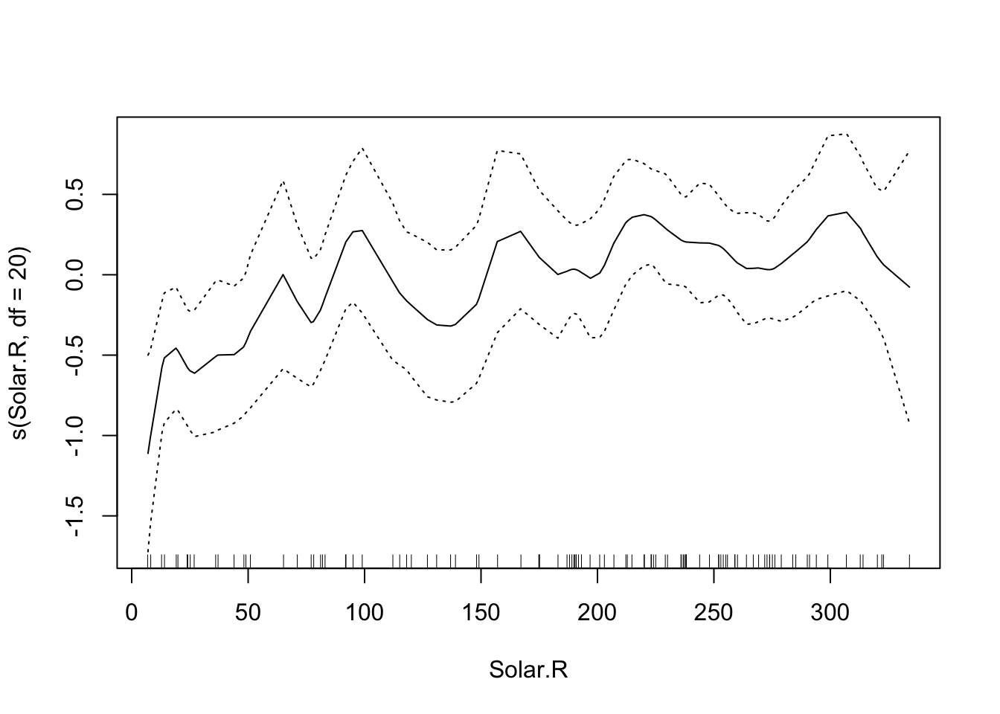
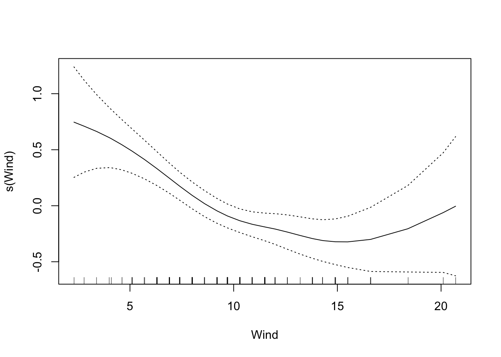
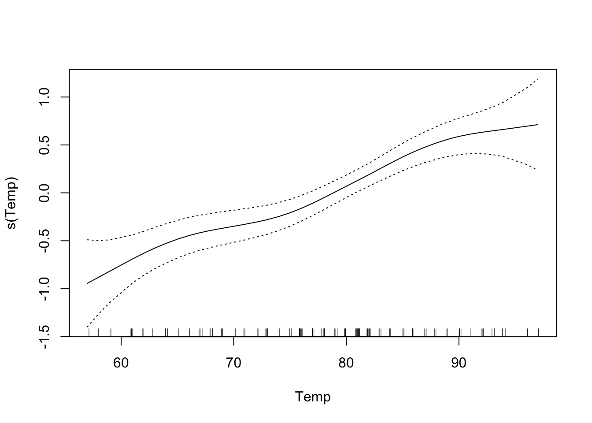

Week 10 Lab
=============


There are 7 parts to this week's lab:

1. Discussion of the Challenger analysis
2. Linear regression with 'lm'
3. Weighted linear regression using 'lm'
4. Logistic regression
5. Poisson regression
6. Understanding deviance
7. Generalized Additive Models

Practice with Multiple regression will be held off until our discussion of model criticism in Week 13.

Discussion of Challenger analysis
---------

One of the classic datasets for logistic regression is the Challenger dataset, so even though its not related to ecology, I think its worth reading. You have already read the article about the Challenger analysis so you know the background behind the o-ring data. Because the Challenger paper is so well written, we will go over the analysis in detail together.

**1-** The night before the launch, there was a meeting to discuss the influence of temperature on o-ring failure. The focus was on Figure 1a showing the number of o-ring failures CONDITIONAL ON there being at least one o-ring failure.

**2-** There are 6 o-rings on each shuttle, what is the appropriate model for o-ring failure?

$$
X\sim Binom(n=6,p(t,s))
$$

where p(s,t) is the probability of o-ring failure as a function of temperature t and pressure s.

**3-** Therefore, the appropriate GLM for o-ring failure is

$$
log\left(\frac{p(t,s)}{1-p(t,s)}\right)=\alpha+\beta t + \gamma s
$$

**4-** They then fit the model using maximum likelihood (*Quick review: What exactly does that mean?*)

**5-** They calculate the "goodness of fit" statistic $G^{2}$. This is just another name for the Deviance.

$$
G^{2} = 2*log\left(\frac{\mbox{Likelihood saturated model}}{\mbox{Likelihood model being considered}}\right)
$$

$$
\mbox{Deviance} = -2*(\mbox{LL(model being considered)}-\mbox{LL(saturated model)})
$$

$$
\mbox{Deviance} = 2*(\mbox{LL(saturated model)}-\mbox{LL(model being considered)})
$$

$$
\mbox{Deviance} = 2*log\left(\frac{\mbox{Likelihood saturated model}}{\mbox{Likelihood model being considered}}\right) = G^{2}
$$

**6-** Recognizing that devaince is only really meaningful relative to another model, they fit the temperature-only model

$$
log\left(\frac{p(t)}{1-p(t)}\right) = \alpha + \beta t
$$

The difference in deviances is given by

$$
\mbox{Deviance difference} \sim \chi^{2}_{\mbox{additional parameters}}
$$

How many additional parameters in this case?

Just one, so

$$
\mbox{Deviance difference} \sim \chi^{2}_{1}
$$

The difference in deviance is not significant, i.e. this model fits about as well as the more complex model, so we can say that pressure has little effect on the probability of o-ring failure and we drop it from the model.

**7-** They construct 90th percentile confidence intervals for the expected number of incidents.

**<span style="color: green;">Checkpoint #1: What exactly are they doing here? Do you understand what they have done and why?</span>** <span style="color: white;">They are sampling with replacement from the original data and are refitting the model each time.</span>

**8-** Next they plot the contours of the log-likelihood function and note that the contours are elliptical and therefore the data were not leading to ill-conditioned computation.

*What do they mean by that?*

**9-** They collapse the binomial data to make a Bernoulli dataset in which "0" means that no o-rings failed, and "1" means that at least one o-ring failed.

**<span style="color: green;">Checkpoint #2: Why did they do this?</span>** 
<span style="color: white;">Because the o-rings may not be independent</span>

**10-** They refit the data using the Bernoulli model and find that the fits are quite close.

**11-** They want to construct confidence intervals for the model parameters. They say "instead of using the aymptotic theory to construct confidence intervals, we use the parametric bootstrap procedure".

**<span style="color: green;">Checkpoint #3: Why might they have used a bootstrap approach here?</span>** 

<span style="color: white;">Small size size probably...</span>

*How do they do a parametric bootstrap?*

They take the best-fit model, sample with replacement from the logistic model (presumably drawing (x,predicted y) pairs at random with replacement), and refit the bootstrapped data to get new model parameter estimates.

**12-** Then they look at the sensitivity of the model to each of the data points, by pulling out each data point in turn and refitting the model.

**<span style="color: green;">Checkpoint #4: What is this called?</span>** 

<span style="color: white;">Jackknife!</span>

**13-** They next consider a non-linear model of the form

$$
log\left(\frac{p(t,s)}{1-p(t,s)}\right)=\alpha + \beta(t-t_{0})+\gamma(t-t_{0})^{2}
$$

**14-** They again consider the change in deviance in going from the simpler linear model to the more complex quadratic model, and they find the quadratic term is not significant.

**15-** They then consider a model in which they use a non-parametric smoothing fit (using a moving window appraoch) in Figure 8.

**16-** They identify possible outliers in the data (more on model criticism in three weeks).

\subsection{Practice fitting models}

You should have downloaded the data linking O-ring failure to launch temperature.

Response: Presence/Absence of erosion or blow-by on at least one o-ring field joint (Y=1 if occured, 0 if not)

Predictor Variable: Temperature at lift-off (degrees Fahrenheit)

Sample size: 23 shuttle lift-offs prior to Challenger


```r
challenger<-read.csv("_data/Challenger_data.csv",head=T)
challenger
```

```
##    Flight.number Temp O.ring.failure
## 1              1   66              0
## 2              2   70              1
## 3              3   69              0
## 4              4   68              0
## 5              5   67              0
## 6              6   72              0
## 7              7   73              0
## 8              8   70              0
## 9              9   57              1
## 10            10   63              1
## 11            11   70              1
## 12            12   78              0
## 13            13   67              0
## 14            14   53              1
## 15            15   67              0
## 16            16   75              0
## 17            17   70              0
## 18            18   81              0
## 19            19   76              0
## 20            20   79              0
## 21            21   75              1
## 22            22   76              0
## 23            23   58              1
```

```r
attach(challenger)
plot(Temp,O.ring.failure,xlab="Temperature",ylab="Damage",main="O-ring damage vs. Temperature")
challenger.fit1<-lm(O.ring.failure~Temp)
summary(challenger.fit1)
```

```
## 
## Call:
## lm(formula = O.ring.failure ~ Temp)
## 
## Residuals:
##      Min       1Q   Median       3Q      Max 
## -0.43762 -0.30679 -0.06381  0.17452  0.89881 
## 
## Coefficients:
##             Estimate Std. Error t value Pr(>|t|)   
## (Intercept)  2.90476    0.84208   3.450  0.00240 **
## Temp        -0.03738    0.01205  -3.103  0.00538 **
## ---
## Signif. codes:  0 '***' 0.001 '**' 0.01 '*' 0.05 '.' 0.1 ' ' 1
## 
## Residual standard error: 0.3987 on 21 degrees of freedom
## Multiple R-squared:  0.3144,	Adjusted R-squared:  0.2818 
## F-statistic:  9.63 on 1 and 21 DF,  p-value: 0.005383
```

```r
lines(Temp,fitted(challenger.fit1),col="red")
```


What's wrong with this model?           
(1) predictions will quickly escape the bounds (0,1)          
(2) residuals are clearly not normal       


```r
resid1<-residuals(challenger.fit1)
plot(Temp,resid1,xlab="Temperature",ylab="Residuals for lm model")
```


Weighted linear regression
----------------

One possible solution to these problems is to use weighted linear regression (to account for high variance at intermediate temperatures) and to truncate the predicted values to the range (0,1).

Remember that weighted linear regression is just like ordinary linear regression except that we minimize the weighted squared residuals

$$
\mbox{weighted SS} = \sum^{n}_{i=1} w_{i} (Y_{i}-\hat{Y}_{i})^{2}
$$

The idea behind weighted linear regression is to give lower weights to observations with high variances so they have less influence over the final model fits. While any weights could be chosen, the inverse variances are most commonly used,

$$
w_{i} = \frac{1}{Variance}
$$

which, for Binomially distributed data is given by

$$
w_{i} = \frac{1}{\pi_{i}(1-\pi_{i})}
$$

Since the actual probabilities $\pi_{i}$ are unknown, we use estimated weights instead constructed from the empirical proportions as follows:

$$
\hat{w}_{i} = \frac{1}{\hat{Y}_{i}(1-\hat{Y}_{i})}
$$

The procedure then goes as follows:

1. Fit ordinary least squares      
2. Obtain estimates $\hat{Y}_{i}$
3. If an estimate is less than 0 or greater than 1, set it to 0.001 (or something small) and 0.999 (or something close to but less than one), respectively
4. Compute the weights $W_{i}$
5. Fit weighted least squares

We have the estimates already, they are


```r
fitted(challenger.fit1)
```

```
##           1           2           3           4           5           6 
##  0.43761905  0.28809524  0.32547619  0.36285714  0.40023810  0.21333333 
##           7           8           9          10          11          12 
##  0.17595238  0.28809524  0.77404762  0.54976190  0.28809524 -0.01095238 
##          13          14          15          16          17          18 
##  0.40023810  0.92357143  0.40023810  0.10119048  0.28809524 -0.12309524 
##          19          20          21          22          23 
##  0.06380952 -0.04833333  0.10119048  0.06380952  0.73666667
```

We have to truncate these to the correct range but notice that we cannot set any values exactly to 0 or 1 because this would make the estimated variance blow up, so we set $\hat{Y}_{i} < 0$ to 0.001 and $\hat{Y}_{i} > 0$ to 0.999. We can do this in one step by using the 'pmin' and 'pmax' functions:

Sidenote: Using the 'pmin' and 'pmax' functions


```r
pmin(c(1,2,3),c(0,3,5))
```

```
## [1] 0 2 3
```

```r
pmin(1,c(0,3,5))
```

```
## [1] 0 1 1
```

(The same logic works for 'pmax'.)

Back to the problem at hand:


```r
new.predictions<-pmin(0.999,pmax(0.001,fitted(challenger.fit1)))
vars<-new.predictions*(1-new.predictions)
challenger.fit2<-lm(O.ring.failure~Temp,weights=(1/vars))
summary(challenger.fit2)
```

```
## 
## Call:
## lm(formula = O.ring.failure ~ Temp, weights = (1/vars))
## 
## Weighted Residuals:
##     Min      1Q  Median      3Q     Max 
## -1.3136 -0.6779 -0.4313  0.8330  2.8846 
## 
## Coefficients:
##              Estimate Std. Error t value Pr(>|t|)    
## (Intercept)  2.343825   0.532408   4.402 0.000248 ***
## Temp        -0.029517   0.006746  -4.376 0.000265 ***
## ---
## Signif. codes:  0 '***' 0.001 '**' 0.01 '*' 0.05 '.' 0.1 ' ' 1
## 
## Residual standard error: 1.105 on 21 degrees of freedom
## Multiple R-squared:  0.4769,	Adjusted R-squared:  0.452 
## F-statistic: 19.15 on 1 and 21 DF,  p-value: 0.0002647
```

Now we can plot the results:


```r
plot(Temp,O.ring.failure,xlab="Temperature",ylab="Damage",main="O-ring Damage vs. Temperature")
lines(Temp,fitted(challenger.fit1),col="red")
lines(Temp,fitted(challenger.fit2),col="blue")
```


The $R^{2}$ of the weighted model is higher, but the fit still has the same problems as the original fit. To properly solve this problem, we need to do logistic regression, which accurately captures the non-linear form of the relationship and the nature of the residuals.

Logistic regression practice
-------------


```r
challenger.fit3<-glm(O.ring.failure~Temp, family="binomial")
plot(Temp,O.ring.failure,xlab="Temperature",ylab="Damage",main="O-ring Damage vs. Temperature") 
# Above line only needed because RMarkdown doesn't keep previous plot
lines(Temp,fitted(challenger.fit1),col="red") 
# Above line only needed because RMarkdown doesn't keep previous plot
lines(Temp,fitted(challenger.fit2),col="blue") 
# Above line only needed because RMarkdown doesn't keep previous plot
lines(sort(Temp), fitted(challenger.fit3)[order(Temp)],col="green",lwd=2)
```


```r
summary(challenger.fit3)
```

```
## 
## Call:
## glm(formula = O.ring.failure ~ Temp, family = "binomial")
## 
## Deviance Residuals: 
##     Min       1Q   Median       3Q      Max  
## -1.0611  -0.7613  -0.3783   0.4524   2.2175  
## 
## Coefficients:
##             Estimate Std. Error z value Pr(>|z|)  
## (Intercept)  15.0429     7.3786   2.039   0.0415 *
## Temp         -0.2322     0.1082  -2.145   0.0320 *
## ---
## Signif. codes:  0 '***' 0.001 '**' 0.01 '*' 0.05 '.' 0.1 ' ' 1
## 
## (Dispersion parameter for binomial family taken to be 1)
## 
##     Null deviance: 28.267  on 22  degrees of freedom
## Residual deviance: 20.315  on 21  degrees of freedom
## AIC: 24.315
## 
## Number of Fisher Scoring iterations: 5
```

```r
newdata<-data.frame(Temp=seq(30,85))
confidence.bands<-predict.glm(challenger.fit3,newdata,se.fit=TRUE)
```

**Important note**: If we were modelling data on the number of O-rings failed as a Binomial distribution rather than the existence of failed O-rings as a Bernoulli, we would have to pass the data to glm() in a slightly different way. In particular, we would have to create a two-column object, where the first column is the number of O-rings failed, and the second column is the number of O-rings that did not fail. The glm() call would look something like:


```r
challenger.fit3<-glm(cbind(O.ring.failure, 6-O.ring.failure)~Temp, family="binomial")
```

OK, back to the task at hand...The default is for predict.glm to give you the fit and s.e. on the scale of the predictor, so you need to use the inverse logit function to extract the fit and s.e. on the scale of the probabilities.

In other words, the model is given by:

$$
Y_{i} \sim \text{Binom}(n_{i},p_{i}) \\
logit(p_{i}) = \beta_{0} + \beta_{1}X_{i}
$$
and R's function predict.glm() provides the confidence intervals on the right hand side of this latter equation, that is

$$
\text{confidence interval} = [\text{LL of } (\beta_{0} + \beta_{1}X_{i}), \text{UL of } (\beta_{0} + \beta_{1}X_{i})]
$$

Therefore, in order to construct confidence intervals on the scale of the probability $p$, you need to back-transform, so the LL for $p$ is given by $logit^{-1}(\text{LL of } (\beta_{0} + \beta_{1}X_{i}))$ and the UL is given by $logit^{-1}(\text{UL of } (\beta_{0} + \beta_{1}X_{i}))$. Operationally, this looks as follows in R:


```r
library(boot)
plot(Temp,O.ring.failure,xlab="Temperature",ylab="Damage",main="O-ring Damage vs. Temperature") 
# Above line only needed because RMarkdown doesn't keep previous plot
lines(newdata[,1],inv.logit(confidence.bands$fit),col="purple",lwd=2)
lines(newdata[,1],inv.logit(confidence.bands$fit+1.96*confidence.bands$se.fit),col="purple",lwd=2,lty=2)
lines(newdata[,1],inv.logit(confidence.bands$fit-1.96*confidence.bands$se.fit),col="purple",lwd=2,lty=2)
```


If you look at the help file for predict.glm, you will see that the only option is a confidence interval on the model (a 'confidence' interval). There is no way to generate a prediction interval for GLMs generally speaking. **<span style="color: green;">Checkpoint #5: How would you construct a prediction interval for a binary value?</span>**<span style="color: white;">You cannot, it doesn't make sense, the value is either 0 or 1.</span>

On the day of the Challenger launch, the temperature was 31 degrees - what was the probability of o-ring failure?

[Work this out at home!]

Now we will calculate the deviances reported by summary(), and discuss the AIC (to be discussed more formally next week).


```r
-2*logLik(challenger.fit3)
```

```
## 'log Lik.' 20.31519 (df=2)
```

```r
challenger.fit4<-glm(O.ring.failure~1,family=binomial)
-2*logLik(challenger.fit4)
```

```
## 'log Lik.' 28.26715 (df=1)
```

The null deviance is that with only an intercept. The statistical significance of the model can be assessed by comparing the deviance with the parameters vs. the model with only an intercept.

Poisson regression practice
---------------

Since we have the data loaded already, we will use the challenger o-ring data to illustrate how a Poisson model is fit, even though a Poisson model would be inappropriate for the o-ring data. **<span style="color: green;">Checkpoint #6: Why is a Poisson model inappropriate?</span>**

Note that now the link function is the $log()$ so the inverse link function needed to get a CI of the Poisson intensity $\lambda$ is now the exponential $exp()$. In other words, to construct confidence intervals on the scale of the intensity $\lambda$, you need to back-transform, so the LL for $p$ is given by $exp^{\text{LL of } (\beta_{0} + \beta_{1}X_{i})}$ and the UL is given by $exp^{\text{UL of } (\beta_{0} + \beta_{1}X_{i})}$. 


```r
challenger.fit4<-glm(O.ring.failure~Temp,family="poisson")
summary(challenger.fit4)
```

```
## 
## Call:
## glm(formula = O.ring.failure ~ Temp, family = "poisson")
## 
## Deviance Residuals: 
##      Min        1Q    Median        3Q       Max  
## -0.81159  -0.67620  -0.48134  -0.04632   1.53598  
## 
## Coefficients:
##             Estimate Std. Error z value Pr(>|z|)  
## (Intercept)  5.78518    3.13068   1.848   0.0646 .
## Temp        -0.10448    0.04878  -2.142   0.0322 *
## ---
## Signif. codes:  0 '***' 0.001 '**' 0.01 '*' 0.05 '.' 0.1 ' ' 1
## 
## (Dispersion parameter for poisson family taken to be 1)
## 
##     Null deviance: 16.654  on 22  degrees of freedom
## Residual deviance: 12.206  on 21  degrees of freedom
## AIC: 30.206
## 
## Number of Fisher Scoring iterations: 6
```

```r
confidence.bands<-predict.glm(challenger.fit4,newdata,se.fit=TRUE)
plot(Temp,O.ring.failure,xlab="Temperature",ylab="Damage",main="O-ring Damage vs. Temperature") 
# Above line only needed because RMarkdown doesn't keep previous plot
lines(newdata[,1],exp(confidence.bands$fit),col="orange",lwd=2)
lines(newdata[,1],exp(confidence.bands$fit+1.96*confidence.bands$se.fit),col="orange",lwd=2,lty=3)
lines(newdata[,1],exp(confidence.bands$fit-1.96*confidence.bands$se.fit),col="orange",lwd=2,lty=3)
```


We can see that the Poisson model has no inflection point and therefore its predictions would not be bounded by (0,1).

Getting a feel for Deviance
-----------------

We can use the challenger dataset to get a feel for deviance, and the idea that while a larger model will always fit the data better (i.e. have a lower deviance), we need to make sure that the improvement in deviance is more than what would be expected by random chance. This is best illsutrated by an example.

We're going to look at the null expectation for the deviance difference of two models that differ by a single randomly generated covariate. In other words, we will add a covariate which is *just noise* and show that the deviance decrease we get adding a random covariate goes as a chi-squared distribution with 1 d.o.f.


```r
# Fit a logistic regression with Temp as the only covariate 
challenger.smaller.model <- glm(O.ring.failure ~ Temp, data=challenger, family="binomial")
# Generate a random covariate with same mean and sd as Temp
randvar <- rnorm(n=length(challenger$Temp), mean=mean(challenger$Temp), sd=sd(challenger$Temp))
# Add the random covariate to a data frame for model-fitting 
newdata <- cbind(challenger, randvar)
# Fit the logistic regression with Temp and the random covariate 
challenger.larger.model <- glm(O.ring.failure ~ Temp + randvar, data=newdata, family="binomial")
# Calculate the deviance difference of the two models 
dev_diff <- deviance(challenger.smaller.model) - deviance(challenger.larger.model)
dev_diff
```

```
## [1] 0.5278955
```

Notice that even though the covariate that we added is just noise, it still decreases the deviance.

Now we need to repeat those steps a number of times to generate a distribution of expected deviance differences 


```r
dev_diff <- c()

for (i in 1:1000){
  # Generate a random covariate with same mean and sd as Temp
  randvar <- rnorm(n=length(challenger$Temp), mean=mean(challenger$Temp), sd=sd(challenger$Temp))
  
  # Add the random covariate to a data frame for model-fitting 
  newdata <- cbind(challenger, randvar)
  
  # Fit the model
  challenger.fit.larger.model <- glm(O.ring.failure ~ Temp + randvar, data=newdata, family="binomial")

  # Calculate the deviance difference 
  dev_diff_rand <- deviance(challenger.smaller.model) - deviance(challenger.fit.larger.model)
  
  dev_diff <- c(dev_diff, dev_diff_rand)
}
```

```
## Warning: glm.fit: fitted probabilities numerically 0 or 1 occurred

## Warning: glm.fit: fitted probabilities numerically 0 or 1 occurred
```

```r
# plot the distribution and add a line for a chi-square with df=1 
hist(dev_diff, xlab="Deviance Difference", main="Expected distribution", freq=FALSE,breaks=30)
lines(seq(0,20,0.1), dchisq(seq(0,20,0.1),df=1), col="red",lwd=2)
```


Sure enough, as expected, the difference in deviance we get by adding a covariate that has *no* association with the response is a $\chi^{2}_{1}$ distributed variable. Therefore, to justify adding a covariate to a model, we want to see that the decrease in deviance is much larger than this. Specifically, we want to see that the decrease in deviance is so unlikely to have arisen from a $\chi^{2}_{1}$ distribution that we reject the null hypothesis that the two models are equivalent. (In other words, by rejecting the null hypothesis, we say that the larger model is, in fact, the better model and the additional covariate is worth keeping.)

**<span style="color: green;">Checkpoint #7: Does this make sense?</span>**

Generalized Additive Models
--------------

There are two libraries that can fit GAMs: 'gam' and 'mcgv'. We will use the 'gam' package for now, but keep in mind that the 'mgcv' package is more flexible and more powerful (so worth considering if you need to do GAMs for your own research).

Stop: Install the GAM package and then load it into the workspace using


```r
library('gam')
```

Inside the 'gam' package is a dataset that we will use on ozone in New York as a function of solar radiation, temperature, and wind.

First we histogram the ozone data


```r
hist(airquality$Ozone)
```


Clearly the ozone data are not normal. It turns out the log transformation gets the ozone data to something more 'normal-like'. (How would we compare different transformations of the data? Try and do a ks.test comparing various transformed datasets against the normal.)

First we'll just fit a linear model for comparison.


```r
air.lm<-lm(log(Ozone)~Solar.R+Wind+Temp,data=airquality)
summary(air.lm)
```

```
## 
## Call:
## lm(formula = log(Ozone) ~ Solar.R + Wind + Temp, data = airquality)
## 
## Residuals:
##      Min       1Q   Median       3Q      Max 
## -2.06193 -0.29970 -0.00231  0.30756  1.23578 
## 
## Coefficients:
##               Estimate Std. Error t value Pr(>|t|)    
## (Intercept) -0.2621323  0.5535669  -0.474 0.636798    
## Solar.R      0.0025152  0.0005567   4.518 1.62e-05 ***
## Wind        -0.0615625  0.0157130  -3.918 0.000158 ***
## Temp         0.0491711  0.0060875   8.077 1.07e-12 ***
## ---
## Signif. codes:  0 '***' 0.001 '**' 0.01 '*' 0.05 '.' 0.1 ' ' 1
## 
## Residual standard error: 0.5086 on 107 degrees of freedom
##   (42 observations deleted due to missingness)
## Multiple R-squared:  0.6644,	Adjusted R-squared:  0.655 
## F-statistic: 70.62 on 3 and 107 DF,  p-value: < 2.2e-16
```

Now we'll try fitting this data with a GAM. Note the syntax: s() fits a smoothing spline, lo() would fit a LOESS curve.


```r
air.gam<-gam(log(Ozone)~s(Solar.R)+s(Wind)+s(Temp),data=airquality)
summary(air.gam)
```

```
## 
## Call: gam(formula = log(Ozone) ~ s(Solar.R) + s(Wind) + s(Temp), data = airquality)
## Deviance Residuals:
##      Min       1Q   Median       3Q      Max 
## -1.84583 -0.24538 -0.04403  0.31419  0.99890 
## 
## (Dispersion Parameter for gaussian family taken to be 0.2235)
## 
##     Null Deviance: 82.47 on 110 degrees of freedom
## Residual Deviance: 21.9077 on 98.0001 degrees of freedom
## AIC: 162.8854 
## 42 observations deleted due to missingness 
## 
## Number of Local Scoring Iterations: NA 
## 
## Anova for Parametric Effects
##            Df Sum Sq Mean Sq F value    Pr(>F)    
## s(Solar.R)  1 16.041 16.0408  71.756 2.484e-13 ***
## s(Wind)     1 17.208 17.2083  76.978 5.521e-14 ***
## s(Temp)     1 12.723 12.7227  56.913 2.351e-11 ***
## Residuals  98 21.908  0.2235                      
## ---
## Signif. codes:  0 '***' 0.001 '**' 0.01 '*' 0.05 '.' 0.1 ' ' 1
## 
## Anova for Nonparametric Effects
##             Npar Df Npar F   Pr(F)  
## (Intercept)                         
## s(Solar.R)        3 2.8465 0.04151 *
## s(Wind)           3 3.4736 0.01897 *
## s(Temp)           3 2.9358 0.03713 *
## ---
## Signif. codes:  0 '***' 0.001 '**' 0.01 '*' 0.05 '.' 0.1 ' ' 1
```

```r
par(mfrow=c(3,1))
plot(air.gam,se=T)
```


The default is that the smoothing splines have df=4, but we can control the amount of smoothing by changing the number of d.o.f.


```r
air.gam<-gam(log(Ozone)~s(Solar.R,df=20)+s(Wind)+s(Temp),data=airquality)
plot(air.gam,se=T)
```



That makes the curve for Solar.R much more curvy.

