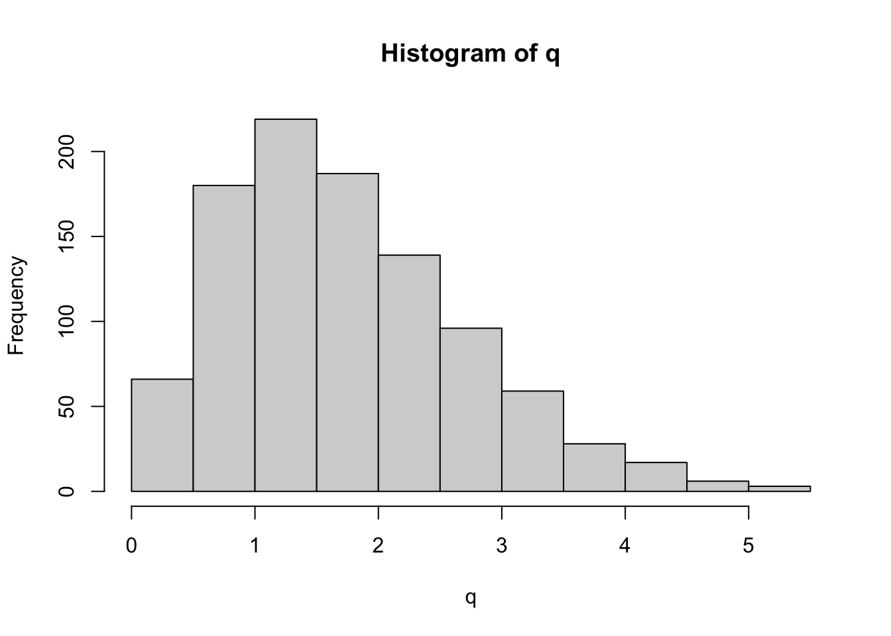

Week 11 Lab
=============

There are 5 parts to this week's lab:

1. R's ANOVA functions
2. Single-factor ANOVA
3. Follow-up analyses to ANOVA
4. More ANOVA practice: Fixed effects (Model I ANOVA) 
5. Brief intro to doing Model II ANOVA in R 

R's ANOVA functions
------------

R has two different functions that can do ANOVA

Option #1: The 'aov' only fits an ANOVA model

Option #2: The 'anova' command takes as input the result of the 'lm' function, and extracts the ANOVA table from the fitted linear model

Since I prefer to think of ANOVA as just another linear model, I will show you how to use the 'anova' command following model fit by 'lm'. There is no reason to think 'lm' is only used for regression and 'aov' for ANOVA. Both are linear models and should be fit using 'lm'. The 'anova' command simply outputs the results of the model fit in the format of an ANOVA table.

Single-factor ANOVA in R
------------

Let's review the model referred to as a single-factor ANOVA

$$
Y_{ij}=\mu + A_{i} + \epsilon_{ij}
$$

Question: What is $H_{0}$?

Answer:

$$
H_{0}: \mbox{all } A_{i}=0
$$

What is $H_{A}$?

$$
H_{A}: \mbox{at least one } A_{i}\neq 0
$$

It is important to keep in mind that the alternative hypothesis does not require that *all* of the $A_{i}$ are different, only that at least one $A_{i}$ is different from the others.

To review, the main components needed to construct an ANOVA table are (remember that n is the number PER CELL)

$$
SS_{total} = \sum^{a}_{i=1}\sum^{n}_{j=1}(Y_{ij}-\bar{Y})^{2}
$$

$$
SS_{\text{among groups}} = \sum^{a}_{i=1}\sum^{n}_{j=1}(\bar{Y}_{i}-\bar{Y})^{2}
$$

$$
SS_{\text{within groups}} = \sum^{a}_{i=1}\sum^{n}_{j=1}(Y_{ij}-\bar{Y}_{i})^{2}
$$

We will start by doing a simple one-way ANOVA. You should already have downloaded some data from the web relating "Salary" to three different kinds of "Education" and "Gender". These data relate to starting salaries for those leaving college with an English degree.


```r
salaries<-read.csv("_data/TwoWayANOVAdata_balanced.csv", header=T)
head(salaries)
```

```
##   Salary Gender Education
## 1     24 Female   Masters
## 2     26 Female   Masters
## 3     25 Female   Masters
## 4     24 Female   Masters
## 5     27 Female   Masters
## 6     24 Female   Masters
```

```r
par(mfrow=c(2,1))
boxplot(salaries$Salary~salaries$Gender,ylab="Salary")
boxplot(salaries$Salary~salaries$Education,ylab="Salary")
```


Question: What determines the order of plotting for the boxplots?
Answer: The alphabet!

Next we will fit a linear model for Education:


```r
lm.fit<-lm(Salary~Education,data=salaries)
summary(lm.fit)
```

```
## 
## Call:
## lm(formula = Salary ~ Education, data = salaries)
## 
## Residuals:
##     Min      1Q  Median      3Q     Max 
## -5.1667 -2.0833 -0.3333  1.8333  5.8333 
## 
## Coefficients:
##                    Estimate Std. Error t value Pr(>|t|)    
## (Intercept)          26.083      0.724  36.026  < 2e-16 ***
## EducationNo degree   -7.583      1.024  -7.406 1.65e-08 ***
## EducationPhD          2.083      1.024   2.035     0.05 *  
## ---
## Signif. codes:  0 '***' 0.001 '**' 0.01 '*' 0.05 '.' 0.1 ' ' 1
## 
## Residual standard error: 2.508 on 33 degrees of freedom
## Multiple R-squared:  0.7495,	Adjusted R-squared:  0.7343 
## F-statistic: 49.37 on 2 and 33 DF,  p-value: 1.201e-10
```

How do we interpret the model fit? Notice that 'lm' has fit an intercept which is by default the "Masters" group, and it is comparing groups "No degree" and "PhD" AGAINST the "Masters" group. It has done this because it has ordered the factors alphabetically, which may not be what you want. In this case, we probably want to order the factors like

No degree, Masters, PhD


```r
salaries$Education<-factor(salaries$Education,levels=c("No degree","Masters","PhD"),ordered=F)
```

If you plot salaries$Education now you'll see that the data have not changed, but we have forced R to list the degrees in some meaningful order. Note that we have said "ordered=F" because we do not want to treat them as 

No degree$\leq$Masters$\leq$PhD

in the modelling, we just want the various levels to appear in a way that we can interpret them easily.


```r
lm.fit<-lm(Salary~Education,data=salaries)
summary(lm.fit)
```

```
## 
## Call:
## lm(formula = Salary ~ Education, data = salaries)
## 
## Residuals:
##     Min      1Q  Median      3Q     Max 
## -5.1667 -2.0833 -0.3333  1.8333  5.8333 
## 
## Coefficients:
##                  Estimate Std. Error t value Pr(>|t|)    
## (Intercept)        18.500      0.724  25.552  < 2e-16 ***
## EducationMasters    7.583      1.024   7.406 1.65e-08 ***
## EducationPhD        9.667      1.024   9.441 6.70e-11 ***
## ---
## Signif. codes:  0 '***' 0.001 '**' 0.01 '*' 0.05 '.' 0.1 ' ' 1
## 
## Residual standard error: 2.508 on 33 degrees of freedom
## Multiple R-squared:  0.7495,	Adjusted R-squared:  0.7343 
## F-statistic: 49.37 on 2 and 33 DF,  p-value: 1.201e-10
```

This is better, but the intercept is still a little mysterious.

Question: How do we interpret the intercept and the other estimates?

Answer: Intercept = No degree mean vs. Other estimates = DIFFERENCE between the "No degree" and the other levels

Notice that the standard error of the intercept is different from the standard error of the other estimates. The estimate of the standard error for each group's mean is calculated as the estimated standard deviation ($\sigma$) divided by the square root of the sample size. This is the same formula as we learned much earlier in the course. However, here, we can get a *better* estimate of the standard deviation by pooling the data across all groups. So instead of just using the data in the No degree category to calculate the uncertainty of the No degree mean, we are using *all* the data to help us estimate our uncertainty about the No degree mean.

What does this look like in practice? We just average the variances across all groups as follows:


```r
var.masters<-var(salaries[salaries$Education=="Masters",]$Salary)
var.PhD<-var(salaries[salaries$Education=="PhD",]$Salary)
var.NoDegree<-var(salaries[salaries$Education=="No degree",]$Salary)
sigma.ave<-sqrt(mean(c(var.masters,var.PhD,var.NoDegree))) #take the mean variance, and then apply the square root
sigma.ave
```

```
## [1] 2.508068
```

```r
No.degree.uncertainty<-sigma.ave/sqrt(length(salaries[salaries$Education=="No degree",]$Salary))
No.degree.uncertainty
```

```
## [1] 0.7240168
```

OK, so now we know how they calculated the standard error for the intercept. Why are the other standard errors larger? The reason is that when you are comparing the intercept against the number 0, then the only source of uncertainty is from the estimate of the intercept. But the other quantities represent *differences*, so the uncertainty in the *difference* arises from both quantities. Remember that variances for independent quantities add, 


<div class="figure" style="text-align: center">

<p class="caption">(\#fig:unnamed-chunk-6)Variances of independent variables add. Source: Hays, W. (1994) Statistics</p>
</div>


so the variance of the difference between the mean of "Masters" and the mean of "No degree" is the *sum* of the variances.


```r
No.degree.uncertainty<-sigma.ave/sqrt(length(salaries[salaries$Education=="No degree",]$Salary))
No.degree.variance<-No.degree.uncertainty^2
Masters.uncertainty<-sigma.ave/sqrt(length(salaries[salaries$Education=="Masters",]$Salary))
Masters.variance<-Masters.uncertainty^2
variance.of.difference<-No.degree.variance+Masters.variance
sd.of.difference<-sqrt(variance.of.difference)
sd.of.difference
```

```
## [1] 1.023914
```

So this is the same as what the summary of the regression fit has provided for the uncertainty of the *difference* between the two groups.

**<span style="color: green;">Checkpoint #1: Does this make sense?</span>**

What do the t-statistics and p-values tell you?

$$
\mbox{t statistic} = \frac{\mbox{estimate}-\mbox{estimate}|H_{0}}{\mbox{s.e. of the estimate}}
$$

It is always assumed that

$$
\mbox{estimate}|H_{0} = 0
$$

Therefore, the t-statistic is just the estimate / s.e., and the p-values derived from that reflect the significance of difference in "Masters" vs. "No degree" and "PhD" vs. "No degree".

We can eliminate the intercept to make the coefficients more obviously analogous to ANOVA.


```r
lm.fit2<-lm(Salary~Education-1,data=salaries)
summary(lm.fit2)
```

```
## 
## Call:
## lm(formula = Salary ~ Education - 1, data = salaries)
## 
## Residuals:
##     Min      1Q  Median      3Q     Max 
## -5.1667 -2.0833 -0.3333  1.8333  5.8333 
## 
## Coefficients:
##                    Estimate Std. Error t value Pr(>|t|)    
## EducationNo degree   18.500      0.724   25.55   <2e-16 ***
## EducationMasters     26.083      0.724   36.03   <2e-16 ***
## EducationPhD         28.167      0.724   38.90   <2e-16 ***
## ---
## Signif. codes:  0 '***' 0.001 '**' 0.01 '*' 0.05 '.' 0.1 ' ' 1
## 
## Residual standard error: 2.508 on 33 degrees of freedom
## Multiple R-squared:  0.9906,	Adjusted R-squared:  0.9897 
## F-statistic:  1155 on 3 and 33 DF,  p-value: < 2.2e-16
```

The main results (the group means and their differences) haven't fundamentally changed, but they are now displayed in a way that makes the most sense. Note that the metrics of model fit (R2, F-statistic, and p-value for the model) have changed, and in the opposite direction as we might expect. We ran into this earlier in the semester when comparing the fit of a regression model with an intercept and the same model without an intercept. 

Now the estimates represent the group means, which is easier to interpret. How do we calculate the standard errors, and why are all the standard errors the same? Recalling our discussion from Week #8, we remember that we want to use the residual variation (which we can extract by using the sigma() function) divided by the square-root of the sample size:


```r
sigma(lm.fit2)/sqrt(length(salaries$Salary[salaries$Education=="Masters"]))
```

```
## [1] 0.7240168
```

Since we have a balanced design, there are the same number of samples from each educational level, and so each educational coefficient estimate has the same standard error. In other words, when calculating the estimate standard errors, we used the mean squared residuals, which is equivalent to a pooled variance estimator, where we have pooled with within group variance from all the groups.

**<span style="color: green;">Checkpoint #2: In words, how do we interpret the p-values for the Masters and PhD group? What hypothesis are they addressing?</span>**
<span style="color: white;">Answer: Now the p-values are meaningless, because they test the uninteresting null hypothesis that the group means are zero.</span>

Before working out all the numbers here, lets print out the ANOVA table for this model


```r
anova(lm.fit)
```

```
## Analysis of Variance Table
## 
## Response: Salary
##           Df Sum Sq Mean Sq F value    Pr(>F)    
## Education  2 621.17  310.58  49.374 1.201e-10 ***
## Residuals 33 207.58    6.29                      
## ---
## Signif. codes:  0 '***' 0.001 '**' 0.01 '*' 0.05 '.' 0.1 ' ' 1
```

Notice that the Mean squared error in the ANOVA table is 6.29, which is 2.508$^2$. In other words, when we printed the output of this model framed as a linear regression, R spit out the "residual standard error". Re-framed as an analysis of variance, we think in terms of the mean squared error, which is just the square of the residual standard error. 

$$
\mbox{SE of the coef} = \sqrt{\frac{MS_{within}}{n}}
$$

(The main take home message is that regression with discrete covariates is the SAME as analysis of variance. Using a regression approach, we focus more on coefficients and hypothesis tests on those coefficients. Using an ANOVA approach, we focus more on the partitioning of variance, and the null hypothesis being addressed is an omnibus hypothesis which addresses whether the covariate in question can explain more variation than would be expected by random chance alone.)

Compare results of 'summary(lm.fit)' with a t-test looking at groups "No degree" and "Masters". **<span style="color: green;">Checkpoint #3: Why would these be different?</span>** <span style="color: white;">(The anova case pools the errors from all three cases, so the results will be slightly different.)</span>


```r
t.test(salaries$Salary[salaries$Education=="Masters"],salaries$Salary[salaries$Education=="No degree"])
```

```
## 
## 	Welch Two Sample t-test
## 
## data:  salaries$Salary[salaries$Education == "Masters"] and salaries$Salary[salaries$Education == "No degree"]
## t = 8.2357, df = 21.657, p-value = 4.09e-08
## alternative hypothesis: true difference in means is not equal to 0
## 95 percent confidence interval:
##  5.671978 9.494689
## sample estimates:
## mean of x mean of y 
##  26.08333  18.50000
```

Question: Why the funny d.o.f. in the two-sample case?

Answer: Remember the d.o.f. for the two sample case when we did not assume equal variance?

$$
d.o.f.^{*} = \frac{\left[\frac{s^{2}_{A}}{n_{A}}+\frac{s_{B}^{2}}{n_{B}}\right]^{2}}{\frac{\left(\frac{s^{2}_{A}}{n_{A}}\right)^{2}}{n_{A}-1}+\frac{\left(\frac{s^{2}_{B}}{n_{B}}\right)^{2}}{n_{B}-1}}
$$


As an aside, what were to happen if we were to print out the ANOVA table for the model with no intercept (lm.fit2)?


```r
anova(lm.fit2)
```

```
## Analysis of Variance Table
## 
## Response: Salary
##           Df  Sum Sq Mean Sq F value    Pr(>F)    
## Education  3 21791.4  7263.8  1154.7 < 2.2e-16 ***
## Residuals 33   207.6     6.3                      
## ---
## Signif. codes:  0 '***' 0.001 '**' 0.01 '*' 0.05 '.' 0.1 ' ' 1
```

The ANOVA table is now very different from what we got before, for the exact same reason that comparing regression models with and without intercepts is confusing. In essence, the total sum of squares being calculated by R is not relative to the overall grand mean, but relative to zero. We can see this easily by calculating $SS_{total}$ 


```r
sum(salaries$Salary^2)
```

```
## [1] 21999
```

which is the new sum-of-squares total, quite a bit larger than the previous, and more sensible calculation of


```r
sum((salaries$Salary-mean(salaries$Salary))^2)
```

```
## [1] 828.75
```

R uses the $SS_{total}$ to work back to what $SS_{among}$ should be. By mis-calculating $SS_{total}$, it inflates $SS_{among}$. There are ways to fix this (insert the $SS_{total}$ from the linear model with an intercept and reconstruct the correct $SS_{among}$), but I won't get into much detail about that now.

Follow up analyses to ANOVA
---------------

On Tuesday, we introduced the studentized range distribution q. Unfortunately, R does not have a function to draw from this distribution (i.e. there is no 'rtukey'). However, we can easy simulate draws from this distribution. In the case of the Educational data, we have three groups, each with 12 data points. Let's start by randomly drawing 36 datapoints from a normal distribution with mean 0 and with a standard deviation that equals the empirical standard deviation. Under the null hypothesis, the three groups are arbitrary subsets of the full data and so we randomly divide them up into three groups of 12. Let's put this in a loop and histogram it to get a sense for the full distribution (each iteration through the loop is one draw from the studentized range distribution). Note that because this is a balanced design, $n_{A}=n_{B}=n_{C}=12$.


```r
attach(salaries)
q<-c()
for (i in 1:1000)
  {
  data<-data.frame(type=c(rep("A",times=12),rep("B",times=12),rep("C",times=12)),response=rnorm(36,0,sd(Salary)))
  temp<-aov(data$response~data$type)
  MSwithin<-sum((temp$residuals^2))/33
  gr.means<-aggregate(data$response, list(data$type), mean)$x
  q<-c(q,(max(gr.means)-min(gr.means))/sqrt(MSwithin*(1/12)))
  }
hist(q)
```



This is a histogram of the studentized range distribution. While R does not provide a function to sample randomly from this distribution, R does provide functions for calculating the cumulative distribution, and so we can check that our simulation works by plotting the empirical distribution against that which is output by 'ptukey'.


```r
plot(ecdf(q))
lines(seq(0,5,0.01),ptukey(seq(0,5,0.01),3,33),col="red")
```


Yeah! Our simulation correctly samples from the studentized range distribution. Now we can use this to reconstruct what R's function TukeyHSD produces.

Before employing Tukey's HSD test, rank the group means (A,B,C) from largest to smallest.

If

$$
A>B>C
$$

then Tukey's HSD test is

$$
\frac{\bar{X}_{A} - \bar{X}_{C}}{\sqrt{MS_{within}\frac{\left(\frac{1}{n_{A}}+\frac{1}{n_{C}}\right)}{2}}} \sim q_{a,DOF_{\text{within}}}
$$

a = # of treatment groups = 3 (in this case)               

$DOF_{\text{within}}$ = # of degrees of freedom used in the calculation of $MS_{within}$ = 33 (in this case)

$n_{A}=n_{C}$ = number of samples within groups A and C = 12


```r
TukeyHSD(aov(Salary~Education,data=salaries))
```

```
##   Tukey multiple comparisons of means
##     95% family-wise confidence level
## 
## Fit: aov(formula = Salary ~ Education, data = salaries)
## 
## $Education
##                       diff        lwr       upr    p adj
## Masters-No degree 7.583333  5.0708578 10.095809 0.000000
## PhD-No degree     9.666667  7.1541912 12.179142 0.000000
## PhD-Masters       2.083333 -0.4291422  4.595809 0.119761
```

**<span style="color: green;">Checkpoint #4: Where are the confidence intervals coming from?</span>** Hint: We use the same basic procedure as in Week #4, we use the quantiles of the distribution to create upper and lower confidence intervals:

$$
q_{a,DOF_{\text{within}}} \sim \frac{max(results)-min(results)}{\sqrt{MS_{within}*\frac{1}{12}}}
$$

then

$$
\mbox{LL for max(results)-min(results)} = max(results)-min(results) - q_{(a,DOF)[0.95]}\sqrt{MS_{\text{within}}*\frac{1}{12}}
$$

and

$$
\mbox{UL for max(results)-min(results)} = max(results)-min(results) + q_{(a,DOF)[0.95]}\sqrt{MS_{\text{within}}*\frac{1}{12}}
$$

where $q_{(a,DOF)[0.95]}$ is the 95th quantile of the q-distribution.

First, let's make sure the estimates for the group differences make sense. We'll do the PhD-No degree as an example, since these groups make up the largest and smallest responses, respectively.


```r
mean(Salary[Education=="PhD"])-mean(Salary[Education=="No degree"])
```

```
## [1] 9.666667
```

This matches the output of TukeyHSD. So far, so good.

What would we calculate for the lower limit?


```r
temp<-aov(Salary~Education,data=salaries)
MSwithin<-sum((temp$residuals^2))/33 # These lines just extract MSwithin
LL<-mean(Salary[Education=="PhD"])-mean(Salary[Education=="No degree"]) - qtukey(0.95,3,33)*sqrt(MSwithin*(1/12))
UL<-mean(Salary[Education=="PhD"])-mean(Salary[Education=="No degree"]) + qtukey(0.95,3,33)*sqrt(MSwithin*(1/12))
LL
```

```
## [1] 7.154191
```

```r
UL
```

```
## [1] 12.17914
```

We have recreated the output from the TukeyHSD function.

More practice: Model I ANOVA
-----------------

Example 10A from Logan:

Medley and Clements (1998) investigated the impact of zinc contamination (and other heavy metals) on the diversity of diatom species in the USA Rocky Mountains (see Box 8.1 of Quinn and Keough) The diversity of diatoms (number of species) and degree of zinc contamination  (categorized as either high, medium, low, or natural background level) were recorded from between four and six sampling within each of six streams known to be polluted. These data were used to test the null hypothesis  that there were no differences the diversity of diatoms between different zinc levels.

$$
H_{0}:\mu_{H} = \mu_{M} = \mu_{L} = \mu_{B} = \mu; \alpha_{i}=0
$$

The linear model would be written as

$$
Y_{ij} = \mu + \alpha_{i} + \epsilon_{ij}
$$
$$
\mbox{Diatom spp diversity} = \mbox{overall mean} + \mbox{effect of zinc level} + \mbox{error}
$$

Step 1: Import the data


```r
medley<-read.table("_data/medley.csv",header=T,sep=",")
```

Step 2: Reorganize the levels of the categorical variable into a more logical order


```r
medley$ZINC<-factor(medley$ZINC,levels=c("HIGH","MED","LOW","BACK"),ordered=F)
```

Now we will work through the steps of Logan's "Key for Single-factor classification".

Step 3: Assess normality/homogeneity of variance using a boxplot of species diversity against zinc group.


```r
boxplot(DIVERSITY~ZINC, medley)
```


Conclusions? No obvious violations of normality or homogeneity of variance (boxplots are not asymmetrical and do not vary greatly in size).

Step 4: Assess homogeneity of variance assumption with a table and/or plot of mean vs variance


```r
plot(tapply(medley$DIVERSITY, medley$ZINC, mean), tapply(medley$DIVERSITY, medley$ZINC, var),pch=16,cex=2)
```


Conclusions? No obvious relationship between mean and variance.

Step 5: Test $H_{0}$ that population group means are all equal - perform analysis of variance (fit the linear model) of species diversity versus zinc level group and examine the diagnostics (residual plot)


```r
medley.aov<-aov(DIVERSITY~ZINC, medley)
plot(medley.aov)
```


Conclusions? We won't discuss this much until we get to model diagnostics, but there are no obvious violations of normality of homogeneity among the residuals (no obvious wedge shape in the residuals, Q-Q plot against a normal is approximately linear). Note that Cook's D values are meaningless in ANOVA.

Step 6: Examine the ANOVA table


```r
anova(medley.aov)
```

```
## Analysis of Variance Table
## 
## Response: DIVERSITY
##           Df Sum Sq Mean Sq F value  Pr(>F)  
## ZINC       3 2.5666 0.85554  3.9387 0.01756 *
## Residuals 30 6.5164 0.21721                  
## ---
## Signif. codes:  0 '***' 0.001 '**' 0.01 '*' 0.05 '.' 0.1 ' ' 1
```

Conclusions? Reject $H_{0}$ that population group means are equal. ZINC was found to have a significant impact on the DIVERSITY of diatoms ($F_{3,30}=3.939, P=0.018$).

Step 7: Perform post-hoc Tukey's test to investigate pairwise mean differences between all groups.

First, we will do this manually, using the equations introducted in lecture.

$$
\frac{\bar{X}_{A}-\bar{X}_{D}}{\sqrt{MS_{within}\frac{\left(\frac{1}{n_{A}}+\frac{1}{n_{D}}\right)}{2}}} \sim q_{num.groups,dof}
$$


```r
MS.within<-0.217 #from anova table output before
n.A<-sum(as.numeric(medley$ZINC=="LOW"))
n.D<-sum(as.numeric(medley$ZINC=="HIGH"))
numerator<-mean(medley$DIVERSITY[medley$ZINC=="LOW"])-mean(medley$DIVERSITY[medley$ZINC=="HIGH"])
denominator<-sqrt(MS.within*(((1/n.A)+(1/n.D))/2))
test.statistic<-numerator/denominator
1-ptukey(test.statistic,nmeans=4,df=30)
```

```
## [1] 0.01160652
```

**<span style="color: green;">Checkpoint #5: Why is this always a one-tailed test?</span>** <span style="color: white;">Note that we did a one tailed test because we always take the largest minus the smallest group mean.</span>

We can also use the built in function we used before


```r
TukeyHSD(medley.aov)
```

```
##   Tukey multiple comparisons of means
##     95% family-wise confidence level
## 
## Fit: aov(formula = DIVERSITY ~ ZINC, data = medley)
## 
## $ZINC
##                  diff         lwr       upr     p adj
## MED-HIGH   0.44000000 -0.15739837 1.0373984 0.2095597
## LOW-HIGH   0.75472222  0.13893808 1.3705064 0.0116543
## BACK-HIGH  0.51972222 -0.09606192 1.1355064 0.1218677
## LOW-MED    0.31472222 -0.30106192 0.9305064 0.5153456
## BACK-MED   0.07972222 -0.53606192 0.6955064 0.9847376
## BACK-LOW  -0.23500000 -0.86863665 0.3986367 0.7457444
```

Conclusion? We see that diatom species diversity is significantly higher in low zinc sites than high zinc sites. (We could check the others manually as well, but we see from the output of 'TukeyHSD' that no other $H_{0}$ is rejected.) 

(Note that Logan uses a function called 'glht' in the package 'multcomp'. This function uses a normal approximation and a randomization test to assess significance, which is more complicated and hard to reproduce, so I am sticking to 'TukeyHSD' which implements what we discussed in lecture.)

More practice: Brief intro to doing Model II ANOVA in R
----------------

Now we will look at the influence of STREAM, which can be considered a random variable (Model II ANOVA).

Step 1: The data is already loaded, but we need to assess normality/homogeneity of variances using a boxplot of species diversity against stream.


```r
boxplot(DIVERSITY ~ STREAM, medley)
```


Step 2: We fit the ANOVA just like we already know how to do for fixed effects; this is a Model I ANOVA


```r
medley.aov<-aov(DIVERSITY~STREAM,medley)
anova(medley.aov)
```

```
## Analysis of Variance Table
## 
## Response: DIVERSITY
##           Df Sum Sq Mean Sq F value Pr(>F)
## STREAM     5 1.8278 0.36557  1.4108 0.2508
## Residuals 28 7.2552 0.25911
```

Conclusions? Do not reject the null hypothesis because there is no evidence to suggest that stream identity is influencing diatom diversity.

Step 3: I won't go into more detail, but we can fit models with only random effects using 'aov' or fit models with random-only models or mixed-models (both random and fixed effects included) using the package 'lme4'. 

Just to get it out of the way, let's load the 'lme4' package:


```r
library(lme4,quietly=TRUE,verbose=FALSE,warn.conflicts=FALSE)
```

Using the 'aov' function we already know how to use for random effects is fairly straightforward:


```r
aov(DIVERSITY~Error(STREAM),medley)
```

```
## 
## Call:
## aov(formula = DIVERSITY ~ Error(STREAM), data = medley)
## 
## Grand Mean: 1.694118
## 
## Stratum 1: STREAM
## 
## Terms:
##                 Residuals
## Sum of Squares   1.827846
## Deg. of Freedom         5
## 
## Residual standard error: 0.6046231
## 
## Stratum 2: Within
## 
## Terms:
##                 Residuals
## Sum of Squares   7.255178
## Deg. of Freedom        28
## 
## Residual standard error: 0.5090319
```

Using the lmer function, the syntax gets slightly messier:


```r
lmer(DIVERSITY~1|STREAM,medley)
```

```
## Linear mixed model fit by REML ['lmerMod']
## Formula: DIVERSITY ~ 1 | STREAM
##    Data: medley
## REML criterion at convergence: 54.2562
## Random effects:
##  Groups   Name        Std.Dev.
##  STREAM   (Intercept) 0.1433  
##  Residual             0.5075  
## Number of obs: 34, groups:  STREAM, 6
## Fixed Effects:
## (Intercept)  
##       1.693
```

In either case, the notation here says that we want to model DIVERSITY with an intercept (a group mean) that is "grouped" by STREAM. STREAM describes the nature of the random variation, but each stream is considered a random sample from a larger population of streams, and so we do not interpret the means grouped by stream in the way we would if they were fixed factors.

Note that 'aov' and 'lmer' do not yield the same answer in this case because the design is unbalanced. In these cases, 'lmer' is to be used, but I have shown 'aov' just to illustrate the syntax. Understanding the output of 'lmer' (or understanding mixed models in general) is well beyond the scope of this course, but if you end up needing to use mixed models for your research, I highly suggest reading Chapter 12 of [Gelman and Hill's excellent book "Data Analysis Using Regression and Multilevel/Hierarchical Models"](https://www.amazon.com/Analysis-Regression-Multilevel-Hierarchical-Models/dp/052168689X/ref=sr_1_1?dchild=1&keywords=gelman+and+hill&qid=1618364668&sr=8-1).
