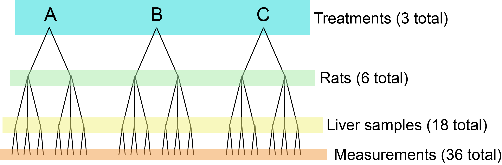
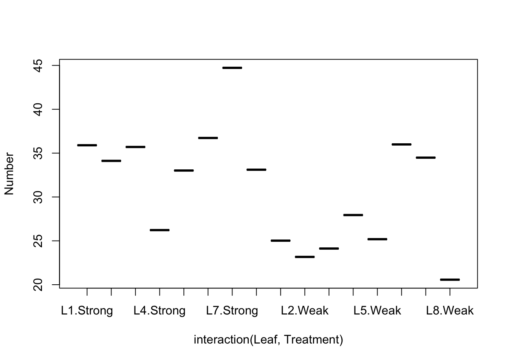

Week 12 Lab
=============


Today we will discuss Hurlbert's [famous paper](https://github.com/hlynch/Biometry2020/tree/master/_data/Hurlbert.pdf) on pseudoreplication. You can also find an interview with Hurlbert [here](https://podcasts.apple.com/us/podcast/get-real-stuart-hurlbert-on-pseudoreplication-other/id426676729?i=1000368631395).

There are 5 parts to this week's lab:

1. Example #1: Two-way factorial ANOVA in R
2. Example #2: Nested deisgn
3. Example #3: Nested design
4. Example #4: Randomized block design
5. Example #5: Nested design 

Example #1: Two-way factorial ANOVA in R
---------------

Two-way ANOVA in R is a lot like one-way ANOVA in R, except now we have a second covariate in the model equation. We will go through a two-way example using the same data on income and education that we used last week. 


```r
salaries<-read.csv("_data/TwoWayANOVAdata.csv")
par(mfrow=c(2,1))
boxplot(salaries$Salary~salaries$Gender,ylab="Salary")
boxplot(salaries$Salary~salaries$Education,ylab="Salary")
```


NB: The data we are using this week are the original (unbalanced) version of the data we used last week. These data are unbalanced, which will have important consequences for the ANOVA as we will see.

Let's stop for a second and figure out how we can look at the data:


```r
summary(salaries)
```

```
##      Salary         Gender           Education        
##  Min.   :15.00   Length:31          Length:31         
##  1st Qu.:20.50   Class :character   Class :character  
##  Median :25.00   Mode  :character   Mode  :character  
##  Mean   :23.97                                        
##  3rd Qu.:27.00                                        
##  Max.   :32.00
```

```r
str(salaries)
```

```
## 'data.frame':	31 obs. of  3 variables:
##  $ Salary   : int  24 26 25 24 27 24 27 23 30 27 ...
##  $ Gender   : chr  "Female" "Female" "Female" "Female" ...
##  $ Education: chr  "Masters" "Masters" "Masters" "Masters" ...
```

```r
head(salaries)
```

```
##   Salary Gender Education
## 1     24 Female   Masters
## 2     26 Female   Masters
## 3     25 Female   Masters
## 4     24 Female   Masters
## 5     27 Female   Masters
## 6     24 Female   Masters
```

I'm going to show you another nice way of looking at ANOVA data which defines a new function which calculates the mean and its standard error and prints it out in a nice format. Don't worry too much about the details, but I include the script here so you have it in case it is helpful for you later...


```r
meansd<-function(x)
  {
  tmp.mean<-format(mean(x),digits=3)
  tmp.sd<-format(apply(x,2,sd),digits=3)
  mean.sd<-paste(tmp.mean, " (",tmp.sd,")", sep="")
  mean.sd<-as.matrix(mean.sd)
  names(mean.sd)<- "Mean (SD)"
  return(mean.sd)
  }

library(rms)  #the function "summary" uses the rms package
```

```
## Loading required package: Hmisc
```

```
## Loading required package: lattice
```

```
## Loading required package: survival
```

```
## Loading required package: Formula
```

```
## Loading required package: ggplot2
```

```
## 
## Attaching package: 'Hmisc'
```

```
## The following objects are masked from 'package:base':
## 
##     format.pval, units
```

```
## Loading required package: SparseM
```

```
## 
## Attaching package: 'SparseM'
```

```
## The following object is masked from 'package:base':
## 
##     backsolve
```

```
## Warning in .recacheSubclasses(def@className, def, env): undefined subclass
## "numericVector" of class "Mnumeric"; definition not updated
```

```r
summary(Salary~Education+Gender,data=salaries,method="cross",fun=meansd)
```

```
## 
##  meansd by Education, Gender 
## 
## +------+
## |     N|
## |Salary|
## +------+
## +---------+-----------+-----------+-----------+
## |Education|   Female  |    Male   |    ALL    |
## +---------+-----------+-----------+-----------+
## |  Masters|         8 |         3 |         11|
## |         |25 (1.51)  |27 (2)     |25.5 (1.81)|
## +---------+-----------+-----------+-----------+
## |No degree|         4 |         7 |         11|
## |         |17 (2.16)  |20 (1.41)  |18.9 (2.21)|
## +---------+-----------+-----------+-----------+
## |      PhD|         4 |         5 |         9 |
## |         |29.2 (2.22)|27.4 (1.67)|28.2 (2.05)|
## +---------+-----------+-----------+-----------+
## |      ALL|         16|         15|         31|
## |         |24.1 (4.89)|23.9 (4.03)|24 (4.42)  |
## +---------+-----------+-----------+-----------+
```

This is a quick and dirty way to look at the raw data to make sense of the model output to come. Note that you could stick this inside 'latex()' and it would make a latex ready formatted table for you.

Back to the modelling...

Note that

```
Salary~Education+Gender+Education:Gender
```

is the same as

```
Salary~Education*Gender
```

since the * says "consider Education and Gender and all interactions".

For reasons that will become clear in a second, we will use the first notation for now.


```r
lm.fit.2way<-lm(Salary~Education+Gender+Education:Gender,data=salaries)
summary(lm.fit.2way)
```

```
## 
## Call:
## lm(formula = Salary ~ Education + Gender + Education:Gender, 
##     data = salaries)
## 
## Residuals:
##    Min     1Q Median     3Q    Max 
## -2.250 -1.125  0.000  1.000  3.000 
## 
## Coefficients:
##                               Estimate Std. Error t value Pr(>|t|)    
## (Intercept)                    25.0000     0.6162  40.569  < 2e-16 ***
## EducationNo degree             -8.0000     1.0674  -7.495 7.55e-08 ***
## EducationPhD                    4.2500     1.0674   3.982 0.000519 ***
## GenderMale                      2.0000     1.1800   1.695 0.102516    
## EducationNo degree:GenderMale   1.0000     1.6081   0.622 0.539664    
## EducationPhD:GenderMale        -3.8500     1.6612  -2.318 0.028945 *  
## ---
## Signif. codes:  0 '***' 0.001 '**' 0.01 '*' 0.05 '.' 0.1 ' ' 1
## 
## Residual standard error: 1.743 on 25 degrees of freedom
## Multiple R-squared:  0.8706,	Adjusted R-squared:  0.8447 
## F-statistic: 33.64 on 5 and 25 DF,  p-value: 2.509e-10
```

```r
anova(lm.fit.2way)
```

```
## Analysis of Variance Table
## 
## Response: Salary
##                  Df Sum Sq Mean Sq F value    Pr(>F)    
## Education         2 471.78 235.888 77.6458 1.882e-11 ***
## Gender            1   8.96   8.955  2.9478   0.09836 .  
## Education:Gender  2  30.29  15.143  4.9846   0.01507 *  
## Residuals        25  75.95   3.038                      
## ---
## Signif. codes:  0 '***' 0.001 '**' 0.01 '*' 0.05 '.' 0.1 ' ' 1
```

(Question: How do we interpret the intercept?)

Note that these effect sizes should make sense if we keep track of the correct usage of the interaction terms. The intercept is the mean salary of a Female with a Masters degree (25k). We can re-create the other cells in the table above by adding or subtracting from the baseline the effects of swapping categories of gender or education.

For example, what is the mean salary of a man with a PhD. Going from the baseline condition of the intercept to a Man with a PhD we have to make two swaps: Female->Male and Masters->PhD. This involves both the main effects of Gender and Education but also the interaction between Gender and Education. Let's do this stepwise:

$$
\mbox{Female&Masters}=25 \\
\mbox{Change for a woman getting a PhD}=4.25 \\ 
 ------- \rightarrow\mbox{Women&PhD}=25+4.25=29.25 \\
\mbox{Change for a Woman with PhD becoming a Man} = 2-3.85 = -1.85\\  
------- \rightarrow \mbox{Man&PhD} = 29.25-1.85=27.4
$$

This is exactly what the table shows as well. Note that because of the interaction, a woman with a PhD is better off staying a woman because the benefit of getting a PhD is much bigger for a woman than for a man and this more than compensates for the negative effect being female has on average salary. Another way of thinking about it would be to do the gender swap first:

$$
\mbox{Female&Masters}=25 \\
\mbox{Change for a Woman with Masters becoming a Man} = 2 \\
------- \rightarrow \mbox{Man&Masters} = 25+2 = 27 \mbox{    [Magic, no additional skills required! :) ]}\\
\mbox{Change for a Man getting a PhD}=4.25-3.85 =0.4 \\
------- \rightarrow \mbox{Man&PhD}=27+0.4=27.4 \\
$$


Now try doing the "same" analysis but switching the order of inputs


```r
lm.fit.2way<-lm(Salary~Gender+Education+Gender:Education,data=salaries)
summary(lm.fit.2way)
```

```
## 
## Call:
## lm(formula = Salary ~ Gender + Education + Gender:Education, 
##     data = salaries)
## 
## Residuals:
##    Min     1Q Median     3Q    Max 
## -2.250 -1.125  0.000  1.000  3.000 
## 
## Coefficients:
##                               Estimate Std. Error t value Pr(>|t|)    
## (Intercept)                    25.0000     0.6162  40.569  < 2e-16 ***
## GenderMale                      2.0000     1.1800   1.695 0.102516    
## EducationNo degree             -8.0000     1.0674  -7.495 7.55e-08 ***
## EducationPhD                    4.2500     1.0674   3.982 0.000519 ***
## GenderMale:EducationNo degree   1.0000     1.6081   0.622 0.539664    
## GenderMale:EducationPhD        -3.8500     1.6612  -2.318 0.028945 *  
## ---
## Signif. codes:  0 '***' 0.001 '**' 0.01 '*' 0.05 '.' 0.1 ' ' 1
## 
## Residual standard error: 1.743 on 25 degrees of freedom
## Multiple R-squared:  0.8706,	Adjusted R-squared:  0.8447 
## F-statistic: 33.64 on 5 and 25 DF,  p-value: 2.509e-10
```

```r
anova(lm.fit.2way)
```

```
## Analysis of Variance Table
## 
## Response: Salary
##                  Df Sum Sq Mean Sq F value    Pr(>F)    
## Gender            1   0.30   0.297  0.0977   0.75716    
## Education         2 480.43 240.217 79.0708 1.547e-11 ***
## Gender:Education  2  30.29  15.143  4.9846   0.01507 *  
## Residuals        25  75.95   3.038                      
## ---
## Signif. codes:  0 '***' 0.001 '**' 0.01 '*' 0.05 '.' 0.1 ' ' 1
```

Did you get the same answer? (No. In fact, Gender is no longer significant the second way.)

Notice that while the ANOVA tables are different, the parameter estimates and their standard errors/p-values are the same in both cases. Why? Remember when we were discussing multiple regression, we said that the coefficients in a multiple regression represented the slope of the "partial regression line" which is to be interpreted as the effect of that covariate holding all other predictor variables at their mean value. In other words, the multiple regression implicitly uses a Type III approach because that is typically what is of interest. Likewise, we are usually interested in the Type III sum of squares ANOVA table. The only problem is that this is not R's default.

To get Type II and Type III sum of squares ANOVA tables, you have to use the 'Anova' function in the 'car' package.

Before moving on from this example, its worth thinking about a slightly simpler analysis in which you model income as a function of gender (men v. women) and education (Masters v. PhD). (Same as above but considering only two of the original three education levels.) Considering the 2-way ANOVA analysis for this, we may find ourselves asking the question "If you have a factorial design and you are going to include an interaction term, why bother doing a two-way ANOVA - why not just do two separate t-tests?". In other words, the interaction allows for the effect of Education to differ for men and for women, so why not just do a t-test for men and a separate t-test for women? One issue is the concern over multiple comparisons. The other difference involves how error is estimated.

Let's do the ANOVA first:


```r
salaries.v2<-salaries[-which(salaries$Education=="No degree"),]
summary(lm(Salary~Gender+Education+Gender:Education,data=salaries.v2))
```

```
## 
## Call:
## lm(formula = Salary ~ Gender + Education + Gender:Education, 
##     data = salaries.v2)
## 
## Residuals:
##    Min     1Q Median     3Q    Max 
## -2.250 -1.288 -0.200  1.250  2.750 
## 
## Coefficients:
##                         Estimate Std. Error t value Pr(>|t|)    
## (Intercept)              25.0000     0.6247  40.020   <2e-16 ***
## GenderMale                2.0000     1.1962   1.672   0.1140    
## EducationPhD              4.2500     1.0820   3.928   0.0012 ** 
## GenderMale:EducationPhD  -3.8500     1.6840  -2.286   0.0362 *  
## ---
## Signif. codes:  0 '***' 0.001 '**' 0.01 '*' 0.05 '.' 0.1 ' ' 1
## 
## Residual standard error: 1.767 on 16 degrees of freedom
## Multiple R-squared:  0.5091,	Adjusted R-squared:  0.417 
## F-statistic: 5.531 on 3 and 16 DF,  p-value: 0.008446
```

Now lets do the analogous t-test, looking at the difference in salary between women with a Masters degree and women with a PhD:


```r
t.test(salaries.v2$Salary[salaries.v2$Gender=="Female"&salaries.v2$Education=="Masters"],salaries.v2$Salary[salaries.v2$Gender=="Female"&salaries.v2$Education=="PhD"])
```

```
## 
## 	Welch Two Sample t-test
## 
## data:  salaries.v2$Salary[salaries.v2$Gender == "Female" & salaries.v2$Education == "Masters"] and salaries.v2$Salary[salaries.v2$Gender == "Female" & salaries.v2$Education == "PhD"]
## t = -3.453, df = 4.4536, p-value = 0.02188
## alternative hypothesis: true difference in means is not equal to 0
## 95 percent confidence interval:
##  -7.5342704 -0.9657296
## sample estimates:
## mean of x mean of y 
##     25.00     29.25
```

Notice that the difference in means is exactly what you would expect from the summary table from the lm() function (4.25) but the t-statistic (and hence the p-value) are now different. Why? In the lm(), data on both males and females are used to estimate the within-group error (in other words, the data are pooled to estimate MSwithin) whereas the t-test uses data for women only and therefore ends up with a slightly different estimate for the test statistic and the p-value. 

Which is correct? It depends on whether you think that there is value in pooling the errors. It also depends on how concerned you are about multiple comparisons with the separate t-tests.

Example #2: Nested design
------------

We will work through one of the classic examples from Sokal & Rohlf in which we are looking at the effect of a treatment on rat livers. We have three treatments, two rats per treatment, three liver samples per rat, and two measurements of each liver sample. The experimental design is sketched out here:

<div class="figure" style="text-align: center">

<p class="caption">(\#fig:unnamed-chunk-9)Nested design of the rat experiment.</p>
</div>


```r
rats<-read.csv("_data/rats.txt",header=T)
attach(rats)
Treatment<-factor(TREAT)
Rat<-factor(RAT)
Liver<-factor(PREP)
anova(lm(GLYCO~TREAT))
```

```
## Analysis of Variance Table
## 
## Response: GLYCO
##           Df Sum Sq Mean Sq F value    Pr(>F)    
## TREAT      2 1557.6  778.78  14.498 3.031e-05 ***
## Residuals 33 1772.7   53.72                      
## ---
## Signif. codes:  0 '***' 0.001 '**' 0.01 '*' 0.05 '.' 0.1 ' ' 1
```

It looks like Treatment is highly significant! But...we made a big mistake here because we have assumed that all 36 liver measurements are independent samples when we know that they are not because they only come from 6 rats (2 for each treatment).

What happens if we simply average the Glycogen context for each rat and redo the ANOVA?


```r
tapply(GLYCO,list(TREAT,RAT),mean)
```

```
##                   Rat1  Rat2     Rat3     Rat4     Rat5 Rat6
## Compound217         NA    NA 149.6667 152.3333       NA   NA
## Compound217Sugar    NA    NA       NA       NA 134.3333  136
## Control          132.5 148.5       NA       NA       NA   NA
```

```r
anova(lm(c(tapply(GLYCO,list(TREAT,RAT),mean))[!is.na(c(tapply(GLYCO,list(TREAT,RAT),mean)))==TRUE]~factor(c(1,2,3,1,2,3))))
```

```
## Analysis of Variance Table
## 
## Response: c(tapply(GLYCO, list(TREAT, RAT), mean))[!is.na(c(tapply(GLYCO, 
## Response:     list(TREAT, RAT), mean))) == TRUE]
##                             Df Sum Sq Mean Sq F value Pr(>F)
## factor(c(1, 2, 3, 1, 2, 3))  2   2.12    1.06  0.0081 0.9919
## Residuals                    3 390.42  130.14
```

Analyzed this way we see that Treatment is not in fact significant, but averaging over all the liver samples precludes the possibility of looking at variation at the other scales of study (within rat, between measurements). Nested designs allow us to do just that.

To analyze nested models, we use the '/' operator to show how things are nested, and we add a new error term to tell R how the errors are nested as well.


```r
model<-aov(GLYCO~TREAT+Error(RAT/PREP))
```

```
## Warning in aov(GLYCO ~ TREAT + Error(RAT/PREP)): Error() model is singular
```

```r
summary(model)
```

```
## 
## Error: RAT
##           Df Sum Sq Mean Sq F value Pr(>F)
## TREAT      2 1557.6   778.8   2.929  0.197
## Residuals  3  797.7   265.9               
## 
## Error: RAT:PREP
##           Df Sum Sq Mean Sq F value Pr(>F)
## Residuals 12    594    49.5               
## 
## Error: Within
##           Df Sum Sq Mean Sq F value Pr(>F)
## Residuals 18    381   21.17
```

Note that if you leave the error term off, the sum of squares calculated are correct, but the F ratios are wrong and, as a result, the p-values are way too small.

Example #3: Nested design
----------------

Case study taken from Logan (see Figure 2): "In an unusually detailed preparation for an Environmental Effects Statement for a proposed discharge of dairy wastes in the Curdies River, in western Victoria, a team of stream ecologists wanted to describe the basic patterns of variation in a stream invertebrate thought to be sensitive to nutrient enrichment. As an indicator species, they focused on a small flatworm, Dugesia, and started by sampling populations of this worm at a range of scales. They sampled in two season, they sampled three randomly chosen (well, haphazardly, because sites are nearly always chosen to be close to road access) sites. A total of six sites in all were visited, 3 in each season. At each site, they sampled six stones, and counted the number of flatworms on each stone." 
Why is this a nested design and not a factorial (crossed) design? Because the sites chosen in each season are not the same sites, they are randomly selected in each season depending on logistical constraints.


```r
worms<-read.csv("_data/flatworms.csv",header=T)
worms$Site<-factor(worms$Site)
```

Question: What are the main hypotheses being tested?

$H_{0}$ for Effect #1: There is no effect of season on flatworm density

$H_{0}$ for Effect #2: There is no added variance due to the random variable Sites

First, let's check the assumption of normality by looking at boxplots of the data


```r
boxplot(Density~Season,data=worms)
```


We see that Winter has significantly more variance than Summer. What do we do? We try and transform Density so as to stabilize variance between two seasons. The original authors use a fourth-root transformation, so we will try that...


```r
boxplot(Density^(1/4)~Season,data=worms)
```


A log transformation would also have worked.There are strategies for finding the best transformation but we don't have time to get into that.

Question: What are the correct F-ratios and the appropriate degrees of freedom?

(See Table 1)

Let's fit the model in R:


```r
model2<-aov(Density^(1/4)~Season+Error(Site),data=worms)
summary(model2)
```

```
## 
## Error: Site
##           Df Sum Sq Mean Sq F value Pr(>F)   
## Season     1  5.571   5.571    34.5 0.0042 **
## Residuals  4  0.646   0.161                  
## ---
## Signif. codes:  0 '***' 0.001 '**' 0.01 '*' 0.05 '.' 0.1 ' ' 1
## 
## Error: Within
##           Df Sum Sq Mean Sq F value Pr(>F)
## Residuals 30  4.556  0.1519
```

```r
summary(lm(model2))
```

```
## 
## Call:
## lm(formula = model2)
## 
## Residuals:
##     Min      1Q  Median      3Q     Max 
## -0.3811 -0.2618 -0.1381  0.1652  0.9023 
## 
## Coefficients: (1 not defined because of singularities)
##                    Estimate Std. Error t value Pr(>|t|)   
## (Intercept)          0.3811     0.1591   2.396  0.02303 * 
## SeasonWINTER         0.7518     0.2250   3.342  0.00224 **
## Site2                0.1389     0.2250   0.618  0.54156   
## Site3               -0.2651     0.2250  -1.178  0.24798   
## Site4               -0.0303     0.2250  -0.135  0.89376   
## Site5               -0.2007     0.2250  -0.892  0.37955   
## Site6                    NA         NA      NA       NA   
## ---
## Signif. codes:  0 '***' 0.001 '**' 0.01 '*' 0.05 '.' 0.1 ' ' 1
## 
## Residual standard error: 0.3897 on 30 degrees of freedom
## Multiple R-squared:  0.5771,	Adjusted R-squared:  0.5066 
## F-statistic: 8.188 on 5 and 30 DF,  p-value: 5.718e-05
```

**Question: How do we interpret the model? The F-ratio for Season is significant - what does this mean biologically? If we were to go back and redesign the study to maximize power, what would we do?**

<details>
  <summary>Click for Answer</summary>
<span style="color: blueviolet;">
If a nested design was to be used, then since SITES are the replicates for the effect of SEASON, then power is maximized by having more sites. Whilst having more stones may increase the precision of the measure of Dugusia within a site, it will not improve the power of the test of SEASON.
</span>
</details> 

Let's fit the model using the untransformed data just to compare:


```r
model3<-aov(Density~Season+Error(Site),data=worms)
summary(model3)
```

```
## 
## Error: Site
##           Df Sum Sq Mean Sq F value Pr(>F)
## Season     1  36.81   36.81   3.918  0.119
## Residuals  4  37.58    9.40               
## 
## Error: Within
##           Df Sum Sq Mean Sq F value Pr(>F)
## Residuals 30  203.9   6.798
```

Now we get a grossly inflated level of significance for Season driven by the larger variance of the Winter densities.

Example #4: Randomized Block Design
--------------

(From Quinn, Keough, and Carey; see Figure 3) A plant pathologist wanted to examine the effects of two different strengths of tobacco virus on the number of lesions on tobacco leaves. She knew from pilot studies that leaves were inherently very variable in response to the virus. In an attempt to account for this leaf to leaf variability, both treatments were applied to each leaf. Eight individual leaves were divided in half, with half of each leaf incoculated with weak strength virus and the other half inoculated with strong virus.

**Question: What kind of analysis is this?**

<details>
  <summary>Click for Answer</summary>
<span style="color: blueviolet;">
A randomized block design, with Leaf as the "blocking factor".
</span>
</details> 

So in this case, the leaves are considered the "blocks" and each treatment is represented once in each block. A completely randomized design would have had 16 leaves, with 8 whole leaves randomly allocated to each treatment.


```r
tobacco<-read.csv("_data/tobacco.csv")
head(tobacco)
```

```
##   Leaf Treatment   Number
## 1   L1    Strong 35.89776
## 2   L1      Weak 25.01984
## 3   L2    Strong 34.11786
## 4   L2      Weak 23.16740
## 5   L3    Strong 35.70215
## 6   L3      Weak 24.12191
```

**Question: What are the main hypotheses being tested?**

<details>
  <summary>Click for Answer</summary>
<span style="color: blueviolet;">
$H_{0}$ for Effect #1: There is no effect of treatment on lesion number within each leaf block.

$H_{0}$ for Effect #2: There is no added variance due to the random variable Leaf. (In other words, there is no effect of the blocking factor leaf.)

We can't actually test for an interaction between Block and Treatment in this design, but we can look at the data using an "Interaction plot".


```r
boxplot(Number~interaction(Leaf,Treatment),data=tobacco)
```



The interaction plot suggests that there is some evidence of an interaction. Although the number of lesions appear to be greater in strongly innoculated leaves than the weakly innoculated leaves in most of the leaf pairs (blocks), this trend is either absent or reversed in two of the eight (1/4) of the leaf pairs. As a result, the test of block may not be reliable, and the power of the main test of treatment is reduced.
</span>
</details> 

**Question: What is the right R command to fit this model?**

<details>
  <summary>Click for Answer</summary>
<span style="color: blueviolet;">

```r
model4<-aov(Number~Treatment+Error(Leaf/Treatment),data=tobacco)
summary(model4)
```

```
## 
## Error: Leaf
##           Df Sum Sq Mean Sq F value Pr(>F)
## Residuals  7  292.1   41.73               
## 
## Error: Leaf:Treatment
##           Df Sum Sq Mean Sq F value  Pr(>F)   
## Treatment  1  248.3  248.34   17.17 0.00433 **
## Residuals  7  101.2   14.46                   
## ---
## Signif. codes:  0 '***' 0.001 '**' 0.01 '*' 0.05 '.' 0.1 ' ' 1
```

Note that Treatment is WITHIN Leaf, not the other way around.
</span>
</details> 

**Question: What are the relevant F-ratios here? **

<details>
  <summary>Click for Answer</summary>
<span style="color: blueviolet;">
Going back to our table for Blocked design, we see that the F-ratio is MS/MS_resid.
</span>
</details> 

**Question: What is the biological interpretation here?**

<details>
  <summary>Click for Answer</summary>
<span style="color: blueviolet;">
Strongly innoculated tobacco leaves were found to have significantly higher mean numbers of lesions than weakly innoculated leaves. Leaf pairs (blocks) explained substantial amounts of the variation and therefore probably contributed to the sensitivity of the main test of treatment - thereby justifying the blocking design over a completely randomized design.
</span>
</details>

How would we fit this with a mixed model?


```r
library(lme4)
```

```
## Loading required package: Matrix
```

```r
model5<-lmer(Number~Treatment+(1|Leaf),tobacco)
summary(model5)
```

```
## Linear mixed model fit by REML ['lmerMod']
## Formula: Number ~ Treatment + (1 | Leaf)
##    Data: tobacco
## 
## REML criterion at convergence: 88.7
## 
## Scaled residuals: 
##      Min       1Q   Median       3Q      Max 
## -1.61850 -0.48453  0.01133  0.40900  1.42778 
## 
## Random effects:
##  Groups   Name        Variance Std.Dev.
##  Leaf     (Intercept) 13.63    3.692   
##  Residual             14.46    3.803   
## Number of obs: 16, groups:  Leaf, 8
## 
## Fixed effects:
##               Estimate Std. Error t value
## (Intercept)     34.940      1.874  18.645
## TreatmentWeak   -7.879      1.901  -4.144
## 
## Correlation of Fixed Effects:
##             (Intr)
## TreatmentWk -0.507
```


Example #5: Nested design
--------------

In an experiment on eye color, each male fly is mated with four different female flies. Two offspring are born from each mating, and the intensity of eye color among these offspring are measured. The question is, how much variation in eye color is due to differences between females and how much is due to differences between males?


```r
flies<-read.table("_data/flies.txt",header=T)
flies$male<-factor(flies$male)
flies$female<-factor(flies$female)
model6<-aov(eye~male/female+Error(male/female),data=flies)
summary(model6)
```

```
## 
## Error: male
##      Df Sum Sq Mean Sq
## male  2  665.7   332.8
## 
## Error: male:female
##             Df Sum Sq Mean Sq
## male:female  9   1721   191.2
## 
## Error: Within
##           Df Sum Sq Mean Sq F value Pr(>F)
## Residuals 12  15.62   1.302
```

**Question: What is the interpretation of this result?**

<details>
  <summary>Click for Answer</summary>
<span style="color: blueviolet;">
Females within male are much more important!
</span>
</details>
