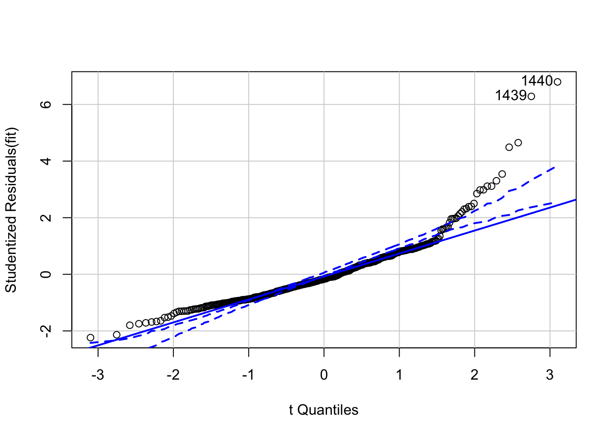

Week 13 Lab
=============


In lab we'll go through 

1. Model selection / model comparison

2. Model criticism

**We will need a series of packages for today's lab, some of which we have not used before: MASS, lmtest, MuMIn, car, and gvlma.**

Part 1: Model selection / model comparison
------------------------

There is a frog dataset on the distribution of the Southern Corroboree frog that we are going to attach. More information on the definition of the covariates in this dataset can be found [here](https://www.key2stats.com/data-set/view/235).


```r
frogs<-read.csv("_data/frogs.csv",header=T)
head(frogs)
```

```
##   X pres.abs northing easting altitude distance NoOfPools NoOfSites   avrain
## 1 2        1      115    1047     1500      500       232         3 155.0000
## 2 3        1      110    1042     1520      250        66         5 157.6667
## 3 4        1      112    1040     1540      250        32         5 159.6667
## 4 5        1      109    1033     1590      250         9         5 165.0000
## 5 6        1      109    1032     1590      250        67         5 165.0000
## 6 7        1      106    1018     1600      500        12         4 167.3333
##    meanmin  meanmax
## 1 3.566667 14.00000
## 2 3.466667 13.80000
## 3 3.400000 13.60000
## 4 3.200000 13.16667
## 5 3.200000 13.16667
## 6 3.133333 13.06667
```

```r
attach(frogs)
plot(northing ~ easting, pch=c(1,16)[frogs$pres.abs+1],xlab="Meters east", ylab="Meters north")
```


Make sure you understand how the pch command is working in the above plot command.


```r
pairs(cbind(altitude,distance,NoOfPools,NoOfSites,avrain,meanmin,meanmax))
```


Looking at the data in this way, are there any covariates that might benefit from transformation?

**Question: Why bother transforming a covariate?**

<details>
  <summary>Click for Answer</summary>
<span style="color: blueviolet;">
As you can see from the scatterplots, some covariates have points with large leverage, and these point may (but don't always) have high influence on model fit. Often we want all the points to have roughly equal influence on the model fit so we will apply a transformation like the log() to spread out small values all bunched together and to pull in large values that are much larger than the others. These transformations (e.hg., log, square root) are often referred to as "variance stabilizing" transformations.
</span>
</details> 

<p>&nbsp;</p>

Let's try log-transforming "distance" and "Number of Pools".


```r
pairs(cbind(altitude,log(distance),log(NoOfPools),NoOfSites,avrain,meanmin,meanmax))
```


Let's fit a GLM with all the variables.

**<span style="color: green;">Checkpoint #1: Why a GLM?</span>** <span style="color: white;">Because the response variable is binary 0/1.</span>


```r
frogs.glm0<-glm(pres.abs~altitude+log(distance)+log(NoOfPools)+NoOfSites+avrain+meanmin+meanmax,family=binomial,data=frogs,na.action=na.fail)
summary(frogs.glm0)
```

```
## 
## Call:
## glm(formula = pres.abs ~ altitude + log(distance) + log(NoOfPools) + 
##     NoOfSites + avrain + meanmin + meanmax, family = binomial, 
##     data = frogs, na.action = na.fail)
## 
## Deviance Residuals: 
##     Min       1Q   Median       3Q      Max  
## -1.9795  -0.7193  -0.2785   0.7964   2.5658  
## 
## Coefficients:
##                  Estimate Std. Error z value Pr(>|z|)    
## (Intercept)     4.090e+01  1.327e+02   0.308 0.757845    
## altitude       -6.648e-03  3.866e-02  -0.172 0.863466    
## log(distance)  -7.593e-01  2.554e-01  -2.973 0.002945 ** 
## log(NoOfPools)  5.727e-01  2.162e-01   2.649 0.008083 ** 
## NoOfSites      -8.979e-04  1.074e-01  -0.008 0.993330    
## avrain         -6.793e-03  5.999e-02  -0.113 0.909848    
## meanmin         5.305e+00  1.543e+00   3.439 0.000584 ***
## meanmax        -3.173e+00  4.839e+00  -0.656 0.512048    
## ---
## Signif. codes:  0 '***' 0.001 '**' 0.01 '*' 0.05 '.' 0.1 ' ' 1
## 
## (Dispersion parameter for binomial family taken to be 1)
## 
##     Null deviance: 279.99  on 211  degrees of freedom
## Residual deviance: 197.62  on 204  degrees of freedom
## AIC: 213.62
## 
## Number of Fisher Scoring iterations: 5
```

(The na.action flag is so MuMIn won't complain further down.)

Anything look funny? Well, for one, meanmin is highly significant but meanmax and altitude are not - but we would expect these three variables to be highly correlated.

Use the vif() function to explore this further


```r
vif(frogs.glm0)
```

```
##       altitude  log(distance) log(NoOfPools)      NoOfSites         avrain 
##     850.879518       1.396014       1.306058       1.401175      16.664582 
##        meanmin        meanmax 
##      29.319704     996.949239
```

It appears that the variances for altitude and meanmax are inflated. **<span style="color: green;">Checkpoint #2: Why?</span>**

Plot the data:


```r
par(mfrow=c(2,1))
plot(altitude,meanmax)
plot(altitude,meanmin)
```


```r
cor(altitude,meanmax)
```

```
## [1] -0.996557
```

```r
cor(altitude,meanmin)
```

```
## [1] -0.953661
```

Question: So...what do we do?

Answer: Let's try removing the least biologically significant variable first. I suggest we remove altitude.


```r
frogs.glm1<-glm(pres.abs~log(distance)+log(NoOfPools)+NoOfSites+avrain+meanmin+meanmax,family=binomial,data=frogs)
summary(frogs.glm1)
```

```
## 
## Call:
## glm(formula = pres.abs ~ log(distance) + log(NoOfPools) + NoOfSites + 
##     avrain + meanmin + meanmax, family = binomial, data = frogs)
## 
## Deviance Residuals: 
##     Min       1Q   Median       3Q      Max  
## -1.9763  -0.7189  -0.2786   0.7970   2.5745  
## 
## Coefficients:
##                  Estimate Std. Error z value Pr(>|z|)    
## (Intercept)    18.2689000 16.1381912   1.132 0.257622    
## log(distance)  -0.7583198  0.2558117  -2.964 0.003033 ** 
## log(NoOfPools)  0.5708953  0.2153335   2.651 0.008020 ** 
## NoOfSites      -0.0036201  0.1061469  -0.034 0.972794    
## avrain          0.0007003  0.0411710   0.017 0.986429    
## meanmin         5.3540724  1.5254665   3.510 0.000448 ***
## meanmax        -2.3624614  1.0678821  -2.212 0.026947 *  
## ---
## Signif. codes:  0 '***' 0.001 '**' 0.01 '*' 0.05 '.' 0.1 ' ' 1
## 
## (Dispersion parameter for binomial family taken to be 1)
## 
##     Null deviance: 279.99  on 211  degrees of freedom
## Residual deviance: 197.65  on 205  degrees of freedom
## AIC: 211.65
## 
## Number of Fisher Scoring iterations: 5
```

Better, but we still have a lot of multicollinearity between meanmin and meanmax.

We could choose one or the other but at this point, let's leave them both in and try and find the best model we can.

First, let's do a little review of the three comparison criteria we discussed on Tuesday:

1. Likelihood (specifically, likelihood ratio)

2. Akaike's Information Criteria (AIC)

3. Bayesian Information Criterion (BIC)

We get the log-likelihood of a model in R using the logLik command


```r
logLik(frogs.glm0)
```

```
## 'log Lik.' -98.81244 (df=8)
```

```r
logLik(frogs.glm1)
```

```
## 'log Lik.' -98.82714 (df=7)
```

How do we do the likelihood ratio test?

Remember that

$$
-2*(LL(smaller)-LL(bigger))
\sim \chi^{2}_{\mbox{difference in parameters}}
$$

In R we can do this with


```r
test.stat<--2*(logLik(frogs.glm1)-logLik(frogs.glm0))
as.numeric(test.stat) # as.numeric is just to suppress the labels which can be misleading
```

```
## [1] 0.02941079
```

```r
as.numeric(1-pchisq(test.stat,df=1))
```

```
## [1] 0.863834
```

**<span style="color: green;">Checkpoint #3: How do we interpret that p-value?</span>**

<span style="color: white;">Answer: This p-value is the probability that the larger model fits the data better only by the amount expected by its additional degree of freedom. In this case, we can not reject the null hypothesis that the two models are equivalent, and so we would prefer the smaller model on the basis of parsimony.</span>

We can actually get R to do the LRT automatically using the 'lrtest' function in the 'lmtest' package.


```r
library('lmtest')
lrtest(frogs.glm0,frogs.glm1)
```

```
## Likelihood ratio test
## 
## Model 1: pres.abs ~ altitude + log(distance) + log(NoOfPools) + NoOfSites + 
##     avrain + meanmin + meanmax
## Model 2: pres.abs ~ log(distance) + log(NoOfPools) + NoOfSites + avrain + 
##     meanmin + meanmax
##   #Df  LogLik Df  Chisq Pr(>Chisq)
## 1   8 -98.812                     
## 2   7 -98.827 -1 0.0294     0.8638
```

This gives us exactly the same result we got before.

We could also have also compared these models by looking at the ANOVA table for comparison


```r
anova(frogs.glm0,frogs.glm1)
```

```
## Analysis of Deviance Table
## 
## Model 1: pres.abs ~ altitude + log(distance) + log(NoOfPools) + NoOfSites + 
##     avrain + meanmin + meanmax
## Model 2: pres.abs ~ log(distance) + log(NoOfPools) + NoOfSites + avrain + 
##     meanmin + meanmax
##   Resid. Df Resid. Dev Df  Deviance
## 1       204     197.62             
## 2       205     197.65 -1 -0.029411
```

How do we calculate AIC for these two models?


```r
logLik(frogs.glm0)
```

```
## 'log Lik.' -98.81244 (df=8)
```

```r
k<-8
AIC.glm0<-as.numeric(-2*logLik(frogs.glm0)+2*k)
AIC.glm0
```

```
## [1] 213.6249
```

```r
AIC(frogs.glm0)
```

```
## [1] 213.6249
```

```r
AIC(frogs.glm1)
```

```
## [1] 211.6543
```

Question: Are these significantly different? 

Answer: This is a trick question. In an Information Theoretic context, we avoid the term "significant" because it is implied that we mean "statistically significant" in the context of hypothesis testing, and no hypothesis test is being performed. AIC simply gives us information on the weight of evidence for one model over another. There are no theoretically justified guidelines (although Burnham and Anderson suggest some as we discussed in lecture). It is better (in my opinion) to convert AICs into model weights and, if it makes sense in the context, to do model averaging.

How about BIC? USe the AIC function with a different flag for the penalty.


```r
AIC(frogs.glm0,k=log(nrow(frogs)))
```

```
## [1] 240.4776
```

```r
AIC(frogs.glm1,k=log(nrow(frogs)))
```

```
## [1] 235.1504
```

We could also do this with the BIC() function


```r
BIC(frogs.glm0)
```

```
## [1] 240.4776
```

```r
BIC(frogs.glm1)
```

```
## [1] 235.1504
```

As a group, find a small set (3-5) of candidate models, calculate the AIC for each of these models, and calculate model weights.

**<span style="color: green;">Checkpoint #4: What covariates were in the best performing model (among the ones you tried as a group) and what was its model weight?</span>**

Model selection via step-wise regression
--------------------

Ideally, we can narrow down the set of candidate covariates based on biology alone. Another approach that is common in the literature, but which has been criticized, is stepwise regression. The default of the step() function is to use both forward and backward steps. If the function step is given the full model, it will begin with the full model, no matter which direction it is working.


```r
step(frogs.glm0) #same as step(frogs.glm0,direction="both")
```

```
## Start:  AIC=213.62
## pres.abs ~ altitude + log(distance) + log(NoOfPools) + NoOfSites + 
##     avrain + meanmin + meanmax
## 
##                  Df Deviance    AIC
## - NoOfSites       1   197.62 211.62
## - avrain          1   197.64 211.64
## - altitude        1   197.65 211.65
## - meanmax         1   198.05 212.05
## <none>                197.62 213.62
## - log(NoOfPools)  1   205.31 219.31
## - log(distance)   1   207.22 221.22
## - meanmin         1   211.27 225.27
## 
## Step:  AIC=211.62
## pres.abs ~ altitude + log(distance) + log(NoOfPools) + avrain + 
##     meanmin + meanmax
## 
##                  Df Deviance    AIC
## - avrain          1   197.64 209.64
## - altitude        1   197.66 209.66
## - meanmax         1   198.06 210.06
## <none>                197.62 211.62
## - log(NoOfPools)  1   205.31 217.31
## - log(distance)   1   209.80 221.80
## - meanmin         1   211.31 223.31
## 
## Step:  AIC=209.64
## pres.abs ~ altitude + log(distance) + log(NoOfPools) + meanmin + 
##     meanmax
## 
##                  Df Deviance    AIC
## - altitude        1   197.66 207.66
## - meanmax         1   198.74 208.74
## <none>                197.64 209.64
## - log(NoOfPools)  1   205.31 215.31
## - log(distance)   1   209.88 219.88
## - meanmin         1   213.32 223.32
## 
## Step:  AIC=207.66
## pres.abs ~ log(distance) + log(NoOfPools) + meanmin + meanmax
## 
##                  Df Deviance    AIC
## <none>                197.66 207.66
## - log(NoOfPools)  1   205.34 213.34
## - log(distance)   1   209.91 217.91
## - meanmax         1   214.18 222.18
## - meanmin         1   222.40 230.40
```

```
## 
## Call:  glm(formula = pres.abs ~ log(distance) + log(NoOfPools) + meanmin + 
##     meanmax, family = binomial, data = frogs, na.action = na.fail)
## 
## Coefficients:
##    (Intercept)   log(distance)  log(NoOfPools)         meanmin         meanmax  
##        18.5268         -0.7547          0.5707          5.3791         -2.3821  
## 
## Degrees of Freedom: 211 Total (i.e. Null);  207 Residual
## Null Deviance:	    280 
## Residual Deviance: 197.7 	AIC: 207.7
```

Now compare this to what you would get from


```r
step(frogs.glm0,direction="backward")
```

```
## Start:  AIC=213.62
## pres.abs ~ altitude + log(distance) + log(NoOfPools) + NoOfSites + 
##     avrain + meanmin + meanmax
## 
##                  Df Deviance    AIC
## - NoOfSites       1   197.62 211.62
## - avrain          1   197.64 211.64
## - altitude        1   197.65 211.65
## - meanmax         1   198.05 212.05
## <none>                197.62 213.62
## - log(NoOfPools)  1   205.31 219.31
## - log(distance)   1   207.22 221.22
## - meanmin         1   211.27 225.27
## 
## Step:  AIC=211.62
## pres.abs ~ altitude + log(distance) + log(NoOfPools) + avrain + 
##     meanmin + meanmax
## 
##                  Df Deviance    AIC
## - avrain          1   197.64 209.64
## - altitude        1   197.66 209.66
## - meanmax         1   198.06 210.06
## <none>                197.62 211.62
## - log(NoOfPools)  1   205.31 217.31
## - log(distance)   1   209.80 221.80
## - meanmin         1   211.31 223.31
## 
## Step:  AIC=209.64
## pres.abs ~ altitude + log(distance) + log(NoOfPools) + meanmin + 
##     meanmax
## 
##                  Df Deviance    AIC
## - altitude        1   197.66 207.66
## - meanmax         1   198.74 208.74
## <none>                197.64 209.64
## - log(NoOfPools)  1   205.31 215.31
## - log(distance)   1   209.88 219.88
## - meanmin         1   213.32 223.32
## 
## Step:  AIC=207.66
## pres.abs ~ log(distance) + log(NoOfPools) + meanmin + meanmax
## 
##                  Df Deviance    AIC
## <none>                197.66 207.66
## - log(NoOfPools)  1   205.34 213.34
## - log(distance)   1   209.91 217.91
## - meanmax         1   214.18 222.18
## - meanmin         1   222.40 230.40
```

```
## 
## Call:  glm(formula = pres.abs ~ log(distance) + log(NoOfPools) + meanmin + 
##     meanmax, family = binomial, data = frogs, na.action = na.fail)
## 
## Coefficients:
##    (Intercept)   log(distance)  log(NoOfPools)         meanmin         meanmax  
##        18.5268         -0.7547          0.5707          5.3791         -2.3821  
## 
## Degrees of Freedom: 211 Total (i.e. Null);  207 Residual
## Null Deviance:	    280 
## Residual Deviance: 197.7 	AIC: 207.7
```

The output can be interpreted as follows: the full model has an AIC of 213.62, but if NoOfSites were removed the subsequent model would have an AIC of 211.62, if avrain were removed 211.64, etc, including $<none>$, which represents removing no variables. The covariates are listed in order of lowest AIC if they were to be removed, to highest AIC. Since removing NoOfSites would result in the lowest AIC, including being lower than the current model, $<none>$, NoOfSites is removed for the next step and the process is repeated over again. This continues until $<none>$ has the lowest AIC, meaning no variables can be removed to decrease the AIC from the current model. In this case, this occurred when log(NoOfPools), log(distance), meanmax, and meanmin were in the model. At this point, the process ends and the model from that step is reported as the output.

**However, if we attempt to use forward stepwise selection starting with the full model, the process does not work.** The function begins with the full model, sees that there are no variables it could add to decrease the AIC because we haven't given it any more variables, then reports the full model as the outcome.


```r
step(frogs.glm0,direction="forward")
```

```
## Start:  AIC=213.62
## pres.abs ~ altitude + log(distance) + log(NoOfPools) + NoOfSites + 
##     avrain + meanmin + meanmax
```

```
## 
## Call:  glm(formula = pres.abs ~ altitude + log(distance) + log(NoOfPools) + 
##     NoOfSites + avrain + meanmin + meanmax, family = binomial, 
##     data = frogs, na.action = na.fail)
## 
## Coefficients:
##    (Intercept)        altitude   log(distance)  log(NoOfPools)       NoOfSites  
##     40.8988354      -0.0066477      -0.7593044       0.5727269      -0.0008979  
##         avrain         meanmin         meanmax  
##     -0.0067930       5.3047879      -3.1729589  
## 
## Degrees of Freedom: 211 Total (i.e. Null);  204 Residual
## Null Deviance:	    280 
## Residual Deviance: 197.6 	AIC: 213.6
```

This is clearly not the result that we want, because there are many insignificant variables in the model.


```r
summary(frogs.glm0)
```

```
## 
## Call:
## glm(formula = pres.abs ~ altitude + log(distance) + log(NoOfPools) + 
##     NoOfSites + avrain + meanmin + meanmax, family = binomial, 
##     data = frogs, na.action = na.fail)
## 
## Deviance Residuals: 
##     Min       1Q   Median       3Q      Max  
## -1.9795  -0.7193  -0.2785   0.7964   2.5658  
## 
## Coefficients:
##                  Estimate Std. Error z value Pr(>|z|)    
## (Intercept)     4.090e+01  1.327e+02   0.308 0.757845    
## altitude       -6.648e-03  3.866e-02  -0.172 0.863466    
## log(distance)  -7.593e-01  2.554e-01  -2.973 0.002945 ** 
## log(NoOfPools)  5.727e-01  2.162e-01   2.649 0.008083 ** 
## NoOfSites      -8.979e-04  1.074e-01  -0.008 0.993330    
## avrain         -6.793e-03  5.999e-02  -0.113 0.909848    
## meanmin         5.305e+00  1.543e+00   3.439 0.000584 ***
## meanmax        -3.173e+00  4.839e+00  -0.656 0.512048    
## ---
## Signif. codes:  0 '***' 0.001 '**' 0.01 '*' 0.05 '.' 0.1 ' ' 1
## 
## (Dispersion parameter for binomial family taken to be 1)
## 
##     Null deviance: 279.99  on 211  degrees of freedom
## Residual deviance: 197.62  on 204  degrees of freedom
## AIC: 213.62
## 
## Number of Fisher Scoring iterations: 5
```

**We need to give the function the model that we want it to start with, in this case, the "empty model."** The empty model predicts the number of species at a site using no covariates, only an intercept, and is denoted as pres.abs ~ 1 in R.


```r
frogs.glm.empty <- glm(pres.abs~1, frogs, family="binomial")
summary(frogs.glm.empty)
```

```
## 
## Call:
## glm(formula = pres.abs ~ 1, family = "binomial", data = frogs)
## 
## Deviance Residuals: 
##     Min       1Q   Median       3Q      Max  
## -0.9657  -0.9657  -0.9657   1.4051   1.4051  
## 
## Coefficients:
##             Estimate Std. Error z value Pr(>|z|)    
## (Intercept)  -0.5209     0.1420  -3.667 0.000245 ***
## ---
## Signif. codes:  0 '***' 0.001 '**' 0.01 '*' 0.05 '.' 0.1 ' ' 1
## 
## (Dispersion parameter for binomial family taken to be 1)
## 
##     Null deviance: 279.99  on 211  degrees of freedom
## Residual deviance: 279.99  on 211  degrees of freedom
## AIC: 281.99
## 
## Number of Fisher Scoring iterations: 4
```

We also need to give the step function all of the possible covariates that it can add to find the best model. This is done using the scope= ~ command in step. 


```r
step(frogs.glm.empty, scope= ~log(distance)+log(NoOfPools)+NoOfSites+avrain+meanmin+meanmax, data=frogs, direction="forward")
```

```
## Start:  AIC=281.99
## pres.abs ~ 1
## 
##                  Df Deviance    AIC
## + log(distance)   1   229.15 233.15
## + meanmin         1   254.40 258.40
## + meanmax         1   269.52 273.52
## + log(NoOfPools)  1   273.59 277.59
## + NoOfSites       1   274.51 278.51
## <none>                279.99 281.99
## + avrain          1   279.95 283.95
## 
## Step:  AIC=233.15
## pres.abs ~ log(distance)
## 
##                  Df Deviance    AIC
## + meanmin         1   220.90 226.90
## + meanmax         1   226.55 232.55
## <none>                229.15 233.15
## + log(NoOfPools)  1   227.44 233.44
## + NoOfSites       1   228.28 234.28
## + avrain          1   229.07 235.07
## 
## Step:  AIC=226.9
## pres.abs ~ log(distance) + meanmin
## 
##                  Df Deviance    AIC
## + meanmax         1   205.34 213.34
## + avrain          1   210.12 218.12
## + log(NoOfPools)  1   214.18 222.18
## <none>                220.90 226.90
## + NoOfSites       1   220.26 228.26
## 
## Step:  AIC=213.34
## pres.abs ~ log(distance) + meanmin + meanmax
## 
##                  Df Deviance    AIC
## + log(NoOfPools)  1   197.66 207.66
## <none>                205.34 213.34
## + avrain          1   205.33 215.33
## + NoOfSites       1   205.34 215.34
## 
## Step:  AIC=207.66
## pres.abs ~ log(distance) + meanmin + meanmax + log(NoOfPools)
## 
##             Df Deviance    AIC
## <none>           197.66 207.66
## + NoOfSites  1   197.66 209.66
## + avrain     1   197.66 209.66
```

```
## 
## Call:  glm(formula = pres.abs ~ log(distance) + meanmin + meanmax + 
##     log(NoOfPools), family = "binomial", data = frogs)
## 
## Coefficients:
##    (Intercept)   log(distance)         meanmin         meanmax  log(NoOfPools)  
##        18.5268         -0.7547          5.3791         -2.3821          0.5707  
## 
## Degrees of Freedom: 211 Total (i.e. Null);  207 Residual
## Null Deviance:	    280 
## Residual Deviance: 197.7 	AIC: 207.7
```

The function now does what we want it to do! It begins with the empty model and reports an AIC of 281.99, and lists the AIC for each variable if it were to be added to the empty model (log(distance) = 229.15, meanmin = 258.40, etc.). Since adding log(distance) results in the lowest AIC, it adds log(distance), then repeats the process. It continues this process until $<none>$ is at the top of the list, meaning there are no variables that can be added that will decrease the AIC. It then reports that model, in this case pres.abs ~ log(distance) + log(NoOfPools) + meanmin + meanmax, as the best model.

Starting with the full model works fine for direction = "both". It takes the full model, takes away the least useful covariate, then has the option to add that covariate back in, or take away another. It repeats this until neither adding nor subtracting variables decreases the AIC of the model.


```r
step(frogs.glm0, direction="both")
```

```
## Start:  AIC=213.62
## pres.abs ~ altitude + log(distance) + log(NoOfPools) + NoOfSites + 
##     avrain + meanmin + meanmax
## 
##                  Df Deviance    AIC
## - NoOfSites       1   197.62 211.62
## - avrain          1   197.64 211.64
## - altitude        1   197.65 211.65
## - meanmax         1   198.05 212.05
## <none>                197.62 213.62
## - log(NoOfPools)  1   205.31 219.31
## - log(distance)   1   207.22 221.22
## - meanmin         1   211.27 225.27
## 
## Step:  AIC=211.62
## pres.abs ~ altitude + log(distance) + log(NoOfPools) + avrain + 
##     meanmin + meanmax
## 
##                  Df Deviance    AIC
## - avrain          1   197.64 209.64
## - altitude        1   197.66 209.66
## - meanmax         1   198.06 210.06
## <none>                197.62 211.62
## + NoOfSites       1   197.62 213.62
## - log(NoOfPools)  1   205.31 217.31
## - log(distance)   1   209.80 221.80
## - meanmin         1   211.31 223.31
## 
## Step:  AIC=209.64
## pres.abs ~ altitude + log(distance) + log(NoOfPools) + meanmin + 
##     meanmax
## 
##                  Df Deviance    AIC
## - altitude        1   197.66 207.66
## - meanmax         1   198.74 208.74
## <none>                197.64 209.64
## + avrain          1   197.62 211.62
## + NoOfSites       1   197.64 211.64
## - log(NoOfPools)  1   205.31 215.31
## - log(distance)   1   209.88 219.88
## - meanmin         1   213.32 223.32
## 
## Step:  AIC=207.66
## pres.abs ~ log(distance) + log(NoOfPools) + meanmin + meanmax
## 
##                  Df Deviance    AIC
## <none>                197.66 207.66
## + altitude        1   197.64 209.64
## + NoOfSites       1   197.66 209.66
## + avrain          1   197.66 209.66
## - log(NoOfPools)  1   205.34 213.34
## - log(distance)   1   209.91 217.91
## - meanmax         1   214.18 222.18
## - meanmin         1   222.40 230.40
```

```
## 
## Call:  glm(formula = pres.abs ~ log(distance) + log(NoOfPools) + meanmin + 
##     meanmax, family = binomial, data = frogs, na.action = na.fail)
## 
## Coefficients:
##    (Intercept)   log(distance)  log(NoOfPools)         meanmin         meanmax  
##        18.5268         -0.7547          0.5707          5.3791         -2.3821  
## 
## Degrees of Freedom: 211 Total (i.e. Null);  207 Residual
## Null Deviance:	    280 
## Residual Deviance: 197.7 	AIC: 207.7
```

However, it can also be done starting with the empty model, where its first step is to add a covariate to the empty model, then proceed from there.


```r
step(frogs.glm.empty, scope= ~log(distance)+log(NoOfPools)+NoOfSites+avrain+meanmin+meanmax, direction="both")
```

```
## Start:  AIC=281.99
## pres.abs ~ 1
## 
##                  Df Deviance    AIC
## + log(distance)   1   229.15 233.15
## + meanmin         1   254.40 258.40
## + meanmax         1   269.52 273.52
## + log(NoOfPools)  1   273.59 277.59
## + NoOfSites       1   274.51 278.51
## <none>                279.99 281.99
## + avrain          1   279.95 283.95
## 
## Step:  AIC=233.15
## pres.abs ~ log(distance)
## 
##                  Df Deviance    AIC
## + meanmin         1   220.90 226.90
## + meanmax         1   226.55 232.55
## <none>                229.15 233.15
## + log(NoOfPools)  1   227.44 233.44
## + NoOfSites       1   228.28 234.28
## + avrain          1   229.07 235.07
## - log(distance)   1   279.99 281.99
## 
## Step:  AIC=226.9
## pres.abs ~ log(distance) + meanmin
## 
##                  Df Deviance    AIC
## + meanmax         1   205.34 213.34
## + avrain          1   210.12 218.12
## + log(NoOfPools)  1   214.18 222.18
## <none>                220.90 226.90
## + NoOfSites       1   220.26 228.26
## - meanmin         1   229.15 233.15
## - log(distance)   1   254.40 258.40
## 
## Step:  AIC=213.34
## pres.abs ~ log(distance) + meanmin + meanmax
## 
##                  Df Deviance    AIC
## + log(NoOfPools)  1   197.66 207.66
## <none>                205.34 213.34
## + avrain          1   205.33 215.33
## + NoOfSites       1   205.34 215.34
## - meanmax         1   220.90 226.90
## - log(distance)   1   225.85 231.85
## - meanmin         1   226.55 232.55
## 
## Step:  AIC=207.66
## pres.abs ~ log(distance) + meanmin + meanmax + log(NoOfPools)
## 
##                  Df Deviance    AIC
## <none>                197.66 207.66
## + NoOfSites       1   197.66 209.66
## + avrain          1   197.66 209.66
## - log(NoOfPools)  1   205.34 213.34
## - log(distance)   1   209.91 217.91
## - meanmax         1   214.18 222.18
## - meanmin         1   222.40 230.40
```

```
## 
## Call:  glm(formula = pres.abs ~ log(distance) + meanmin + meanmax + 
##     log(NoOfPools), family = "binomial", data = frogs)
## 
## Coefficients:
##    (Intercept)   log(distance)         meanmin         meanmax  log(NoOfPools)  
##        18.5268         -0.7547          5.3791         -2.3821          0.5707  
## 
## Degrees of Freedom: 211 Total (i.e. Null);  207 Residual
## Null Deviance:	    280 
## Residual Deviance: 197.7 	AIC: 207.7
```

The real magic comes when we use a package like 'MuMIn' (Multimodel Inference)


```r
dredge(frogs.glm0)
```

```
## Fixed term is "(Intercept)"
```

```
## Global model call: glm(formula = pres.abs ~ altitude + log(distance) + log(NoOfPools) + 
##     NoOfSites + avrain + meanmin + meanmax, family = binomial, 
##     data = frogs, na.action = na.fail)
## ---
## Model selection table 
##          (Int)        alt        avr log(dst) log(NOP)     mnmx   mnmn
## 61    18.53000                        -0.7547   0.5707 -2.38200 5.3790
## 46   -51.58000  0.0231400             -0.7619   0.5598          5.9520
## 62    28.93000 -0.0034840             -0.7553   0.5716 -2.72100 5.2570
## 125   18.53000                        -0.7590   0.5710 -2.37700 5.3700
## 63    18.16000             0.0009902  -0.7543   0.5707 -2.36100 5.3560
## 48   -45.93000  0.0181700  0.0266100  -0.7437   0.5631          5.3080
## 110  -50.64000  0.0228600             -0.7953   0.5623          5.8910
## 64    41.04000 -0.0066960 -0.0067780  -0.7583   0.5727 -3.17800 5.3050
## 126   28.84000 -0.0034520             -0.7558   0.5716 -2.71700 5.2570
## 127   18.27000             0.0007003  -0.7583   0.5709 -2.36200 5.3540
## 112  -45.80000  0.0182300  0.0257700  -0.7551   0.5638          5.3080
## 47   -14.29000             0.0721300  -0.7924   0.5455          2.1740
## 53    21.47000                        -0.9221          -2.25600 4.7810
## 128   40.90000 -0.0066480 -0.0067930  -0.7593   0.5727 -3.17300 5.3050
## 38   -44.64000  0.0217700             -0.9299                   5.2960
## 111  -14.33000             0.0722500  -0.7903   0.5454          2.1760
## 54    33.40000 -0.0039860             -0.9222          -2.64600 4.6470
## 55    20.22000             0.0034080  -0.9202          -2.18500 4.7050
## 117   21.47000                        -0.9193          -2.25900 4.7870
## 40   -39.23000  0.0168400  0.0272300  -0.9080                   4.6710
## 102  -43.92000  0.0215600             -0.9548                   5.2490
## 121   15.48000                                  0.7078 -2.86800 6.5640
## 118   34.67000 -0.0044110             -0.9147          -2.69700 4.6490
## 56    38.63000 -0.0053740 -0.0029350  -0.9239          -2.84300 4.6660
## 119   20.08000             0.0037900  -0.9150          -2.18300 4.7070
## 104  -39.22000  0.0168500  0.0271500  -0.9091                   4.6700
## 57    14.78000                                  0.7515 -2.76600 6.4440
## 39   -10.29000             0.0704800  -0.9389                   1.7990
## 42   -67.27000  0.0271400                       0.7407          7.1610
## 123   10.13000             0.0145800            0.7037 -2.55800 6.2240
## 106  -68.17000  0.0275000                       0.7057          7.1910
## 122   36.11000 -0.0068950                       0.7084 -3.54600 6.3380
## 120   39.59000 -0.0057160 -0.0027840  -0.9164          -2.88200 4.6670
## 108  -59.48000  0.0198800  0.0415200            0.6935          6.1980
## 44   -60.67000  0.0214900  0.0300900            0.7388          6.4230
## 58     4.26100  0.0035230                       0.7501 -2.42300 6.5640
## 59    14.15000             0.0016700            0.7514 -2.72900 6.4030
## 103  -10.54000             0.0711800  -0.9270                   1.8100
## 16     7.78400 -0.0095890  0.0772300  -0.9211   0.4622                
## 124    7.02900  0.0009015  0.0156800            0.7033 -2.44600 6.2280
## 31   -25.39000             0.0889800  -0.9126   0.4583  1.21000       
## 60   -25.77000  0.0115700  0.0161800            0.7449 -1.28600 6.4470
## 45     0.68640                        -0.9050   0.5027          1.1150
## 30   171.20000 -0.0549900             -0.9926   0.4544 -5.93600       
## 109    1.52600                        -0.9867   0.5102          1.1030
## 80     8.03300 -0.0094940  0.0759000  -0.9417   0.4640                
## 32    28.01000 -0.0153900  0.0696800  -0.9275   0.4632 -0.73800       
## 95   -24.73000             0.0873300  -0.9365   0.4605  1.19700       
## 8      7.89600 -0.0079910  0.0738300  -1.0310                         
## 23   -19.78000             0.0836700  -1.0230           1.01000       
## 107  -24.84000             0.0878800            0.6831          2.7640
## 94   167.30000 -0.0536800             -1.0180   0.4564 -5.78400       
## 96    26.31000 -0.0147500  0.0691700  -0.9460   0.4648 -0.66760       
## 22   163.80000 -0.0513600             -1.0970          -5.66500       
## 37     4.04100                        -1.0450                   0.8095
## 24    27.44000 -0.0135900  0.0665100  -1.0370          -0.71300       
## 72     8.03500 -0.0079340  0.0730600  -1.0420                         
## 43   -22.87000             0.0784300            0.7370          2.7040
## 87   -19.37000             0.0826300  -1.0380           1.00100       
## 101    4.82900                        -1.1200                   0.7954
## 86   161.10000 -0.0504200             -1.1140          -5.55700       
## 113   18.49000                                         -2.84900 6.1290
## 88    26.58000 -0.0132600  0.0662000  -1.0470          -0.67720       
## 14    10.82000 -0.0035650             -1.0220   0.4011                
## 78    11.71000 -0.0035710             -1.1130   0.4129                
## 29     0.38330                        -1.0400   0.3807  0.37270       
## 115    9.95400             0.0233400                   -2.36100 5.6050
## 100  -54.64000  0.0185100  0.0480700                            5.6130
## 114   46.40000 -0.0093210                              -3.77000 5.8350
## 93     1.22500                        -1.1330   0.3946  0.37800       
## 98   -63.97000  0.0270400                                       6.6860
## 6     10.90000 -0.0024360             -1.1230                         
## 49    17.74000                                         -2.70600 5.9250
## 21     3.78600                        -1.1340           0.25010       
## 116  -14.39000  0.0070520  0.0321900                   -1.48000 5.6320
## 34   -62.19000  0.0264000                                       6.5890
## 70    11.71000 -0.0024230             -1.2060                         
## 5      7.68400                        -1.2040                         
## 13     6.80900                        -1.1680   0.2237                
## 36   -55.32000  0.0203300  0.0332800                            5.8200
## 85     4.61900                        -1.2190           0.25220       
## 51    15.12000             0.0070460                   -2.55200 5.7580
## 50     7.34400  0.0034820                              -2.36600 6.0410
## 69     8.51000                        -1.2860                         
## 77     7.65500                        -1.2540   0.2315                
## 7      7.11800             0.0040160  -1.2080                         
## 15     6.95000            -0.0011020  -1.1670   0.2273                
## 52   -57.05000  0.0208200  0.0339800                    0.06385 5.8190
## 99   -22.42000             0.0909300                            2.4310
## 71     8.25500             0.0016800  -1.2860                         
## 79     8.23400            -0.0041500  -1.2530   0.2459                
## 35   -19.64000             0.0789800                            2.3260
## 91   -41.16000             0.1113000            0.6039  1.59300       
## 76     2.41000 -0.0125800  0.0953200            0.6084                
## 41    -7.61300                                  0.7316          1.5830
## 105   -7.72800                                  0.7033          1.5490
## 92   -68.98000  0.0080870  0.1209000            0.5997  2.61100       
## 27   -38.57000             0.1006000            0.6573  1.54900       
## 12     3.82200 -0.0121600  0.0843300            0.6619                
## 28  -108.30000  0.0202200  0.1254000            0.6439  4.09600       
## 90   174.80000 -0.0596700                       0.6255 -6.25300       
## 83   -37.08000             0.1114000                    1.41100       
## 68     1.51100 -0.0111000  0.0969900                                  
## 84   -83.69000  0.0135300  0.1277000                    3.11500       
## 26   142.50000 -0.0493600                       0.6721 -5.02400       
## 19   -33.37000             0.0978600                    1.33700       
## 4      3.21500 -0.0104300  0.0832300                                  
## 20  -130.00000  0.0279800  0.1324000                    4.86500       
## 97    -4.69200                                                  1.1780
## 33    -4.34600                                                  1.2070
## 10     6.32200 -0.0056080                       0.6344                
## 74     5.74400 -0.0053960                       0.6019                
## 82   170.70000 -0.0570500                              -6.13000       
## 25   -10.59000                                  0.6152  0.60690       
## 89   -10.44000                                  0.5822  0.57870       
## 18   132.00000 -0.0445500                              -4.65700       
## 66     4.88500 -0.0038050                                             
## 81    -6.45900                                          0.40020       
## 2      5.63300 -0.0039940                                             
## 17    -6.38200                                          0.42720       
## 73    -1.97500                                  0.3479                
## 75    -1.28400            -0.0048460            0.3651                
## 9     -1.58400                                  0.3765                
## 65    -1.04300                                                        
## 11    -0.02344            -0.0112600            0.4140                
## 67    -1.64300             0.0039450                                  
## 1     -0.52090                                                        
## 3     -0.17310            -0.0023490                                  
##            NOS df   logLik  AICc delta weight
## 61              5  -98.828 207.9  0.00  0.250
## 46              5  -99.368 209.0  1.08  0.146
## 62              6  -98.819 210.0  2.10  0.088
## 125 -0.0039920  6  -98.827 210.1  2.12  0.087
## 63              6  -98.828 210.1  2.12  0.087
## 48              6  -99.030 210.5  2.52  0.071
## 110 -0.0313600  6  -99.320 211.1  3.10  0.053
## 64              7  -98.812 212.2  4.23  0.030
## 126 -0.0005225  7  -98.819 212.2  4.24  0.030
## 127 -0.0036200  7  -98.827 212.2  4.26  0.030
## 112 -0.0100800  7  -99.025 212.6  4.65  0.024
## 47              5 -101.473 213.2  5.29  0.018
## 53              4 -102.670 213.5  5.59  0.015
## 128 -0.0008979  8  -98.812 214.3  6.39  0.010
## 38              4 -103.185 214.6  6.62  0.009
## 111  0.0019890  6 -101.473 215.4  7.41  0.006
## 54              5 -102.658 215.6  7.66  0.005
## 55              5 -102.666 215.6  7.68  0.005
## 117  0.0025550  5 -102.670 215.6  7.68  0.005
## 40              5 -102.831 216.0  8.01  0.005
## 102 -0.0229600  5 -103.158 216.6  8.66  0.003
## 121  0.1417000  5 -103.690 217.7  9.72  0.002
## 118  0.0069150  6 -102.655 217.7  9.77  0.002
## 56              6 -102.656 217.7  9.78  0.002
## 119  0.0045760  6 -102.665 217.7  9.79  0.002
## 104 -0.0009286  6 -102.831 218.1 10.12  0.002
## 57              4 -104.954 218.1 10.15  0.002
## 39              4 -105.058 218.3 10.36  0.001
## 42              4 -105.494 219.2 11.23  0.001
## 123  0.1495000  6 -103.612 219.6 11.69  0.001
## 106  0.1109000  5 -104.704 219.7 11.75  0.001
## 122  0.1494000  6 -103.648 219.7 11.76  0.001
## 120  0.0067250  7 -102.654 219.9 11.91  0.001
## 108  0.1414000  6 -103.743 219.9 11.95  0.001
## 44              5 -104.940 220.2 12.22  0.001
## 58              5 -104.941 220.2 12.23  0.001
## 59              5 -104.953 220.2 12.25  0.001
## 103  0.0109500  5 -105.052 220.4 12.45  0.000
## 16              5 -105.670 221.6 13.68  0.000
## 124  0.1491000  7 -103.611 221.8 13.82  0.000
## 31              5 -105.761 221.8 13.87  0.000
## 60              6 -104.902 222.2 14.27  0.000
## 45              4 -107.089 222.4 14.42  0.000
## 30              5 -106.658 223.6 15.66  0.000
## 109 -0.0868600  5 -106.703 223.7 15.75  0.000
## 80  -0.0208000  6 -105.649 223.7 15.76  0.000
## 32              6 -105.654 223.7 15.77  0.000
## 95  -0.0240100  6 -105.733 223.9 15.93  0.000
## 8               4 -108.393 225.0 17.03  0.000
## 23              4 -108.460 225.1 17.17  0.000
## 107  0.1784000  5 -107.491 225.3 17.33  0.000
## 94  -0.0277700  6 -106.622 225.7 17.71  0.000
## 96  -0.0193800  7 -105.637 225.8 17.88  0.000
## 22              4 -109.274 226.7 18.79  0.000
## 37              3 -110.450 227.0 19.07  0.000
## 24              5 -108.379 227.0 19.10  0.000
## 72  -0.0112700  5 -108.387 227.1 19.12  0.000
## 43              4 -109.478 227.1 19.20  0.000
## 87  -0.0139100  5 -108.451 227.2 19.25  0.000
## 101 -0.0774900  4 -110.128 228.4 20.50  0.000
## 86  -0.0188800  5 -109.256 228.8 20.86  0.000
## 113  0.1874000  4 -110.480 229.2 21.21  0.000
## 88  -0.0098920  6 -108.374 229.2 21.21  0.000
## 14              4 -110.658 229.5 21.56  0.000
## 78  -0.0998600  5 -110.119 230.5 22.58  0.000
## 29              4 -111.202 230.6 22.65  0.000
## 115  0.1996000  5 -110.252 230.8 22.85  0.000
## 100  0.1917000  5 -110.283 230.9 22.91  0.000
## 114  0.1977000  5 -110.391 231.1 23.13  0.000
## 93  -0.1042000  5 -110.610 231.5 23.56  0.000
## 98   0.1580000  4 -111.733 231.7 23.71  0.000
## 6               3 -112.923 232.0 24.01  0.000
## 49              3 -112.924 232.0 24.02  0.000
## 21              3 -113.273 232.7 24.71  0.000
## 116  0.1964000  6 -110.234 232.9 24.93  0.000
## 34              3 -113.514 233.1 25.20  0.000
## 70  -0.0886600  4 -112.483 233.2 25.21  0.000
## 5               2 -114.577 233.2 25.26  0.000
## 13              3 -113.719 233.6 25.61  0.000
## 36              4 -112.729 233.7 25.70  0.000
## 85  -0.0917800  4 -112.799 233.8 25.84  0.000
## 51              4 -112.900 234.0 26.05  0.000
## 50              4 -112.910 234.0 26.07  0.000
## 69  -0.0861500  3 -114.142 234.4 26.45  0.000
## 77  -0.0911900  4 -113.233 234.7 26.71  0.000
## 7               3 -114.537 235.2 27.24  0.000
## 15              4 -113.716 235.6 27.68  0.000
## 52              5 -112.729 235.7 27.80  0.000
## 99   0.2238000  4 -113.959 236.1 28.16  0.000
## 71  -0.0841400  4 -114.135 236.5 28.52  0.000
## 79  -0.0966200  5 -113.194 236.7 28.73  0.000
## 35              3 -117.391 240.9 32.95  0.000
## 91   0.1876000  5 -115.662 241.6 33.67  0.000
## 76   0.1952000  5 -115.875 242.0 34.09  0.000
## 41              3 -118.231 242.6 34.63  0.000
## 105  0.0995700  4 -117.532 243.3 35.31  0.000
## 92   0.1825000  6 -115.625 243.7 35.71  0.000
## 27              4 -118.048 244.3 36.34  0.000
## 12              4 -118.452 245.1 37.15  0.000
## 28              5 -117.797 245.9 37.94  0.000
## 90   0.1989000  5 -119.943 250.2 42.23  0.000
## 83   0.2269000  4 -121.222 250.6 42.69  0.000
## 68   0.2335000  4 -121.485 251.2 43.22  0.000
## 84   0.2183000  5 -121.111 252.5 44.57  0.000
## 26              4 -122.592 253.4 45.43  0.000
## 19              3 -124.993 256.1 48.15  0.000
## 4               3 -125.468 257.1 49.10  0.000
## 20              4 -124.476 257.1 49.20  0.000
## 97   0.1438000  3 -125.583 257.3 49.33  0.000
## 33              2 -127.199 258.5 50.51  0.000
## 10              3 -126.706 259.5 51.58  0.000
## 74   0.1141000  4 -125.693 259.6 51.63  0.000
## 82   0.2354000  4 -126.085 260.4 52.42  0.000
## 25              3 -127.803 261.7 53.77  0.000
## 89   0.1093000  4 -126.867 261.9 53.98  0.000
## 18              3 -130.106 266.3 58.38  0.000
## 66   0.1516000  3 -132.034 270.2 62.24  0.000
## 81   0.1481000  3 -132.892 271.9 63.95  0.000
## 2               2 -133.978 272.0 64.07  0.000
## 17              2 -134.759 273.6 65.63  0.000
## 73   0.1564000  3 -134.617 275.4 67.40  0.000
## 75   0.1491000  4 -134.550 277.3 69.35  0.000
## 9               2 -136.793 277.6 69.70  0.000
## 65   0.1733000  2 -137.255 278.6 70.62  0.000
## 11              3 -136.394 278.9 70.96  0.000
## 67   0.1786000  3 -137.204 280.5 72.58  0.000
## 1               1 -139.993 282.0 74.06  0.000
## 3               2 -139.974 284.0 76.06  0.000
## Models ranked by AICc(x)
```

We can make a table to compare a hand-selected set of models.


```r
model.sel(frogs.glm0,frogs.glm1)
```

```
## Model selection table 
##            (Int)       alt        avr log(dst) log(NOP)   mnmx  mnmn        NOS
## frogs.glm1 18.27            0.0007003  -0.7583   0.5709 -2.362 5.354 -0.0036200
## frogs.glm0 40.90 -0.006648 -0.0067930  -0.7593   0.5727 -3.173 5.305 -0.0008979
##                     family na.action df  logLik  AICc delta weight
## frogs.glm1 binomial(logit)            7 -98.827 212.2  0.00  0.744
## frogs.glm0 binomial(logit)   na.fail  8 -98.812 214.3  2.13  0.256
## Models ranked by AICc(x)
```

We can do model averaging


```r
summary(model.avg(frogs.glm0,frogs.glm1))
```

```
## 
## Call:
## model.avg(object = frogs.glm0, frogs.glm1)
## 
## Component model call: 
## glm(formula = <2 unique values>, family = binomial, data = frogs, 
##      na.action = <2 unique values>)
## 
## Component models: 
##         df logLik   AICc delta weight
## 234567   7 -98.83 212.20  0.00   0.74
## 1234567  8 -98.81 214.33  2.13   0.26
## 
## Term codes: 
##       altitude         avrain  log(distance) log(NoOfPools)        meanmax 
##              1              2              3              4              5 
##        meanmin      NoOfSites 
##              6              7 
## 
## Model-averaged coefficients:  
## (full average) 
##                 Estimate Std. Error Adjusted SE z value Pr(>|z|)    
## (Intercept)    24.068195  69.288185   69.693226   0.345  0.72984    
## log(distance)  -0.758572   0.255698    0.257218   2.949  0.00319 ** 
## log(NoOfPools)  0.571365   0.215568    0.216850   2.635  0.00842 ** 
## NoOfSites      -0.002923   0.106481    0.107115   0.027  0.97823    
## avrain         -0.001220   0.046837    0.047114   0.026  0.97934    
## meanmin         5.341442   1.530021    1.539117   3.470  0.00052 ***
## meanmax        -2.570165   2.641027    2.656497   0.968  0.33329    
## altitude       -0.001704   0.019784    0.019899   0.086  0.93178    
##  
## (conditional average) 
##                 Estimate Std. Error Adjusted SE z value Pr(>|z|)    
## (Intercept)    24.068195  69.288185   69.693226   0.345  0.72984    
## log(distance)  -0.758572   0.255698    0.257218   2.949  0.00319 ** 
## log(NoOfPools)  0.571365   0.215568    0.216850   2.635  0.00842 ** 
## NoOfSites      -0.002923   0.106481    0.107115   0.027  0.97823    
## avrain         -0.001220   0.046837    0.047114   0.026  0.97934    
## meanmin         5.341442   1.530021    1.539117   3.470  0.00052 ***
## meanmax        -2.570165   2.641027    2.656497   0.968  0.33329    
## altitude       -0.006648   0.038658    0.038888   0.171  0.86427    
## ---
## Signif. codes:  0 '***' 0.001 '**' 0.01 '*' 0.05 '.' 0.1 ' ' 1
```

What does the output mean "with shrinkage"? These estimates include a zero value when a parameter does not actually appear in a model. In this case 'altitude' appears in only one of the two models and so the estimate "with shrinkage" is signicantly smaller than the parameter value estimated only from a weighting of the models including the covariate 'altitude'.

Part 2: Model criticism
------------------------

We are going to use a dataset that comes from the journal Ecology, which is available [here](https://github.com/hlynch/Biometry2021/tree/master/_data/Ernest2003.pdf).

STOP: Let's read the abstract so we know what we are modelling.

The goal is to create the best possible, most parsimonious model for maximum longevity in non-volant mammals. The covariates we have in this dataset to consider are:

Order           
Family                   
Genus               
Species              
Mass (g)              
Gestation (mo)            
Newborn weight (g)            
Weaning age (mo)             
Weaning mass (g)             
Age of first reproduction (mo)            
Litter size                
Litters/year                  

First, we will load the data and the 'car' package, and use 'names' to see what the columns are named


```r
data<-read.csv("_data/MammalLifeHistory.csv")
attach(data)
names(data)
```

```
##  [1] "Order"          "Family"         "Genus"          "Species"       
##  [5] "Mass"           "Gestation"      "Newborn"        "Weaning"       
##  [9] "WeanMass"       "AFR"            "MaxLifespan"    "LitterSize"    
## [13] "LittersPerYear"
```

Before fitting any models, let's just look at each potential covariate vs. maximum longevity to get a sense for which variables need to be transformed. I list get the first few here...


```r
boxplot(MaxLifespan~Order)
```


```r
boxplot(MaxLifespan~Family)
```


```r
boxplot(MaxLifespan~Genus)
```


```r
boxplot(MaxLifespan~Species)
```


```r
plot(MaxLifespan~Mass)
```


```r
plot(MaxLifespan~Gestation)
```


Note that most of the covariates need to be transformed to linearize the relationship. The easiest transformation to try is the log() - the covariates that should probably be transformed relate to mass and time periods: Mass, Gestation, Newborn, Weaning, WeanMass, AFR, LittersPerYear (possible, not clear what the best transmation is for this). In other words, look at:


```r
plot(MaxLifespan~log10(Mass))
```


```r
plot(MaxLifespan~log10(Gestation))
```


etc.

For now, let's ignore the taxonomic covariates and focus on just three covariates: Mass, AFR, and LitterSize.

*Fitting the model using 'lm'*

Let's fit the model with Mass,AFR, and LitterSize. We will consider this the full model.


```r
fit<-lm(MaxLifespan~log10(Mass)+log10(AFR)+LitterSize)
summary(fit)
```

```
## 
## Call:
## lm(formula = MaxLifespan ~ log10(Mass) + log10(AFR) + LitterSize)
## 
## Residuals:
##     Min      1Q  Median      3Q     Max 
## -263.66  -78.11  -19.31   53.52  763.75 
## 
## Coefficients:
##              Estimate Std. Error t value Pr(>|t|)    
## (Intercept) -168.4019    26.8904  -6.263 8.35e-10 ***
## log10(Mass)   60.7061     5.6008  10.839  < 2e-16 ***
## log10(AFR)   152.5190    17.5461   8.692  < 2e-16 ***
## LitterSize    -0.1925     3.8823  -0.050     0.96    
## ---
## Signif. codes:  0 '***' 0.001 '**' 0.01 '*' 0.05 '.' 0.1 ' ' 1
## 
## Residual standard error: 118.7 on 485 degrees of freedom
##   (951 observations deleted due to missingness)
## Multiple R-squared:  0.6282,	Adjusted R-squared:  0.6259 
## F-statistic: 273.1 on 3 and 485 DF,  p-value: < 2.2e-16
```

*Model diagnostics*

Let's look at the residuals as a function of the fitted values:


```r
plot(fitted(fit),residuals(fit))
```


Let's look at the residuals using the 'car' package function 'residualPlots'. This command produces scatterplots of the residuals versus each of the predictors and versus the final fitted value. Note that what we did manually above is reproduced as the final panel here.


```r
residualPlots(fit)
```


```
##             Test stat Pr(>|Test stat|)    
## log10(Mass)   12.8413           <2e-16 ***
## log10(AFR)    11.6289           <2e-16 ***
## LitterSize     0.2717            0.786    
## Tukey test    15.0728           <2e-16 ***
## ---
## Signif. codes:  0 '***' 0.001 '**' 0.01 '*' 0.05 '.' 0.1 ' ' 1
```

We can assess the normality of the residuals by histogramming the studentized residuals. We can pull these out from the fitted model using the 'studres' function from the 'MASS' package.


```r
sresid<-studres(fit)
hist(sresid,freq=FALSE)
xfit<-seq(min(sresid),max(sresid),length=40)
yfit<-dnorm(xfit)
lines(xfit,yfit)
```


A variation on the basic residual plot is the marginal model plot.


```r
marginalModelPlots(fit)
```


Note that loess smoothers have been added showing the non-parametric regression between the actual data (solid line) and the model prediction (dashed line) against each of the predictor variables. If these two lines are close together, that is an indication of good model fit.

Note that the marginal plots display the relationship between the response and each covariates IGNORING the other covariates. We can also look at the relationship between the response and each covariates CONTROLLING for the other covariates. We do this through "added variable plots".

Let's say we have the following model

$$
Y \sim X_{1} + X_{2} + X_{3}
$$

There are two steps in building the added-variable plot for $X_{1}$:

1. Regress

$$
Y \sim X_{2} + X_{3}
$$

The residuals from this plot reflect all the variation that is not otherwise explained in the model (i.e. by all the covariates except $X_{1}$).

2. Regress

$$
X_{1} \sim X_{2} + X_{3}
$$

The residuals from this plot represent the part of $X_{1}$ not explained by the other covariates.

The added variable plot is simply a plot of the residuals from #1 on the y-axis and the residuals from #2 on the x-axis.

We can do this in R using the function 'avPlots' from the 'car' package


```r
avPlots(fit,id.n=2)
```

```
## Warning in plot.window(...): "id.n" is not a graphical parameter
```

```
## Warning in plot.xy(xy, type, ...): "id.n" is not a graphical parameter
```

```
## Warning in axis(side = side, at = at, labels = labels, ...): "id.n" is not a
## graphical parameter

## Warning in axis(side = side, at = at, labels = labels, ...): "id.n" is not a
## graphical parameter
```

```
## Warning in box(...): "id.n" is not a graphical parameter
```

```
## Warning in title(...): "id.n" is not a graphical parameter
```

```
## Warning in plot.xy(xy.coords(x, y), type = type, ...): "id.n" is not a
## graphical parameter
```

```
## Warning in plot.window(...): "id.n" is not a graphical parameter
```

```
## Warning in plot.xy(xy, type, ...): "id.n" is not a graphical parameter
```

```
## Warning in axis(side = side, at = at, labels = labels, ...): "id.n" is not a
## graphical parameter

## Warning in axis(side = side, at = at, labels = labels, ...): "id.n" is not a
## graphical parameter
```

```
## Warning in box(...): "id.n" is not a graphical parameter
```

```
## Warning in title(...): "id.n" is not a graphical parameter
```

```
## Warning in plot.xy(xy.coords(x, y), type = type, ...): "id.n" is not a
## graphical parameter
```

```
## Warning in plot.window(...): "id.n" is not a graphical parameter
```

```
## Warning in plot.xy(xy, type, ...): "id.n" is not a graphical parameter
```

```
## Warning in axis(side = side, at = at, labels = labels, ...): "id.n" is not a
## graphical parameter

## Warning in axis(side = side, at = at, labels = labels, ...): "id.n" is not a
## graphical parameter
```

```
## Warning in box(...): "id.n" is not a graphical parameter
```

```
## Warning in title(...): "id.n" is not a graphical parameter
```

```
## Warning in plot.xy(xy.coords(x, y), type = type, ...): "id.n" is not a
## graphical parameter
```


The id.n option will cause the plot to identify the two points that are furthest from the mean on the x axis and the two with the largest absolute residuals.

The added variable plot allows us to visualize the effect of each covariate after adjusting for all the other covariates in the model.

We can also look at leverage by using the command 'leveragePlots'


```r
leveragePlots(fit)
```


For covariates with only a single degree of freedom (i.e. not different levels of a factor), this will simply be a rescaled version of the added-variable plots.

*Outliers*

Let's look for outliers using the 'car' function 'outlierTest' which reports the Bonferroni p-values for Studentized residuals:


```r
outlierTest(fit)
```

```
##      rstudent unadjusted p-value Bonferroni p
## 1440 6.797206         3.1481e-11   1.5394e-08
## 1439 6.284883         7.3267e-10   3.5828e-07
## 1438 4.650225         4.2834e-06   2.0946e-03
## 1437 4.488601         8.9697e-06   4.3862e-03
```

Plot the qqplot for the studentized residuals using the 'car' package function qqPlot. WARNING: This is not the same as qqplot (lower case p); this is a specialized function in the 'car' package that will plot the appropriate qqplot for the studentized residuals given a fitted model as input.


```r
qqPlot(fit)
```



```
## [1] 1439 1440
```

To identify points with high leverage, we want to calculate the hat values for each of the points. We can do this using the 'hatvalues" command in the 'car' package.


```r
hatvalues(fit)
```

```
##         842         846         847         848         849         850 
## 0.015068582 0.017116554 0.013839481 0.021939881 0.017150953 0.018853062 
##         853         854         856         857         858         859 
## 0.009549529 0.005599577 0.014340191 0.019328979 0.012823175 0.013772585 
##         861         862         863         865         866         867 
## 0.009440959 0.016442917 0.017600641 0.007572179 0.013613866 0.007801192 
##         870         873         874         875         877         879 
## 0.011338383 0.008197299 0.014927487 0.006055714 0.011443251 0.016563954 
##         880         882         884         885         886         887 
## 0.013955050 0.010053036 0.015267217 0.010993510 0.012341340 0.014343983 
##         888         889         891         893         894         895 
## 0.008865008 0.005970050 0.011063709 0.029705488 0.011271224 0.003770331 
##         896         897         899         900         901         902 
## 0.004983555 0.009589510 0.011642918 0.010190113 0.008382325 0.007342826 
##         905         906         907         908         909         910 
## 0.014709335 0.015055631 0.006571569 0.006224857 0.015789476 0.012402864 
##         911         912         913         914         915         916 
## 0.006796631 0.015641460 0.009947711 0.011609740 0.013271976 0.008664947 
##         919         920         921         922         923         924 
## 0.011320700 0.009584098 0.008836642 0.023302778 0.013285879 0.013900936 
##         925         926         928         929         931         932 
## 0.006221926 0.009090168 0.004859531 0.004634291 0.010114932 0.003656926 
##         933         937         938         939         940         941 
## 0.011388887 0.010593856 0.007535007 0.007456337 0.007670776 0.030754607 
##         942         944         945         946         947         949 
## 0.011129173 0.008955209 0.010397163 0.014035279 0.011948458 0.012339818 
##         950         951         952         954         955         956 
## 0.006449339 0.011225454 0.008363365 0.008531905 0.016430642 0.010567908 
##         959         960         961         962         963         966 
## 0.009671992 0.015610676 0.007195425 0.006295996 0.007158921 0.013672739 
##         968         969         970         971         972         973 
## 0.034809065 0.005230397 0.005791008 0.017812912 0.005496217 0.008931287 
##         974         975         976         977         978         979 
## 0.010714088 0.007259116 0.013047745 0.012098943 0.003733398 0.003745609 
##         980         981         983         985         986         987 
## 0.007505282 0.122249610 0.011234272 0.003202089 0.003567088 0.013845063 
##         988         989         990         992         993         996 
## 0.005235163 0.009494211 0.008892926 0.012990091 0.008085905 0.005684921 
##         998        1001        1002        1003        1004        1005 
## 0.003768405 0.007223905 0.005180949 0.004814076 0.007704883 0.004911695 
##        1006        1008        1009        1011        1012        1013 
## 0.008829438 0.008971676 0.008165306 0.007724797 0.006735167 0.011439088 
##        1016        1017        1018        1020        1021        1024 
## 0.011792716 0.003381829 0.009339714 0.003349616 0.004859820 0.005352438 
##        1025        1027        1028        1029        1030        1032 
## 0.006487226 0.006408716 0.005061128 0.003532664 0.008939130 0.004258913 
##        1033        1034        1035        1036        1037        1038 
## 0.002395187 0.004871201 0.005370386 0.007518471 0.010234137 0.003800835 
##        1039        1040        1041        1043        1046        1047 
## 0.013633921 0.002976951 0.005133274 0.007015061 0.003943074 0.051406682 
##        1049        1051        1052        1053        1054        1056 
## 0.004092141 0.006286774 0.002611721 0.013539610 0.008068323 0.004325113 
##        1057        1059        1060        1061        1062        1063 
## 0.005555973 0.004945531 0.002924891 0.004345880 0.005991305 0.007685537 
##        1064        1065        1066        1067        1068        1069 
## 0.004908637 0.004400779 0.003253593 0.011575449 0.007305610 0.005860831 
##        1070        1071        1072        1074        1075        1076 
## 0.002402003 0.002792913 0.005557776 0.007675980 0.010483247 0.006799054 
##        1077        1082        1083        1084        1085        1086 
## 0.006660530 0.006995133 0.006078065 0.002901274 0.007114720 0.004327091 
##        1087        1089        1090        1091        1092        1094 
## 0.005282506 0.003614222 0.006269742 0.006495829 0.008953724 0.004307162 
##        1095        1096        1097        1099        1100        1101 
## 0.007351841 0.005469209 0.003710382 0.010650969 0.002978093 0.003473076 
##        1102        1103        1105        1106        1108        1110 
## 0.006171337 0.007069918 0.005347415 0.003187388 0.024443728 0.011503286 
##        1111        1112        1113        1114        1115        1116 
## 0.011335444 0.006680094 0.007107539 0.007312845 0.002519741 0.007070413 
##        1117        1118        1119        1120        1121        1122 
## 0.002830881 0.004408249 0.003807998 0.003297593 0.003592997 0.002743881 
##        1123        1124        1126        1127        1128        1129 
## 0.002194139 0.003298492 0.009266549 0.006794262 0.007208532 0.008079244 
##        1130        1131        1132        1133        1134        1135 
## 0.006286228 0.008345838 0.003273337 0.003828792 0.005575621 0.006207749 
##        1136        1137        1138        1139        1142        1143 
## 0.007097858 0.013811813 0.006330278 0.011706480 0.003789064 0.002575829 
##        1144        1145        1146        1147        1149        1150 
## 0.006992516 0.003514526 0.005379992 0.034096666 0.005852205 0.033293641 
##        1151        1152        1153        1154        1155        1156 
## 0.003453114 0.009386505 0.007006645 0.030158122 0.004003816 0.005932827 
##        1157        1158        1159        1160        1161        1163 
## 0.006238935 0.007099396 0.003294258 0.004460579 0.002382034 0.004959417 
##        1164        1165        1166        1167        1168        1169 
## 0.005815032 0.005636536 0.007810206 0.011412521 0.016350024 0.003145305 
##        1172        1173        1174        1175        1176        1177 
## 0.006659253 0.004164675 0.010321781 0.008759469 0.008968261 0.005112558 
##        1178        1179        1180        1181        1182        1183 
## 0.007413931 0.004092970 0.004144759 0.005136702 0.004079677 0.007101366 
##        1184        1185        1187        1188        1189        1191 
## 0.007859365 0.004565706 0.007752359 0.004891404 0.004984572 0.010947371 
##        1192        1193        1194        1195        1196        1197 
## 0.005974901 0.003571493 0.006637753 0.005020810 0.002784743 0.008507969 
##        1198        1199        1200        1202        1203        1204 
## 0.005564695 0.004808824 0.005100021 0.011504907 0.002532735 0.005352594 
##        1205        1206        1207        1208        1209        1210 
## 0.005481630 0.004135045 0.008106898 0.010955028 0.005124791 0.003077065 
##        1211        1212        1213        1215        1216        1217 
## 0.003610983 0.004251044 0.004395735 0.003557946 0.006615751 0.003897994 
##        1218        1222        1223        1226        1227        1228 
## 0.007260722 0.004722739 0.008573003 0.006186477 0.007481516 0.006778917 
##        1230        1231        1232        1233        1234        1235 
## 0.004511308 0.007878819 0.002950337 0.004743704 0.007035720 0.005283641 
##        1236        1237        1238        1240        1241        1242 
## 0.011306445 0.022893409 0.003614331 0.003258847 0.003970306 0.004500544 
##        1243        1244        1245        1246        1247        1248 
## 0.008833069 0.011832830 0.004962626 0.006739456 0.002961121 0.004095768 
##        1249        1250        1251        1252        1253        1254 
## 0.002697826 0.007713930 0.008888300 0.006103942 0.004462294 0.004126934 
##        1255        1256        1257        1258        1259        1260 
## 0.003575584 0.012908842 0.007919903 0.003450691 0.005238098 0.002709156 
##        1261        1262        1263        1264        1265        1266 
## 0.004487147 0.004141025 0.005462472 0.005616879 0.007023565 0.004157081 
##        1267        1269        1270        1271        1272        1274 
## 0.005405134 0.004237417 0.008758783 0.003659095 0.003641221 0.006924737 
##        1275        1277        1278        1279        1280        1282 
## 0.006556800 0.006777154 0.004657738 0.007400513 0.006358517 0.006840930 
##        1283        1284        1285        1286        1287        1288 
## 0.003604012 0.004650281 0.002931686 0.004993995 0.004907787 0.004930544 
##        1289        1290        1291        1292        1293        1294 
## 0.005290486 0.008136328 0.006958753 0.006647525 0.003779911 0.007934545 
##        1295        1296        1297        1298        1300        1301 
## 0.004946197 0.004302767 0.006799393 0.006732886 0.004519527 0.005707493 
##        1302        1303        1304        1305        1306        1307 
## 0.005550477 0.002595298 0.007779227 0.009609406 0.004636675 0.011250687 
##        1308        1309        1310        1311        1312        1313 
## 0.004781732 0.005060416 0.003886592 0.003321002 0.011590056 0.004771912 
##        1314        1315        1316        1317        1318        1319 
## 0.004385500 0.005503135 0.010437770 0.006328062 0.009054948 0.005575354 
##        1320        1321        1323        1325        1326        1327 
## 0.006215209 0.005548372 0.008165573 0.002922401 0.006738098 0.006856105 
##        1328        1329        1331        1332        1334        1335 
## 0.004278941 0.005994052 0.008439600 0.005687190 0.012655364 0.004428018 
##        1336        1337        1338        1339        1340        1341 
## 0.002716818 0.006707334 0.006023086 0.007232496 0.003974231 0.005413279 
##        1342        1343        1344        1346        1347        1348 
## 0.010988882 0.003898428 0.005552927 0.005835286 0.005067843 0.006460036 
##        1349        1350        1351        1353        1355        1356 
## 0.003628967 0.005276712 0.005131207 0.006341430 0.005387209 0.005671682 
##        1357        1358        1359        1360        1361        1362 
## 0.007056530 0.005369556 0.005524772 0.007859248 0.015081516 0.005429746 
##        1364        1365        1366        1367        1368        1369 
## 0.004934686 0.002370536 0.008380701 0.007978252 0.006482352 0.005136907 
##        1370        1371        1372        1373        1374        1375 
## 0.002962098 0.004225617 0.006654086 0.010193078 0.004704468 0.003955831 
##        1376        1377        1378        1379        1380        1382 
## 0.005892978 0.006761250 0.009081694 0.004618119 0.003413752 0.005023688 
##        1384        1385        1386        1388        1389        1390 
## 0.006697765 0.011954991 0.007447664 0.004846690 0.007081667 0.007402309 
##        1391        1392        1394        1395        1396        1397 
## 0.005589098 0.006310048 0.005901080 0.008585187 0.016351942 0.003439244 
##        1398        1399        1401        1402        1403        1404 
## 0.006193983 0.004744828 0.005438690 0.005680335 0.010608833 0.006236326 
##        1405        1406        1407        1408        1409        1411 
## 0.006949090 0.004709298 0.010467387 0.008132087 0.014792229 0.006401322 
##        1412        1413        1414        1415        1416        1417 
## 0.008215980 0.010237253 0.007768586 0.005145764 0.007202106 0.008845023 
##        1418        1419        1420        1421        1422        1423 
## 0.008912327 0.004916235 0.010635773 0.008120296 0.007774509 0.012684103 
##        1424        1426        1427        1428        1429        1430 
## 0.008368418 0.008586505 0.016052450 0.016559061 0.012372053 0.015524328 
##        1431        1432        1433        1434        1435        1437 
## 0.008787016 0.014546150 0.017984508 0.014618941 0.011304205 0.012288729 
##        1438        1439        1440 
## 0.022172504 0.025746100 0.020671173
```

Note that the 'stats' package has a function called 'lm.influence' that provides much the same information.

We can make a plot that highlights highly influential values. We will use John Fox's suggested cut-off of 4/(n-p-1) where n=number of data points and p=number of estimated parameters.


```r
cutoff<-4/((nrow(data)-length(fit$coefficients)-2))
plot(fit,which=4,cook.levels=cutoff)
```


Another useful plot is created by 'influencePlot' which creates a "bubble" plot of studentized residuals by hat values, with the areas of the circles representing the observations proportional to Cook's distances. Vertical reference lines are drawn at twice and three times the average hat value, horizontal reference lines at -2,0,2 on the studentized-residual scale.


```r
influencePlot(fit,id.method="identify")
```

```
## Warning in plot.window(...): "id.method" is not a graphical parameter
```

```
## Warning in plot.xy(xy, type, ...): "id.method" is not a graphical parameter
```

```
## Warning in axis(side = side, at = at, labels = labels, ...): "id.method" is not
## a graphical parameter

## Warning in axis(side = side, at = at, labels = labels, ...): "id.method" is not
## a graphical parameter
```

```
## Warning in box(...): "id.method" is not a graphical parameter
```

```
## Warning in title(...): "id.method" is not a graphical parameter
```

```
## Warning in plot.xy(xy.coords(x, y), type = type, ...): "id.method" is not a
## graphical parameter
```


```
##         StudRes        Hat       CookD
## 981  -0.4853275 0.12224961 0.008214314
## 1047 -0.7584248 0.05140668 0.007799829
## 1439  6.2848828 0.02574610 0.241768060
## 1440  6.7972059 0.02067117 0.223016923
```

*Heteroskedacity*

Although we can often pick up heteroskedacity graphically, we can test for it formally by using the 'ncvTest' function in the 'car' package


```r
ncvTest(fit)
```

```
## Non-constant Variance Score Test 
## Variance formula: ~ fitted.values 
## Chisquare = 297.9263, Df = 1, p = < 2.22e-16
```

We can also use the function 'spreadLevelPlot' from the 'car' package to create plots for examining potential heteroskedacity in the data.


```r
spreadLevelPlot(fit)
```

```
## Warning in spreadLevelPlot.lm(fit): 
## 47 negative fitted values removed
```


```
## 
## Suggested power transformation:  0.4508167
```

*Multicollinearity*

We can calculate the variance inflation factors using the function 'vif'


```r
vif(fit)
```

```
## log10(Mass)  log10(AFR)  LitterSize 
##    2.466580    2.434861    1.759614
```

*Serially correlated residuals*

Remember, linear modelling assumes that the residuals independent and identically distributed. You can test whether the residuals are serially autocorrelated using the Durban-Watson statistic

$$
d=\frac{\sum^{T}_{t=2}(e_{t}-e_{t-1})^{2}}{\sum^{T}_{t=1}e^{2}_{t}}
$$

where T is the number of data points.

We can calculate the Durban-Watson test as follows:


```r
durbinWatsonTest(fit)
```

```
##  lag Autocorrelation D-W Statistic p-value
##    1       0.6286888     0.6560464       0
##  Alternative hypothesis: rho != 0
```

*More help with model diagnostics*

There is another package that can help with model diagnostics called the 'gvlma' or "Global Validation of Linear Model Assumptions".

Install 'gvlma'


```r
library(gvlma)
gvmodel<-gvlma(fit)
summary(gvmodel)
```

```
## 
## Call:
## lm(formula = MaxLifespan ~ log10(Mass) + log10(AFR) + LitterSize)
## 
## Residuals:
##     Min      1Q  Median      3Q     Max 
## -263.66  -78.11  -19.31   53.52  763.75 
## 
## Coefficients:
##              Estimate Std. Error t value Pr(>|t|)    
## (Intercept) -168.4019    26.8904  -6.263 8.35e-10 ***
## log10(Mass)   60.7061     5.6008  10.839  < 2e-16 ***
## log10(AFR)   152.5190    17.5461   8.692  < 2e-16 ***
## LitterSize    -0.1925     3.8823  -0.050     0.96    
## ---
## Signif. codes:  0 '***' 0.001 '**' 0.01 '*' 0.05 '.' 0.1 ' ' 1
## 
## Residual standard error: 118.7 on 485 degrees of freedom
##   (951 observations deleted due to missingness)
## Multiple R-squared:  0.6282,	Adjusted R-squared:  0.6259 
## F-statistic: 273.1 on 3 and 485 DF,  p-value: < 2.2e-16
## 
## 
## ASSESSMENT OF THE LINEAR MODEL ASSUMPTIONS
## USING THE GLOBAL TEST ON 4 DEGREES-OF-FREEDOM:
## Level of Significance =  0.05 
## 
## Call:
##  gvlma(x = fit) 
## 
##                     Value p-value                   Decision
## Global Stat        1752.4       0 Assumptions NOT satisfied!
## Skewness            285.2       0 Assumptions NOT satisfied!
## Kurtosis           1121.3       0 Assumptions NOT satisfied!
## Link Function       156.2       0 Assumptions NOT satisfied!
## Heteroscedasticity  189.6       0 Assumptions NOT satisfied!
```

Yet another package we won't discuss but may prove helpful is the 'lmtest' package.


