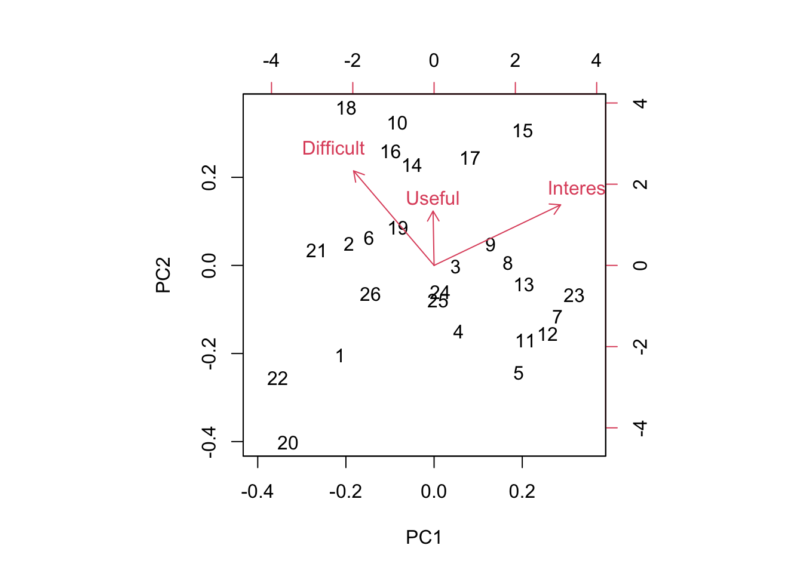

Week 14 Lab
=============

In lab we'll go through 

1. Some practice with PCA using the semester survey results

2. Some practice with GLMs using the semester survey results

There are a number of functions you could use in R to do principal components analysis. We will use the 'prcomp' function, but there is a very closely related function called 'princomp' as well as a function called 'principal' which is in the 'psych' package.


```r
readings<-read.csv("~/Dropbox/Biometry/Week 14 Multivariate analyses and Review/Week 14 Lab/Readings 2023.csv",header=T)

missing<-is.na(readings$Useful)|is.na(readings$Difficult)|is.na(readings$Interesting)
Useful<-aggregate(readings$Useful[!missing], by=list(Index=readings$Index[!missing]),FUN=mean)$x

Difficult<-aggregate(readings$Difficult[!missing], by=list(Index=readings$Index[!missing]),FUN=mean)$x

Interesting<-aggregate(readings$Interesting[!missing], by=list(Index=readings$Index[!missing]),FUN=mean)$x

#Length.means.readings<-aggregate(readings$Length[!missing], by=list(Index=readings$Index[!missing]),FUN=mean)$x

pca.result<-prcomp(~Useful+Interesting+Difficult,retx=T)
```

Before printing out the result, let's make sure everyone understands what I was doing with the aggregate commands, and how the 'prcomp' function input works. 

To print out a summary of the PCA, we use


```r
summary(pca.result)
```

```
## Importance of components:
##                           PC1    PC2     PC3
## Standard deviation     0.9046 0.4566 0.29753
## Proportion of Variance 0.7337 0.1869 0.07937
## Cumulative Proportion  0.7337 0.9206 1.00000
```

We see that PCA1 is associated with over 73% of the variation in responses. So, what is PCA1?


```r
pca.result$rotation
```

```
##                    PC1       PC2        PC3
## Useful       0.2565179 0.7697893  0.5844853
## Interesting  0.5521851 0.3796006 -0.7422904
## Difficult   -0.7932781 0.5131548 -0.3276918
```

PCA1 is an axis which describes papers that are more Interesting and less Difficult, with a very small weight towards papers that are Useful. In other words, a large positive PCA1 score would be associated with an interesting paper that was easy to read. Note that the principal components denote an axis, but the direction is arbitrary. Since no direction is implied by the sign, we do not interpret this as saying that most papers were interesting and easy. Instead we would say that the papers largely fall along a common axis in which Interesting/Easy to read papers are at one end, and Boring/Difficult to read papers are at the other end. (For now I am ignoring the smaller influence of Useful on PCA1.)

We can visualize this using the function 'biplot'


```r
biplot(pca.result)
```



Biplots take some getting used to, and when they have many more dimensions, they become increasingly difficult to interpret. However, papers high on PC1 are generally Interesting and Easy to read and papers low on PC1 are generally Boring and more Difficult to read. Papers high on PC2 are generally more Useful and slightly more Difficult and papers low on PC2 are generally less Useful but less Difficult to read. It's worth noting that there is a nice spread of papers in this bi-plot, so at least along these two axes, there were no real outliers. Also, keep in mind that since the PCA is picking up relative differences, it is not possible for all papers to end up in one corner of the plot. While of course we would want all papers to be highly Interesting and highly Useful, even if all papers ranked high on both measures overall, the PCA will identify axes of *differences* so there will always be some that show up as "relatively less Interesting" - does this make sense?

Which papers were highly positive on PC2 and also positive on PC1? These are papers that were Useful and also more Interesting than the average.


```r
readings[readings$Index==15,1][1]
```

```
## [1] "Siddhartha, R. D., E. B. Fowlkes, and B. Hoadley. 1989. Risk analysis of the space shuttle: Pre-challenger prediction of failure. Journal of the American Statistical Association 84(408): 945-957."
```

```r
readings[readings$Index==21,1][1]
```

```
## [1] "Aho, K., D. DeWayne, and T. Peterson. 2014. Model selection for ecologists: the worldviews of AIC and BIC. Ecology 95(3): 631-636."
```

```r
readings[readings$Index==4,1][1]
```

```
## [1] "Johnson, D.H. 2002. The role of hypothesis testing in wildlife science. The Journal of Wildlife Management 66(2): 272-276."
```

```r
readings[readings$Index==25,1][1]
```

```
## [1] "Johnson, J.B., and K.S. Omland. 2004. Model selection in ecology and evolution. TRENDS in Ecology and Evolution 19(2): 101-108."
```

I totally agree on the Siddhartha paper! Johnson's paper's also fall in this qudrant as well.

You can play around with this yourself and see why I added the [1] at the end. When I pull out the rows with the Index identified by the PCA, I get the list of all entries (since we had >1 team rating the papers) and so I only print the first one.

Which paper fell out along the Difficult axis?


```r
readings[readings$Index==22,1][1]
```

```
## [1] "Burnham et al. 2011. AIC model selection and multimodel inference in behavioral ecology: some background, observations, and comparisons. Behavior, Ecology, and Sociobiology 65: 23-35."
```

Burnham's AIC model selection paper. Also, 


```r
readings[readings$Index==6,1][1]
```

```
## [1] "Bender, R., and S. Lange. 2001. Adjusting for multiple testing – when and how? Journal of Clinical Epidemiology 54: 343-349."
```

Usually Bolker holds this honor! Bolker is often rated as difficult. I keep this chapter around because his thinking is so "spot on" and the material in his book will serve you well if you continue on doing quantitative modelling. I'm a little surprised to see Bender and Lange here, but every year is different.

The real quadrant that I investigate closely are papers that are considered Difficult but not all that Useful. Through this PCA exeercise, I have eliminated papers consistently falling into this corner. Let's see what 16 is...


```r
readings[readings$Index==16,1][1]
```

```
## [1] "Altman, N., and M. Krzywinski. 2015. Sources of variation. Nature Methods 12(1): 5-6. (optional)"
```

I'm surprised to see Altman here, as the Points of Significance papers are so short and I think quite well written. I think this probably means we just need to spend a bit of time going over this one next year.

One thing to keep in mind is that a PCA identifies *variation* in the dataset. It's worth putting these numbers in context of the overall means.


```r
mean(Useful)
```

```
## [1] 3.874055
```

```r
mean(Difficult)
```

```
## [1] 2.08303
```

```r
mean(Interesting)
```

```
## [1] 3.372958
```

So the average reading scored pretty high for being Useful and Interesting and was rated below average for Difficulty, so on the whole, I'm fairly pleased with these ratings.

You might be interested in how these ratings have changed over time (I was!). Let's start with the readings.


```r
library(readxl)
Biometry_change <- read_excel("_data/Biometry_change.xlsx")
fitR_U<-summary(lm(Biometry_change$R_U_mean~Biometry_change$Year))
fitR_U
```

```
## 
## Call:
## lm(formula = Biometry_change$R_U_mean ~ Biometry_change$Year)
## 
## Residuals:
##      Min       1Q   Median       3Q      Max 
## -0.36439 -0.26399  0.06366  0.16202  0.38224 
## 
## Coefficients:
##                       Estimate Std. Error t value Pr(>|t|)
## (Intercept)          -85.55852   51.82955  -1.651    0.150
## Biometry_change$Year   0.04416    0.02569   1.719    0.136
## 
## Residual standard error: 0.2946 on 6 degrees of freedom
## Multiple R-squared:   0.33,	Adjusted R-squared:  0.2183 
## F-statistic: 2.955 on 1 and 6 DF,  p-value: 0.1364
```

```r
plot(Biometry_change$Year,Biometry_change$R_U_mean,pch=15,xlab="Year",ylab="Mean Response (out of 5)",cex=2,ylim=c(1.5,4.5),main="Useful (black), Difficult (red), Interesting (green)")

for (i in 1:8)
{
  segments(x0=Biometry_change$Year[i], x1=Biometry_change$Year[i], y0=Biometry_change$R_U_mean[i]-2*Biometry_change$R_U_se[i],y1=Biometry_change$R_U_mean[i]+2*Biometry_change$R_U_se[i])
}

fitR_D<-summary(lm(Biometry_change$R_D_mean~Biometry_change$Year))
fitR_D
```

```
## 
## Call:
## lm(formula = Biometry_change$R_D_mean ~ Biometry_change$Year)
## 
## Residuals:
##      Min       1Q   Median       3Q      Max 
## -0.29893 -0.12886  0.03503  0.12404  0.31271 
## 
## Coefficients:
##                       Estimate Std. Error t value Pr(>|t|)
## (Intercept)          -39.63356   39.88751  -0.994    0.359
## Biometry_change$Year   0.02076    0.01977   1.050    0.334
## 
## Residual standard error: 0.2267 on 6 degrees of freedom
## Multiple R-squared:  0.1553,	Adjusted R-squared:  0.01454 
## F-statistic: 1.103 on 1 and 6 DF,  p-value: 0.334
```

```r
points(Biometry_change$Year,Biometry_change$R_D_mean,pch=15,xlab="Year",ylab="Mean Difficult",cex=2,col=2)
for (i in 1:8)
{
  segments(x0=Biometry_change$Year[i], x1=Biometry_change$Year[i], y0=Biometry_change$R_D_mean[i]-2*Biometry_change$R_D_se[i],y1=Biometry_change$R_D_mean[i]+2*Biometry_change$R_D_se[i],col=2)
}

fitR_I<-summary(lm(Biometry_change$R_I_mean~Biometry_change$Year))
fitR_I
```

```
## 
## Call:
## lm(formula = Biometry_change$R_I_mean ~ Biometry_change$Year)
## 
## Residuals:
##      Min       1Q   Median       3Q      Max 
## -0.19171 -0.11413 -0.03823  0.12481  0.21891 
## 
## Coefficients:
##                       Estimate Std. Error t value Pr(>|t|)  
## (Intercept)          -72.68056   29.30218  -2.480   0.0478 *
## Biometry_change$Year   0.03766    0.01452   2.593   0.0410 *
## ---
## Signif. codes:  0 '***' 0.001 '**' 0.01 '*' 0.05 '.' 0.1 ' ' 1
## 
## Residual standard error: 0.1665 on 6 degrees of freedom
## Multiple R-squared:  0.5284,	Adjusted R-squared:  0.4498 
## F-statistic: 6.724 on 1 and 6 DF,  p-value: 0.04105
```

```r
points(Biometry_change$Year,Biometry_change$R_I_mean,pch=15,xlab="Year",ylab="Mean Difficult",cex=2,col=3)
for (i in 1:8)
{
  segments(x0=Biometry_change$Year[i], x1=Biometry_change$Year[i], y0=Biometry_change$R_I_mean[i]-2*Biometry_change$R_I_se[i],y1=Biometry_change$R_I_mean[i]+2*Biometry_change$R_I_se[i],col=3)
}
```


So it looks like while the overall trend is towards readings that are more Interesting, more Difficult, and more Useful, the only one of these that is statistically significant is the trend towards more Interesting.

The problem sets show exactly the same trends, with no significant changes in Useful or Difficult but a significant trend towards ore Interesting problem sets.


```r
PS<-read.csv("~/Dropbox/Biometry/Week 14 Multivariate analyses and Review/Week 14 Lab/ProblemSets 2022.csv",header=T)

missing<-is.na(PS$Useful)|is.na(PS$Difficult)|is.na(PS$Interesting)

Useful.means.PS<-aggregate(PS$Useful[!missing], by=list(Index=PS$Week[!missing]),FUN=mean)$x

Difficult.means.PS<-aggregate(PS$Difficult[!missing], by=list(Week=PS$Week[!missing]),FUN=mean)$x

Interesting.means.PS<-aggregate(PS$Interesting[!missing], by=list(Week=PS$Week[!missing]),FUN=mean)$x

pca.result<-prcomp(~Useful.means.PS+Interesting.means.PS+Difficult.means.PS,data=PS,retx=T)
```

Notice that it has simply labeled them in order, so 7=Week #9 PS, 8=Week #10 PS, 9=Week #11 PS, 10=Week #12 PS, and 11=Week #13 PS.

To print out a summary of the PCA, we use


```r
summary(pca.result)
```

```
## Importance of components:
##                           PC1    PC2    PC3
## Standard deviation     0.8474 0.6995 0.2560
## Proportion of Variance 0.5641 0.3844 0.0515
## Cumulative Proportion  0.5641 0.9485 1.0000
```

We see that for the problem sets, PC1 is less dominant (56% of the variation). So, what is PCA1?


```r
pca.result$rotation
```

```
##                             PC1        PC2        PC3
## Useful.means.PS      -0.7894404 -0.1122903 -0.6034689
## Interesting.means.PS -0.4937346 -0.4679620  0.7329650
## Difficult.means.PS    0.3647054 -0.8765857 -0.3139865
```

PC1 combines all three factors with the largest component being focused on "Useful", and the axis divides problem sets judged Useless/Boring/Difficult and those that are Useful/Interesting/Easy. (Reminder: the signs of the PCs is *arbitrary*, so the signs on the rotation could have all be flipped.) Looking across all the PC axes, we want papers that are low (negative) on PC1 and low (negative) on PC2 (though these are also slightly less Useful). PC3 is a toss up, because that axis represents a trade-off between Useful and Interesting.


```r
biplot(pca.result)
```


We can see that problem set 6 is the one that is really driving variation here! (As always) If we were to eliminate week 6, the others are all varying primarily on PC2.

Again, looking at the means:


```r
mean(Useful.means.PS)
```

```
## [1] 4.348485
```

```r
mean(Difficult.means.PS)
```

```
## [1] 3.643939
```

```r
mean(Interesting.means.PS)
```

```
## [1] 4.155303
```

The problem sets overall rated as being very Useful and Interesting but also sort of Difficult. 

How have things changed over time?


```r
fitPS_U<-summary(lm(Biometry_change$PS_U_mean~Biometry_change$Year))
fitPS_U
```

```
## 
## Call:
## lm(formula = Biometry_change$PS_U_mean ~ Biometry_change$Year)
## 
## Residuals:
##      Min       1Q   Median       3Q      Max 
## -0.35934 -0.10749 -0.06325  0.05777  0.54458 
## 
## Coefficients:
##                       Estimate Std. Error t value Pr(>|t|)
## (Intercept)          -73.58452   49.66576  -1.482    0.189
## Biometry_change$Year   0.03848    0.02461   1.563    0.169
## 
## Residual standard error: 0.2823 on 6 degrees of freedom
## Multiple R-squared:  0.2894,	Adjusted R-squared:  0.171 
## F-statistic: 2.444 on 1 and 6 DF,  p-value: 0.169
```

```r
plot(Biometry_change$Year,Biometry_change$PS_U_mean,pch=15,xlab="Year",ylab="Mean Response (out of 5)",cex=2,ylim=c(2,5),main="Useful (black), Difficult (red), Interesting (green)")

for (i in 1:8)
{
segments(x0=Biometry_change$Year[i], x1=Biometry_change$Year[i], y0=Biometry_change$PS_U_mean[i]-2*Biometry_change$PS_U_se[i],y1=Biometry_change$PS_U_mean[i]+2*Biometry_change$PS_U_se[i])
}

fitPS_D<-summary(lm(Biometry_change$PS_D_mean~Biometry_change$Year))
fitPS_D
```

```
## 
## Call:
## lm(formula = Biometry_change$PS_D_mean ~ Biometry_change$Year)
## 
## Residuals:
##      Min       1Q   Median       3Q      Max 
## -0.40591 -0.18510  0.03417  0.16826  0.38526 
## 
## Coefficients:
##                       Estimate Std. Error t value Pr(>|t|)
## (Intercept)          -30.20979   50.25999  -0.601    0.570
## Biometry_change$Year   0.01655    0.02491   0.664    0.531
## 
## Residual standard error: 0.2856 on 6 degrees of freedom
## Multiple R-squared:  0.0685,	Adjusted R-squared:  -0.08675 
## F-statistic: 0.4412 on 1 and 6 DF,  p-value: 0.5312
```

```r
points(Biometry_change$Year,Biometry_change$PS_D_mean,pch=15,xlab="Year",ylab="Mean Difficult",cex=2,col=2)
for (i in 1:8)
{
  segments(x0=Biometry_change$Year[i], x1=Biometry_change$Year[i], y0=Biometry_change$PS_D_mean[i]-2*Biometry_change$PS_D_se[i],y1=Biometry_change$PS_D_mean[i]+2*Biometry_change$PS_D_se[i],col=2)
}


fitPS_I<-summary(lm(Biometry_change$PS_I_mean~Biometry_change$Year))
fitPS_I
```

```
## 
## Call:
## lm(formula = Biometry_change$PS_I_mean ~ Biometry_change$Year)
## 
## Residuals:
##      Min       1Q   Median       3Q      Max 
## -0.44739 -0.17128 -0.01723  0.15788  0.44258 
## 
## Coefficients:
##                        Estimate Std. Error t value Pr(>|t|)  
## (Intercept)          -137.90978   55.40599  -2.489   0.0472 *
## Biometry_change$Year    0.07004    0.02746   2.551   0.0435 *
## ---
## Signif. codes:  0 '***' 0.001 '**' 0.01 '*' 0.05 '.' 0.1 ' ' 1
## 
## Residual standard error: 0.3149 on 6 degrees of freedom
## Multiple R-squared:  0.5202,	Adjusted R-squared:  0.4403 
## F-statistic: 6.506 on 1 and 6 DF,  p-value: 0.04345
```

```r
points(Biometry_change$Year,Biometry_change$PS_I_mean,pch=15,xlab="Year",ylab="Mean Difficult",cex=2,col=3)
for (i in 1:8)
{
  segments(x0=Biometry_change$Year[i], x1=Biometry_change$Year[i], y0=Biometry_change$PS_I_mean[i]-2*Biometry_change$PS_I_se[i],y1=Biometry_change$PS_I_mean[i]+2*Biometry_change$PS_I_se[i],col=3)
}
```


Interestingly, this is the same pattern seen for the Readings, with everything getting slightly (but not significantly) more Useful and Difficult over time but statistically significantly more Interesting.

Missing at random - practice with GLMs
--------------------------------------

One of the things we can do with this dataset is to ask whether data were missing at random, since not all readings were given ratings.


```r
missing<-is.na(readings$Useful)|is.na(readings$Difficult)|is.na(readings$Interesting)
Useful<-aggregate(readings$Useful[!missing], by=list(Index=readings$Index[!missing]),FUN=mean)$x

Difficult<-aggregate(readings$Difficult[!missing], by=list(Index=readings$Index[!missing]),FUN=mean)$x

Interesting<-aggregate(readings$Interesting[!missing], by=list(Index=readings$Index[!missing]),FUN=mean)$x

Length.means.readings<-aggregate(readings$Length[!missing], by=list(Index=readings$Index[!missing]),FUN=mean)$x
```

One could ask the question, are these data missing at random? In the problem set for Week #13, we completed the dataset using random imputation. In other words, we assumed that data were missing at random and we drew with replacement from the other values to replace missing datapoints. However, in this case, it seems likely that data are not missing at random. I suspect that papers were not evaluated because no one read them, and that something about the papers may predict whether the papers were read or not. We can answer this question by constructing a model for "missingness" which assumes that the probability of being evaluated is distributed as Binom(n,p) where p is the probability of being evaluated (and presumably, of having been read in the first place).

First, I need to go through the data and figure out how many times a paper was evaluated. 


```r
num.missing<-vector(length=max(readings$Index))
for (i in 1:max(readings$Index))
{
  num.missing.useful<-sum(as.numeric(is.na(readings$Useful[readings$Index==i])))
  num.missing.difficult<-sum(as.numeric(is.na(readings$Difficult[readings$Index==i])))
  num.missing.interesting<-sum(as.numeric(is.na(readings$Interesting[readings$Index==i])))
  max.missing<-max(num.missing.useful,num.missing.difficult,num.missing.interesting)
  num.missing[i]<-max.missing
}
```

For simplicity, I am considering "evaluated" as evaluated for all three categories (Useful, Difficult, and Interesting).

Now I use a Binomial GLM to model the probability of being evaluated as a function of Useful, Interesting, and Difficult (as rated by the other groups). Note that there were 11 groups total, so n=11.


```r
fit<-glm(cbind(11-num.missing,num.missing)~Useful+Difficult+Interesting,family="binomial")
summary(fit)
```

```
## 
## Call:
## glm(formula = cbind(11 - num.missing, num.missing) ~ Useful + 
##     Difficult + Interesting, family = "binomial")
## 
## Deviance Residuals: 
##     Min       1Q   Median       3Q      Max  
## -1.8889   0.2226   0.3517   0.5553   1.0689  
## 
## Coefficients:
##             Estimate Std. Error z value Pr(>|z|)  
## (Intercept)  -8.9095     4.7986  -1.857   0.0634 .
## Useful        1.8824     1.0529   1.788   0.0738 .
## Difficult     0.6784     0.8084   0.839   0.4013  
## Interesting   1.3888     1.2207   1.138   0.2553  
## ---
## Signif. codes:  0 '***' 0.001 '**' 0.01 '*' 0.05 '.' 0.1 ' ' 1
## 
## (Dispersion parameter for binomial family taken to be 1)
## 
##     Null deviance: 33.997  on 34  degrees of freedom
## Residual deviance: 20.274  on 31  degrees of freedom
## AIC: 41.242
## 
## Number of Fisher Scoring iterations: 6
```

None of the covariates are significant. 

We might suspect a high degree of multicollinearity among the predictors. We can use PCA to create new orthogonal covariates which (more efficiently) capture the variability in the survey results. 

I will rerun the PCA for the readings. 


```r
pca.result<-prcomp(~Useful+Interesting+Difficult,retx=T)
summary(pca.result)
```

```
## Importance of components:
##                           PC1    PC2     PC3
## Standard deviation     0.9046 0.4566 0.29753
## Proportion of Variance 0.7337 0.1869 0.07937
## Cumulative Proportion  0.7337 0.9206 1.00000
```

```r
pca.result$rotation
```

```
##                    PC1       PC2        PC3
## Useful       0.2565179 0.7697893  0.5844853
## Interesting  0.5521851 0.3796006 -0.7422904
## Difficult   -0.7932781 0.5131548 -0.3276918
```

PCA1 captures about 73% of the variability, so we try using just PCA1 in our GLM. 


```r
fit<-glm(cbind(11-num.missing,num.missing)~pca.result$x[,1],family="binomial")
summary(fit)
```

```
## 
## Call:
## glm(formula = cbind(11 - num.missing, num.missing) ~ pca.result$x[, 
##     1], family = "binomial")
## 
## Deviance Residuals: 
##     Min       1Q   Median       3Q      Max  
## -2.0307   0.3584   0.5512   0.6803   1.2636  
## 
## Coefficients:
##                   Estimate Std. Error z value Pr(>|z|)    
## (Intercept)         4.0506     0.4411   9.182   <2e-16 ***
## pca.result$x[, 1]   0.9334     0.4302   2.170     0.03 *  
## ---
## Signif. codes:  0 '***' 0.001 '**' 0.01 '*' 0.05 '.' 0.1 ' ' 1
## 
## (Dispersion parameter for binomial family taken to be 1)
## 
##     Null deviance: 33.997  on 34  degrees of freedom
## Residual deviance: 28.604  on 33  degrees of freedom
## AIC: 45.572
## 
## Number of Fisher Scoring iterations: 6
```

Aha! So none of the individual covariates are statistically significant, but in part this is because they are co-linear and so the variances are inflated. When we use the first PCA axis, the model does show a statistically significant trend between papers that are Useful, Interesting, and Easy and the probability that the paper was read.

Is there an effect of paper length to consider? After all, that's probably the most salient feature of a paper when you first download it.


```r
fit<-glm(cbind(11-num.missing,num.missing)~Length.means.readings,family="binomial")
```

```
## Warning: glm.fit: fitted probabilities numerically 0 or 1 occurred
```

```r
summary(fit)
```

```
## 
## Call:
## glm(formula = cbind(11 - num.missing, num.missing) ~ Length.means.readings, 
##     family = "binomial")
## 
## Deviance Residuals: 
##      Min        1Q    Median        3Q       Max  
## -1.58226   0.00104   0.00981   0.10240   0.95209  
## 
## Coefficients:
##                       Estimate Std. Error z value Pr(>|z|)  
## (Intercept)            -0.7617     1.3958  -0.546   0.5853  
## Length.means.readings   1.3101     0.6014   2.178   0.0294 *
## ---
## Signif. codes:  0 '***' 0.001 '**' 0.01 '*' 0.05 '.' 0.1 ' ' 1
## 
## (Dispersion parameter for binomial family taken to be 1)
## 
##     Null deviance: 33.9971  on 34  degrees of freedom
## Residual deviance:  6.4514  on 33  degrees of freedom
## AIC: 23.419
## 
## Number of Fisher Scoring iterations: 10
```

Yes, but not in the direction we would anticipate. Longer papers are more likely to be read than shorter papers. Digging into the data a bit, the papers that were not rated and presumably not read were the very short Points of Significance papers, so this is certainly driving this unanticipated response. We have assumed throughout that these readings are all independent data points, but can you see why that might not be the case here? If students decide not to read the Points of Significance papers, that will impact all of those papers, and it might be that independent decisions are not being made for each one individually. (They were also assigned in the same week, so perhaps that plays a role as well.)

Finally, a word about grades
--------------------------------------


The question came up as to how grades have changed over time. Behold, the grade distribution over time (A=4, A-=3.67, B+=3.33, B=3, etc.).


```r
year<-c(2012,2013,2014,2015,2016,2017,2018,2020,2021,2022)
mean.grade<-c(3.37,2.88,2.62,3.45,3.11,3.22,3.00,3.25,2.45,2.47)
sem.grade<-c(0.15,0.21,0.26,0.13,0.18,0.19,0.23,0.20,0.33,0.32)
plot(year,mean.grade,pch=15,xlab="Year",ylab="Mean grade",cex=2,col=1,ylim=c(1.5,4))
points(year[c(8,9)],mean.grade[c(8,9)],pch=15,cex=2,col=2,ylim=c(1.5,4))
for (i in 1:length(mean.grade))
{
segments(x0=year[i], x1=year[i], y0=mean.grade[i]-2*sem.grade[i],y1=mean.grade[i]+2*sem.grade[i],col=1)
}
segments(x0=year[8], x1=year[8], y0=mean.grade[8]-2*sem.grade[8],y1=mean.grade[8]+2*sem.grade[8],col=2)
segments(x0=year[9], x1=year[9], y0=mean.grade[9]-2*sem.grade[9],y1=mean.grade[9]+2*sem.grade[9],col=2)
```


