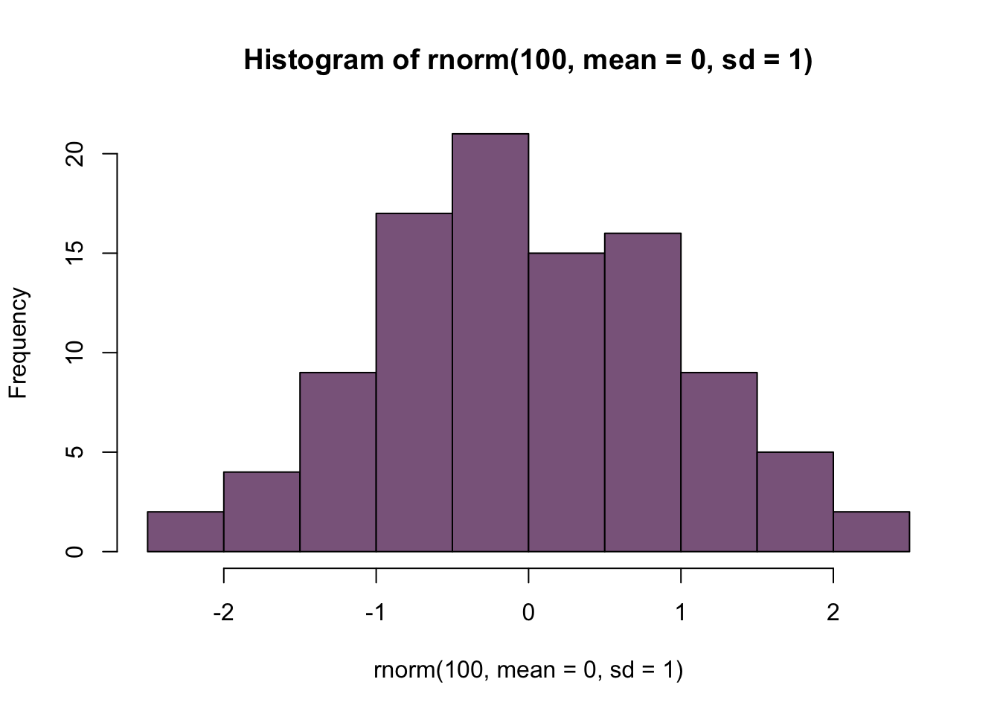
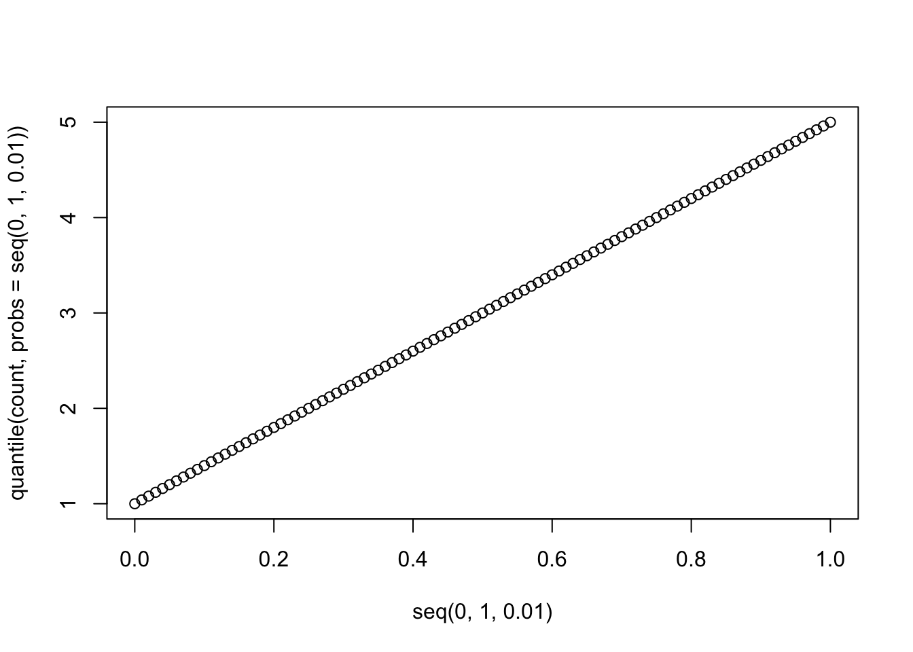
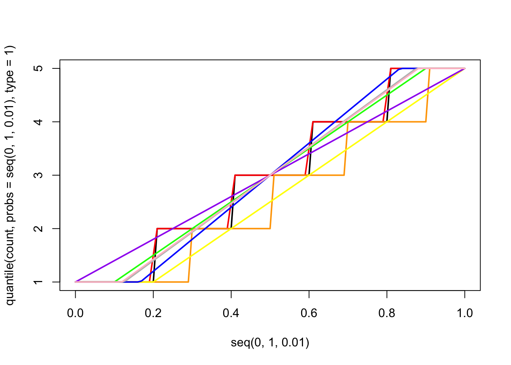
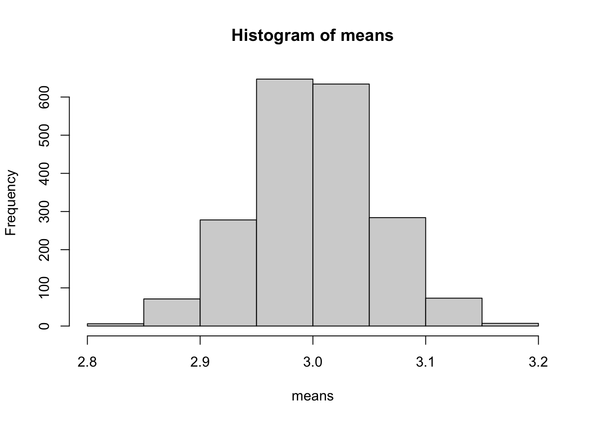
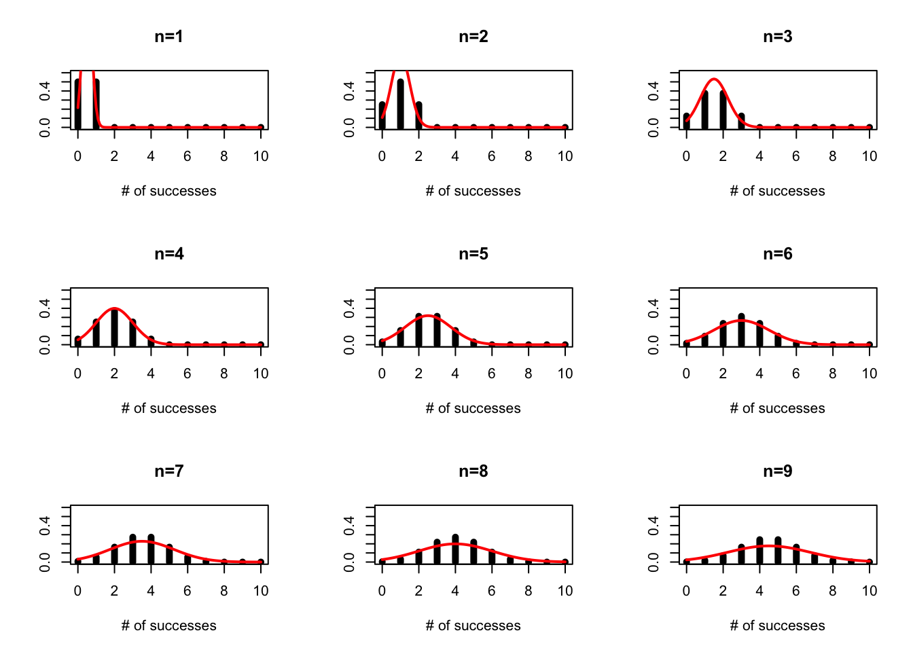
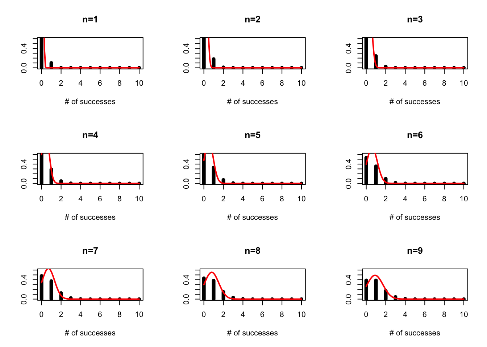
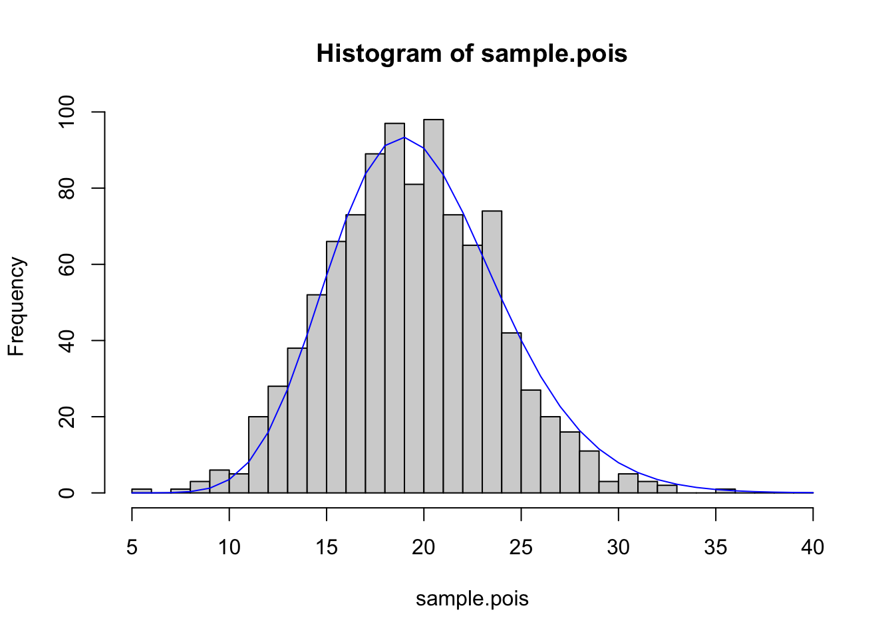
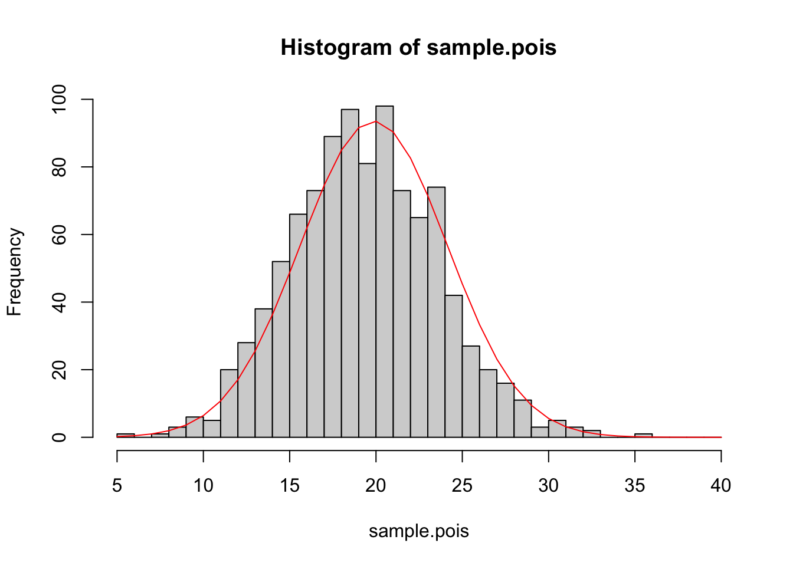
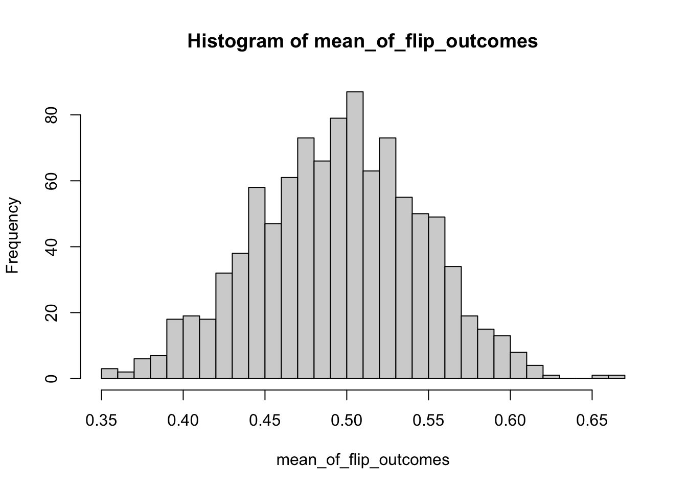
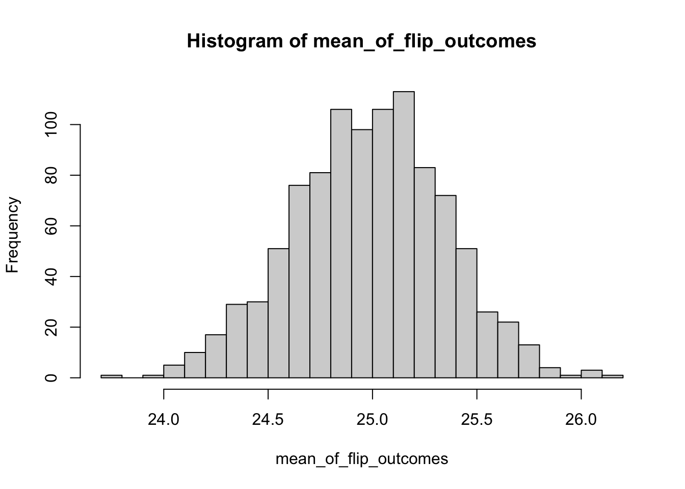

Week 3 Lab
========================================================

Exploring the univariate distributions with R
-----------------------------------

As a review of last week's lecture, we can ask a number of things about a statistical distribution:

1.  Look at the probability density function: What is the probability of obtaining X (discrete) or a number in the interval (X1,X2) (continuous)?
2.	Look at the cumulative probability: What is the probability of obtaining $X < X^{*}$?
3.	Look at the quantiles of the distributions: The inverse of the cumulative distribution - What is $X^{*}$ such that the cumulative probability of obtaining $X < X^{*}$ is the specified quantile? Quantiles can have any size: Quartiles, deciles, percentiles, etc.
4.	Look at samples from the distribution: What does the distribution "look like"?

There are four basic functions in R:                    
d = probability density function                      
p = cumulative probability          
q = quantiles of the distribution              
r = random numbers generated from the distribution            

We combine these letters with the function names to make all the function calls: For example,

Normal distribution: dnorm, pnorm, qnorm, rnorm           
Log-normal distribution: dlnorm, plnorm, qlnorm, rlnorm        
Poisson: dpois, ppois, qpois, rpois           

First we'll play around with the normal distribution because we know what the answers should be. Then we'll move onto distributions we may be less familiar with:

First, lets draw a couple of random values from the standard normal. We can take 100 random draws from the Standard Normal N(0,1) using the R function 'rnorm'.


```r
data<-rnorm(100,mean=0,sd=1)
head(data)
```

```
## [1]  1.74765117 -0.25783258  0.79906831  0.59071186  0.31950945  0.02606016
```

Note that you could have left off the "mean" and "sd" since R knows the order of inputs, that is you could simply write 


```r
head(rnorm(100,0,1)) 
```

```
## [1] -0.6634890 -1.2405381  2.8424101  0.3887692 -0.5350299 -2.0187744
```

or even


```r
head(rnorm(100)) 
```

```
## [1]  0.14746705 -1.26745932 -0.37705203 -0.50536389  0.02728185 -0.09581116
```

since mean=0, sd=1 is the default. Until you are 100% comfortable with R, its better to leave all the options spelled out. 

Make a histogram of data


```r
hist(data)
```


Play around with the hist command using different numbers of 'breaks' or try leaving that option off altogether. You will get a sense for how many breaks you need for the histogram to "look right" but I prefer to use more breaks than R defaults to. Also, compare this last plot with this one:


```r
hist(data,freq=FALSE)
```


To really play around with these distributions, lets combine these commands into a single command:


```r
hist(rnorm(100,mean=0,sd=1),col="plum4")
```



Play around with different means and sd and convince yourself that 'rnorm' really does work. You can look at the graphics options by doing ?hist and you can explore the list of named colors by typing

```
colors()
```

What happens if you add the flag "plot=F"?


```r
hist(rnorm(1000,mean=0,sd=1),plot=F)
```

```
## $breaks
##  [1] -4.0 -3.5 -3.0 -2.5 -2.0 -1.5 -1.0 -0.5  0.0  0.5  1.0  1.5  2.0  2.5  3.0
## [16]  3.5  4.0
## 
## $counts
##  [1]   1   0   8  15  37  96 145 194 192 150  88  56  12   2   2   2
## 
## $density
##  [1] 0.002 0.000 0.016 0.030 0.074 0.192 0.290 0.388 0.384 0.300 0.176 0.112
## [13] 0.024 0.004 0.004 0.004
## 
## $mids
##  [1] -3.75 -3.25 -2.75 -2.25 -1.75 -1.25 -0.75 -0.25  0.25  0.75  1.25  1.75
## [13]  2.25  2.75  3.25  3.75
## 
## $xname
## [1] "rnorm(1000, mean = 0, sd = 1)"
## 
## $equidist
## [1] TRUE
## 
## attr(,"class")
## [1] "histogram"
```

Note that you can assign that to a variable and then use those results later in a calculation or another plot.

Next, lets play around with pnorm


```r
quantiles<-seq(-3.5,3.5,0.01) #These are the quantiles
density<-dnorm(quantiles,mean=0,sd=1) #dnorm gives the pdf for a given quantile
plot(quantiles,density,type="l",ylab="Probability density")
```


This is the probability density function for the Standard Normal. (We are getting a little ahead of ourselves because we won't discuss graphics until next week, but this syntax is fairly straightforward.)

Let's use the same vector 'quantiles' and try the function pnorm:


```r
cumulative<-pnorm(quantiles,mean=0,sd=1)
plot(quantiles,cumulative,type="l",ylab="Probability")
```


This gives us the cumulative distribution function!

Finally, lets look at qnorm


```r
probability<-seq(0,1,0.001)
quantiles<-qnorm(probability,mean=0,sd=1)
plot(probability,quantiles,type="l",ylab="Quantiles")
```


This plots the quantiles for each probability between 0 and 1. In other words, what value $Y^{*}$ is associated with the cumulative probability of $X^{*}$. Lets make sure this makes sense by plotting on top of this line another representing the quantiles for a normal distribution with smaller variance


```r
quantiles2<- qnorm(probability,mean=0,sd=0.2)
plot(probability,quantiles,type="l",ylab="Quantiles")
lines(probability,quantiles2,col="red")
```


Notice that because the variance of the new distribution is smaller, you get from a cumulative probability of 0 to 1 over a smaller range of values.

Now the issue of quantiles gets a bit complicated when we consider discrete distributions. A nice online post on this can be found [here](https://beta.boost.org/doc/libs/1_36_0/libs/math/doc/sf_and_dist/html/math_toolkit/policy/pol_tutorial/understand_dis_quant.html).

Let's consider data drawn from a very simple fake dataset and plot the quantiles.


```r
count<-c(1,2,3,4,5)
plot(seq(0,1,0.01),quantile(count,probs=seq(0,1,0.01)))
```



This is confusing because the default definition of the quantiles here makes it look like the data are continuous and non-integer values are possible, but the actual data are discrete. In other words, if you asked what the "10th percentile" of this data were, this plot tells you that the 10th percentile is ~1.5, but that's not even a value in the original dataset. This behavior comes about because of the ambiguity described in the blog post above. It turns out there are at least 9 ways to define quantiles for discrete data, and you can see a decription of them [here](https://stat.ethz.ch/R-manual/R-devel/library/stats/html/quantile.html) and [here](https://blogs.sas.com/content/iml/2017/05/24/definitions-sample-quantiles.html). The default behavior in R is to use the "type 7" quantile, which is a weighted average of the two closest values.

We can see them all plotted together as follows:


```r
count<-c(1,2,3,4,5)
plot(seq(0,1,0.01),quantile(count,probs=seq(0,1,0.01),type=1),typ="l",lwd=2)
lines(seq(0,1,0.01),quantile(count,probs=seq(0,1,0.01),type=2),col="red",lwd=2)
lines(seq(0,1,0.01),quantile(count,probs=seq(0,1,0.01),type=3),col="orange",lwd=2)
lines(seq(0,1,0.01),quantile(count,probs=seq(0,1,0.01),type=4),col="yellow",lwd=2)
lines(seq(0,1,0.01),quantile(count,probs=seq(0,1,0.01),type=5),col="green",lwd=2)
lines(seq(0,1,0.01),quantile(count,probs=seq(0,1,0.01),type=6),col="blue",lwd=2)
lines(seq(0,1,0.01),quantile(count,probs=seq(0,1,0.01),type=7),col="purple",lwd=2)
lines(seq(0,1,0.01),quantile(count,probs=seq(0,1,0.01),type=8),col="gray",lwd=2)
lines(seq(0,1,0.01),quantile(count,probs=seq(0,1,0.01),type=9),col="pink",lwd=2)
```



Standard deviation vs. Standard error
-------------------------------------

Many people struggle with the distinction between the standard deviation of a sample (or a population), and the standard error of the mean of the sample (or population). The standard deviation is a measure of the average spread of the data. Since the standard deviation is a measure of the average spread of the data, adding more data does not appreciably change the standard deviation. (*Make sure this makes sense!*)

The standard error can be understood as follows: **<span style="color: orangered;">If you repeated your experiment many times, and calculated the mean of each of the samples (one sample from each "experiment"), the standard deviation of the means would represent the uncertainty in the estimate of the mean coming from any one sample.</span>** The standard deviation of those means is called the standard error of the mean (or SEM). The SEM decreases as the size of each sample increases because each sample is now more representative of the underlying distribution.

More precisely, **<span style="color: orangered;">the standard error is the standard deviation of the sampling distribution of a statistic</span>**. Standard errors can be calculated for any statistic. For example, if we fit a Beta($\alpha$,$\beta$) distribution to a dataset, we want to estimate the parameter values $\hat{\alpha}$ and $\hat{\beta}$ **and** thier standard errors, which we might denote s.e.$_{\hat{\alpha}}$ and s.e.$_{\hat{\beta}}$. 

**<span style="color: green;">Checkpoint #1: Does everyone in your group understand the definition of a standard error?</span>**

We can use the Poisson distribution to illustrate the difference between a standard deviation of a distribution and the standard deviation of the mean:

First we want to plot the distribution for three different sample sizes:


```r
par(mfrow=c(3,1))  #Use ?par to see what this command does - more on this later
sample1<-rpois(1000,lambda=3)	
sample2<-rpois(10000,lambda=3)
sample3<-rpois(100000,lambda=3)
hist(sample1)
hist(sample2)
hist(sample3)
```


```r
sd(sample1)
```

```
## [1] 1.69525
```

```r
sd(sample2)
```

```
## [1] 1.713554
```

```r
sd(sample3)
```

```
## [1] 1.732784
```

Notice that the standard deviation has not appreciably changed as we have increased the sample size.

Now lets run some code to calculate the standard error of the mean: 


```r
sample.size<-1000
means<-c()
for (i in 1:2000)
 {
  means<-c(means,mean(rpois(sample.size,lambda=3)))
 }
hist(means)
```



```r
s.e.1<-sqrt(var(rpois(sample.size,lambda=3))/sample.size)
s.e.2<-sd(means)
s.e.1
```

```
## [1] 0.05511766
```

```r
s.e.2
```

```
## [1] 0.05514545
```

Note that the number of experiments I looped through (2000 in this case) is not relevant. It just has to be big enough that you get a sense of what the distribution of means looks like. Now go back and modify the code so that sample.size=10000. 

**<span style="color: green;">Checkpoint #2: How does increasing the sample size change the result?</span>**

On Tuesday we discussed the probability mass function for the binomial. While an individual flip of the coin can be thought of as a success/failure, the binomial is answering the question "How many succesess do I expect if I try n times."

We can plot this for varying numbers of trials assuming p=0.5


```r
par(mfrow=c(3,3))
p=0.5
plot(seq(0,10),dbinom(x=seq(0,10),size=1,prob=p),typ="h",lwd=5,xlab="# of successes",ylab="",main="n=1",ylim=c(0,0.6))
lines(seq(0,10,0.1),dnorm(seq(0,10,0.1),1*p,1*p*(1-p)),col="red",lwd=2)
plot(seq(0,10),dbinom(x=seq(0,10),size=2,prob=p),typ="h",lwd=5,xlab="# of successes",ylab="",main="n=2",ylim=c(0,0.6))
lines(seq(0,10,0.1),dnorm(seq(0,10,0.1),2*p,2*p*(1-p)),col="red",lwd=2)
plot(seq(0,10),dbinom(x=seq(0,10),size=3,prob=p),typ="h",lwd=5,xlab="# of successes",ylab="",main="n=3",ylim=c(0,0.6))
lines(seq(0,10,0.1),dnorm(seq(0,10,0.1),3*p,3*p*(1-p)),col="red",lwd=2)
plot(seq(0,10),dbinom(x=seq(0,10),size=4,prob=p),typ="h",lwd=5,xlab="# of successes",ylab="",main="n=4",ylim=c(0,0.6))
lines(seq(0,10,0.1),dnorm(seq(0,10,0.1),4*p,4*p*(1-p)),col="red",lwd=2)
plot(seq(0,10),dbinom(x=seq(0,10),size=5,prob=p),typ="h",lwd=5,xlab="# of successes",ylab="",main="n=5",ylim=c(0,0.6))
lines(seq(0,10,0.1),dnorm(seq(0,10,0.1),5*p,5*p*(1-p)),col="red",lwd=2)
plot(seq(0,10),dbinom(x=seq(0,10),size=6,prob=p),typ="h",lwd=5,xlab="# of successes",ylab="",main="n=6",ylim=c(0,0.6))
lines(seq(0,10,0.1),dnorm(seq(0,10,0.1),6*p,6*p*(1-p)),col="red",lwd=2)
plot(seq(0,10),dbinom(x=seq(0,10),size=7,prob=p),typ="h",lwd=5,xlab="# of successes",ylab="",main="n=7",ylim=c(0,0.6))
lines(seq(0,10,0.1),dnorm(seq(0,10,0.1),7*p,7*p*(1-p)),col="red",lwd=2)
plot(seq(0,10),dbinom(x=seq(0,10),size=8,prob=p),typ="h",lwd=5,xlab="# of successes",ylab="",main="n=8",ylim=c(0,0.6))
lines(seq(0,10,0.1),dnorm(seq(0,10,0.1),8*p,8*p*(1-p)),col="red",lwd=2)
plot(seq(0,10),dbinom(x=seq(0,10),size=9,prob=p),typ="h",lwd=5,xlab="# of successes",ylab="",main="n=9",ylim=c(0,0.6))
lines(seq(0,10,0.1),dnorm(seq(0,10,0.1),9*p,9*p*(1-p)),col="red",lwd=2)
```



and we can see how this might change for p=0.1


```r
par(mfrow=c(3,3))
p=0.1
plot(seq(0,10),dbinom(x=seq(0,10),size=1,prob=p),typ="h",lwd=5,xlab="# of successes",ylab="",main="n=1",ylim=c(0,0.6))
lines(seq(0,10,0.1),dnorm(seq(0,10,0.1),1*p,1*p*(1-p)),col="red",lwd=2)
plot(seq(0,10),dbinom(x=seq(0,10),size=2,prob=p),typ="h",lwd=5,xlab="# of successes",ylab="",main="n=2",ylim=c(0,0.6))
lines(seq(0,10,0.1),dnorm(seq(0,10,0.1),2*p,2*p*(1-p)),col="red",lwd=2)
plot(seq(0,10),dbinom(x=seq(0,10),size=3,prob=p),typ="h",lwd=5,xlab="# of successes",ylab="",main="n=3",ylim=c(0,0.6))
lines(seq(0,10,0.1),dnorm(seq(0,10,0.1),3*p,3*p*(1-p)),col="red",lwd=2)
plot(seq(0,10),dbinom(x=seq(0,10),size=4,prob=p),typ="h",lwd=5,xlab="# of successes",ylab="",main="n=4",ylim=c(0,0.6))
lines(seq(0,10,0.1),dnorm(seq(0,10,0.1),4*p,4*p*(1-p)),col="red",lwd=2)
plot(seq(0,10),dbinom(x=seq(0,10),size=5,prob=p),typ="h",lwd=5,xlab="# of successes",ylab="",main="n=5",ylim=c(0,0.6))
lines(seq(0,10,0.1),dnorm(seq(0,10,0.1),5*p,5*p*(1-p)),col="red",lwd=2)
plot(seq(0,10),dbinom(x=seq(0,10),size=6,prob=p),typ="h",lwd=5,xlab="# of successes",ylab="",main="n=6",ylim=c(0,0.6))
lines(seq(0,10,0.1),dnorm(seq(0,10,0.1),6*p,6*p*(1-p)),col="red",lwd=2)
plot(seq(0,10),dbinom(x=seq(0,10),size=7,prob=p),typ="h",lwd=5,xlab="# of successes",ylab="",main="n=7",ylim=c(0,0.6))
lines(seq(0,10,0.1),dnorm(seq(0,10,0.1),7*p,7*p*(1-p)),col="red",lwd=2)
plot(seq(0,10),dbinom(x=seq(0,10),size=8,prob=p),typ="h",lwd=5,xlab="# of successes",ylab="",main="n=8",ylim=c(0,0.6))
lines(seq(0,10,0.1),dnorm(seq(0,10,0.1),8*p,8*p*(1-p)),col="red",lwd=2)
plot(seq(0,10),dbinom(x=seq(0,10),size=9,prob=p),typ="h",lwd=5,xlab="# of successes",ylab="",main="n=9",ylim=c(0,0.6))
lines(seq(0,10,0.1),dnorm(seq(0,10,0.1),9*p,9*p*(1-p)),col="red",lwd=2)
```



If you look back at our notes from Tuesday, we see that the gamma and the Poisson distributions look quite similar (ignoring that one is discrete and the other continuous). We can use R to show us the differences are:

First we will draw from the Poisson distribution, then we will use R's very handy function 'fitdistr' to fit the gamma distribution to that data and compare. We haven't yet covered HOW this function works, but for now let's just take for granted that this function is able to find the parameter estimates that will give you the best fit to your data.

First, install the library 'MASS'. 


```r
library(MASS) #this loads the library into the workspace
sample.pois<-rpois(1000,lambda=20)
fit<-fitdistr(sample.pois,"gamma",start=list(shape=20,scale=1))
fit
```

```
##      shape        scale   
##   19.7295655    1.0325620 
##  ( 0.8748910) ( 0.0463742)
```

(Sometimes you get a warnings message about NAs when using fitdistr. The best explanation I can find says that this means R "encountered some difficulties during fitting". I can find no difference in the fits when you get the warning and when you don't, and the same sample.pois will sometimes give a warning and sometimes not, so it appears independent of the data itself. Do not ignore warnings() in R but don't be paralized by them, especially in a context where R is searching parameter space during an optimization. Be sure to search around for an explanation and make sure you are confident that R is still giving reasonable answers.)

Notice that we are fitting a gamma distribution to this data, and we specify what distribution we want to fit using the name of the distribution in quotes. *Remember that rgamma can take as inputs shape,scale or shape,rate=1/scale. I am using scale as the input because it is consistent with the way I introduced the gamma distribution in class. Be aware that some people will use rate and some will use scale and you always have to check.* 

When we print the object fit, we get the estimates and the standard errors, but at first it isn't obvious how to extract the estimates (and errors) so we can use them in other calculations.

We start by using the function names to "get inside" this object and see what it is made up of.


```r
names(fit)
```

```
## [1] "estimate" "sd"       "vcov"     "loglik"   "n"
```

We now look at


```r
fit$estimate
```

```
##     shape     scale 
## 19.729566  1.032562
```

and notice that we can pull out the two estimates as


```r
fit$estimate[1]
```

```
##    shape 
## 19.72957
```

```r
fit$estimate[2]
```

```
##    scale 
## 1.032562
```

Now we want to plot the data, and the best fit line:


```r
x.vals<- seq(from=5,to=40,by=1)
hist(sample.pois,breaks=x.vals)
lines(x.vals,dgamma(x.vals,shape=fit$estimate[1],scale=fit$estimate[2])*1000,col="blue")
```



Two things to note here:
1. I created x.vals just as a mechanism for plotting a relatively smooth line for the best-fit distribution
2. I multiplied for 1000 because I had originally drawn 1000 values, and this puts my best-fit line on the same scale as the histogram.

NOTE: We can guess at starting values by making sure the mean and variance of the gamma match the mean and variance of the data. This method is an example of "moment matching". In other words, we take two distributions and get a close fit between them by requiring that they have the same mean and, if possible, the same variance.

We can see that if we generate data from a Poisson, it can be fit very well by a gamma distribution. It can also be fit quite well by a Normal distribution


```r
hist(sample.pois,breaks=x.vals)
fit2<-fitdistr(sample.pois,"normal")
lines(x.vals,dnorm(x.vals,mean=fit2$estimate[1],sd=fit2$estimate[2])*1000,col="red")
```



**<span style="color: green;">Checkpoint #3: We see here that the data, which were generated by a Poisson distribution, are fit quite well by the Normal distribution. If this data were research data, what would be one major clue that the Poisson distribution was more appropriate than the Normal distribution?</span>**

So we have shown that given certain parameters, a Gamma distribution can approximate a Poisson, and we have shown that the Normal can approximate the draws from a Poisson distribution. This latter fact shouldn't come as a surprise because 

$$
\lim_{\lambda\rightarrow\infty} Pois(\lambda)\rightarrow N(\lambda,\lambda)
$$


The function 'fitdistr' is one of the MOST HANDY functions that exist for probabilities in R. 

Notice that 'fitdistr' also gives the estimated standard errors in parentheses. The next few weeks will be dedicated to learning more about the interpretation and creation of these standard errors or, equivalently, confidence intervals.

Finally, I want to introduce the idea of a QQ-plot. A QQ-plot has the quantiles of two distributions plotted against one another. If the two distributions are quite similar, the QQ-plot will fall roughly on the 1:1 line. We can compare the Poisson data to the gamma distribution fit using a QQ-plot of the original Poisson sample and an equally sized sample from our best-fit gamma distribution.


```r
qqplot(x=sample.pois, y=rgamma(1000,shape=fit$estimate[1],scale=fit$estimate[2]))
abline(a=0,b=1,col="red",lwd=2)
```


In lab today, we will dive into using R to understand the properties of the univariate distributions, but first we'll take a short detour to discuss the Central Limit Theorem (or CLT).

The Central Limit Theorem
------------------------------

QUESTION: Why is the normal distribution so fundamental to statistics?
ANSWER: The central-limit theorem.

Let $X_{1}$, $X_{2}$,..., $X_{n}$ be independently and identically distributed random variables with mean $\mu$ and finite, non-zero variance $\sigma^{2}$, 

$$
X_{1},X_{2},...,X_{n} \sim N(\mu,\sigma^{2})
$$

and the average of these variable $S_{n}$ be defined as

$$
S_{n} = \frac{1}{n}(X_{1}+X_{2}+X_{3}+...+X_{n})
$$

Then the Central Limit Theorem states:

$$
\lim_{n\rightarrow\infty} S_{n} \rightarrow N \left( \mu,\frac{\sigma^{2}}{n} \right)
$$
The Central Limit Theorem tells us something very important about how well we can estimate the mean of a set of random i.i.d. numbers. 

Our uncertainty of the mean is given by the variance of $S_{n}$ 

$$
\mbox{variance of estimate of } \mu =  \frac{s^{2}}{n}
$$

where

$$
s^{2} = \frac{(X-\bar{X})^{2}}{n-1}
$$

is our unbiased estimate of $\sigma^{2}$. Therefore, we define the STANDARD ERROR of our estimate of $\mu$ as 

$$
\mbox{s.e. of } \mu = \sqrt{\frac{s^{2}}{n}}
$$

Our uncertainty regarding our estimate of $\mu$ goes down as the $\sqrt{n}$. Note that in the more general case, where draws are not from a Normal distribution to start with, we should think of this as

$$
\mbox{s.e. of } mean = \sqrt{\frac{\mbox{variance of the data}}{n}}
$$


DO NOT CONFUSE STANDARD ERROR AND STANDARD DEVIATION. Standard errors are just the standard deviation of a parameter estimate, it expresses uncertainty about the estimate. Standard deviations of a population simply reflect the spread in values. As you increase sample size, standard errors (i.e. standard deviations of the parameter estimate) get smaller and smaller, but standard deviations of the population values do not get smaller with increasing sample size.

Here I have illustrated the CLT using the normal distribution, but the variables X can be drawn from ANY distribution (as long as the X are i.i.d. from a distribution with finite mean and variance), which is remarkable. For example, X could be drawn from a Bernoulli! 

**<span style="color: green;">Checkpoint #4: Write a short script to draw Bernoulli distributed data. Play around with data of different sizes. Roughly how large does $n$ need to get before $S_{n}$ starts to "look" like a Normal distribution? What effect does the parameter $p$ have? </span>**

The application of the CLT to Bernoulli and Binomially-distributed variables can be confusing, because we have to be very careful about what $\textit{n}$ is.

Consider 100 draws from a Bernoulli distribution. Each draw is either 0 or 1. The CLT says that the mean of those 100 Bernoulli draws is as follows:

$$
\lim_{n\rightarrow\infty} S_{n} \rightarrow N \left( \mu,\frac{p(1-p)}{100} \right)
$$
and therefore the standard error of the mean (i.e. the uncertainty in the mean of those 100 draws) is $\sqrt{\frac{p(1-p)}{100}}$. We can code that experiment as follows:


```r
mean_of_flip_outcomes<-c()
for (j in 1:1000)
{
  vector_of_flip_outcomes<-c()
  for (i in 1:100)
    {
      flip_outcome<-rbinom(1,1,0.5)
      vector_of_flip_outcomes<-c(vector_of_flip_outcomes,flip_outcome)
    }
  mean_of_flip_outcomes<-c(mean_of_flip_outcomes,mean(vector_of_flip_outcomes))
}
hist(mean_of_flip_outcomes,breaks=30)
```



```r
sd(mean_of_flip_outcomes)
```

```
## [1] 0.04865148
```

Notice that the standard error is what we would have expected.

Now consider 100 draws from a Binomial distribution where each draw represents 5 coin flips. Each sample now represents the number of "heads" across the 5 flips and is in the set {0,1,2,3,4,5}. The CLT says that the mean of those 100 Binomial draws is as follows:

$$
\lim_{n\rightarrow\infty} S_{n} \rightarrow N \left( \mu,\frac{50p(1-p)}{100} \right)
$$

and therefore the standard error of the mean (i.e. the uncertainty in the mean of those 100 draws) is $\sqrt{\frac{50p(1-p)}{100}}$.


```r
mean_of_flip_outcomes<-c()
for (j in 1:1000)
{
  vector_of_flip_outcomes<-c()
  for (i in 1:100)
    {
      flip_outcome<-rbinom(1,50,0.5) #this is the only line that changed
      vector_of_flip_outcomes<-c(vector_of_flip_outcomes,flip_outcome)
    }
  mean_of_flip_outcomes<-c(mean_of_flip_outcomes,mean(vector_of_flip_outcomes))
}
hist(mean_of_flip_outcomes,breaks=30)
```



```r
sd(mean_of_flip_outcomes)
```

```
## [1] 0.3615065
```

Once again, the standard error is what we would have expected.

Note that we could have written the code for this binomial experiment more compactly, as follows:


```r
mean_of_flip_outcomes<-c()
for (j in 1:1000)
{
  flip_outcome<-rbinom(100,50,0.5) #here we are doing all 100 draws at once
  mean_of_flip_outcomes<-c(mean_of_flip_outcomes,mean(flip_outcome))
}

hist(mean_of_flip_outcomes,breaks=30)
```


```r
sd(mean_of_flip_outcomes)
```

```
## [1] 0.3681831
```

And again, our estimate of the standard error is what we expect.

The key with Bernoulli and the Binomial is just being really clear on what $\textit{n}$ is, because we have 1) the number of coin flips in each experiment (this determines what the variance $\sigma^2$ is in the numerator part of the CLT) and 2) the number of experiments (which determines what the denominator is in the CLT).

Finally, while the CLT is a very general statement, do not forget the requirements that the mean and standard deviation exist (i.e. are finite). The Cauchy distribution, which is used all the time in atomic physics but rarely in ecology, has NO MEAN and NO SD – therefore, the CLT would not apply.


