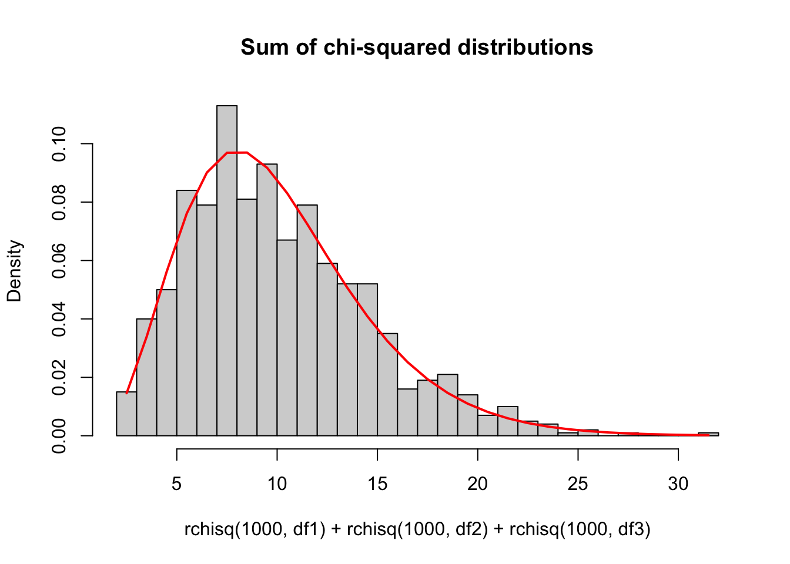

Week 4 Lecture
========================================================

## Week 4 Readings

For this week, I suggest reading Aho Sections 4.4.2, 5.1, 5.2, 5.3-5.3.4 and Logan Chapter 3. I also strongly recommend reading Sections 1.1, 2.1, 3.1, and 4.1 of [Bolker Chapter 6](https://github.com/hlynch/Biometry2023/tree/master/_data/Bolker_Chapter6.pdf). Note that most students dislike this chapter by Bolker but it covers some fundamental information that will be important throughout your statistics journey and many advanced students come around to Bolker's way of thinking over time, so bear with it.


t-distribution
-------------

Let $X_{1},X_{2},...,X_{n}$ be independently and identically distributed random variables with mean $\mu$ and finite, non-zero variance $\sigma^{2}$, and the average of these variable $\bar{X}$ be defined as

$$
\bar{X} = \frac{1}{n}(X_{1}+X_{2}+X_{3}+...+X_{n})
$$

Then the Central Limit Theorem states:

$$
lim_{n \rightarrow \infty} \bar{X} \rightarrow N\left(\mu,\frac{\sigma^{2}}{n}\right)
$$
and therefore that

$$
lim_{n \rightarrow \infty} \frac{\bar{X}-\mu}{\sqrt{\sigma^{2}/n}} \rightarrow N(0,1)
$$

(Note that I could use $s^{2}$ synonymously with $\sigma^{2}$ here because $s^{2}$ is an unbiased estimator of $\sigma^{2}$, which means that $lim_{n \rightarrow \infty} s^{2}\rightarrow \sigma^{2}$.)

**What is the distribution of $\bar{X}$ for finite n when we don’t know what the population variance $\sigma^{2}$ is and have to substitute $s^{2}$ instead? The t-distribution.**

The t-distribution has one parameter, n-1, where n=the number of degrees of freedom.

(Just like $\mu$ and $\sigma^{2}$ are the parameters of the Normal, the parameter of the t is called the “degrees of freedom”. Do not let the name confuse you. Also, keep in mind that there is no relationship between the *number* of draws from the t distribution and the parameter for the t distribution. You can have n=100 draws from a $t_{n-1=10}$ or n=10 draws from a $t_{n-1=100}$. The two "n"s here are different and independent of one another.)

Notice that as n gets large, both the numerator and the denominator get small. The ratio of these two small numbers is the t-distribution, which is symmetric about 0 because the sample mean could end up either slightly too low or slightly too high.

**Where did we lose the degree of freedom?** 

<details>
  <summary>Click for Answer</summary>
<span style="color: blueviolet;">
We lost one degree of freedom because we had to use the sample mean in the estimation of the sample variance.
</span>
</details> 

Sometimes $s^{2}$ is smaller than $\sigma^{2}$, and sometimes it is larger, which explains why **the t-distribution is flatter in the middle but fatter in the tails**.


For large sample sizes, the t-distribution is indistinguishable from the normal distribution, but for small sample sizes, the t-distribution is flatter in the middle and fatter in the tails. 

The p.d.f. looks like

$$
p.d.f. = f(x|p=n-1=d.o.f.) \sim \frac{\Gamma(\frac{p+1}{2})}{\Gamma(\frac{p}{2})}\frac{1}{(p\pi)^{1/2}}\frac{1}{(1+\frac{x^{2}}{p})^{(p+1)/2}}
$$

Side note: I mentioned that there were some distributions for which I was not requiring you to memorize the pdf. Note that for some of the remaining pdfs (like the t, F, and chi-squared) I may give you the pdf and ask you to identify it. Fair warning!!

The expected value is given by

$$
E[X]=0 \mbox{ if p}>1
$$

The variance is given by

$$
Var[X]=\frac{p}{p-2} \mbox{ if p}>2
$$

Chi-squared distribution
---------------

The chi-squared distribution is related to the standard normal distribution as follows:
Draw

$$
X_{1},X_{2},X_{3},...,X_{n}  \sim N(0,1)
$$

Create a new quantity

$$
Y= X_{1}^{2}+X_{2}^{2}+X_{3}^{2}+...+X_{n}^{2}
$$
$$
Y \sim χ_{n}^{2}
$$

In other words, the sum of squared standard deviates is distributed as a $\chi^{2}$ distribution with n degrees of freedom.

If we construct standard normal by transforming normal distributions with mean $\mu$ and variance $\sigma^{2}$, we can re-write the sum above as

$$
Y = \frac{1}{\sigma^{2}}(X_{1}-\mu)^{2}+\frac{1}{\sigma^{2}}(X_{2}-\mu)^{2}+\frac{1}{\sigma^{2}}(X_{3}-\mu)^{2}+...+\frac{1}{\sigma^{2}}(X_{n}-\mu)^{2}
$$

$$
Y = \frac{1}{\sigma^{2}}\sum_{i=1}^{n}{(X_{i}-\mu)^{2}} \sim \chi_{n}^{2}
$$

where $\mu$ is the population mean and $\sigma^{2}$ is the population variance.

To reiterate, it is important to remember the following properties of the chi-squared distribution:

1. If $X \sim N(0,1)$, then $X^{2} \sim \chi_{1}^{2}$. In other words, the square of a standard normal random variable is a chi-squared random variable.


```r
chisqhist<-hist((rnorm(1000,0,1))^2,freq=F,breaks=30,main="Chi-squared with df=1")
lines(chisqhist$mids,dchisq(chisqhist$mids,1),col="red",lwd=2)
```


2. If $X_{p1},X_{p2},X_{p3}... \sim \chi^{2}$ distribution, then $\sum_{i}{X_{pi}} \sim \chi^{2}_{\sum{p_{i}}}$. In other words, independent chi-squared random variables sum to a chi-squared random variable, and the degrees of freedom also add.


```r
df1<-5 
df2<-2
df3<-3
chisqhist2<-hist(rchisq(1000,df1)+rchisq(1000,df2)+rchisq(1000,df3),freq=F,breaks=30,main="Sum of chi-squared distributions")
lines(chisqhist2$mids,dchisq(chisqhist2$mids,df1+df2+df3),col="red",lwd=2)
```



While above I used the symbol "n" to designate the parameter of the $\chi^{2}$ distribution because it is intuitive how that parameter is equal to the number of (squared) random variables are being summed, here I will switch to the letter $\nu$, which is slightly more traditional. The chi-squared distribution has an ugly pdf, which I include here for completeness.

$$ 
f(x \mid \nu=n) = \frac{1}{2^\frac{\nu}{2} \Gamma(\frac{\nu}{2})} x^{(\frac{\nu}{2}-1)} e^\frac{-x}{2}
$$
Remembering that the Gamma distribution is given by

$$
f(x|\alpha,\beta) = \frac{1}{\beta^{\alpha}\Gamma(\alpha)}x^{\alpha-1}e^{-x/\beta}
$$
With this we can see that the $\chi^{2}$ distribution is a special case of the gamma distribution with $\alpha = \nu/2$ and $\beta=2$.

The shape of the $\chi^{2}$ distribution can be seen with a few examples:


The expected value and variance are given by:

$$ E[X] = \nu \\ Var[X] =2\nu  $$

I don’t derive these, but they follow from the E[X] and Var[X] of the gamma distribution.

F distribution
-------------

As you will see in detail throughout the semester, the F distribution is critical to modelling variances. The F distribution is related to the $\chi^{2}$ distribution, in fact the ratio of two chi-squared distributions is the F-distribution.

$$
\frac{\chi^{2}_{n-1}/(n-1)}{\chi^{2}_{m-1}/(m-1)} \sim F_{n-1,m-1}
$$

The F distribution has two parameters: the d.o.f. of both samples being compared (n-1 and m-1).

The pdf of the F distribution is given by

$$
f(x|r=n-1,s=m-1)=\frac{r\Gamma(\frac{1}{2}(r+s))}{s\Gamma(\frac{1}{2}r)\Gamma(\frac{1}{2}s)}\frac{\frac{rx}{s}^{\frac{r}{2}-1}}{(1+\frac{rx}{s})^{\frac{r+s}{2}}}
$$

(noting that I have used r=n-1 and s=m-1 to make the equation slightly more readable) and the shape of the F distribution looks like


$$ E[X] = \frac{m-1}{m-3} $$

and the variance is just ugly.

Why would we ever need to use the F-distribution? It turns out that the F-distribution is critical for assessing variances. Let’s say you have two datasets...

Data set A, with n data points:

$$
X_{1},X_{2},X_{3},...,X_{n} \sim N(\mu_{A},\sigma_{A}^{2})
$$

and data set B, with m data points:

$$
Y_{1},Y_{2},Y_{3},...,Y_{m} \sim N(\mu_{B},\sigma_{B}^{2})
$$

Now you have two sets of data, both normally distributed but with different means and variances. You want to know whether the variance of data set A is bigger or smaller than the variance for data set B.

We *want* to know the ratio $\sigma_{A}^{2}/\sigma_{B}^{2}$ but all we *have* at our disposal is the ratio of the sample variances $s_{A}^{2}/s_{B}^{2}$. It turns out the F-distribution can help us. 

We start with the fact that you know from our discussion a few minutes ago that

$$ 
\frac{1}{\sigma^2}\sum_{i=1}^n{(X_i-\mu)^2} \sim \chi^2_n
$$

If we have to estimate $\mu$ using $\bar{X}$ than we lose one degree of freedom

$$
\frac{1}{\sigma^2}\sum_{i=1}^n{(X_i-\bar{X})^2} \sim \chi^2_{n-1} 
$$
but we know that

$$
s^2 = \frac{\sum_{i=1}^n(X_i-\bar{X})^2}{n-1}
$$

Therefore

$$
s^2(n-1) = \sum_{i=1}^n(X_i-\bar{X})^2
$$

So we can write

$$
\frac{1}{\sigma^2}\sum_{i=1}^n(X_i-\bar{X})^2 =  \frac{s^2(n-1)}{\sigma^2} \sim \chi^2_{n-1}
$$


Therefore, 

$$ 
\frac{s^2_A/\sigma^2_A}{s^2_B/\sigma^2_B} \sim \frac{\chi^2_{n-1}/(n-1)}{\chi^2_{m-1}/(m-1)} 
$$

is a ratio of scaled chi-squared distributions which is, as you now know, also an F-distribution:

$$ 
\frac{s^2_A/\sigma^2_A}{s^2_B/\sigma^2_B} \sim F_{n-1,m-1}
$$

So, if we know the population variances ($\sigma^2$) and we calculate the sample variances ($s^2$), than the ratio above has the F-distribution. While we don’t usually know the population variances, we are often testing a hypothesis that the two population variances are equal. If we *assume* that $\sigma_{A}^{2}=\sigma_{B}^{2}$, than the expression above becomes

$$ 
\frac{s^2_A}{s^2_B} \sim F_{n-1,m-1}
$$
This fact will be used in a few weeks when we discuss F-tests. (Stay tuned…)

The t-, F-, and chi-squared distributions are all closely related. I will not work through the proofs here, but I will highlight a couple important relationships that will come in handy later.

*Relationship 1*: We’ve already shown that the F distribution is a ratio of scaled chi-squared distributions.

$$ 
\frac{\chi^2_{n-1}/(n-1)}{\chi^2_{m-1}/(m-1)} \sim F_{n-1,m-1}
$$
*Relationship 2*: If $X \sim t_{n-1}$, then $X^2 \sim F_{1,n-1}$. In words, this means that if you square a t-distributed variable, you get an F distributed variable. 

Once you decide on a distribution for your data, you need some way of estimating the best-fit parameters. This brings us to the next major topic of Biometry.

Estimating confidence intervals - 5 special cases
----------------

We will now learn how to fit a model to data, that is, to estimate the parameter values for the distribution being used to model the data. Since parameter estimates are useless without their corresponding confidence intervals, we will also learn out to estimate confidence intervals for these parameters.

Let's review for a second what is meant by a confidence interval. **<span style="color: orangered;">A 95th percentile confidence interval is an interval estimated from the data that we are 95$\%$ certain contains the true but unknown value for the parameter.</span>** Because this interval is estimated from data, it has its own confidence interval. While we usually we don't worry too much about this, keep in mind that **a different dataset would also produce a different parameter estimate and a different confidence interval**.

How do we calculate confidence intervals when we are using a parametric distribution to model some data? We are going to use what we know about these distributions to derive an analytical expression for the distribution of the parameter of interest, and then use the quantiles of that distribution to calculate the appropriate confidence intervals (typically we use the $\alpha⁄2$ and 1-$\alpha⁄2$ confidence intervals, where $\alpha$=0.05).

The following five examples use the same methodology:

*Step #1*: Start with an expression involving the parameter of interest that you know is true based on what we already know about the properties of the univariate distributions

*Step #2*: Algebraically re-arrange that expression to isolate the parameter of interest on one side of the equation. You now have an expression for the statistical distribution describing the estimate of that parameter

*Step #3*: Replace the distribution with the appropriate quantiles to generate the lower bound and upper bound of interest.

The first four examples involve the following model

$$
X \sim N(\mu,\sigma^{2})
$$
If we want to find confidence intervals for $\mu$, we can do so in the case where $\sigma$ is known (unrealistic) or where $\sigma$ is unknown. If we want to find confidence intervals for $\sigma$, we can do so in cases where $\mu$ is known (unrealistic) or where $\mu$ is unknown. These form the first four of the five examples we will cover.

**Example 1: Confidence intervals for $\mu$ assuming $\sigma$ is known.** Let's say that we have some data $X_{1},X_{2},X_{3},....,X_{n}$. To use a concrete example, let's say that these data represent the population growth rate of some bird colonies that I am monitoring. I am going to model growth rate by a Normal distribution:

$$
X \sim N(\mu,\sigma^{2})
$$
Let's assume for the moment that I already know what the variance of growth rate is, so **$\sigma$ is already known and does not have to be estimated from the data**, but I do need to use the data to estimate the mean of the distribution $\mu$. 

Let's start with the model we have for the data

$$
X \sim N(\mu,\sigma^{2})
$$

From this, follows

$$
\bar{X} \sim N(\mu,\sigma^{2}/n)
$$
Note that this is *exactly* true if the original data come from a Normal distribution but it is also approximately true as long as the Central Limit Theorem holds (and it does for almost all distributions that you are likely to encounter in your research). Subtracting off the parameter $\mu$ from both sides we get

$$
\bar{X}-\mu \sim N(0,\sigma^{2}/n)
$$

and

$$
\bar{X}-\mu \sim \sqrt{\frac{\sigma^{2}}{n}}N(0,1)
$$
We can re-arrange this expression to get the distribution for $\mu$

$$
\mu-\bar{X} \sim \sqrt{\frac{\sigma^{2}}{n}}N(0,1)
$$
(Why can I just reverse the signs on the left hand side?)

$$
\mu \sim \bar{X}+\sqrt{\frac{\sigma^{2}}{n}}N(0,1)
$$

We now have the distribution for the parameter $\mu$ in terms of quantities we already know ($\sigma$, which is assumed known, sample size n, and the average of the data $\bar{X}$).

We can use this expression to get confidence intervals for $\mu$, by plugging in the quantiles of the standard Normal distribution on the right hand side. The lower limit is defined by the [$\alpha$/2] quantile of N(0,1), and the upper limit is defined by 1-[$\alpha$/2] quantile of N(0,1). By tradition, we call the quantiles of the standard normal ''z''.

$$
P(\bar{X}+\sqrt{\frac{\sigma^{2}}{n}}z_{\alpha/2} \leq \mu \leq \bar{X}+\sqrt{\frac{\sigma^{2}}{n}}z_{1-\alpha/2}) = 0.95
$$

Because the N(0,1) is symmetric about zero,

$$
z_{\alpha/2}= -z_{1-\alpha/2}
$$

<div class="figure" style="text-align: center">

<p class="caption">(\#fig:unnamed-chunk-6)Standard normal diagram illustrating the symmetry of the distribution and the quantiles for the left and right tails.</p>
</div>

this is the same as

$$
P(\bar{X}-\sqrt{\frac{\sigma^{2}}{n}}z_{1-\alpha/2} \leq \mu \leq \bar{X}+\sqrt{\frac{\sigma^{2}}{n}}z_{1-\alpha/2}) = 0.95 = 1-\alpha
$$

This second version makes it easier to see that there is a quantity that is subtracted off $\bar{X}$ for the lower limit, and added to $\bar{X}$ for the upper limit. The confidence intervals in this case are symmetric about $\bar{X}$.

Side note: This is called the “equal-tails” method, because we have constructed the confidence interval using equal amounts in each tail of the distribution. It is the most common way of constructing a confidence interval, but not the only way. 

Notice that

$$
z_{1-\alpha/2}=qnorm(0.975)=1.96
$$

from which we arrive at a form for the confidence interval that might look familiar, that is, estimate $\pm$ 2 $\times$ SE (the standard error).

*Note*: We often use this approach for the population mean even if we do not know the exact distribution because the CLT tells us that for large sample sizes, the mean of the distribution is normally distributed. But this approach is quite limited because it doesn’t tell us how to get estimates and CIs for other parameters, nor does it address the problem of estimates when the sample size is small and the CLT doesn’t apply.

**Example #2: Confidence intervals for $\mu$ assuming $\sigma$ is unknown.** What about a (much more common) situation where you need to use the data to estimate both the mean and the variance? In this case we have to use the sample variance $s^{2}$ to estimate the parametric variance $\sigma^{2}$. We start with the following fact

$$
\frac{\bar{X}-\mu}{\sqrt{\frac{s^{2}}{n}}} \sim t_{n-1}
$$

Therefore

$$
\bar{X}-\mu \sim \sqrt{\frac{s^{2}}{n}} t_{n-1}
$$

$$
P(\bar{X}-\sqrt{\frac{s^{2}}{n}}t_{(1-\alpha/2)[n-1]} \leq \mu \leq \bar{X}+\sqrt{\frac{s^{2}}{n}}t_{(1-\alpha/2)[n-1]}) = 1-\alpha
$$

It is almost never the case that you know $\sigma^{2}$, so you should always use the quantiles of the t-distribution for building confidence intervals for $\bar{X}$. People incorrectly use the normal approximation because back in the day of tables, the normal distribution was easier. *In the age of computers, no excuse – use the t-distribution.*

One final note - next week we will learn about t-tests and depending on the assumptions being made, the appropriate t-distribution may have a degree-of-freedom different from n-1, so I'm including the most general statement about the confidence interval for the mean of a Normally distriuted population here:

$$
P(\bar{X}-\sqrt{\frac{s^{2}}{n}}t_{(1-\alpha/2)[dof]} \leq \mu \leq \bar{X}+\sqrt{\frac{s^{2}}{n}}t_{(1-\alpha/2)[dof]}) = 1-\alpha
$$

Where does the Central Limit Theorem come in here? In this case, if you are going to invoke the Central Limit Theorem (because your data are not actually Normally distributed) to get at confidence intervals for the mean of the distribution, you would need the sample size to be large anyways (because the CLT only says that the mean takes a Normal distribution in the limit of large sample sizes) and in this case $s^{2} \rightarrow \sigma^{2}$ so you can use Case 1 above.

**Example #3: Estimating the confidence intervals for the variance $\sigma^{2}$ assuming $\mu$ is known.**

Based on the definition of a $\chi^{2}$ distribution, we know that if we have data $X \sim N(\mu,\sigma^{2})$, then 

$$
\frac{1}{\sigma^{2}}\sum_{i=1}^{n}(X_{i}-\mu)^{2} \sim \chi^{2}_{n}
$$

*Note that this is only true if the underlying data are actually Normally distributed.* (In other words, the parameter $\sigma$ is a parameter of the Normal distribution, so Examples 3-5 require that the original data are Normally distributed, otherwise the concept of putting CI on the parameter $\sigma$ doesn't make sense.) Here we will use the fact that if $\mu$ is *known*, than the sample variance is calculated as

$$
\frac{1}{n}\sum_{i=1}^{n}(X_{i}-\mu)^{2} = s^{2}
$$
Notice that because $\mu$ is known and does not have to be estimated from the data, we retain all n degrees of freedom in the denominator.

We can re-arrange this equation to get

$$
\sum_{i=1}^{n}(X_{i}-\mu)^{2} = ns^{2}
$$
which we plug into our $\chi^{2}$ expression to yield

$$
\frac{1}{\sigma^{2}}ns^{2} \sim \chi^{2}_{n}
$$
We then re-arrange a bit further to isolate $\sigma^{2}$

$$
\sigma^{2} \sim \frac{ns^{2}}{\chi^{2}_{n}}
$$

Now that we have the sampling distribution for $\sigma^{2}$ we can simply insert the appropriate quantiles to get the lower and upper limits of the confidence interval. Note that because the $\chi^{2}$ is in the denominator, the *larger* quantile is associated with the lower limit, and vice versa.

$$
P\left(\frac{ns^{2}}{\chi^{2}_{(1-\alpha/2)[n]}} \leq \sigma^{2} \leq \frac{ns^{2}}{\chi^{2}_{(\alpha/2)[n]}}\right) = 1-\alpha
$$

**Example #4: Estimating the confidence intervals for the variance $\sigma^{2}$ assuming $\mu$ is unknown.**

This example proceeds similarly to the one above, except we now need to estimate $\mu$ from the data, and this means we lose of degree of freedom both in the $\chi^{2}$ distribution and in the estimate of the sample variance.

$$
\frac{1}{\sigma^{2}}\sum_{i=1}^{n}(X_{i}-\bar{X})^{2} \sim \chi^{2}_{n-1}
$$

Why n-1? Because we lost a degree of freedom when we had to estimate $\bar{X}$.

As before (except with $\mu$ unknown, and estimated by $\bar{X}$)

$$
\frac{1}{(n-1)}\sum_{i=1}^{n}(X_{i}-\bar{X})^{2} = s^{2}
$$

so we can rearrange to show that

$$
\frac{1}{\sigma^{2}}\sum_{i=1}^{n}(X_{i}-\bar{X})^{2}=\frac{(n-1)s^{2}}{\sigma^{2}} \sim \chi^{2}_{n-1}
$$
Using the above expression, we re-arrange to get the sampling distribution of $\sigma^{2}$

$$
\sigma^{2} \sim \frac{(n-1)s^{2}}{\chi^{2}_{n-1}}
$$

from which we get the confidence intervals

$$
P(\frac{(n-1)s^{2}}{\chi^{2}_{(1-\alpha/2)[n-1]}} \leq \sigma^{2} \leq \frac{(n-1)s^{2}}{\chi^{2}_{(\alpha/2)[n-1]}}) = 1-\alpha
$$

**Example #5: Estimating the ratio of two variances $\sigma^{2}_{A}/\sigma^{2}_{B}$**

We start with this expression, which we derived above:

$$ 
\frac{s^2_A/\sigma^2_A}{s^2_B/\sigma^2_B} \sim F_{n-1,m-1}
$$
We can rewrite this equation as

$$ 
\frac{s^2_A/s^2_B}{\sigma_{A}^{2}/\sigma^2_B} \sim F_{n-1,m-1}
$$
Now we are going to invert the fraction on the left hand side in order to get the $\sigma$s in the numerator. The right hand side is still an F-distribution, but because we have flipped numerator and denominator, we need to switch the order of the two parameters

$$ 
\frac{\sigma_{A}^{2}/\sigma^2_B}{s^2_A/s^2_B} \sim F_{m-1,n-1}
$$

We isolate the ratio of $\sigma$s in the numerator by multiplying the sample variances across, as follows

$$ 
\frac{\sigma_{A}^{2}}{\sigma^2_B} \sim \frac{s^2_A}{s^2_B} F_{m-1,n-1}
$$

Now, as before, we have the sampling distribution for the quantity we want, and we obtain the confidence intervals by substituting in the appropriate quantiles. 

$$
\frac{s_{A}^{2}}{s_{B}^{2}}F_{(\alpha/2)[m-1,n-1]} \leq \frac{\sigma_{A}^{2}}{\sigma_{B}^{2}} \leq \frac{s_{A}^{2}}{s_{B}^{2}}F_{(1-\alpha/2)[m-1,n-1]}
$$

To recap
-----------

We used the Normal distribution to derive the confidence interval for the parametric mean $\mu$ when $\sigma$ is known. 

We used the t-distribution to derive the confidence interval for the parametric mean $\mu$ when $\sigma$ is unknown (much more common).

We used the $\chi^{2}$ distribution to derive the confidence interval for the parametric variance $\sigma^{2}$ when $\mu$ is known.

We used the $\chi^{2}$ distribution to derive the confidence interval for the parametric variance $\sigma^{2}$ when $\mu$ is unknown (much more common).

We used the F distribution to derive the confidence interval for the ratio of two variances.


