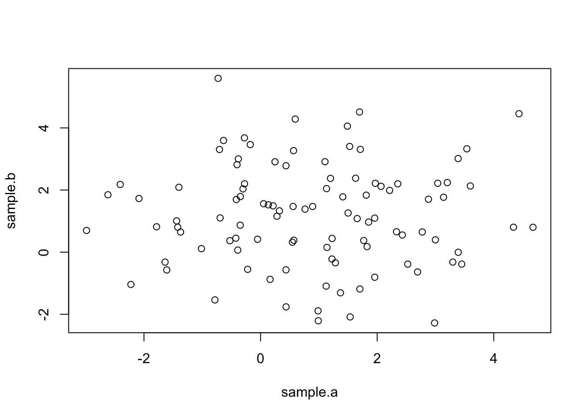
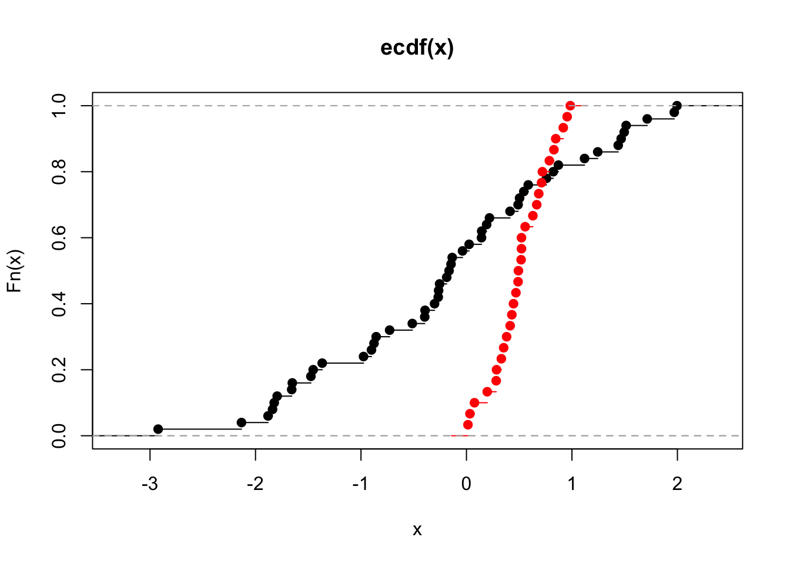

Week 5 Lab
=============
  
To learn more about R`s functions for doing the hypothesis tests introduced on Tuesday, we will simulate some data. Simulating data with known properties is always the best way of exploring a statistical test before applying it to your own data. Although we could simulate data using the "rnorm" function, we will use the "mvrnorm" function from the MASS package so we can consider the role of correlation between the two samples.


```r
library(MASS)
data<-mvrnorm(n=100,c(1,1.2),matrix(c(3,0,0,3),2,2))
```

The call here is similar to the one used for rnorm except now we are drawing two samples at the same time with the following properties:

$$
\left[ \begin{array}{c}
X_{A}  \\
X_{B}  \end{array} \right] \sim N\left(\left(\begin{array}{c}
\mu_{A}  \\
\mu_{B}  \end{array}\right),\left(\begin{array}{cc}
Cov(A,A) & Cov(A,B)   \\
Cov(A,B) & Cov(B,B) \end{array}\right)\right)
$$

Note that the variances have to be non-negative, and because Cov(A,B)=Cov(B,A), the covariance matrix has to be symmetric. (CAREFUL: mvrnorm does not enforce this!)


```r
sample.a<-data[,1]
sample.b<-data[,2]
plot(sample.a,sample.b)
```



Notice that because Cov$(X_{A},X_{B})$=0, the scatterplot has no trend.

The t-test will answer the question, "Can we reject the null hypothesis that these two populations have the same mean"?


```r
t.test(sample.a,sample.b)
```

```
## 
## 	Welch Two Sample t-test
## 
## data:  sample.a and sample.b
## t = -1.4074, df = 195.79, p-value = 0.1609
## alternative hypothesis: true difference in means is not equal to 0
## 95 percent confidence interval:
##  -0.8289596  0.1385364
## sample estimates:
## mean of x mean of y 
##  1.144057  1.489268
```

Notice that the degrees of freedom need not necessarily be an integer. R assumes unequal variances so we have to use the more complicated formula for the degrees of freedom. (In this situation, the number of degrees of freedom is not very intuitive; however, if you have $s_{A}^{2}=s_{B}^{2}$ and $n_{A}=n_{B}$, then the formula for the d.o.f. simplifies to 2n-2 which is what you would expect. )

Because we are simulating data, everyone's output is going to look slightly different. In fact, some of us may get p<0.05 and others p>0.05. Here we are looking for a relatively small difference (compared to the standard deviations) with only 100 random draws. We would get more consistent results if we had larger sample sizes, larger mean differences, or smaller standard deviations. This touches on the very important question of statistical POWER, which we will discuss next week.

**<span style="color: green;">Checkpoint #1: The output of t.test includes 7 quantities - can you reproduce all 7 quantities based on what we learned on Tuesday?</span>**

The default in R is to assume a two-sided test. In other words, by default, R tests

$$
H_{0}:\mu_{1}=\mu_{2},                                                
H_{A}:\mu_{1}\neq\mu_{2}
$$

The lower limit of the two-sided 95th percentile CI represents the quantile below which 2.5$\%$ of the probability falls and vice versa. However, when we are thinking about a one-tailed test, we would put all 5$\%$ in one tail and then we would reject all test statistics that fall inside this one tail. If we are estimating effect sizes and their confidence intervals, the confidence intervals are no longer bounded on both sides. In fact, for a one-tailed test where we are only interested in the "greater" alternative hypothesis (for example, $X_{A}>X_{B}$), there is only a lower bound (the upper bound is infinity) because the question then becomes whether the smallest value of the test statistic consistent with the data is below zero (in which case you cannot reject the null hypothesis and the difference is not significant) or above zero (in which case the values consistent with the data are *all* above zero and therefore you can reject the null hypothesis). In other words, when you are only interested in the alternative hypotheses $X_{A}>X_{B}$, you don't care *how* much bigger $X_{A}$ is than $X_{B}$, you just want to know whether *at its smallest* the difference is still larger than zero.

You can force R to do a one-sided test, either

$$
H_{A}:\mu_{1}>\mu_{2}
$$

or

$$
H_{A}:\mu_{1}<\mu_{2}
$$

by using the options


```r
t.test(sample.a,sample.b,alternative="greater")
```

```
## 
## 	Welch Two Sample t-test
## 
## data:  sample.a and sample.b
## t = -1.4074, df = 195.79, p-value = 0.9195
## alternative hypothesis: true difference in means is greater than 0
## 95 percent confidence interval:
##  -0.7505944        Inf
## sample estimates:
## mean of x mean of y 
##  1.144057  1.489268
```

```r
t.test(sample.a,sample.b,alternative="less")
```

```
## 
## 	Welch Two Sample t-test
## 
## data:  sample.a and sample.b
## t = -1.4074, df = 195.79, p-value = 0.08045
## alternative hypothesis: true difference in means is less than 0
## 95 percent confidence interval:
##        -Inf 0.06017123
## sample estimates:
## mean of x mean of y 
##  1.144057  1.489268
```

Try both of these options and see how the p-value and the confidence intervals change. Make sure you understand why they make sense. Remember, if you are going to use a one-tailed test, you should be prepared to accept that a large difference opposite to what was expected is pure random chance.

Spend some time going back and experimenting with different sets of random variables. Make the means more or less different. Change the variances. Make sure you understand why the t-test results change as you alter the data. **<span style="color: green;">Checkpoint #2: What happens if you make the sample sizes smaller or larger?</span>**

Now let's see what happens when we simulate a new dataset with correlations between the two samples.


```r
data<-mvrnorm(n=100,c(1,1.2),matrix(c(3,2,2,3),2,2))
sample.a<-data[,1]
sample.b<-data[,2]
plot(sample.a,sample.b)
```


Notice that now the two samples are positively correlated.


```r
t.test(sample.a,sample.b,paired=T)
```

```
## 
## 	Paired t-test
## 
## data:  sample.a and sample.b
## t = 1.1841, df = 99, p-value = 0.2392
## alternative hypothesis: true difference in means is not equal to 0
## 95 percent confidence interval:
##  -0.1286097  0.5092772
## sample estimates:
## mean of the differences 
##               0.1903338
```

Compare this with


```r
t.test(sample.a,sample.b,paired=F)
```

```
## 
## 	Welch Two Sample t-test
## 
## data:  sample.a and sample.b
## t = 0.73125, df = 194.91, p-value = 0.4655
## alternative hypothesis: true difference in means is not equal to 0
## 95 percent confidence interval:
##  -0.3230062  0.7036737
## sample estimates:
## mean of x mean of y 
##  1.424163  1.233829
```

which is the same as 


```r
t.test(sample.a,sample.b)
```

```
## 
## 	Welch Two Sample t-test
## 
## data:  sample.a and sample.b
## t = 0.73125, df = 194.91, p-value = 0.4655
## alternative hypothesis: true difference in means is not equal to 0
## 95 percent confidence interval:
##  -0.3230062  0.7036737
## sample estimates:
## mean of x mean of y 
##  1.424163  1.233829
```

since the default is to assume unpaired samples.

To convince ourselves of the formulas we learned for paired t-tests, we will define a new variable


```r
z<-sample.a-sample.b
mean(z)
```

```
## [1] 0.1903338
```

```r
var(z)
```

```
## [1] 2.583742
```

```r
var(sample.a)+var(sample.b)-2*cov(sample.a,sample.b)
```

```
## [1] 2.583742
```

Spend some time going back and experimenting with different sets of random variables. In particular, change the covariances (makign sure that the covariance matrix is symmetric and the variances positive). Make sure you understand why the t-test results change as you alter the data. **<span style="color: green;">Checkpoint #3: What happens to the t-test results when you make the correlation weak?</span>**

F-test
--------

One of the conditions for using the t-test is that the variances of the two samples are the same. One way of determining if the two variances are the same is the F-test. To review what we learned on Tuesday, under the null hypothesis that two populations have the same $\sigma^{2}$, the ratio of their sample variances will follow an F-distribution

$$
F_{s}=\frac{s_{A}^{2}}{s_{B}^{2}}
$$

If the value of the test statistic would be unusual for the F-distribution, we would reject the null hypothesis. (In other words, such a ratio of variances would be unlikely to occur by chance if the two variances were in fact the same.)

As with the t-test, we can do a one-tailed or two-tailed F-test. The one-tailed F-test presumes that we want to test whether one variance is significantly larger than another variance, i.e.

$$
H_{0}: \sigma_{A}^{2} = \sigma_{B}^{2}
$$

$$
H_{\mbox{A implied}}: \sigma_{A}^{2} > \sigma_{B}^{2}
$$

For a one-tailed test, we would assume that if the data were to show that

$$
s_{B}^{2} > s_{A}^{2}
$$

then we would chalk that up to random chance and we would NOT interpret that as

$$
\sigma_{B}^{2} > \sigma_{A}^{2}.
$$

If we are doing a one-tailed F-test where we are *only* interested in $\sigma_{A}^{2} > \sigma_{B}^{2}$, then our test statistic is $\frac{s_{A}^{2}}{s_{B}^{2}}$ (regardless of which is bigger), and we would set our critical value so that $\alpha$ of the distribution of the test statistic would fall into the right-hand tail of the F-distribution. We would then compare our test statistic $T^{*}$ to the value of the (1-$\alpha$) quantile of the F-distribution, and the question becomes

$$
\frac{s_{A}^{2}}{s_{B}^{2}} > F_{[1-\alpha](n-1,m-1)}?
$$

However, if we are open to either

$$
H_{\mbox{A implied}}: \sigma_{A}^{2} > \sigma_{B}^{2}
$$

or

$$
H_{\mbox{A implied}}: \sigma_{A}^{2} < \sigma_{B}^{2}
$$

then we want to do a two-tailed test. In this case, by tradition and to make life simpler, the larger sample variance always goes in the numerator, and we check this value against the critical value obtained by putting only 2.5% in the right hand tail. Now we are asking the question

$$
\frac{s_{A}^{2}}{s_{B}^{2}} > F_{[1-\frac{\alpha}{2}](n-1,m-1)}?
$$

In other words, because the F-distribution is always non-negative, it is easier to put the larger sample variance in the numerator to create a test statistic $T^{*}>1$ and then compare that to $F_{[1-\frac{\alpha}{2}](n-1,m-1)}$ than it is to worry about computing both critical values (one for a ratio $<1$ and a separate one for a ratio $>1$).

Let's explore this by simulating some data


```r
sample.a<-rnorm(100,mean=5,sd=4)
sample.b<-rnorm(100,mean=2,sd=3)
```

Lets assume we are only interested in the implied alternative hypothesis

$$
H_{A implied}: \sigma_{A}^{2} > \sigma_{B}^{2}
$$

We can calculate this one-tailed F-test by hand first


```r
var.A<-var(sample.a)
var.B<-var(sample.b)
F.ratio<-var.A/var.B 
F.ratio
```

```
## [1] 1.775501
```

Note that we didn't check that var.A was actually bigger than var.B. Because we are only interested in a one-tailed test, we want var.A in the numerator and we will compare that to the right-hand side of the F-distribution.

Now we know what the F-ratio of our simulated data is, but we don't know what the critical value of the test statistic is for the ratio to be considered "significant".


```r
qf(p=0.95,df1=99,df2=99)
```

```
## [1] 1.394061
```

**<span style="color: green;">Checkpoint #4: Do you understand why df1=99 and df2=99?</span>**

We see that the F-ratio for our data is greater than the critical value for the 95th percentile. Therefore we can say that the two samples are unlikely to come from populations from the same variance. We can also flip the question around to ask: "What is the probability of obtaining this F-ratio if the null hypothesis were true?"


```r
1-pf(F.ratio,df1=99,df2=99)
```

```
## [1] 0.00232984
```

and we see that it is small (<0.05).

Remember, pf gives the cumulative probability of getting any value less than or equal to the percentile being queried, so 1-pf gives the probability of getting a value as or more extreme.

R gives us an easier way to test equality of variances (the F test):


```r
var.test(sample.a,sample.b)
```

```
## 
## 	F test to compare two variances
## 
## data:  sample.a and sample.b
## F = 1.7755, num df = 99, denom df = 99, p-value = 0.00466
## alternative hypothesis: true ratio of variances is not equal to 1
## 95 percent confidence interval:
##  1.194631 2.638809
## sample estimates:
## ratio of variances 
##           1.775501
```

The output of var.test includes 7 quantities - make sure you can calculate each and every one of these quantities.

How did R arrive at its p-value? Notice that it is twice what we calculated when doing the F-test by hand. The reason is that R's default is to do a two-sided test, and we only calculated the probability that you got a ratio as big or larger than the $F^{*}$. You can get the two-tailed probability by either doubling that value or by adding the probability that you would get an F-ratio smaller than 1/$F^{*}$. 

Notice also that to get the confidence intervals on the F-ratio, you multiply by the quantiles of the F-distribution. 


```r
qf(0.025,df1=99,df2=99)*F.ratio
```

```
## [1] 1.194631
```

```r
qf(0.975,df1=99,df2=99)*F.ratio
```

```
## [1] 2.638809
```

Comparing two proportions
--------------------------

On Tuesday I introduced two different test statistics that are frequently used to test a binomial proportion. 

The Wald test is based on the idea that near the minimum of the likelihood function (in the vicinity of the MLE), deviations from the MLE will be normally distributed. Therefore, the Wald test is a very general statement 

$$
\frac{\hat{\theta}-\theta_{0}}{se(\hat{\theta})}\sim N(0,1)
$$

which we can apply in this specific case as

$$
\frac{\hat{p}-\theta_{0}}{\sqrt{\frac{\hat{p}(1-\hat{p})}{n}}}\sim N(0,1) 
$$

The 'score' test uses the value of the binomial proportion *under the null hypothesis* in place of the empirical probability in estimating the standard error in the denominator.

$$
\frac{\hat{p}-\theta_{0}}{\sqrt{\frac{\theta_{0}(1-\theta_{0})}{n}}}\sim N(0,1) 
$$

We can easily invert the Wald test to arrive at the following confidence interval for p:

$$
P\left(\hat{p}-z_{1-(\alpha/2)}\sqrt{\frac{\hat{p}(1-\hat{p})}{n}}\leq \theta \leq \hat{p}+z_{1-(\alpha/2)}\sqrt{\frac{\hat{p}(1-\hat{p})}{n}}\right)=1-\alpha
$$

However, if you look at the score test, you see that it is quite difficult to invert and isolate $\hat{p}$. This is why the confidence intervals for the score test are so complicated. We will not go into more detail here because in practice you would not be calculating it by hand anyways (but the general idea behind inverting the test to get a CI should be clear!).

We will now explore R's functions for estimating the probability $\hat{p}$ (and its confidence interval) for a binomial distribution.

First we simulate some data to work with


```r
heads<-rbinom(1,size=100,prob=0.5)
heads
```

```
## [1] 47
```

Now we will use R's function for the proportion test


```r
prop.test(heads,100) #continuity correction true by default
```

```
## 
## 	1-sample proportions test with continuity correction
## 
## data:  heads out of 100, null probability 0.5
## X-squared = 0.25, df = 1, p-value = 0.6171
## alternative hypothesis: true p is not equal to 0.5
## 95 percent confidence interval:
##  0.3703535 0.5719775
## sample estimates:
##    p 
## 0.47
```

The continuity correction is used because we are approximating a discrete distribution (the binomial) with its normal approximation. While generally recommended, it rarely makes a large difference and for transparency I suggest we turn it off.


```r
prop.test(heads,100,correct=FALSE)
```

```
## 
## 	1-sample proportions test without continuity correction
## 
## data:  heads out of 100, null probability 0.5
## X-squared = 0.36, df = 1, p-value = 0.5485
## alternative hypothesis: true p is not equal to 0.5
## 95 percent confidence interval:
##  0.3751082 0.5671114
## sample estimates:
##    p 
## 0.47
```

To make sure we understand this, let's look at the help file for prop.test

```
?prop.test
```

There are a couple of additional pieces of information you need to understand and/or reconstruct the output for prop.test, and unfortunately the help file for this function is fairly unhelpful.

- R uses the **score test**, so the confidence interval computed by R won't be quite the same as what we would calculate using the Wald test method introduced in lecture. (But they will be close.)
- The test statistic that prop.test reports is the square of the score test statistic introduced in lecture

$$
\left[\frac{\hat{p}-\theta_{0}}{\sqrt{\frac{\theta_{0}(1-\theta_{0})}{n}}}\right]^{2}
$$

This is fine. Remember that there is no "correct" test statistic. The only challenge here is that we need to find the distribution of the test statistic under the null hypothesis. In this case, we remember from Week 3 that if we have a random variable X

$$
X \sim N(0,1)
$$

then the square of X

$$
X^{2} \sim \chi^{2}_{1}
$$

Therefore, the test statistic output by prop.test (assuming $H_{0}: \theta_{0}=0.5$) is


```r
n<-100
theta0<-0.5
test.statistic<-(((heads/n)-theta0)/(sqrt(theta0*theta0/n)))^2
test.statistic
```

```
## [1] 0.36
```

and the p-value is given by


```r
1-pchisq(test.statistic,df=1)
```

```
## [1] 0.5485062
```

Notice that because $X^{2}$ is always positive, the test is a one-tailed test ("extreme" values of this test statistic are always large and **positive**). We could get the same result comparing the original (non-squared) test statistic against the Standard Normal, as long as you make sure to do the two-tailed test ("extreme" for X includes large and positive **and** large and negative). 


```r
2*(1-pnorm(sqrt(test.statistic)))
```

```
## [1] 0.5485062
```

- Notice in the helpfile that R will return a clipped version of the confidence interval, so the confidence interval is bounded [0,1]. 

There is another function in R called "binom.test" which does an "exact test" based on the actual binomial distribution, rather than the normal approximation to it we introduced on Tuesday. Notice that there is no continuity correction because we are not approximating the binomial distribution with the normal distribution.


```r
binom.test(heads,100)
```

```
## 
## 	Exact binomial test
## 
## data:  heads and 100
## number of successes = 47, number of trials = 100, p-value = 0.6173
## alternative hypothesis: true probability of success is not equal to 0.5
## 95 percent confidence interval:
##  0.3694052 0.5724185
## sample estimates:
## probability of success 
##                   0.47
```

One of the caveats in using the Wald method for binomial proportion is that it can give unrealistic values for the CIs when the underlying probability is very close to either 0 or 1 (especially if the sample size is small).

To see this, lets calculate the Wald confidence intervals by hand assuming we got 2 successes out of 100 trials.


```r
p.hat<-2/100
n<-100
se<-sqrt(p.hat*(1-p.hat)/n)
z<-qnorm(0.975)
LL<-p.hat-se*z
UL<-p.hat+se*z
LL
```

```
## [1] -0.007439496
```

```r
UL
```

```
## [1] 0.0474395
```

The lower limit of the CI is actually negative which makes no sense since the binomial proportion is bounded [0,1]. We can clip the CI to have a LL of zero, but there is no guarentee that the "coverage" of the CI contains 95%. To see whether this is true, lets simulate multiple datasets with a true underlying probability of 0.02, calculate confidence intervals from those random samples, and see what proportion of the CIs actually contain the true value (0.02).


```r
data<-rbinom(n=1000,size=100,prob=0.02) #draw 1000 random datasets-100 trials each
p.hat<-data/100 #vector of empirical probabilities p.hat
n<-100
se<-sqrt(p.hat*(1-p.hat)/n)
z<-qnorm(0.975)
LL<-p.hat-se*z #vector of LLs
UL<-p.hat+se*z #vector of UL
sum(as.numeric((0.02<=UL)&(0.02>=LL)))/1000 #proportion of times the CI include the true value
```

```
## [1] 0.864
```

We see that the CIs are actually too narrow! The Wald test is commonly used but as we have demonstrated, it is not very good in practice. R and its packages make it easy to get better CIs for a binomial proportion and in real analysis, you should use these more sophisticated methods.

One of the better functions for doing tests of binomial proportions is provided by Dr. Dirk Enzmann. He has posted a function online that calculates 11 different versions of the binomial confidence interval.

I have pasted the function here:


```r
# Calculate confidence intervals for a single proportion according to one of 11
# methods (default: log likelihood ratio) for a level of alpha (default: .05)
# and with significant decimals (default: 3) given a proportion and the sample
# size (see: Newcombe, 1998; Brown et al., 2001). Except for the asymptotic and
# Agresti's methods all methods can yield asymmetric intervals around p:
#
# Methods are:
# 'likelihood'    : log likelihood ratio interval (default)
# 'asymptotic'    : simple "classical text book" or Wald method interval
# 'asymptotic.cc  : asymptotic with Yates' continuity correction
# 'score'         : score or Wilson method interval (= prop.test(...,correct=F),
#                   i.e. without Yates' continuity correction)
# 'score.cc'      : score method with continuity correction (= default of
#                   prop.test())
# 'binomial'      : "exact" or Clopper-Pearson method interval (= binom.test())
# 'binomial.midp' : binomial mid-p "quasi-exact" interval
# 'Jeffreys'      : Jeffreys prior interval
# 'Agresti-Coull' : Agresti-Coull method adding z?/2 successes
# 'Agresti.2_2    : Agresti-Coull method adding 2 successes and 2 failures
# 'logit'         : logit interval
#
# References:
# Brown, L.D., Cai, T.T. & DasGupta, A. (2001). Interval estimation for a
#    binomial proportion. Statistical Science, 16, 101-133.
# Newcombe, R.G. (1998). Two-sided confidence intervals for the single propor-
#    tion: Comparison of seven methods. Statistics in Medicine, 17, 857-872.

prop.CI = function(p,n,alpha=.05,digits=3,method="likelihood")
{
# Asymptotic (or Wald) interval:
  z = qnorm(1-alpha/2)
  if (method=='asymptotic') {
    se = sqrt(p*(1-p)/n)
    CI = list(p=p,CI=c((p-z*se),(p+z*se)),n=n,level=1-alpha,method=method)
  }
# Asymptotic (or Wald-test) CIs with continuity correction:
  if (method=='asymptotic.cc') {
    se = sqrt(p*(1-p)/n)
    CI = list(p=p,CI=c((p-z*se-1/(2*n)),(p+z*se+1/(2*n))),n=n,level=1-alpha,
              method=method)
  }
# Score test (or Wilson) interval:
  if (method=='score') {
    term1 = 2*n*p + z**2
    term2 = z*sqrt(z**2 + 4*n*p*(1-p))
    term3 = 2*(n + z**2)
    CI = list(p=p,CI=c((term1-term2)/term3,(term1+term2)/term3),n=n,
              level=1-alpha,method=method)
  }
# Score test (or Wilson) interval with continuity correction:
  if (method=='score.cc') {
    term1 = 2*n*p + z**2
    if (p>0) {
    term2L = z*sqrt(z**2 - 2 - 1/n + 4*p*(n*(1-p)+1))
    }
    if (p<1) {
    term2U = z*sqrt(z**2 + 2 - 1/n + 4*p*(n*(1-p)-1))
    }
    term3 = 2*(n + z**2)
    if ((p>0) & (p<1)) {
      CI = list(p=p,CI=c((term1-1-term2L)/term3,(term1+1+term2U)/term3),n=n,
                level=1-alpha,method=method)
    }
    if (p==0) {
      CI = list(p=p,CI=c(0,CIU=(term1+1+term2U)/term3),n=n,level=1-alpha,
                method=method)
    }
    if (p==1) {
      CI = list(p=p,CI=c((term1-1-term2L)/term3,1),n=n,level=1-alpha,
                method=method)
    }
  }
# Binomial ('exact' or Clopper-Pearson) interval:
  if (method=='binomial') {
    conf.int=binom.test(round(p*n),n,conf.level=1-alpha)$conf.int
    CI = list(p=p,CI=c(conf.int[1],conf.int[2]),n=n,level=1-alpha,method=method)
  }
# Binomial mid-p quasi-exact interval:
  if (method=='binomial.midp') {
    x = round(p*n)
    uplim = 1
    lowlim = 0
    if (x == 0) uplim = 1-alpha**(1/n)
    if (x == n) lowlim = alpha**(1/n)
    if (x > 0 & x < n) {
      pp = seq(0.000001,0.999999,length=100000)
      a2 = 0.5*pbinom(x-1,n,pp) + 0.5*pbinom(x,n,pp)
      uplim = pp[max(which(a2>(alpha/2)))]
      lowlim = pp[min(which(a2<(1-alpha/2)))]
    }
    CI = list(p=p,CI=c(lowlim,uplim),n=n,level=1-alpha,method=method)
  }
# Log-likelihood-ratio interval:
  if (method=='likelihood') {
    x = round(p*n)
    k = -qchisq(1-alpha,1)/2
    pp = seq(0.000001,0.999999,length=100000)
    lik = dbinom(x,size=n,pp)
    logLR = log(lik/max(lik))
    conf.int=range(pp[logLR > k])
    CI = list(p=p,CI=c(conf.int[1],conf.int[2]),n=n,level=1-alpha,method=method)
  }
# Jeffreys prior interval:
  if (method=='Jeffreys') {
    x = round(p*n)
    conf.int=qbeta(c(alpha/2,1-alpha/2),x+.5,n-x+.5)
    CI = list(p=p,CI=c(conf.int[1],conf.int[2]),n=n,level=1-alpha,method=method)
  }
# Agresti-Coull (adding z?/2 successes) interval
# (see: http://www.stat.ufl.edu/~aa/cda/R/one_sample/R1/index.html )
  if (method=='Agresti-Coull') {
    x = round(p*n)
    tr = z**2
    suc = tr/2
    pp = (x+suc)/(n+tr)
    se = sqrt(pp*(1-pp)/(n+tr))
    CI = list(p=p,CI=c((pp-z*se),(pp+z*se)),n=n,level=1-alpha,method=method)
    if (CI$CI[1] < 0) CI$CI[1]=0
    if (CI$CI[2] > 1) CI$CI[2]=1
  }
# Agresti-Coull (adding 2 successes and 2 failures) interval:
# (see: http://www.stat.ufl.edu/~aa/cda/R/one_sample/R1/index.html )
  if (method=='Agresti.2_2') {
    x = round(p*n)
    pp = (x+2)/(n+4)
    se = sqrt(pp*(1-pp)/(n+4))
    CI = list(p=p,CI=c((pp-z*se),(pp+z*se)),n=n,level=1-alpha,method=method)
    if (CI$CI[1] < 0) CI$CI[1]=0
    if (CI$CI[2] > 1) CI$CI[2]=1
  }
# Logit interval:
  if (method=='logit') {
    lambda = log(p/(1-p))
    x = round(p*n)
    V = n/(x*(n-x))
    conf.int = (c(lambda - z*sqrt(V),lambda + z*sqrt(V)))
    conf.int = exp(conf.int)/(1+exp(conf.int))
    CI = list(p=p,CI=c(conf.int[1],conf.int[2]),n=n,level=1-alpha,method=method)
  }
  cat('p ? ',100*(1-alpha),'%-CI = ',round(p,digits),' (',
      round(CI$CI[1],digits),'; ',round(CI$CI[2],digits),')\n',sep='')
  CI
}

# The following example  reproduces the data of Table I of Newcombe (1998,
# p. 861). Other methods to calculate confidence intervals of a single propor-
# tion as discussed in Brown et al. (2001) will also be demonstrated.
#
# To run, de-comment the following line:
# source("http://www2.jura.uni-hamburg.de/instkrim/kriminologie/Mitarbeiter/Enzmann/Software/ex_prop.CI.r")
```

I will use this code to calculate the confidence intervals for the binomial proportion if I get 2 successes out of 100 trials.


```r
ci.1C1 =prop.CI(2/100,100,digits=4,method='asymptotic')$CI
```

```
## p ? 95%-CI = 0.02 (-0.0074; 0.0474)
```

```r
ci.2C1 =prop.CI(2/100,100,digits=4,method='asymptotic.cc')$CI
```

```
## p ? 95%-CI = 0.02 (-0.0124; 0.0524)
```

```r
ci.3C1 =prop.CI(2/100,100,digits=4,method='score')$CI
```

```
## p ? 95%-CI = 0.02 (0.0055; 0.07)
```

```r
ci.4C1 =prop.CI(2/100,100,digits=4,method='score.cc')$CI
```

```
## p ? 95%-CI = 0.02 (0.0035; 0.0774)
```

```r
ci.5C1 =prop.CI(2/100,100,digits=4,method='binomial')$CI
```

```
## p ? 95%-CI = 0.02 (0.0024; 0.0704)
```

```r
ci.6C1 =prop.CI(2/100,100,digits=4,method='binomial.midp')$CI
```

```
## p ? 95%-CI = 0.02 (0.0034; 0.0645)
```

```r
ci.7C1 =prop.CI(2/100,100,digits=4)$CI
```

```
## p ? 95%-CI = 0.02 (0.0034; 0.0605)
```

```r
ci.8C1 =prop.CI(2/100,100,digits=4,method='Jeffreys')$CI
```

```
## p ? 95%-CI = 0.02 (0.0042; 0.0626)
```

```r
ci.9C1 =prop.CI(2/100,100,digits=4,method='Agresti-Coull')$CI
```

```
## p ? 95%-CI = 0.02 (0.0011; 0.0744)
```

```r
ci.10C1=prop.CI(2/100,100,digits=4,method='Agresti.2_2')$CI
```

```
## p ? 95%-CI = 0.02 (0.0015; 0.0754)
```

```r
ci.11C1=prop.CI(2/100,100,digits=4,method='logit')$CI
```

```
## p ? 95%-CI = 0.02 (0.005; 0.0764)
```

We see that most of these methods correctly constrain the CIs to be bounded by [0,1]. 

Comparing two distributions
----------------------------

To perform the K-S test to compare two distributions, we need to simulate some data. We will plot their (empirical) cumulative distributions using the function "ecdf".


```r
x<-rnorm(50,mean=0,sd=1)
y<-runif(30,0,1)
ks.test(x,y)
```

```
## 
## 	Two-sample Kolmogorov-Smirnov test
## 
## data:  x and y
## D = 0.54, p-value = 1.598e-05
## alternative hypothesis: two-sided
```

```r
plot(ecdf(x))
lines(ecdf(y),col="red")
```



