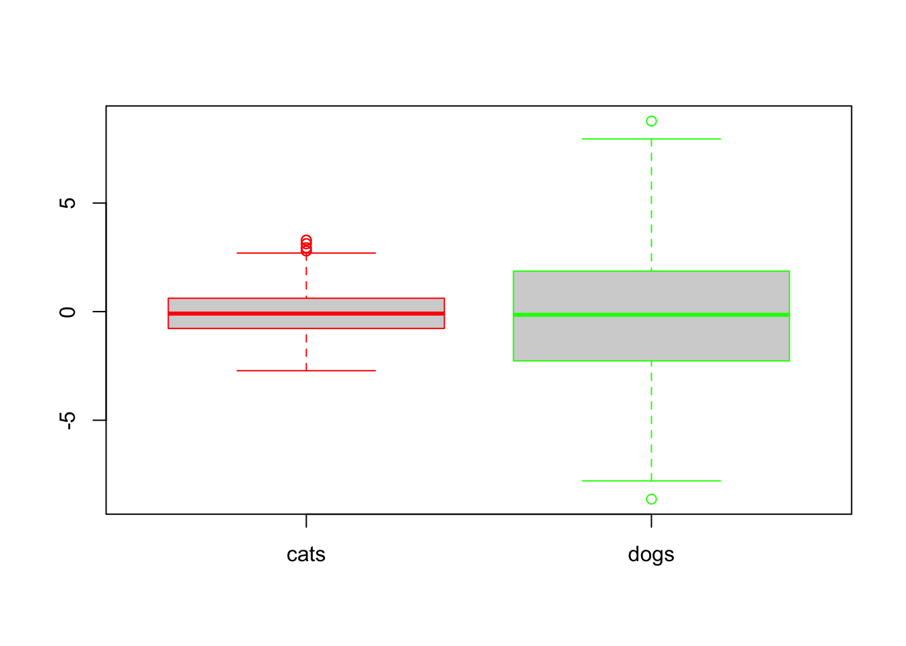
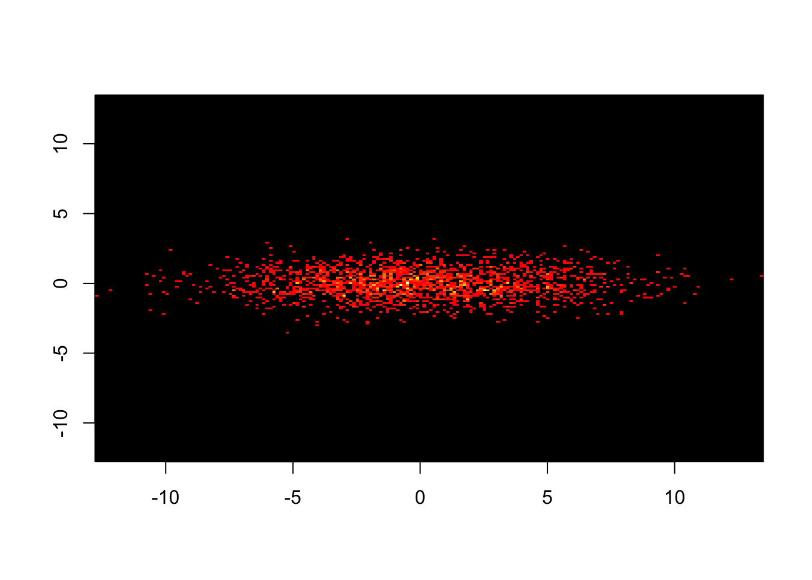
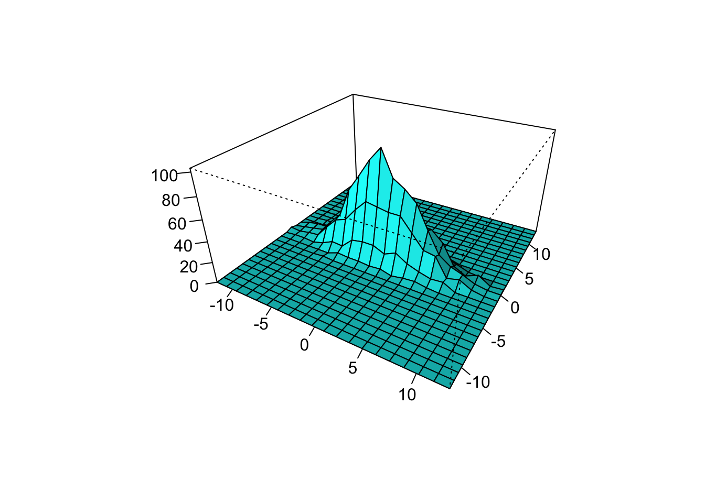
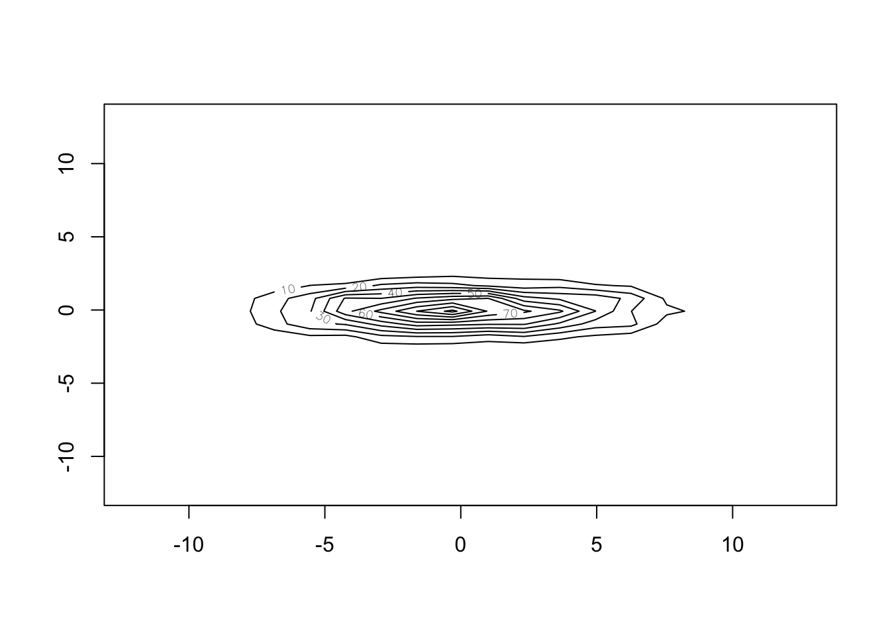

Week 7 Lecture/Lab
=============

## Week 7 Readings

For this week, I suggest reading Logan Chapter 5. There are many papers that might be helpful in the design of effective visualizations. Two that I would recommend highly are [Wainer (1984)](https://github.com/hlynch/Biometry2023/tree/master/_data/Wainer_1984.pdf) and [Rougier et al. (2014)](https://github.com/hlynch/Biometry2023/tree/master/_data/Rougier_etal_2014.pdf).

There are a suite of additional papers you should at least open and skim, papers on: [three-dimensional visualizations](https://github.com/hlynch/Biometry2023/tree/master/_data/Gehlenborg_Wong_2012.pdf), [callouts and labels](https://github.com/hlynch/Biometry2023/tree/master/_data/Krzywinski_2013.pdf), [axes, ticks, and grids](https://github.com/hlynch/Biometry2023/tree/master/_data/Krzywinski_2014.pdf), [error bars](https://github.com/hlynch/Biometry2023/tree/master/_data/Krzywinski_Altman_2013.pdf), and [box plots](https://github.com/hlynch/Biometry2023/tree/master/_data/Krzywinski_Altman_2014a.pdf).

## Introduction to plotting in R

We have already covered most of the basic elements of plotting, but here I'll go over some elements of plotting that you may not have learned already this semester.

You will need the packages 'ggplot2','gplots', and 'ade4' so you might as well install them now.


```r
library(ggplot2)
library(gplots)
```

```
## 
## Attaching package: 'gplots'
```

```
## The following object is masked from 'package:stats':
## 
##     lowess
```

```r
library(ade4)
```

Box plots
------------------

A boxplot is a convenient way of summarizing univariate data; the top and bottom of the rectangle represent the upper and lower quartiles of the data, the median by a horizontal line in the rectangle. There are several conventions for the whiskers, so the meaning of the whiskers should be explained clearly in the legend. One convention holds that the whisker extend to the further point that is no more than 1.5 times the interquartile range (75th-25th). In this case, outlying datapoints are shown with their own dot or star. You can also draw whiskers that extend out to the furthest datapoint.

Let's illustrate this using some randomly drawn data.


```r
boxplot(rnorm(1000,mean=0,sd=1),rnorm(1000,mean=0,sd=3))
```


We can play around with some of the options, such as naming the boxes and coloring the borders.


```r
boxplot(rnorm(1000,mean=0,sd=1),rnorm(1000,mean=0,sd=3),names=c("cats","dogs"), border=c("red","green"))
```



Two-dimensional data
-------------------------

Read in the following dataset describing [fox fur production as a function of year](https://github.com/hlynch/Biometry2021/tree/master/_data/FoxFurProduction.csv)


```r
fox.data<-read.csv("_data/FoxFurProduction.csv", header=F)
```

We could do our entire analysis referring to the two columns as [,1] and [,2] but to make our code more readable, lets add some column names


```r
colnames(fox.data)<-c("year","production")
```

Now we can refer to the two columns of data as $year and $production.

Now let's plot the data:


```r
plot(fox.data$year,fox.data$production)
abline(a=200,b=0)
abline(h=200)
points(fox.data$year[fox.data$production>200],fox.data$production[fox.data$production>200],cex=2,pch=16)
large.production<- fox.data$production>200
points(fox.data$year[large.production],fox.data$production[large.production],cex=2,pch=16)
```


Notice that with this code I am highlighting all the points where fur production is >200, and I added a horizontal bar at 200 using the function "abline". (Stop: Discuss the options for abline.)

All software packages make horrible default plots and R is no exception. Make the following changes to make a more information plot and to explore what R can do.

1. Label the x and y axes.
2. Try plotting as a line using "typ="l"""
3. Plot both points and lines suing "typ="b""
4. Change the plotting symbol using "pch=XX" where XX is a number between 1 and 25. 
5. While black is the logical default color, play around with color using the option "col=XX" where XX can be either a number or a name.

We can get R to list all of the named colors using


```r
colors()
```

```
##   [1] "white"                "aliceblue"            "antiquewhite"        
##   [4] "antiquewhite1"        "antiquewhite2"        "antiquewhite3"       
##   [7] "antiquewhite4"        "aquamarine"           "aquamarine1"         
##  [10] "aquamarine2"          "aquamarine3"          "aquamarine4"         
##  [13] "azure"                "azure1"               "azure2"              
##  [16] "azure3"               "azure4"               "beige"               
##  [19] "bisque"               "bisque1"              "bisque2"             
##  [22] "bisque3"              "bisque4"              "black"               
##  [25] "blanchedalmond"       "blue"                 "blue1"               
##  [28] "blue2"                "blue3"                "blue4"               
##  [31] "blueviolet"           "brown"                "brown1"              
##  [34] "brown2"               "brown3"               "brown4"              
##  [37] "burlywood"            "burlywood1"           "burlywood2"          
##  [40] "burlywood3"           "burlywood4"           "cadetblue"           
##  [43] "cadetblue1"           "cadetblue2"           "cadetblue3"          
##  [46] "cadetblue4"           "chartreuse"           "chartreuse1"         
##  [49] "chartreuse2"          "chartreuse3"          "chartreuse4"         
##  [52] "chocolate"            "chocolate1"           "chocolate2"          
##  [55] "chocolate3"           "chocolate4"           "coral"               
##  [58] "coral1"               "coral2"               "coral3"              
##  [61] "coral4"               "cornflowerblue"       "cornsilk"            
##  [64] "cornsilk1"            "cornsilk2"            "cornsilk3"           
##  [67] "cornsilk4"            "cyan"                 "cyan1"               
##  [70] "cyan2"                "cyan3"                "cyan4"               
##  [73] "darkblue"             "darkcyan"             "darkgoldenrod"       
##  [76] "darkgoldenrod1"       "darkgoldenrod2"       "darkgoldenrod3"      
##  [79] "darkgoldenrod4"       "darkgray"             "darkgreen"           
##  [82] "darkgrey"             "darkkhaki"            "darkmagenta"         
##  [85] "darkolivegreen"       "darkolivegreen1"      "darkolivegreen2"     
##  [88] "darkolivegreen3"      "darkolivegreen4"      "darkorange"          
##  [91] "darkorange1"          "darkorange2"          "darkorange3"         
##  [94] "darkorange4"          "darkorchid"           "darkorchid1"         
##  [97] "darkorchid2"          "darkorchid3"          "darkorchid4"         
## [100] "darkred"              "darksalmon"           "darkseagreen"        
## [103] "darkseagreen1"        "darkseagreen2"        "darkseagreen3"       
## [106] "darkseagreen4"        "darkslateblue"        "darkslategray"       
## [109] "darkslategray1"       "darkslategray2"       "darkslategray3"      
## [112] "darkslategray4"       "darkslategrey"        "darkturquoise"       
## [115] "darkviolet"           "deeppink"             "deeppink1"           
## [118] "deeppink2"            "deeppink3"            "deeppink4"           
## [121] "deepskyblue"          "deepskyblue1"         "deepskyblue2"        
## [124] "deepskyblue3"         "deepskyblue4"         "dimgray"             
## [127] "dimgrey"              "dodgerblue"           "dodgerblue1"         
## [130] "dodgerblue2"          "dodgerblue3"          "dodgerblue4"         
## [133] "firebrick"            "firebrick1"           "firebrick2"          
## [136] "firebrick3"           "firebrick4"           "floralwhite"         
## [139] "forestgreen"          "gainsboro"            "ghostwhite"          
## [142] "gold"                 "gold1"                "gold2"               
## [145] "gold3"                "gold4"                "goldenrod"           
## [148] "goldenrod1"           "goldenrod2"           "goldenrod3"          
## [151] "goldenrod4"           "gray"                 "gray0"               
## [154] "gray1"                "gray2"                "gray3"               
## [157] "gray4"                "gray5"                "gray6"               
## [160] "gray7"                "gray8"                "gray9"               
## [163] "gray10"               "gray11"               "gray12"              
## [166] "gray13"               "gray14"               "gray15"              
## [169] "gray16"               "gray17"               "gray18"              
## [172] "gray19"               "gray20"               "gray21"              
## [175] "gray22"               "gray23"               "gray24"              
## [178] "gray25"               "gray26"               "gray27"              
## [181] "gray28"               "gray29"               "gray30"              
## [184] "gray31"               "gray32"               "gray33"              
## [187] "gray34"               "gray35"               "gray36"              
## [190] "gray37"               "gray38"               "gray39"              
## [193] "gray40"               "gray41"               "gray42"              
## [196] "gray43"               "gray44"               "gray45"              
## [199] "gray46"               "gray47"               "gray48"              
## [202] "gray49"               "gray50"               "gray51"              
## [205] "gray52"               "gray53"               "gray54"              
## [208] "gray55"               "gray56"               "gray57"              
## [211] "gray58"               "gray59"               "gray60"              
## [214] "gray61"               "gray62"               "gray63"              
## [217] "gray64"               "gray65"               "gray66"              
## [220] "gray67"               "gray68"               "gray69"              
## [223] "gray70"               "gray71"               "gray72"              
## [226] "gray73"               "gray74"               "gray75"              
## [229] "gray76"               "gray77"               "gray78"              
## [232] "gray79"               "gray80"               "gray81"              
## [235] "gray82"               "gray83"               "gray84"              
## [238] "gray85"               "gray86"               "gray87"              
## [241] "gray88"               "gray89"               "gray90"              
## [244] "gray91"               "gray92"               "gray93"              
## [247] "gray94"               "gray95"               "gray96"              
## [250] "gray97"               "gray98"               "gray99"              
## [253] "gray100"              "green"                "green1"              
## [256] "green2"               "green3"               "green4"              
## [259] "greenyellow"          "grey"                 "grey0"               
## [262] "grey1"                "grey2"                "grey3"               
## [265] "grey4"                "grey5"                "grey6"               
## [268] "grey7"                "grey8"                "grey9"               
## [271] "grey10"               "grey11"               "grey12"              
## [274] "grey13"               "grey14"               "grey15"              
## [277] "grey16"               "grey17"               "grey18"              
## [280] "grey19"               "grey20"               "grey21"              
## [283] "grey22"               "grey23"               "grey24"              
## [286] "grey25"               "grey26"               "grey27"              
## [289] "grey28"               "grey29"               "grey30"              
## [292] "grey31"               "grey32"               "grey33"              
## [295] "grey34"               "grey35"               "grey36"              
## [298] "grey37"               "grey38"               "grey39"              
## [301] "grey40"               "grey41"               "grey42"              
## [304] "grey43"               "grey44"               "grey45"              
## [307] "grey46"               "grey47"               "grey48"              
## [310] "grey49"               "grey50"               "grey51"              
## [313] "grey52"               "grey53"               "grey54"              
## [316] "grey55"               "grey56"               "grey57"              
## [319] "grey58"               "grey59"               "grey60"              
## [322] "grey61"               "grey62"               "grey63"              
## [325] "grey64"               "grey65"               "grey66"              
## [328] "grey67"               "grey68"               "grey69"              
## [331] "grey70"               "grey71"               "grey72"              
## [334] "grey73"               "grey74"               "grey75"              
## [337] "grey76"               "grey77"               "grey78"              
## [340] "grey79"               "grey80"               "grey81"              
## [343] "grey82"               "grey83"               "grey84"              
## [346] "grey85"               "grey86"               "grey87"              
## [349] "grey88"               "grey89"               "grey90"              
## [352] "grey91"               "grey92"               "grey93"              
## [355] "grey94"               "grey95"               "grey96"              
## [358] "grey97"               "grey98"               "grey99"              
## [361] "grey100"              "honeydew"             "honeydew1"           
## [364] "honeydew2"            "honeydew3"            "honeydew4"           
## [367] "hotpink"              "hotpink1"             "hotpink2"            
## [370] "hotpink3"             "hotpink4"             "indianred"           
## [373] "indianred1"           "indianred2"           "indianred3"          
## [376] "indianred4"           "ivory"                "ivory1"              
## [379] "ivory2"               "ivory3"               "ivory4"              
## [382] "khaki"                "khaki1"               "khaki2"              
## [385] "khaki3"               "khaki4"               "lavender"            
## [388] "lavenderblush"        "lavenderblush1"       "lavenderblush2"      
## [391] "lavenderblush3"       "lavenderblush4"       "lawngreen"           
## [394] "lemonchiffon"         "lemonchiffon1"        "lemonchiffon2"       
## [397] "lemonchiffon3"        "lemonchiffon4"        "lightblue"           
## [400] "lightblue1"           "lightblue2"           "lightblue3"          
## [403] "lightblue4"           "lightcoral"           "lightcyan"           
## [406] "lightcyan1"           "lightcyan2"           "lightcyan3"          
## [409] "lightcyan4"           "lightgoldenrod"       "lightgoldenrod1"     
## [412] "lightgoldenrod2"      "lightgoldenrod3"      "lightgoldenrod4"     
## [415] "lightgoldenrodyellow" "lightgray"            "lightgreen"          
## [418] "lightgrey"            "lightpink"            "lightpink1"          
## [421] "lightpink2"           "lightpink3"           "lightpink4"          
## [424] "lightsalmon"          "lightsalmon1"         "lightsalmon2"        
## [427] "lightsalmon3"         "lightsalmon4"         "lightseagreen"       
## [430] "lightskyblue"         "lightskyblue1"        "lightskyblue2"       
## [433] "lightskyblue3"        "lightskyblue4"        "lightslateblue"      
## [436] "lightslategray"       "lightslategrey"       "lightsteelblue"      
## [439] "lightsteelblue1"      "lightsteelblue2"      "lightsteelblue3"     
## [442] "lightsteelblue4"      "lightyellow"          "lightyellow1"        
## [445] "lightyellow2"         "lightyellow3"         "lightyellow4"        
## [448] "limegreen"            "linen"                "magenta"             
## [451] "magenta1"             "magenta2"             "magenta3"            
## [454] "magenta4"             "maroon"               "maroon1"             
## [457] "maroon2"              "maroon3"              "maroon4"             
## [460] "mediumaquamarine"     "mediumblue"           "mediumorchid"        
## [463] "mediumorchid1"        "mediumorchid2"        "mediumorchid3"       
## [466] "mediumorchid4"        "mediumpurple"         "mediumpurple1"       
## [469] "mediumpurple2"        "mediumpurple3"        "mediumpurple4"       
## [472] "mediumseagreen"       "mediumslateblue"      "mediumspringgreen"   
## [475] "mediumturquoise"      "mediumvioletred"      "midnightblue"        
## [478] "mintcream"            "mistyrose"            "mistyrose1"          
## [481] "mistyrose2"           "mistyrose3"           "mistyrose4"          
## [484] "moccasin"             "navajowhite"          "navajowhite1"        
## [487] "navajowhite2"         "navajowhite3"         "navajowhite4"        
## [490] "navy"                 "navyblue"             "oldlace"             
## [493] "olivedrab"            "olivedrab1"           "olivedrab2"          
## [496] "olivedrab3"           "olivedrab4"           "orange"              
## [499] "orange1"              "orange2"              "orange3"             
## [502] "orange4"              "orangered"            "orangered1"          
## [505] "orangered2"           "orangered3"           "orangered4"          
## [508] "orchid"               "orchid1"              "orchid2"             
## [511] "orchid3"              "orchid4"              "palegoldenrod"       
## [514] "palegreen"            "palegreen1"           "palegreen2"          
## [517] "palegreen3"           "palegreen4"           "paleturquoise"       
## [520] "paleturquoise1"       "paleturquoise2"       "paleturquoise3"      
## [523] "paleturquoise4"       "palevioletred"        "palevioletred1"      
## [526] "palevioletred2"       "palevioletred3"       "palevioletred4"      
## [529] "papayawhip"           "peachpuff"            "peachpuff1"          
## [532] "peachpuff2"           "peachpuff3"           "peachpuff4"          
## [535] "peru"                 "pink"                 "pink1"               
## [538] "pink2"                "pink3"                "pink4"               
## [541] "plum"                 "plum1"                "plum2"               
## [544] "plum3"                "plum4"                "powderblue"          
## [547] "purple"               "purple1"              "purple2"             
## [550] "purple3"              "purple4"              "red"                 
## [553] "red1"                 "red2"                 "red3"                
## [556] "red4"                 "rosybrown"            "rosybrown1"          
## [559] "rosybrown2"           "rosybrown3"           "rosybrown4"          
## [562] "royalblue"            "royalblue1"           "royalblue2"          
## [565] "royalblue3"           "royalblue4"           "saddlebrown"         
## [568] "salmon"               "salmon1"              "salmon2"             
## [571] "salmon3"              "salmon4"              "sandybrown"          
## [574] "seagreen"             "seagreen1"            "seagreen2"           
## [577] "seagreen3"            "seagreen4"            "seashell"            
## [580] "seashell1"            "seashell2"            "seashell3"           
## [583] "seashell4"            "sienna"               "sienna1"             
## [586] "sienna2"              "sienna3"              "sienna4"             
## [589] "skyblue"              "skyblue1"             "skyblue2"            
## [592] "skyblue3"             "skyblue4"             "slateblue"           
## [595] "slateblue1"           "slateblue2"           "slateblue3"          
## [598] "slateblue4"           "slategray"            "slategray1"          
## [601] "slategray2"           "slategray3"           "slategray4"          
## [604] "slategrey"            "snow"                 "snow1"               
## [607] "snow2"                "snow3"                "snow4"               
## [610] "springgreen"          "springgreen1"         "springgreen2"        
## [613] "springgreen3"         "springgreen4"         "steelblue"           
## [616] "steelblue1"           "steelblue2"           "steelblue3"          
## [619] "steelblue4"           "tan"                  "tan1"                
## [622] "tan2"                 "tan3"                 "tan4"                
## [625] "thistle"              "thistle1"             "thistle2"            
## [628] "thistle3"             "thistle4"             "tomato"              
## [631] "tomato1"              "tomato2"              "tomato3"             
## [634] "tomato4"              "turquoise"            "turquoise1"          
## [637] "turquoise2"           "turquoise3"           "turquoise4"          
## [640] "violet"               "violetred"            "violetred1"          
## [643] "violetred2"           "violetred3"           "violetred4"          
## [646] "wheat"                "wheat1"               "wheat2"              
## [649] "wheat3"               "wheat4"               "whitesmoke"          
## [652] "yellow"               "yellow1"              "yellow2"             
## [655] "yellow3"              "yellow4"              "yellowgreen"
```

but we can also explicitly type in RGB values using the rgb() function and values (from 0 to MaxColorValue, which is 1 by default) for each of the red, green, and blue components. 
 

```r
plot(fox.data$year,fox.data$production,col=rgb(red=0,green=1,blue=0))
```


 
You can extract rgb values from a named color using the col2rgb() function


```r
col2rgb("peachpuff")
```

```
##       [,1]
## red    255
## green  218
## blue   185
```

For complex plots which require a suite of colors, I highly recommend using the R package RColorBrewer. This package has a companion website for choosing color schemes (for mapping, for example) www.colorbrewer2.org. RColorBrewer allows you to pick color schemes with certain characteristics (diverging, sequential, etc) and to select a certain number of colors within that color scheme. The website also suggests color schemes that are color-blind friendly (often required for publication).


```r
library(RColorBrewer)
```

```
## Warning: package 'RColorBrewer' was built under R version 4.0.5
```

```r
mypalette<-brewer.pal(7,"Greens")
image(1:7,1,as.matrix(1:7),col=mypalette,xlab="Greens (sequential)",
      ylab="",xaxt="n",yaxt="n",bty="n")
```


This is a sequential palette. ColorBrewer also offers up a variety of divergent and qualitative palettes such as


```r
display.brewer.pal(7,"BrBG")
```


and


```r
display.brewer.pal(7,"Accent")
```


There are many other options. You can extract the actual hex codes for these colors using


```r
brewer.pal(7,"Accent")
```

```
## [1] "#7FC97F" "#BEAED4" "#FDC086" "#FFFF99" "#386CB0" "#F0027F" "#BF5B17"
```

To play around with a few more graphics options, we will use one of the built-in datasets that has R called "mtcars". I will break one of my own rules here and attach the dataset.


```r
attach(mtcars)
```

```
## The following object is masked from package:ggplot2:
## 
##     mpg
```

```r
plot(wt, mpg, main="Milage vs. Car Weight",xlab="Weight", ylab="Mileage", pch=18, col="blue")
text(wt, mpg, row.names(mtcars), cex=0.6, pos=4, col="red")
```


Note that we can add a legend:


```r
# Legend Example
boxplot(mpg~cyl, main="Milage by Car Weight",yaxt="n", xlab="Milage", horizontal=TRUE,col=terrain.colors(3))
legend("topright", inset=.05, title="Number of Cylinders",c("4","6","8"), fill=terrain.colors(3), horiz=TRUE)
```


Be aware of overplotting (points that overlap) especially when data are discrete or rounded. One strategy for overcoming this is jittering the points so the density of points can be displayed without overly distorting the underlying relationships. You can use the 'jitter' command in the base package.


```r
jitter(rep(0, 7))
```

```
## [1]  0.014162834 -0.010974714  0.014741596 -0.013839037 -0.009673522
## [6] -0.006468554  0.011450812
```

Before we launch into three-dimensional plotting, we should introduce 'ggplot2' which is quickly becoming "industry standard" for making plots in R. There is *so* much that can be done with ggplot2 that we will only scratch the surface today, but at least this introduction will illustrate some of the things that ggplot2 can do.

The basic function to make plots using ggplot2 is 'qplot'. We can recreate the scatterplot of the mtcars data using ggplot2 as follows


```r
library(ggplot2)
qplot(wt, mpg, main="Milage vs. Car Weight",xlab="Weight", ylab="Mileage", data=mtcars)
```

```
## Warning: `qplot()` was deprecated in ggplot2 3.4.0.
## This warning is displayed once every 8 hours.
## Call `lifecycle::last_lifecycle_warnings()` to see where this warning was
## generated.
```


We can also do fancier things, such as


```r
mtcars$gear <- factor(mtcars$gear,levels=c(3,4,5),
   labels=c("3gears","4gears","5gears"))
mtcars$am <- factor(mtcars$am,levels=c(0,1),
   labels=c("Automatic","Manual"))
mtcars$cyl <- factor(mtcars$cyl,levels=c(4,6,8),
   labels=c("4cyl","6cyl","8cyl"))

# Kernel density plots for mpg
# grouped by number of gears (indicated by color)
qplot(mpg, data=mtcars, geom="density", fill=gear, alpha=I(.5),
   main="Distribution of Gas Milage", xlab="Miles Per Gallon",
   ylab="Density")
```


There is more to ggplot2 than I can cover today, but if you are serious about making nice plots, its worth investing some time in learning this package.


Three-dimensional data
------------------------

There are almost an infinite variety of graphical options for R, most of which are available through the contributed R packages. We will use one of them now to demonstrate some of R's other graphical options.

You should already have installed the R package 'gplots' but if not, do so now. 


```r
library(gplots,quietly=TRUE,warn.conflicts=F)
```

For data, we will simply draw samples from the normal distribution. Feel free to choose any two distributions of your own liking.


```r
x <- rnorm(2000, sd=4)
y <- rnorm(2000, sd=1)
hist2d(x,y, same.scale=TRUE)
```



```
## 
## ----------------------------
## 2-D Histogram Object
## ----------------------------
## 
## Call: hist2d(x = x, y = y, same.scale = TRUE)
## 
## Number of data points:  2000 
## Number of grid bins:  200 x 200 
## X range: ( -14.66493 , 14.24997 )
## Y range: ( -14.66493 , 14.24997 )
```

Notice that we had to use "same.scale=T" to make sure that distances along the x and y axes were comparable.

Now we will use the hisr2d function to create inputs for a three-dimensional perspective plot.


```r
h2d <- hist2d(x,y,show=FALSE, same.scale=TRUE, nbins=c(20,30))
persp( h2d$x, h2d$y, h2d$counts, ticktype="detailed", theta=30, phi=30, expand=0.5, shade=0.5, col="cyan", ltheta=-30,xlab="",ylab="",zlab="")
```



Make sure you know what these options all mean! Play around with theta and phi and see how that changes the perspective.

Let's use the same data and make a contour plot.


```r
contour( h2d$x, h2d$y, h2d$counts, nlevels=10)
```



We can also make a filled contour plot:


```r
filled.contour( h2d$x, h2d$y, h2d$counts, nlevels=10, col=gray((10:0)/10))
```


Play around with "col=rainbow(10)" or "col=topo.colors(10)".

Go back and play around with some of the other distributions from the last few weeks. It is particularly useful to use the 2-dimensional histograms to get a sense for what changing a distribution parameter does to the distribution.

We can demonstrate some other kinds of plots R can make using some of the built in datasets. Here we demonstrate both a color plot and a contour plot:


```r
x <- 10*(1:nrow(volcano))
x.at <- seq(100, 800, by=100)
y <- 10*(1:ncol(volcano))
y.at <- seq(100, 600, by=100)
image(x, y, volcano, col=terrain.colors(100),axes=FALSE)
contour(x, y, volcano, levels=seq(90, 200, by=5), add=TRUE, col="brown")
axis(1, at=x.at)
axis(2, at=y.at)
box()
title(main="Maunga Whau Volcano", sub = "col=terrain.colors(100)", font.main=4)
```


Multiple plots
---------------------

Now we will discuss how to arrange multiple plots of the same page.

With the par() function, you can include the option mfrow=c(nrows,ncols) to make a matrix of nrowsxncols plots that are filled by row. mfcol=c(nrows,ncols) would fill the matrix by columns.


```r
# 4 figures arranged in 2 rows and 2 columns
par(mfrow=c(2,2))
plot(mtcars$wt,mtcars$mpg, main="Scatterplot of wt vs. mpg")
plot(mtcars$wt,mtcars$disp, main="Scatterplot of wt vs disp")
hist(mtcars$wt, main="Histogram of wt")
boxplot(mtcars$wt, main="Boxplot of wt")
```


```r
# 3 figures arranged in 3 rows and 1 column
layout(matrix(c(1,1,2,3), 2, 2, byrow = TRUE))
hist(mtcars$wt)
hist(mtcars$mpg)
hist(mtcars$disp)
```


Now for a slightly complicated example that uses much of what we have learned. Childrens IQ scores are normally distributed with a mean of 100 and a standard deviation of 15. What proportion of children are expected to have an IQ between 80 and 120?


```r
mean<-100
sd<-15
lb<-80
ub<-120
x<-seq(-4,4,length=100)*sd+mean
hx<-dnorm(x,mean,sd)
plot(x,hx,typ="n",xlab="IQ Values",ylab="Density",main="Normal Distribution",axes=F)
i<-x>=lb & x<=ub
lines(x,hx)
polygon(c(lb,x[i],ub),c(0,hx[i],0),col="red")
```


As one final example, we will plot scatter plots with marginal histograms. For this we need to install the R package "ade4". This package has a huge number of useful functions, which we can look at here:

<a href="http://pbil.univ-lyon1.fr/ADE-4/" target="_blank">The ade4 webpage</a>

For now, I just want to use some of its plotting functionality to illustrate the kinds of sophisticated graphics R is capable of.


```r
library(ade4)
data(rpjdl)
```

First, lets just look at the data using "?rpjdl".


```r
coa1<-dudi.coa(rpjdl$fau,scannf=FALSE,nf=4)
s.hist(coa1$li)
```


```
## [1] 10 20 30
```

Finally, just a word of advice about making figures for publication. While R is very flexible, making publication ready figures can be very time consuming in R. If you have any possibility of using Adobe Illustrator, I *highly* suggest using R to get your figure 90% correct, and then exporting it as an .eps (Encapsulated Postscript) to Illustrator. 

Except is very rare cases where you have an actual photo or image in your figure, you want to keep your figures as vector graphics throughout the entire process. Postscript (.ps) and Encapsulated Postscript (.eps) are vector file formats, but .tiff, .jpeg, and .png are not. Vector file formats will preserve the clarity pf your figure at any size scale, so your figure remains crisp and clear throughout the creation process. 

In Illustrator, you can relabel everything (in whatever font the editor prefers), fix the line widths, tweak the colors as needed, arrange multiple panels as needed, add arrows and legends or other details, make one figure an inset of another, or do anything else you could possibly want to do. Illustrator has a learning curve of its own but is well worth the investment.


