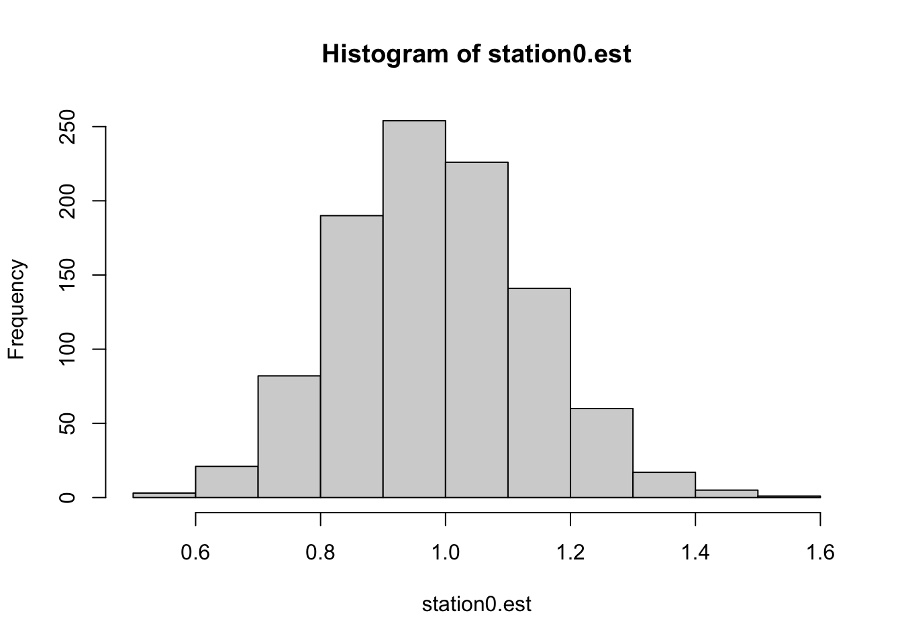

Week 8 Lab
=============

Our first task is to go over how to write a linear model in R. Let's take a moment to go through Logan Table 7.3.


Covariate as number vs. covariate as factor
--------

First we will read in [some data](https://github.com/hlynch/Biometry2021/tree/master/_data/fish.txt) on mercury levels in fish. 


```r
data<-read.table("_data/fish.txt",header=T)
head(data)
```

```
##   RIVER STATION LENGTH WEIGHT MERCURY
## 1     0       0   47.0   1616    1.60
## 2     0       0   48.7   1862    1.50
## 3     0       0   55.7   2855    1.70
## 4     0       0   45.2   1199    0.73
## 5     0       0   44.7   1320    0.56
## 6     0       0   43.8   1225    0.51
```

Let's use Station as a categorical variable, and use it as a covariate for a model of mercury:


```r
Station<-data$STATION
Mercury<-data$MERCURY
```

What's the difference between 


```r
Station
```

```
##   [1]  0  0  0  0  0  0  0  0  0  0  1  1  1  1  1  1  1  1  1  1  1  1  1  1  1
##  [26]  1  1  1  1  2  2  2  2  2  2  2  2  2  2  2  2  2  3  3  3  3  3  3  3  3
##  [51]  3  3  4  4  4  4  4  4  4  4  4  4  4  4  4  4  5  5  5  6  6  6  6  7  7
##  [76]  7  7  7  7  7  7  7  7  8  8  8  8  8  8  8  8  8  8  8  8  8  8  9  9  9
## [101] 10 10 10 10 10 10 10 10 10 10 10 10 10 10 10 10 10 10 10 10 10 11 11 11 11
## [126] 11 11 11 11 11 12 12 12 12 12 12 12 12 12 12 12 12 12 13 13 13 13 14 14 14
## [151] 14 14 14 14 14 14 14 14 14 14 15 15 15 15 15 15 15 15 15 15 15
```

and


```r
as.factor(Station)
```

```
##   [1] 0  0  0  0  0  0  0  0  0  0  1  1  1  1  1  1  1  1  1  1  1  1  1  1  1 
##  [26] 1  1  1  1  2  2  2  2  2  2  2  2  2  2  2  2  2  3  3  3  3  3  3  3  3 
##  [51] 3  3  4  4  4  4  4  4  4  4  4  4  4  4  4  4  5  5  5  6  6  6  6  7  7 
##  [76] 7  7  7  7  7  7  7  7  8  8  8  8  8  8  8  8  8  8  8  8  8  8  9  9  9 
## [101] 10 10 10 10 10 10 10 10 10 10 10 10 10 10 10 10 10 10 10 10 10 11 11 11 11
## [126] 11 11 11 11 11 12 12 12 12 12 12 12 12 12 12 12 12 12 13 13 13 13 14 14 14
## [151] 14 14 14 14 14 14 14 14 14 14 15 15 15 15 15 15 15 15 15 15 15
## Levels: 0 1 2 3 4 5 6 7 8 9 10 11 12 13 14 15
```

To see what impact this has on the modelling, let's write a basic linear model in R


```r
fit<-lm(Mercury~Station)
summary(fit)
```

```
## 
## Call:
## lm(formula = Mercury ~ Station)
## 
## Residuals:
##     Min      1Q  Median      3Q     Max 
## -1.3005 -0.5324 -0.1256  0.4088  2.3669 
## 
## Coefficients:
##             Estimate Std. Error t value Pr(>|t|)    
## (Intercept)  0.85564    0.10121   8.454 1.26e-14 ***
## Station      0.04624    0.01161   3.983 0.000101 ***
## ---
## Signif. codes:  0 '***' 0.001 '**' 0.01 '*' 0.05 '.' 0.1 ' ' 1
## 
## Residual standard error: 0.7304 on 169 degrees of freedom
## Multiple R-squared:  0.0858,	Adjusted R-squared:  0.08039 
## F-statistic: 15.86 on 1 and 169 DF,  p-value: 0.0001011
```

and compare this with


```r
fit2<-lm(Mercury~as.factor(Station))
summary(fit2)
```

```
## 
## Call:
## lm(formula = Mercury ~ as.factor(Station))
## 
## Residuals:
##     Min      1Q  Median      3Q     Max 
## -1.3525 -0.3767 -0.1100  0.3592  2.0779 
## 
## Coefficients:
##                      Estimate Std. Error t value Pr(>|t|)    
## (Intercept)           0.99300    0.19842   5.005 1.50e-06 ***
## as.factor(Station)1  -0.14879    0.24513  -0.607  0.54475    
## as.factor(Station)2   0.14777    0.26392   0.560  0.57635    
## as.factor(Station)3   0.30800    0.28060   1.098  0.27407    
## as.factor(Station)4   0.02914    0.25979   0.112  0.91083    
## as.factor(Station)5  -0.24300    0.41304  -0.588  0.55717    
## as.factor(Station)6   1.08950    0.37120   2.935  0.00384 ** 
## as.factor(Station)7  -0.30300    0.28060  -1.080  0.28190    
## as.factor(Station)8  -0.20657    0.25979  -0.795  0.42774    
## as.factor(Station)9   0.32367    0.41304   0.784  0.43446    
## as.factor(Station)10  0.52129    0.24107   2.162  0.03212 *  
## as.factor(Station)11  0.28144    0.28829   0.976  0.33046    
## as.factor(Station)12 -0.50608    0.26392  -1.918  0.05701 .  
## as.factor(Station)13  0.22700    0.37120   0.612  0.54175    
## as.factor(Station)14  0.97623    0.26392   3.699  0.00030 ***
## as.factor(Station)15  1.11155    0.27415   4.054 7.93e-05 ***
## ---
## Signif. codes:  0 '***' 0.001 '**' 0.01 '*' 0.05 '.' 0.1 ' ' 1
## 
## Residual standard error: 0.6274 on 155 degrees of freedom
## Multiple R-squared:  0.3813,	Adjusted R-squared:  0.3214 
## F-statistic: 6.367 on 15 and 155 DF,  p-value: 2.1e-10
```

This second approach is what we are interested in, because we want to use the Stations as categorical factors. 

**<span style="color: green;">Checkpoint #1: Why is the intercept for fit2 not the same as the intercept for fit?</span>** We won't get into linear regression formally until next week, but we can see what's going on if we plot the data and the best-fit line together on the same plot.


```r
plot(Station, Mercury,cex=1,xlab="Station as a numeric",ylab="Mercury")
abline(a=coef(fit)[1],b=coef(fit)[2],col="red")
segments(x0=-0.5,x1=0.5,y0=coef(fit2)[1],y1=coef(fit2)[1],col="blue",lwd=4)
```


The blue segment shows you the mean mercury measurement for the first station (Station 0), whereas the intercept of the red line is a little lower. Why? Because the best fitting line for all the mercury measurements doesn't necessary pass through the mean value for the first station. 

To make our consideration of contrasts easy, let's just redefine the variable accordingly:


```r
Station<-as.factor(Station)
```

Let's examine this output for a second. How do we interpret the intercept? Notice that Station=0 isn't represented among the factors, it has been turned in to (a.k.a. "aliased by") the intercept. We can convince ourselves this is true using


```r
mean(Mercury[Station=="0"])
```

```
## [1] 0.993
```

(We have to use quotes now, because the variable "Station" is a factor, which means the levels are now identified by names (characters) which must be put in quotes.)


**<span style="color: green;">Checkpoint #2: Do you understand what the intercept of fit2 means? Can you predict what the value for as.factor(Station)1 means?</span>**

We can also convince ourselves of the other model estimates using


```r
mean(Mercury[Station=="1"])
```

```
## [1] 0.8442105
```

```r
mean(Mercury[Station=="2"])
```

```
## [1] 1.140769
```


When fitting a model involving categorical factors as predictors, R will always use the first factor for the intercept, which is the one that comes first alphabetically or numerically. This may not be what you actually want to do. Why?? Because the hypotheses being tested are:

$$
H_{0}: \mbox{Factor level 1} = \mbox{Intercept}=0 
$$
$$
H_{0}: \mbox{Difference between factor level 2 and factor level 1} = 0            
$$
$$
H_{0}: \mbox{Difference between factor level 3 and factor level 1} = 0
$$
$$
H_{0}: \mbox{Difference between factor level 4 and factor level 1} = 0 
$$

etc. In other words, with the exception of the first factor which is the intercept, you are testing the equality of each factor with the first factor, not against zero (or other benchmark).

This is the "Treatment contrasts/Dummy coding" approach we discussed in lecture on Tuesday. We can confirm this by having R tell us what its default behavior is when faced with categorical predictors.


```r
options()$contrasts
```

```
##         unordered           ordered 
## "contr.treatment"      "contr.poly"
```

(As a side note, we can just call "options()" to get all sorts of information about R's defaults.) 

We can get R to spit out the design matrix for this set of contrasts using


```r
contr.treatment(15)
```

```
##    2 3 4 5 6 7 8 9 10 11 12 13 14 15
## 1  0 0 0 0 0 0 0 0  0  0  0  0  0  0
## 2  1 0 0 0 0 0 0 0  0  0  0  0  0  0
## 3  0 1 0 0 0 0 0 0  0  0  0  0  0  0
## 4  0 0 1 0 0 0 0 0  0  0  0  0  0  0
## 5  0 0 0 1 0 0 0 0  0  0  0  0  0  0
## 6  0 0 0 0 1 0 0 0  0  0  0  0  0  0
## 7  0 0 0 0 0 1 0 0  0  0  0  0  0  0
## 8  0 0 0 0 0 0 1 0  0  0  0  0  0  0
## 9  0 0 0 0 0 0 0 1  0  0  0  0  0  0
## 10 0 0 0 0 0 0 0 0  1  0  0  0  0  0
## 11 0 0 0 0 0 0 0 0  0  1  0  0  0  0
## 12 0 0 0 0 0 0 0 0  0  0  1  0  0  0
## 13 0 0 0 0 0 0 0 0  0  0  0  1  0  0
## 14 0 0 0 0 0 0 0 0  0  0  0  0  1  0
## 15 0 0 0 0 0 0 0 0  0  0  0  0  0  1
```


Another approach would be to take the intercept out of the model, so the coefficients simply represented the group means. We can do this by including a "-1" in the model statement.


```r
fit3<-lm(Mercury~Station-1)
summary(fit3)
```

```
## 
## Call:
## lm(formula = Mercury ~ Station - 1)
## 
## Residuals:
##     Min      1Q  Median      3Q     Max 
## -1.3525 -0.3767 -0.1100  0.3592  2.0779 
## 
## Coefficients:
##           Estimate Std. Error t value Pr(>|t|)    
## Station0    0.9930     0.1984   5.005 1.50e-06 ***
## Station1    0.8442     0.1439   5.865 2.63e-08 ***
## Station2    1.1408     0.1740   6.555 7.80e-10 ***
## Station3    1.3010     0.1984   6.557 7.74e-10 ***
## Station4    1.0221     0.1677   6.095 8.32e-09 ***
## Station5    0.7500     0.3623   2.070 0.040078 *  
## Station6    2.0825     0.3137   6.638 5.05e-10 ***
## Station7    0.6900     0.1984   3.478 0.000657 ***
## Station8    0.7864     0.1677   4.690 5.96e-06 ***
## Station9    1.3167     0.3623   3.635 0.000378 ***
## Station10   1.5143     0.1369  11.060  < 2e-16 ***
## Station11   1.2744     0.2091   6.093 8.40e-09 ***
## Station12   0.4869     0.1740   2.798 0.005794 ** 
## Station13   1.2200     0.3137   3.889 0.000149 ***
## Station14   1.9692     0.1740  11.316  < 2e-16 ***
## Station15   2.1045     0.1892  11.124  < 2e-16 ***
## ---
## Signif. codes:  0 '***' 0.001 '**' 0.01 '*' 0.05 '.' 0.1 ' ' 1
## 
## Residual standard error: 0.6274 on 155 degrees of freedom
## Multiple R-squared:  0.8213,	Adjusted R-squared:  0.8029 
## F-statistic: 44.53 on 16 and 155 DF,  p-value: < 2.2e-16
```

Notice that all stations are now treated equally, there is no intercept, and the model coefficients (the group means) are tested for significant differences from 0.

Let's pause for a second and make sure we understand how R calculated the estimates and their standard errors. The estimates are pretty straightforward, in fact we have already calculated this.


```r
mean(Mercury[Station=="0"])
```

```
## [1] 0.993
```

But how did R calculate the standard errors? Let's stop and think for a second as to what the standard error of an estimate represents. We know the standard error of the mean of a (normal) distribution is given by

$$
\mbox{Standard error of the mean} = \frac{\mbox{standard deviation}}{\sqrt{\mbox{sample size}}} 
$$

So the standard error of any estimate is, roughly speaking, the (residual) variation divided by the square root of the sample size. (In the case of the SEM, all the variation is "residual".)

What is the residual variation in this case? One way to measure residual variation within the Station=0 group is to calculate the standard deviation of the Station=0 data.


```r
sd(Mercury[Station=="0"])
```

```
## [1] 0.5043158
```

Using this as the "residual" variation, we would calculate the standard error of the coefficient for the Station=0 group as follows:


```r
sd(Mercury[Station=="0"])/sqrt(length(Mercury[Station=="0"]))
```

```
## [1] 0.1594787
```

But this doesn't match what R has returned!! Why not? Because an even better estimate of the "residual" variation is the pooled estimate of the residual variation, where we use not only the residual variation within the Station=0 group, but within each of the Stations. R returned this value above: "Residual standard error:0.6274". Using this value, we calculate


```r
0.6274/sqrt(length(Mercury[Station=="0"]))
```

```
## [1] 0.1984013
```

Now we get what R has returned for the standard error on the co-efficient for the Station=0 group. **<span style="color: green;">Checkpoint #3: Does this make sense?</span>** Its important to recognize that your intuition to use the standard deviation within the Station=0 group to estimate the standard error of the coefficient is not wrong, but that by pooling the data, we can get a more precise estimate of that residual standard deviation. Notice also that the only difference in standard errors between the different stations comes from the different sample sizes.

We can write a short script to bootstrap resample data within each station (sample with replacement within station 0, then sample with resamplement within station 1, etc.) and calculate the standard deviation of the estimate for Station 0. This should be at least approximately equal to the standard error of the estimate as reported by the model's fit using the real data. 


```r
station0.est<-c()
for (i in 1:1000)
{
  data.bootstrap<-data
  Station.bootstrap<-data.bootstrap$STATION
  Mercury.bootstrap<-data.bootstrap$MERCURY
  Mercury.bootstrap[Station.bootstrap=="0"]<-sample(Mercury.bootstrap[Station.bootstrap=="0"],length(Mercury.bootstrap[Station.bootstrap=="0"]),replace=T)
  Mercury.bootstrap[Station.bootstrap=="1"]<-sample(Mercury.bootstrap[Station.bootstrap=="1"],length(Mercury.bootstrap[Station.bootstrap=="1"]),replace=T)
  Mercury.bootstrap[Station.bootstrap=="2"]<-sample(Mercury.bootstrap[Station.bootstrap=="2"],length(Mercury.bootstrap[Station.bootstrap=="2"]),replace=T)
  Mercury.bootstrap[Station.bootstrap=="3"]<-sample(Mercury.bootstrap[Station.bootstrap=="3"],length(Mercury.bootstrap[Station.bootstrap=="3"]),replace=T)
  Mercury.bootstrap[Station.bootstrap=="4"]<-sample(Mercury.bootstrap[Station.bootstrap=="4"],length(Mercury.bootstrap[Station.bootstrap=="4"]),replace=T)
  Mercury.bootstrap[Station.bootstrap=="5"]<-sample(Mercury.bootstrap[Station.bootstrap=="5"],length(Mercury.bootstrap[Station.bootstrap=="5"]),replace=T)
  Mercury.bootstrap[Station.bootstrap=="6"]<-sample(Mercury.bootstrap[Station.bootstrap=="6"],length(Mercury.bootstrap[Station.bootstrap=="6"]),replace=T)
  Mercury.bootstrap[Station.bootstrap=="7"]<-sample(Mercury.bootstrap[Station.bootstrap=="7"],length(Mercury.bootstrap[Station.bootstrap=="7"]),replace=T)
  Mercury.bootstrap[Station.bootstrap=="8"]<-sample(Mercury.bootstrap[Station.bootstrap=="8"],length(Mercury.bootstrap[Station.bootstrap=="8"]),replace=T)
  Mercury.bootstrap[Station.bootstrap=="9"]<-sample(Mercury.bootstrap[Station.bootstrap=="9"],length(Mercury.bootstrap[Station.bootstrap=="9"]),replace=T)
  Mercury.bootstrap[Station.bootstrap=="10"]<-sample(Mercury.bootstrap[Station.bootstrap=="10"],length(Mercury.bootstrap[Station.bootstrap=="10"]),replace=T)
  Mercury.bootstrap[Station.bootstrap=="11"]<-sample(Mercury.bootstrap[Station.bootstrap=="11"],length(Mercury.bootstrap[Station.bootstrap=="11"]),replace=T)
  Mercury.bootstrap[Station.bootstrap=="12"]<-sample(Mercury.bootstrap[Station.bootstrap=="12"],length(Mercury.bootstrap[Station.bootstrap=="12"]),replace=T)
  Mercury.bootstrap[Station.bootstrap=="13"]<-sample(Mercury.bootstrap[Station.bootstrap=="13"],length(Mercury.bootstrap[Station.bootstrap=="13"]),replace=T)
  Mercury.bootstrap[Station.bootstrap=="14"]<-sample(Mercury.bootstrap[Station.bootstrap=="14"],length(Mercury.bootstrap[Station.bootstrap=="14"]),replace=T)
  Mercury.bootstrap[Station.bootstrap=="15"]<-sample(Mercury.bootstrap[Station.bootstrap=="15"],length(Mercury.bootstrap[Station.bootstrap=="15"]),replace=T)
  fit.bs<-lm(Mercury.bootstrap~as.factor(Station.bootstrap)-1)
  station0.est<-c(station0.est,coef(fit.bs)[1])
}
hist(station0.est)
```



```r
sd(station0.est)
```

```
## [1] 0.152043
```


Helmert contrasts in R
--------

In lecture on Tuesday we discussed several other contrasts. Let's start with the Helmhert contrast. 


```r
contrasts(Station)<-"contr.helmert"
contr.helmert(15)
```

```
##    [,1] [,2] [,3] [,4] [,5] [,6] [,7] [,8] [,9] [,10] [,11] [,12] [,13] [,14]
## 1    -1   -1   -1   -1   -1   -1   -1   -1   -1    -1    -1    -1    -1    -1
## 2     1   -1   -1   -1   -1   -1   -1   -1   -1    -1    -1    -1    -1    -1
## 3     0    2   -1   -1   -1   -1   -1   -1   -1    -1    -1    -1    -1    -1
## 4     0    0    3   -1   -1   -1   -1   -1   -1    -1    -1    -1    -1    -1
## 5     0    0    0    4   -1   -1   -1   -1   -1    -1    -1    -1    -1    -1
## 6     0    0    0    0    5   -1   -1   -1   -1    -1    -1    -1    -1    -1
## 7     0    0    0    0    0    6   -1   -1   -1    -1    -1    -1    -1    -1
## 8     0    0    0    0    0    0    7   -1   -1    -1    -1    -1    -1    -1
## 9     0    0    0    0    0    0    0    8   -1    -1    -1    -1    -1    -1
## 10    0    0    0    0    0    0    0    0    9    -1    -1    -1    -1    -1
## 11    0    0    0    0    0    0    0    0    0    10    -1    -1    -1    -1
## 12    0    0    0    0    0    0    0    0    0     0    11    -1    -1    -1
## 13    0    0    0    0    0    0    0    0    0     0     0    12    -1    -1
## 14    0    0    0    0    0    0    0    0    0     0     0     0    13    -1
## 15    0    0    0    0    0    0    0    0    0     0     0     0     0    14
```

and redo the analysis (this time with an intercept)


```r
fit4<-lm(Mercury~Station)
summary(fit4)
```

```
## 
## Call:
## lm(formula = Mercury ~ Station)
## 
## Residuals:
##     Min      1Q  Median      3Q     Max 
## -1.3525 -0.3767 -0.1100  0.3592  2.0779 
## 
## Coefficients:
##              Estimate Std. Error t value Pr(>|t|)    
## (Intercept)  1.218509   0.057402  21.228  < 2e-16 ***
## Station1    -0.074395   0.122566  -0.607 0.544754    
## Station2     0.074055   0.070951   1.044 0.298229    
## Station3     0.077085   0.055571   1.387 0.167391    
## Station4    -0.009520   0.038068  -0.250 0.802850    
## Station5    -0.051704   0.061812  -0.836 0.404175    
## Station6     0.153426   0.046610   3.292 0.001233 ** 
## Station7    -0.058993   0.027179  -2.171 0.031489 *  
## Station8    -0.035169   0.020725  -1.697 0.091709 .  
## Station9     0.024888   0.036993   0.673 0.502085    
## Station10    0.038329   0.014261   2.688 0.007983 ** 
## Station11    0.011954   0.018398   0.650 0.516836    
## Station12   -0.050464   0.014348  -3.517 0.000572 ***
## Station13    0.009108   0.022862   0.398 0.690891    
## Station14    0.057842   0.012338   4.688 6.00e-06 ***
## Station15    0.059069   0.012403   4.763 4.36e-06 ***
## ---
## Signif. codes:  0 '***' 0.001 '**' 0.01 '*' 0.05 '.' 0.1 ' ' 1
## 
## Residual standard error: 0.6274 on 155 degrees of freedom
## Multiple R-squared:  0.3813,	Adjusted R-squared:  0.3214 
## F-statistic: 6.367 on 15 and 155 DF,  p-value: 2.1e-10
```

Do these coefficients make sense? Let's work through them using the information learned in Tuesday's lecture.

The first coefficient for the Helmert contrasts is the mean of the group means. This is *not* the same as the overall mean, because different groups may have different sample sizes. We can find the mean of all the group means by using the output from fit3. Let's pull out all the coefficients from fit3, and give them a new name for convenience:


```r
group.means<-coef(fit3)
group.means
```

```
##  Station0  Station1  Station2  Station3  Station4  Station5  Station6  Station7 
## 0.9930000 0.8442105 1.1407692 1.3010000 1.0221429 0.7500000 2.0825000 0.6900000 
##  Station8  Station9 Station10 Station11 Station12 Station13 Station14 Station15 
## 0.7864286 1.3166667 1.5142857 1.2744444 0.4869231 1.2200000 1.9692308 2.1045455
```

We can confirm the first Helmert parameter estimate by looking at


```r
mean(group.means)
```

```
## [1] 1.218509
```

Now the second Helmert parameter is given by

$$
\frac{\mu_{1}+\mu_{2}}{2}-\mu_{1}
$$

which we can calculate using


```r
((group.means[1]+group.means[2])/2)-group.means[1]
```

```
##    Station0 
## -0.07439474
```

The third Helmert coefficient is given by

$$
\frac{\mu_{1}+\mu_{2}+\mu_{3}}{3}-\frac{\mu_{1}+\mu_{2}}{2}
$$

which we can calculate using


```r
((group.means[1]+group.means[2]+group.means[3])/3)-((group.means[1]+group.means[2])/2)
```

```
##   Station0 
## 0.07405466
```

and so on.

Sum-to-zero contrasts can be done using


```r
contrasts(Station)<-"contr.sum"
contr.sum(15)
```

```
##    [,1] [,2] [,3] [,4] [,5] [,6] [,7] [,8] [,9] [,10] [,11] [,12] [,13] [,14]
## 1     1    0    0    0    0    0    0    0    0     0     0     0     0     0
## 2     0    1    0    0    0    0    0    0    0     0     0     0     0     0
## 3     0    0    1    0    0    0    0    0    0     0     0     0     0     0
## 4     0    0    0    1    0    0    0    0    0     0     0     0     0     0
## 5     0    0    0    0    1    0    0    0    0     0     0     0     0     0
## 6     0    0    0    0    0    1    0    0    0     0     0     0     0     0
## 7     0    0    0    0    0    0    1    0    0     0     0     0     0     0
## 8     0    0    0    0    0    0    0    1    0     0     0     0     0     0
## 9     0    0    0    0    0    0    0    0    1     0     0     0     0     0
## 10    0    0    0    0    0    0    0    0    0     1     0     0     0     0
## 11    0    0    0    0    0    0    0    0    0     0     1     0     0     0
## 12    0    0    0    0    0    0    0    0    0     0     0     1     0     0
## 13    0    0    0    0    0    0    0    0    0     0     0     0     1     0
## 14    0    0    0    0    0    0    0    0    0     0     0     0     0     1
## 15   -1   -1   -1   -1   -1   -1   -1   -1   -1    -1    -1    -1    -1    -1
```

and redo the analysis (this time with an intercept)


```r
fit5<-lm(Mercury~Station)
summary(fit5)
```

```
## 
## Call:
## lm(formula = Mercury ~ Station)
## 
## Residuals:
##     Min      1Q  Median      3Q     Max 
## -1.3525 -0.3767 -0.1100  0.3592  2.0779 
## 
## Coefficients:
##              Estimate Std. Error t value Pr(>|t|)    
## (Intercept)  1.218509   0.057402  21.228  < 2e-16 ***
## Station1    -0.225509   0.194275  -1.161  0.24752    
## Station2    -0.374299   0.146374  -2.557  0.01151 *  
## Station3    -0.077740   0.172608  -0.450  0.65306    
## Station4     0.082491   0.194275   0.425  0.67171    
## Station5    -0.196366   0.167035  -1.176  0.24156    
## Station6    -0.468509   0.343688  -1.363  0.17480    
## Station7     0.863991   0.299023   2.889  0.00441 ** 
## Station8    -0.528509   0.194275  -2.720  0.00727 ** 
## Station9    -0.432081   0.167035  -2.587  0.01061 *  
## Station10    0.098157   0.343688   0.286  0.77557    
## Station11    0.295777   0.140352   2.107  0.03669 *  
## Station12    0.055935   0.203888   0.274  0.78419    
## Station13   -0.731586   0.172608  -4.238 3.85e-05 ***
## Station14    0.001491   0.299023   0.005  0.99603    
## Station15    0.750722   0.172608   4.349 2.47e-05 ***
## ---
## Signif. codes:  0 '***' 0.001 '**' 0.01 '*' 0.05 '.' 0.1 ' ' 1
## 
## Residual standard error: 0.6274 on 155 degrees of freedom
## Multiple R-squared:  0.3813,	Adjusted R-squared:  0.3214 
## F-statistic: 6.367 on 15 and 155 DF,  p-value: 2.1e-10
```

Once again the first parameter to be estimated is the mean of the group means. The second and third parameter estimates can be confirmed as


```r
group.means[1]-mean(group.means)
```

```
##   Station0 
## -0.2255092
```

```r
group.means[2]-mean(group.means)
```

```
##   Station1 
## -0.3742987
```

and so forth. **<span style="color: green;">Checkpoint #4: Do you understand how to obtain the sum-to-zero parameter estimates and what they mean in terms of this dataset?</span>**

Polynomial contrasts in R
--------

Polynomial contrasts can be done using


```r
contrasts(Station)<-"contr.poly"
contr.poly(15)
```

```
##                  .L          .Q            .C          ^4            ^5
##  [1,] -4.183300e-01  0.47227028 -4.562564e-01  0.39364141 -3.077236e-01
##  [2,] -3.585686e-01  0.26986873 -6.517949e-02 -0.16870346  3.516842e-01
##  [3,] -2.988072e-01  0.09860588  1.754832e-01 -0.34173265  3.009605e-01
##  [4,] -2.390457e-01 -0.04151827  2.908008e-01 -0.27684671  1.352631e-02
##  [5,] -1.792843e-01 -0.15050372  3.058422e-01 -0.09791879 -2.308696e-01
##  [6,] -1.195229e-01 -0.22835046  2.456765e-01  0.09870529 -3.074162e-01
##  [7,] -5.976143e-02 -0.27505851  1.353728e-01  0.24420711 -2.075060e-01
##  [8,]  1.326970e-17 -0.29062786 -4.453155e-17  0.29729561 -2.660506e-16
##  [9,]  5.976143e-02 -0.27505851 -1.353728e-01  0.24420711  2.075060e-01
## [10,]  1.195229e-01 -0.22835046 -2.456765e-01  0.09870529  3.074162e-01
## [11,]  1.792843e-01 -0.15050372 -3.058422e-01 -0.09791879  2.308696e-01
## [12,]  2.390457e-01 -0.04151827 -2.908008e-01 -0.27684671 -1.352631e-02
## [13,]  2.988072e-01  0.09860588 -1.754832e-01 -0.34173265 -3.009605e-01
## [14,]  3.585686e-01  0.26986873  6.517949e-02 -0.16870346 -3.516842e-01
## [15,]  4.183300e-01  0.47227028  4.562564e-01  0.39364141  3.077236e-01
##                ^6            ^7          ^8            ^9          ^10
##  [1,]  0.21900186 -1.418585e-01  0.08331426 -4.403943e-02  0.020705682
##  [2,] -0.43800373  4.255756e-01 -0.34515908  2.390712e-01 -0.141981819
##  [3,] -0.08423149 -1.855073e-01  0.37994966 -4.360388e-01  0.371109531
##  [4,]  0.26954076 -3.382780e-01  0.14373999  1.664787e-01 -0.392270283
##  [5,]  0.30170187 -3.273658e-02 -0.28473336  3.189229e-01 -0.036178060
##  [6,]  0.07657408  2.728048e-01 -0.25177387 -1.209874e-01  0.356774828
##  [7,] -0.19143520  2.728048e-01  0.11444267 -3.266661e-01 -0.006143444
##  [8,] -0.30629631  3.647875e-16  0.32043947  8.091348e-15 -0.344032870
##  [9,] -0.19143520 -2.728048e-01  0.11444267  3.266661e-01 -0.006143444
## [10,]  0.07657408 -2.728048e-01 -0.25177387  1.209874e-01  0.356774828
## [11,]  0.30170187  3.273658e-02 -0.28473336 -3.189229e-01 -0.036178060
## [12,]  0.26954076  3.382780e-01  0.14373999 -1.664787e-01 -0.392270283
## [13,] -0.08423149  1.855073e-01  0.37994966  4.360388e-01  0.371109531
## [14,] -0.43800373 -4.255756e-01 -0.34515908 -2.390712e-01 -0.141981819
## [15,]  0.21900186  1.418585e-01  0.08331426  4.403943e-02  0.020705682
##                 ^11          ^12           ^13           ^14
##  [1,] -8.499378e-03  0.002953738 -8.203890e-04  0.0001578839
##  [2,]  7.163761e-02 -0.029959342  9.844668e-03 -0.0022103751
##  [3,] -2.489103e-01  0.132074283 -5.332528e-02  0.0143674381
##  [4,]  4.322541e-01 -0.323223324  1.706409e-01 -0.0574697522
##  [5,] -3.071918e-01  0.450234056 -3.519469e-01  0.1580418186
##  [6,] -1.469178e-01 -0.273853704  4.692625e-01 -0.3160836371
##  [7,]  3.606165e-01 -0.153172411 -3.519469e-01  0.4741254557
##  [8,]  4.271769e-14  0.389893410  3.717605e-13 -0.5418576636
##  [9,] -3.606165e-01 -0.153172411  3.519469e-01  0.4741254557
## [10,]  1.469178e-01 -0.273853704 -4.692625e-01 -0.3160836371
## [11,]  3.071918e-01  0.450234056  3.519469e-01  0.1580418186
## [12,] -4.322541e-01 -0.323223324 -1.706409e-01 -0.0574697522
## [13,]  2.489103e-01  0.132074283  5.332528e-02  0.0143674381
## [14,] -7.163761e-02 -0.029959342 -9.844668e-03 -0.0022103751
## [15,]  8.499378e-03  0.002953738  8.203890e-04  0.0001578839
```

and redo the analysis


```r
fit6<-lm(Mercury~Station)
summary(fit6)
```

```
## 
## Call:
## lm(formula = Mercury ~ Station)
## 
## Residuals:
##     Min      1Q  Median      3Q     Max 
## -1.3525 -0.3767 -0.1100  0.3592  2.0779 
## 
## Coefficients:
##              Estimate Std. Error t value Pr(>|t|)    
## (Intercept)  1.218509   0.057402  21.228  < 2e-16 ***
## Station.L    0.765487   0.203194   3.767 0.000234 ***
## Station.Q    0.486024   0.220330   2.206 0.028864 *  
## Station.C    0.664117   0.218809   3.035 0.002821 ** 
## Station^4    0.358959   0.217116   1.653 0.100293    
## Station^5    0.110091   0.238465   0.462 0.644970    
## Station^6   -0.030278   0.190891  -0.159 0.874180    
## Station^7   -0.471084   0.223023  -2.112 0.036266 *  
## Station^8   -0.447493   0.215194  -2.079 0.039219 *  
## Station^9   -0.485254   0.242256  -2.003 0.046913 *  
## Station^10   0.511679   0.236677   2.162 0.032158 *  
## Station^11   0.689250   0.234116   2.944 0.003738 ** 
## Station^12  -0.359702   0.233627  -1.540 0.125687    
## Station^13  -0.002538   0.218399  -0.012 0.990744    
## Station^14   0.702948   0.282851   2.485 0.014009 *  
## Station^15  -0.485066   0.254535  -1.906 0.058541 .  
## ---
## Signif. codes:  0 '***' 0.001 '**' 0.01 '*' 0.05 '.' 0.1 ' ' 1
## 
## Residual standard error: 0.6274 on 155 degrees of freedom
## Multiple R-squared:  0.3813,	Adjusted R-squared:  0.3214 
## F-statistic: 6.367 on 15 and 155 DF,  p-value: 2.1e-10
```

Let's plot the contrast polynomials to get a sense for them.


```r
temp<-contr.poly(15)
plot(temp[,1],lwd=2,xlab="Group",ylab="Coefficient",typ="b")
lines(temp[,2],lwd=2,typ="b",col="red")
lines(temp[,3],lwd=2,typ="b",col="blue")
lines(temp[,4],lwd=2,typ="b",col="green")
lines(temp[,5],lwd=2,typ="b",col="orange")
lines(rep(1/sqrt(15),times=15),typ="b",lwd=2,col="purple")
```


where the last line plot is the intercept (a constant value whose vector magnitude equals 1) which R doesn't include in the print out of the treatments.

We can get R to plot out the model matrix for any of these models as follows:


```r
head(model.matrix(~Station,contrasts=list(Station="contr.treatment")),n=20)
```

```
##    (Intercept) Station1 Station2 Station3 Station4 Station5 Station6 Station7
## 1            1        0        0        0        0        0        0        0
## 2            1        0        0        0        0        0        0        0
## 3            1        0        0        0        0        0        0        0
## 4            1        0        0        0        0        0        0        0
## 5            1        0        0        0        0        0        0        0
## 6            1        0        0        0        0        0        0        0
## 7            1        0        0        0        0        0        0        0
## 8            1        0        0        0        0        0        0        0
## 9            1        0        0        0        0        0        0        0
## 10           1        0        0        0        0        0        0        0
## 11           1        1        0        0        0        0        0        0
## 12           1        1        0        0        0        0        0        0
## 13           1        1        0        0        0        0        0        0
## 14           1        1        0        0        0        0        0        0
## 15           1        1        0        0        0        0        0        0
## 16           1        1        0        0        0        0        0        0
## 17           1        1        0        0        0        0        0        0
## 18           1        1        0        0        0        0        0        0
## 19           1        1        0        0        0        0        0        0
## 20           1        1        0        0        0        0        0        0
##    Station8 Station9 Station10 Station11 Station12 Station13 Station14
## 1         0        0         0         0         0         0         0
## 2         0        0         0         0         0         0         0
## 3         0        0         0         0         0         0         0
## 4         0        0         0         0         0         0         0
## 5         0        0         0         0         0         0         0
## 6         0        0         0         0         0         0         0
## 7         0        0         0         0         0         0         0
## 8         0        0         0         0         0         0         0
## 9         0        0         0         0         0         0         0
## 10        0        0         0         0         0         0         0
## 11        0        0         0         0         0         0         0
## 12        0        0         0         0         0         0         0
## 13        0        0         0         0         0         0         0
## 14        0        0         0         0         0         0         0
## 15        0        0         0         0         0         0         0
## 16        0        0         0         0         0         0         0
## 17        0        0         0         0         0         0         0
## 18        0        0         0         0         0         0         0
## 19        0        0         0         0         0         0         0
## 20        0        0         0         0         0         0         0
##    Station15
## 1          0
## 2          0
## 3          0
## 4          0
## 5          0
## 6          0
## 7          0
## 8          0
## 9          0
## 10         0
## 11         0
## 12         0
## 13         0
## 14         0
## 15         0
## 16         0
## 17         0
## 18         0
## 19         0
## 20         0
```

or


```r
head(model.matrix(~Station,contrasts=list(Station="contr.helmert")),n=20)
```

```
##    (Intercept) Station1 Station2 Station3 Station4 Station5 Station6 Station7
## 1            1       -1       -1       -1       -1       -1       -1       -1
## 2            1       -1       -1       -1       -1       -1       -1       -1
## 3            1       -1       -1       -1       -1       -1       -1       -1
## 4            1       -1       -1       -1       -1       -1       -1       -1
## 5            1       -1       -1       -1       -1       -1       -1       -1
## 6            1       -1       -1       -1       -1       -1       -1       -1
## 7            1       -1       -1       -1       -1       -1       -1       -1
## 8            1       -1       -1       -1       -1       -1       -1       -1
## 9            1       -1       -1       -1       -1       -1       -1       -1
## 10           1       -1       -1       -1       -1       -1       -1       -1
## 11           1        1       -1       -1       -1       -1       -1       -1
## 12           1        1       -1       -1       -1       -1       -1       -1
## 13           1        1       -1       -1       -1       -1       -1       -1
## 14           1        1       -1       -1       -1       -1       -1       -1
## 15           1        1       -1       -1       -1       -1       -1       -1
## 16           1        1       -1       -1       -1       -1       -1       -1
## 17           1        1       -1       -1       -1       -1       -1       -1
## 18           1        1       -1       -1       -1       -1       -1       -1
## 19           1        1       -1       -1       -1       -1       -1       -1
## 20           1        1       -1       -1       -1       -1       -1       -1
##    Station8 Station9 Station10 Station11 Station12 Station13 Station14
## 1        -1       -1        -1        -1        -1        -1        -1
## 2        -1       -1        -1        -1        -1        -1        -1
## 3        -1       -1        -1        -1        -1        -1        -1
## 4        -1       -1        -1        -1        -1        -1        -1
## 5        -1       -1        -1        -1        -1        -1        -1
## 6        -1       -1        -1        -1        -1        -1        -1
## 7        -1       -1        -1        -1        -1        -1        -1
## 8        -1       -1        -1        -1        -1        -1        -1
## 9        -1       -1        -1        -1        -1        -1        -1
## 10       -1       -1        -1        -1        -1        -1        -1
## 11       -1       -1        -1        -1        -1        -1        -1
## 12       -1       -1        -1        -1        -1        -1        -1
## 13       -1       -1        -1        -1        -1        -1        -1
## 14       -1       -1        -1        -1        -1        -1        -1
## 15       -1       -1        -1        -1        -1        -1        -1
## 16       -1       -1        -1        -1        -1        -1        -1
## 17       -1       -1        -1        -1        -1        -1        -1
## 18       -1       -1        -1        -1        -1        -1        -1
## 19       -1       -1        -1        -1        -1        -1        -1
## 20       -1       -1        -1        -1        -1        -1        -1
##    Station15
## 1         -1
## 2         -1
## 3         -1
## 4         -1
## 5         -1
## 6         -1
## 7         -1
## 8         -1
## 9         -1
## 10        -1
## 11        -1
## 12        -1
## 13        -1
## 14        -1
## 15        -1
## 16        -1
## 17        -1
## 18        -1
## 19        -1
## 20        -1
```

