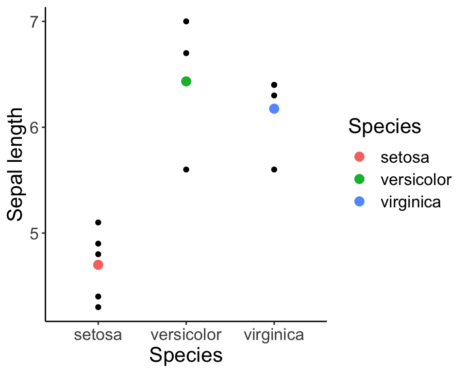

Week 8 Lecture
=============

## Week 8 Readings

For this week, I suggest reading Logan Chapter 7. I have also assigned [Shmueli (2010)](https://github.com/hlynch/Biometry2023/tree/master/_data/Shmueli_2010.pdf). This is quite an important paper and I encourage you to read it quite carefully. 

Warm-up
-----------

Which of these is the best model? Why?

<div class="figure" style="text-align: center">

<p class="caption">(\#fig:unnamed-chunk-1)Models of three different complexities. Figure adapted from [Grunwald (2007) The Minimum Description Length principle](https://mitpress.mit.edu/books/minimum-description-length-principle)</p>
</div>

The aims of modelling -- A discussion of Shmueli (2010)
------------------

Before we launch into the technical details of building linear models, let’s discuss the Shmueli (2010) paper. Shmueli makes the distinction between three kinds of models

1.	Explanatory models 
2.	Predictive models
3.	Descriptive models

**Explanatory models** fit data with the goal of testing causal hypotheses about theoretical constructs. Explanatory models can therefore never be confirmed and are harder to contradict than predictive models. These are models used for *inference* (inferential models).

**Predictive models** fit data solely to predict new outcomes. Models either work for prediction or don't. Predictive models may involve parameters that are uninterpretable (e.g., Generalized Additive Models, spline fits, etc.). These models are used for *prediction.*

**Descriptive models** summarize data, and that's the only goal. These models are used to *describe* data.

**Question: What are the differences among these three types of model?**

<details>
  <summary>Click for Answer</summary>
<span style="color: blueviolet;">
    "Explanatory modeling refers…to the application of statistical models to data for testing causal hypotheses about theoretical constructs." (Shmueli 2010) Using this definition, explanatory modeling is testing a hypothesis or a theory and therefore can never be confirmed and are also harder (than predictive models) to contradict. We have been referring to these models as “inferential models” or models used for “inference”.

Predictive models are concerned only with the ability to predict new (measurable) outcomes. Either the models works for prediction or it doesn’t.  Predictive models are therefore more utilitarian than explanatory models (use whatever works!). Predictive models may involve predictors that are uninterpretable (more on this later when we discuss Generalized Additive Models and other curve fitting techniques).

Example: We can think back to our discussion of population statistics and sample statistics. If we are measuring every individual of a population and we want to summarize the data, we are doing *descriptive* statistics. Descriptive modeling is aimed at succinctly summarizing a body of data. If we want to use that data to make some inference about a larger population, we are doing *inferential* statistics. If we want to use our sample to predict a new sample from that larger population, we are doing *predictive* statistics. 
</span>
</details> 

As noted by Shmueli, prediction and explanation are conflated in the hypothetical-deductive paradigm of null hypothesis significance testing, because we are saying in essence "If it predicts the data, then it explains the data". Does everyone see why this is the case?

The critical distinction between explanation and prediction can be seen by looking at the Expected Prediction Error (Shmueli 2010; page 293), which we will discuss in more detail below.

This distinction is at the core of model selection because, when faced with a number of competing models, we must decide whether we prefer the most accurate model (in terms of capturing the underlying mechanism) or the one that will yield the best predictions. It is also important to note that predictive models are restricted to variables which can actually be measured ahead of time. For example, a model to predict wine quality at the time of harvest cannot depend on the type of cask because the type of cask hasn’t been measured at the time the model is to be run. Likewise, the cost of running an aircraft may depend on the cost of fuel on the day of the flight, but fuel costs on the day of flight cannot be used in a predictive model because it is not possible to know what the cost of fuel will be on that day.

**Question: If you have to choose one or the other, do you want the most accurate model that captures the underlying mechanism, or the model that will give the best predictions?**

<details>
  <summary>Click for Answer</summary>
<span style="color: blueviolet;">
If we describe "real life" as, $\mathscr{Y} = \mathscr{F}(\mathscr{X})$, where $\mathscr{F}$ is the *mechanism*, then in model space, we write, $Y = F(X)$, where $F$ is the *model*. With explanatory modeling, the goal is $F = \mathscr{F}$, while with predictive modeling, the goal is $Y = \mathscr{Y}$. 

The expected prediction error ($EPE$)

$$\text{EPE} = \mathrm{E} [ (Y - \hat{f} (X))^2 ]$$

can be broken down into three components:

$$
\text{EPE} = \mathrm{Var}(Y) + \text{bias}^2 + \mathrm{Var} (\hat{f} (X))
$$

1.The variance in the response, or the underlying stochasticity in the process ($\mathrm{Var} (Y)$), 2. the bias, which describes to what degree the model is misspecified ($\text{bias}^2$), and 
3. the estimation variance, which arises because the model is developed from a sample of the data ($\mathrm{Var} (\hat{f} (X))$).

While the goal of predictive modeling is to minimize EPE, the goal of explanatory modeling is to minimize bias.
</span>
</details> 

**Question: Shmueli makes the case that predictive modeling requires a larger sample size than explanatory modeling. Why?**

<details>
  <summary>Click for Answer</summary>
<span style="color: blueviolet;">
In explanatory modeling, you only need enough data to "see whats going on" – in essence, you just need to understand the mean behavior. On the other hand, in predictive modeling, you actually want to be able to make good predictions, which means you need to understand the mean behavior AND the variability around the mean. Understanding the variability requires more data. Also, if the method for testing predictive models is to withhold some of the data at the model building stage, then you need more data.
</span>
</details> 

**Question: What is data partitioning? When/why is it used?**

<details>
  <summary>Click for Answer</summary>
<span style="color: blueviolet;">
Data partitioning is when you partition the data into a "training" dataset and a "validation" dataset. The model is fit on the "training dataset" and its predictive accuracy tested on the "validation dataset". Data partitioning is less used in explanatory modeling because by reducing the sample size, it reduces the power of the test.
</span>
</details> 

**Question: How do explanatory and predictive models differ in their use of “dimension reduction”. (First, what is meant by “dimension reduction”.)**

<details>
  <summary>Click for Answer</summary>
<span style="color: blueviolet;">
Sometimes we want to combine a number of related predictors into a smaller set of predictors that are uncorrelated. The classic example of this would be Principal Components Analysis (PCA). Dimension reduction is often used for predictive modeling, because we can reduce the variance of our predictions by reducing the number of predictors used in the model. However, we do so at the expense of interpretability, since the new predictors are linear combinations of the original variables and can be difficult to interpret. (More on this in the last week of the semester.) The important point here is that in predictive modeling, we don’t care what goes into the model, only that what comes out of the model is optimal is terms of the accuracy of its predictions for new data.
</span>
</details> 

**Question: Shmueli discusses “algorithmic modeling”. What is it?**

<details>
  <summary>Click for Answer</summary>
<span style="color: blueviolet;">
There are many data mining techniques which can produce predictive models that are useless for explanatory models. One example would be "neural networks". 
</span>
</details> 

**Question: What are ensemble methods?**

<details>
  <summary>Click for Answer</summary>
<span style="color: blueviolet;">
Ensemble models exploit multiple models simultaneously to achieve predictive accuracy. These models might be completely incompatible (using different predictors for example) but their predictions can be merged into a distribution of predictions, the ensemble of which is better than any of the individual models. Examples include climate change models in which predictions from multiple climate models are combined, and hurricane models where you can look at multiple predicted storm tracks to get an idea of where the storm is most likely to go.

Shmueli distinguishes between three types of model checking:

"Model validation": How well does the model fit the underlying causal relationships?

"Model fit": How well does the model fit the data you have?

"Generalization": How well does the model fit new data?
</span>
</details> 

**Question: This brings us to the problem of overfitting – what is overfitting?**

<details>
  <summary>Click for Answer</summary>
<span style="color: blueviolet;">
Overfitting is when models are fit to the noise in the data as well as the underlying "signal". This can happen when too many predictor variables are used and is the basis for the idea behind model "parsimony" (use the simplest model that works).
</span>
</details> 
  
Model selection depends on a clear idea of purpose – i.e. whether the model is explanatory or predictive. In explanatory models, predictors that have a theoretical justification may be left in the model even if they are not statistically significant because they are thought to be part of the true underlying model F. On the other hand, predictive models may drop predictors even if they are statistically significant, if their effect size is so small than leaving them out of the model actually increases predictive accuracy.

Shmueli illustrates these ideas with two examples:

Example #1: The Netflix prize

*Question: What was the Netflix prize about?*

*Question: What were some of the main conclusions?*

1.	Missingness is predictively informative. In other words, it is important to know what makes a person decide to rate a movie at all.
2.	Data reduction was key, and many variables you would think would be useful in the model were not (i.e. which actors were actually in the movie).
3.	You can get better predictions by combining the predictions of several smaller models than by building a single more complex model (i.e. ensemble methods work)

Example #2: Online auctions.

*Question: What was the online auction example about?*

*Question: What were some of the main conclusions?*

1.	In this example, the goal was explanatory model, so covariates such as the number of bids were excluded because they arose from the bidding process and did not contribute to the bidding process (and therefore could not have a causal effect).

2.	R2 as a measure of explanatory power is used to compare models (this is the common metric of explanatory power, more on this next week)

3.	The authors retained insignificant variables because the model was built from theory and not from the data itself.

*Major conclusions:*

1.	Prediction, explanation, and description are three very different goals for a statistical analysis.
2.	R2 is a measure of explanatory power but does not tell you anything about predictive power because you may have fit the model to noise in the original sample. Also, explanatory models tend to be overly optimistic with regards to predictive power.
3. "Checking the model" can include three component: 1) Model validation: how well does the model fit the underlying causal mechanism?; 2) Model fit: how well does the model fit the data you have? (e.g., $R^2$); 3) Generalization: how well does the model fit new data? (not $R^2$).

*Final discussion questions:*

1. Must an explanatory model have some level of predictive power to be considered scientifically useful?
2. Must a predictive model have sufficient explanatory power to be scientifically useful?

Introduction to linear models
--------------
\subsection{Continuous covariates}

In the first half of the semester, we were discussing how to identify distributions, and how to fit distributions to data (i.e. parameter estimation). This is a very simple application of fitting a "statistical model".  For example, we would write

$$
Y \sim N(\mu,\sigma^{2})
$$
and then we would use MLE (or other methods) to estimate the two parameters of this distribution $\mu$ and $\sigma$. We can also re-write this model as

$$
Y = \mu + \epsilon \mbox{ where } \epsilon \sim N(0,\sigma^{2}) 
$$
Note that the equation on the left has an equal sign, since Y is strictly equal to the sum of $\mu$ and $\epsilon$ and it is $\epsilon$ that is drawn from a statistical distribution. As the semester proceeds, we will spend a lot of time thinking about the $\epsilon$, which is the *residual* representing the difference between the actual response value and what is predicted by the model ($\mu$ in this case). In essence, we have decomposed Y into a component that is fixed ($\mu$) and a component that is stochastic ($\epsilon$). We read this equation as "Y is modeled as having a mean $\mu$ and a random error that is Normally distributed".

This illustrates nicely the general format of a linear model:

Response = Deterministic function + Stochastic function

Some authors will write this as:

Response = Model + Error

but I dislike this for two reasons. 1) Your "model" is not just the deterministic function. A model for your data includes the deterministic component and the stochastic component. 2) I don't like referring to the stochastic component as "error" because that implies that your model is faulty in some way. This stochasticity may be built into the system that you are trying to model, it may be irreducible variability that is not your "fault" and therefore should be considered a legitimate part of what you are trying to model rather than a mistake or an error.

Going back for a moment to our original model $Y \sim N(\mu,\sigma^{2})$, we can either leave $\mu$ as a constant to be estimated or we can try and improve our model by adding complexity to $\mu$. In other words, if Y represents the size of individuals in a collection of gentoo penguins, we might model mean size as being a function of a continuous variable like age. In that case, our model looks like:

$$
Y = \beta_{0}+\beta_{1}Age + \epsilon \mbox{ where } \epsilon \sim N(0,\sigma^{2})
$$

or, equivalently,

$$
Y \sim N(\beta_{0}+\beta_{1}Age,\sigma^{2})
$$
where I've used $\beta_{0}$ to represent the intercept of this linear model and $\beta_{1}$ to represent the slope (the amount by which Y increases for each year of Age).

We may choose to model $\mu$ as a function of a discrete variable like Colony. In this case, we would write the model as

$$
Y = \mu_{i} + \epsilon \mbox{ where } \epsilon \sim N(0,\sigma^{2})
$$
where each group has its own $\mu$:$\mu_{1}$,$\mu_{2}$,...,$\mu_{n}$.

When the covariates are continuous (the first case), we call this regression. When the covariates represent discrete groups or categories (the second case), we call this ANOVA. But both of these are simply different examples of linear modeling, which is it itself just a special case of fitting distributions, which is what we have been doing all along.

In this class, we are not defining linear models as models that can be described by a line. Instead, we define linear models as models in which the parameters can be arranged in a linear combination, and no parameter is a multiplier, divisor, or exponent to any other parameter. For example, $Y = \beta_0 + \beta_1X + \beta_2X^2 + \epsilon \text{, } \epsilon \sim N(0, \sigma^2)$, is a linear model because we can create a new variable $Z=X^{2}$, which makes it more obvious that Y is a linear function of X and this new variable Z. $Y = \beta_0 + \beta_1 X + \beta_1^2 X$ is also a linear model. An example of a nonlinearizable model is $Y = \frac{\beta_1 + \beta_2 X}{\beta_3 + \beta_4 X}$.

In this class, we will cover a suite of different linear models. Here I introduce them all briefly as a roadmap for the rest of the semester. 

Variables that are best described as coming from a Gaussian distribution can be modelled by a model of the type introduced just above. Here I just re-use the simple example above where the mean $\mu$ is a function of a covariate called $Age$.

$$
Y \sim N(\mu,\sigma^{2}) \\
\mu = \beta_{0}+\beta_{1}Age
$$

However, let's say $Y$ follows a different distribution, such as a Binomial. In that case the model would look like

$$
Y \sim Binom(n,p) \\
logit(p) = \beta_{0}+\beta_{1}Age
$$
In this case, the parameter influenced by $Age$ is the probability $p$ and here we have to transform the parameter using a function called the logit() function that we will be introduced to formally in Week 10. But mathematically, all we care about now is that some function of the parameter has a linear relationship to $Age$, just like before.

What if $Y$ is best modelled as a Poisson distributed variable? In that case, we have

$$
Y \sim Pois(\lambda) \\
log(\lambda) = \beta_{0}+\beta_{1}Age
$$

where it is the parameter $\lambda$ (actually, the log of $\lambda$, stay tuned for more details in Week 10) that is linearly related to the covariate.

We can, in fact, write down any number of models like this, for example maybe the data are Beta distributed and we want $Age$ to control the $\alpha$ parameter.

$$
Y \sim Beta(\alpha,\beta) \\
f(\alpha) = \beta_{0}+\beta_{1}Age
$$
where f() is some mathematical function. Maybe we think the $\beta$ parameter is control by some other covariate, say Weight

$$
Y \sim Beta(\alpha,\beta) \\
f(\alpha) = \beta_{0}+\beta_{1}Age \\
g(\beta) = \beta_{2}+\beta_{3}Weight
$$
where f() and g() are some functions that transform the parameter so it is linearly related to the covariates.

The point is that all linear modelling takes this general form. You decide on the best distribution to describe the data, and then you build detail into the model by finding covariates that you think describe variation in the parameters. These covariates allow each response to be modelled by a distribution that is tailored for it, accounting for whatever covariates you think describe why some data points $Y$ are larger than other data points.

Linear regression and all flavors of ANOVA deal with the model of the basic type introduced first:

$$
Y \sim N(\mu,\sigma^{2}) \\
\mu = \mbox{covariates added together linearly}
$$
All the other models get lumped into "Generalized Linear Models" and we will discuss that in Week 10.


Linear models | example with continuous covariate
---------------

Linear models can be written in matrix form (with vectors and matrices), which is more clear when you look at an example. For the model:

$$
Y_i = \beta_0 + \beta_1 X_i + \epsilon_i \text{, where } \epsilon_i \sim N(0, \sigma^2)
$$

We can expand this model for every data point ($i$), for a total of five data points:

$$
Y_1 = \beta_0 + \beta_1 X_1 + \epsilon_1 \text{, where } \epsilon_1 \sim N(0, \sigma^2)
$$

$$
Y_2 = \beta_0 + \beta_1 X_2 + \epsilon_2 \text{, where } \epsilon_2 \sim N(0, \sigma^2)
$$

$$
Y_3 = \beta_0 + \beta_1 X_3 + \epsilon_3 \text{, where } \epsilon_3 \sim N(0, \sigma^2)
$$
$$
Y_4 = \beta_0 + \beta_1 X_4 + \epsilon_4 \text{, where } \epsilon_4 \sim N(0, \sigma^2)
$$

$$
Y_5 = \beta_0 + \beta_1 X_5 + \epsilon_5 \text{, where } \epsilon_5 \sim N(0, \sigma^2)
$$

Note that $\epsilon_{1}$, $\epsilon_{2}$,...,$\epsilon_{5}$ are i.i.d. draws from the same error distribution.

In matrix form the model can be written as:

$$\begin{bmatrix}
  Y_1 \\
  Y_2 \\
  Y_3 \\
  Y_4 \\
  Y_5
\end{bmatrix} =
\begin{bmatrix}
  1 & X_1 \\
  1 & X_2 \\
  1 & X_3 \\
  1 & X_4 \\
  1 & X_5
\end{bmatrix}
\begin{bmatrix}
  \beta_0 \\
  \beta_1 \\
\end{bmatrix} +
\begin{bmatrix}
  \epsilon_1 \\
  \epsilon_2 \\
  \epsilon_3 \\
  \epsilon_4 \\
  \epsilon_5
\end{bmatrix}$$

where $Y$ is the response vector, $X$ is the design matrix, $\beta$ is the vector of parameters, and $\epsilon$ is the error vector. The design matrix tells us which combination of parameters are used to predict each data point. We can simply this notation even further by writing it as

$$
\overrightarrow{Y} = \overleftrightarrow{X}\overrightarrow{\alpha} + \overrightarrow{\epsilon}
$$

where $\overrightarrow{Y}$ is the response vector, $\overleftrightarrow{X}$ is design matrix, $\overrightarrow{\alpha}$ is the vector of parameters (coefficients), $\overrightarrow{\epsilon}$ is the vector of residuals (i.e. the remaining stochastic component). (Note: Keeping with traditional mathematical notation, vectors have a single headed arrow whereas as matrices have a double headed arrow. Also, here I use $\overrightarrow{\alpha}$ to represent the vector of model coefficients. More traditional would be to use the Greek letter $\overrightarrow{\beta}$, but in keeping with my notation above I will stick with $\overrightarrow{\alpha}$.)

The design matrix is the crucial element here. It tells us what combination of parameters are used to predict each data point (the Ys).

In the above example we had one continuous predictor, and the interpretation in this case is fairly straightforward. The interpretation and construction of the design matrix gets more complicated when we have discrete or categorical variables because there are many ways in which to parametrize the design matrix. 

\subsection{Discrete covariates}
Rewriting what we had above for a categorical predictor

$$
Y_i = \alpha_{j(i)} + \epsilon_i \text{, where } \epsilon_i \sim N(0, \sigma^2)
$$
where $\alpha_{j(i)}$ is the mean of the group $j$ to which data point $i$ belongs (before we had used the variable $\mu$ to represent the mean but here we will use $\alpha$ as the mean for each of the $j$ discrete groups). We can expand this model for every data point (let's say there are 5 data points and 3 groups):

$$
Y_1 = \alpha_{1(1)} + \epsilon_1 \text{, where } \epsilon_1 \sim N(0, \sigma^2)
$$

$$
Y_2 = \alpha_{3(2)} + \epsilon_2 \text{, where } \epsilon_2 \sim N(0, \sigma^2)
$$

$$
Y_3 = \alpha_{1(3)} + \epsilon_3 \text{, where } \epsilon_3 \sim N(0, \sigma^2)
$$

$$
Y_4 = \alpha_{2(4)} + \epsilon_4 \text{, where } \epsilon_4 \sim N(0, \sigma^2)
$$

$$
Y_5 = \alpha_{2(5)} + \epsilon_5 \text{, where } \epsilon_5 \sim N(0, \sigma^2)
$$

Here, data point 1 is in group 1, 2 is in group 3, 3 is in group 1, 4 is in group 2, and 5 is in group 2. Both $Y_1$ and $Y_3$ are in group 1, for example, so will have the same predicted value. However, the error ($\epsilon$) for each is different.

This is called the "group means", "cell means", or "dummy" coding. Think of it like representing each group with a binary indicator telling you if each point is in the group (a "dummy" variable). 

We can illustrate dummy coding with an example:


```r
iris.sub <- iris[sample(x = 1:nrow(iris), size = 12), ]
model.matrix( ~ -1 + iris.sub$Species)
```

```
##    iris.sub$Speciessetosa iris.sub$Speciesversicolor iris.sub$Speciesvirginica
## 1                       0                          0                         1
## 2                       0                          1                         0
## 3                       0                          1                         0
## 4                       0                          0                         1
## 5                       0                          1                         0
## 6                       0                          1                         0
## 7                       0                          1                         0
## 8                       0                          1                         0
## 9                       0                          1                         0
## 10                      0                          1                         0
## 11                      0                          1                         0
## 12                      0                          0                         1
## attr(,"assign")
## [1] 1 1 1
## attr(,"contrasts")
## attr(,"contrasts")$`iris.sub$Species`
## [1] "contr.treatment"
```

```r
iris.means <- ddply(iris.sub, .(Species), summarise, Sepal.Length = mean(Sepal.Length))
```


```r
dummy <- summary(lm(iris.sub$Sepal.Length ~ -1 + iris.sub$Species))
dummy$coefficients
```

```
##                            Estimate Std. Error  t value     Pr(>|t|)
## iris.sub$Speciesversicolor 6.177778  0.2234963 27.64152 8.904243e-11
## iris.sub$Speciesvirginica  7.100000  0.3871070 18.34118 4.994691e-09
```

```r
iris.fig <- ggplot(iris.sub, aes(x = Species, y = Sepal.Length)) + geom_point() +
  geom_point(data = iris.means, aes(x = Species, y = Sepal.Length, col = Species), size = 3) + 
  labs(y = "Sepal length") + theme_classic() + theme(text = element_text(size = font.size))
iris.fig
```



Don't worry about the syntax, but look closely at the figure. The figure is illustrating the values for each group, and the red, green, and blue filled circles represent the mean within each group. Our simple "dummy coding" model simply states that each value (the individual black dots) can be modelled as the mean for that group PLUS the residual difference (i.e. $\epsilon$) between the group mean and that individual value. Note that the function we use to fit the linear model 'lm' is one that we haven't formally introduced yet (but that will come soon). For now, just observe how the output of the model represents the parameters we are interested in (in this case, the group means).

We write the equation in matrix form as

$$\begin{bmatrix}
  Y_1 \\
  Y_2 \\
  Y_3 \\
  Y_4 \\
  Y_5
\end{bmatrix} =
\begin{bmatrix}
  1 & 0 & 0 \\
  0 & 0 & 1 \\
  1 & 0 & 0 \\
  0 & 1 & 0 \\
  0 & 1 & 0
\end{bmatrix}
\begin{bmatrix}
  \alpha_1 \\
  \alpha_2 \\
  \alpha_3
\end{bmatrix} +
\begin{bmatrix}
  \epsilon_1 \\
  \epsilon_2 \\
  \epsilon_3 \\
  \epsilon_4 \\
  \epsilon_5
\end{bmatrix}$$

Like with the continuous example, $Y$ is the response vector of length $n$, the design matrix is an $n \times p$ matrix of ones and zeroes, the vector of parameters has length $p$, and $\epsilon$ is the error vector of length $n$.

Note that we can still write the equation in the compact form:

$$
\overrightarrow{Y} = \overleftrightarrow{X}\overrightarrow{\beta} + \overrightarrow{\epsilon}
$$

Notice that we have a system of equations, one for each group. (We may have several data points in each group – so our model wont fit each data point exactly; the error term takes care of this...) We also have three unknowns, which are the three group means. The three model parameters $\alpha_{1}$, $\alpha_{2}$, and $\alpha_{3}$ are all uniquely specified by the data.

However, there are other equivalent ways of writing the same model. For example, we could write

$$
Y_{i} \sim \bar{\alpha} + \alpha_{j(i)} + \epsilon_{i} \mbox{, where } \epsilon_{i} \sim N(0,\sigma^{2})
$$

where **now $\bar{\alpha}$ represents the average of all the group means and $\alpha_{j(i)}$ is the DIFFERENCE between the mean of group j and the mean of all the groups**. (If the number of data points within each group are equal, than the mean of the group means is simply the mean of all the data, and we often refer to this as the 'grand' mean. However, if the groups are unbalanced, this may not be the case.) 

We can explicitly write out what this model means for each and every data point $Y_{i}$:

$$
Y_1 = \bar{\alpha} + \alpha_{1(1)} + \epsilon_1 \text{, where } \epsilon_1 \sim N(0, \sigma^2)
$$

$$
Y_2 = \bar{\alpha} + \alpha_{3(2)} + \epsilon_2 \text{, where } \epsilon_2 \sim N(0, \sigma^2)
$$

$$
Y_3 = \bar{\alpha} + \alpha_{1(3)} + \epsilon_3 \text{, where } \epsilon_3 \sim N(0, \sigma^2)
$$

$$
Y_4 = \bar{\alpha} + \alpha_{2(4)} + \epsilon_4 \text{, where } \epsilon_4 \sim N(0, \sigma^2)
$$

$$
Y_5 = \bar{\alpha} + \alpha_{2(5)} + \epsilon_5 \text{, where } \epsilon_5 \sim N(0, \sigma^2)
$$

We write the equation in matrix form as

$$\begin{bmatrix}
  Y_1 \\
  Y_2 \\
  Y_3 \\
  Y_4 \\
  Y_5
\end{bmatrix} =
\begin{bmatrix}
  1 & 1 & 0 & 0 \\
  1 & 0 & 0 & 1 \\
  1 & 1 & 0 & 0 \\
  1 & 0 & 1 & 0 \\
  1 & 0 & 1 & 0
\end{bmatrix}
\begin{bmatrix}
  \bar{\alpha} \\
  \alpha_1 \\
  \alpha_2 \\
  \alpha_3
\end{bmatrix} +
\begin{bmatrix}
  \epsilon_1 \\
  \epsilon_2 \\
  \epsilon_3 \\
  \epsilon_4 \\
  \epsilon_5
\end{bmatrix}$$

We have rewritten the model in terms of an overall mean (the mean of all the group means) and the effect of membership in each of the groups is added to this. Because the differences of each group to the overall mean sum to zero (do you see why this is?)

Notice that now we have introduced a fourth parameter without changing the data. We now have three group means and four parameters, so we cannot uniquely estimate all four parameters independently. If we estimate the overall global mean $\bar{\alpha}$, then we can only estimate two of the three group differences. The difference associated with the last group is completely constrained. This is analogous to our discussion of the number of degrees of freedom. We say that this model is **over parametrized**. We can solve this problem is a number of ways. We can remove a parameter altogether (in our first example, we implicitly removed the global mean $\bar{\alpha}$), or we can create new groups (linear combinations of the old groups) that are uniquely parameterized. Parameters that are not estimated because they are fully constrained by the other parameters are said to be **aliased**.

**Question:** What parameter was removed/aliased in the dummy coding scheme? In that case, $\bar{\alpha}$ was removed/aliased.

We have now introduced two perfectly "correct" ways of writing this linear model with different design matrices and correspondingly different interpretations of the model coefficients. These different ways of parametrizing the model for categorical variables are called "coding schemes". While the models represent the same math, the different ways of writing the models down permits different hypothesis tests about the model parameters.

In the case where we are looking at group means

$$
Y_{i} \sim \alpha_{j(i)} + \epsilon \mbox{, where } \epsilon \sim N(0,\sigma^{2})
$$
the (implicit) null hypothesis is that the group means are zero. Mathematically,

$$
H_{0}: \alpha_{j} = 0
$$

However, in the second case, 

$$
Y_{i} \sim \bar{\alpha} + \alpha_{j(i)} + \epsilon \mbox{, where } \epsilon \sim N(0,\sigma^{2})
$$
the same null hypothesis

$$
H_{0}: \alpha_{j} = 0
$$
means something very different. Therefore, we need to make sure to use coding schemes that will allow us to most directly test the hypothesis of interest. (This is why there is no one "correct" approach.)

Resolving overparameterization using contrasts
--------------

We can reduce the number of parameters in our model by creating a new set of parameters, each of which is a linear combination of groups, rather than a single group effect. Each parameter can include contributions from any number of the groups. We will now introduce of series of potential options for doing this, each of which is designed to test a specific hypothesis about how groups may differ. It is occassionally the case that none of these "off the shelf" options are appropriate for your analysis and you may need to design a design matrix that is tailored specifically for your research question, so the options we introduce here are just a few of the options and meant to illustrate the overall idea. The following decision tree is designed to help you choose the correct coding scheme for your specific analysis.

We know now that there are many ways in which to write a linear model with categorical predictors, and that the choices made about how to contrast the various levels of the factors is important for interpreting the results. In addition to the "dummy" or "cell means" coding scheme introduced above, we will go over 4 common "off-the-shelf" coding schemes that are used. Keep in mind that these are not all the possible coding schemes that could be used to write a model. Many others exist, and often it is necessary to write your own custom coding schemes to answer a particular question of interest. 

Before getting into the math that describes the various options, we'll work through a simple example. Lets say we have a study in which we measure the average lifespan of four species of penguins. For arguments sake, lets say we track 10 individuals in each of four species (40 penguins total). The mean lifespan in each group is 13, 12, 9, and 6. One way to write this model would be to simply estimate the mean of each group. This is the 'cell means' coding we described above. Nothing is being contrasted here. In other words, no group is being compared to any other group.

| Parameter          | Method$\#1$     | Method$\#2$    | Method$\#3$    |Method$\#4$  | 
| ------------------ |:---------------:| :------------: | :------------: |:-----------:|
| $\mu$              | aliased         |                |                |             |
| $\alpha_{1}$       | 13              |                |                |             |
| $\alpha_{2}$       | 12              |                |                |             |
| $\alpha_{3}$       | 9               |                |                |             |
| $\alpha_{4}$       | 6               |                |                |             |

Now let's say we want to write the model differently. Now we want to explicitly compare the lifespan of penguins in spp 2, 3, and 4 to the lifespan of penguins of spp 1. In other words, we are contrasting spp 2 vs. spp 1, spp 3 vs. spp 1, and spp 4 vs. spp 1. The estimates we get for these contrasts will allow us to test hypotheses about how each group compares to the first. 

| Parameter          | Method$\#1$     | Method$\#2$    | Method$\#3$    |Method$\#4$  | 
| ------------------ |:---------------:|:--------------:|:--------------:|:-----------:|
| $\mu$              | aliased         |  aliased       |                |             |
| $\alpha_{1}$       | 13              |  13            |                |             |
| $\alpha_{2}$       | 12              |  -1            |                |             |
| $\alpha_{3}$       | 9               |  -4            |                |             |
| $\alpha_{4}$       | 6               |  -7            |                |             |

Let's try another set of contrasts. In this case, let's say that, for whatever reason, we want to compare the Mean(spp 1,spp 2) vs. Mean(spp 1), as well as Mean(spp 1, spp 2, spp 3) vs.  Mean(spp 1,spp 2), and the Mean(spp 1, spp 2, spp 3, spp 4) vs. Mean(spp 1, spp 2, spp 3). That would yield the following parameter estimates. (Note that in this case, we have pulled out the group mean as a parameter, and the mean of spp 1 has been aliased, so its not being estimated.)

| Parameter          | Method$\#1$     | Method$\#2$    | Method$\#3$    |Method$\#4$  | 
| ------------------ |:---------------:|:--------------:|:--------------:|:-----------:|
| $\mu$              | aliased         |  aliased       |    10          |             |
| $\alpha_{1}$       | 13              |  13            |   aliased      |             |
| $\alpha_{2}$       | 12              |  -1            |   -0.5         |             |
| $\alpha_{3}$       | 9               |  -4            |   -1.1667      |             |
| $\alpha_{4}$       | 6               |  -7            |   -1.3333      |             |

Finally, imagine we want to compare each group to the grand mean ($\mu$). In this case we pull out the $\mu$ and estimate it. Than we compare spp 1 vs. $\mu$, and spp 2 vs. $\mu$, and spp 3 vs. $\mu$. We can't also do spp 4 vs. $\mu$ because once we've calculated the other four quantities ($\mu$, and the three contrasts with $\mu$), the final quantity (spp 4 vs. $\mu$) is completely determined and therefore is aliased.

| Parameter          | Method$\#1$     | Method$\#2$    | Method$\#3$    |Method$\#4$  | 
| ------------------ |:---------------:|:--------------:|:--------------:|:-----------:|
| $\mu$              | aliased         |  aliased       |    10          |     10      |
| $\alpha_{1}$       | 13              |  13            |   aliased      |      3      |
| $\alpha_{2}$       | 12              |  -1            |   -0.5         |      2      |
| $\alpha_{3}$       | 9               |  -4            |   -1.1667      |     -1      |
| $\alpha_{4}$       | 6               |  -7            |   -1.3333      |    aliased  |

As a review, the first way of writing the model does not contrast anything. It simply estimates the group means, and the model for group $j$ is simply the group mean for $j$ plus an error term. The other three model parameterizations explicitly contrast the groups, but in different ways.

Hopefully, by working through a few examples, you can see that there are many ways we can write a model, and that each way contrasts different things and allows for an explicit hypothesis test on differences that are of interest. In this example, Method #1 is the 'cell means' coding that we started with, Method #2 is called 'effect coding' or 'treatment contrasts', Method #3 is called Helmert contrasts, and Method #4 is called the 'sum-to-zero' contrast we already briefly introduced. We'll walk through a more formal introduction of these contrasts now.

Effect coding/Treatment constrast
------------

In effect coding or treatment contrasts, you set aside one group as the "control" and estimate the difference of every other group from that control group. The estimated parameters therefore represent the "effect" of moving from the control group to any other group (which often represents the impact of a "treatment" relative to the control group).

$$
Y_i = \alpha_{\text{control}} + \alpha_{j(i)} + \epsilon_i \text{, where } \epsilon_i \sim N(0, \sigma^2)
$$

where $\alpha_{control}$ is the mean of the control group, and $\alpha_{j>1}$ is the difference between group $j$ and the control group. If we have $k$ groups, we only have $k-1$ $\alpha_{j}$ to estimate since we use one group as the control. We can think of $\alpha_{control}$ as an intercept.

We can summary this as

| Parameter          | Interpretation           | Null hypothesis  |
| ------------------ |:------------------------:| ----------------:|
| $\alpha_{control}$ | mean of control group ($\mu_1$) | $H_0: \mu_1 = 0$ |
| $\alpha_2$         | difference between mean of group 2 and mean of control group ($\mu_2 - \mu_1$) | $H_0: \mu_2 - \mu_1 = 0$ |
| $\alpha_3$         | difference between mean of group 3 and mean of control group ($\mu_3 - \mu_1$) |    $H_0: \mu_3 - \mu_1 = 0$ |


This basically uses the first group as the "intercept" of the model, so instead of this

$$\begin{bmatrix}
  Y_1 \\
  Y_2 \\
  Y_3 \\
  Y_4 
\end{bmatrix} =
\begin{bmatrix}
  1 & 0 & 0 \\
  0 & 1 & 0 \\
  0 & 0 & 1 \\
  0 & 0 & 1 
\end{bmatrix}
\begin{bmatrix}
  \mu_1 \\
  \mu_2 \\
  \mu_3
\end{bmatrix} +
\begin{bmatrix}
  \epsilon_1 \\
  \epsilon_2 \\
  \epsilon_3 \\
  \epsilon_4
\end{bmatrix}$$

we have

$$\begin{bmatrix}
  Y_1 \\
  Y_2 \\
  Y_3 \\
  Y_4 
\end{bmatrix} =
\begin{bmatrix}
  1 & 0 & 0 \\
  1 & 1 & 0 \\
  1 & 0 & 1 \\
  1 & 0 & 1 
\end{bmatrix}
\begin{bmatrix}
  \alpha_{control} = \mu_1 \\
  \alpha_{2} = \mu_2 - \mu_{1}\\
  \alpha_{3} = \mu_3 - \mu_{1}
\end{bmatrix} +
\begin{bmatrix}
  \epsilon_1 \\
  \epsilon_2 \\
  \epsilon_3 \\
  \epsilon_4
\end{bmatrix}$$

Note that the last two data points come from the same group, and so those two rows will always be the same. In theory, there are many many rows NOT shown.

The first version specifies the model in terms of the group means. The second version specifies the model in terms of linear combinations of the group means. The latter approach permits a straightforward way of estimating quantities of biological interest (usually we are interested in testing hypotheses about differences).


```r
contrasts(iris.sub$Species) <- "contr.treatment"
model.matrix(~ iris.sub$Species)
```

```
##    (Intercept) iris.sub$Speciesversicolor iris.sub$Speciesvirginica
## 1            1                          0                         1
## 2            1                          1                         0
## 3            1                          1                         0
## 4            1                          0                         1
## 5            1                          1                         0
## 6            1                          1                         0
## 7            1                          1                         0
## 8            1                          1                         0
## 9            1                          1                         0
## 10           1                          1                         0
## 11           1                          1                         0
## 12           1                          0                         1
## attr(,"assign")
## [1] 0 1 1
## attr(,"contrasts")
## attr(,"contrasts")$`iris.sub$Species`
## [1] "contr.treatment"
```


```r
treatment <- summary(lm(iris.sub$Sepal.Length ~ iris.sub$Species))
```

```
## Warning: contrasts dropped from factor iris.sub$Species due to missing levels
```

```r
treatment$coefficients
```

```
##                            Estimate Std. Error   t value     Pr(>|t|)
## (Intercept)               6.1777778  0.2234963 27.641516 8.904243e-11
## iris.sub$Speciesvirginica 0.9222222  0.4469927  2.063171 6.603543e-02
```

In this case, you can see that the model is estimating the mean of the first group (setosa) and then the difference between the second and first group and the difference between the third and first groups. This allows you to test hypotheses about the differences, which is often more meaningful than testing hypotheses about the group means themselves.

Helmert contrasts
---------------

Helmert contrasts include a mean treatment effect and then the remaining parameters estimate the group mean relative to the mean treatment effect of the groups before it. This is usually only sensible when the categories have some natural order to them, and are not very common in ecology but they are the default in SPLUS (but not R fortunately). (There are many different versions, but as long as you keep the interpretation of each coefficient straight, it doesn’t matter which you use. I think this version is the clearest.) The equation is difficult to write compactly but the Helmert contrast can be understood using the following example involving three groups.

| Parameter          | Interpretation           | Null hypothesis  |
| ------------------ |:------------------------:| ----------------:|
| $\bar{\alpha}$ | mean of group means | $H_0: \frac{\mu_1 + \mu_2 + \mu_3}{3} = 0$ |
| $\alpha_2$         | difference between mean of groups 1 and 2 and mean of group 1 | $H_0: \frac{\mu_1 + \mu_2}{2} - \mu_1 = 0$ |
| $\alpha_3$         | difference between mean of groups 1-3 and mean of groups 1 and 2 |    $H_0: \frac{\mu_1 + \mu_2 + \mu_3}{3} - \frac{\mu_1 + \mu_2}{2} = 0$ |

This can be expressed as:

$$\begin{bmatrix}
  Y_1 \\
  Y_2 \\
  Y_3 \\
  Y_4 
\end{bmatrix} =
\begin{bmatrix}
  1 & -1 & -1 \\
  1 & 1 & -1 \\
  1 & 0 & 2 \\
  1 & 0 & 2 
\end{bmatrix}
\begin{bmatrix}
  \alpha_{\small{\mbox{mean of group means}}} = \frac{\mu_{1}+\mu_{2}+\mu_{3}}{3} \\
  \alpha_{2} = \frac{\mu_{1}+\mu_{2}}{2}-\mu_{1} \\
  \alpha_{3} = \frac{\mu_{1}+\mu_{2}+\mu_{3}}{3}-\frac{\mu_{1}+\mu_{2}}{2}
\end{bmatrix} +
\begin{bmatrix}
  \epsilon_1 \\
  \epsilon_2 \\
  \epsilon_3 \\
  \epsilon_4
\end{bmatrix}$$

where I have assumed it is $\alpha_{1}$ that is aliased (although different books define this differently, so you may find versions in which it is parameterized differently).


```r
contrasts(iris.sub$Species) <- "contr.helmert"
model.matrix(~ iris.sub$Species)
```

```
##    (Intercept) iris.sub$Species1 iris.sub$Species2
## 1            1                 0                 2
## 2            1                 1                -1
## 3            1                 1                -1
## 4            1                 0                 2
## 5            1                 1                -1
## 6            1                 1                -1
## 7            1                 1                -1
## 8            1                 1                -1
## 9            1                 1                -1
## 10           1                 1                -1
## 11           1                 1                -1
## 12           1                 0                 2
## attr(,"assign")
## [1] 0 1 1
## attr(,"contrasts")
## attr(,"contrasts")$`iris.sub$Species`
## [1] "contr.helmert"
```


```r
helmert <- summary(lm(iris.sub$Sepal.Length ~ iris.sub$Species))
```

```
## Warning: contrasts dropped from factor iris.sub$Species due to missing levels
```

```r
helmert$coefficients
```

```
##                            Estimate Std. Error   t value     Pr(>|t|)
## (Intercept)               6.1777778  0.2234963 27.641516 8.904243e-11
## iris.sub$Speciesvirginica 0.9222222  0.4469927  2.063171 6.603543e-02
```

Sum-to-zero contrasts
--------------

Sum-to-zero contrast set the intercept to the mean treatment effect (the mean of the group means) and then the remaining parameters estimate the mean treatment effect of that group relative to the mean treatment effect. (We introduced this contrast briefly earlier.)

$$
Y_i = \bar{\alpha} + \alpha_{j(i)} + \epsilon_i \text{, where } \epsilon_i \sim N(0, \sigma^2)
$$

where $\bar{\alpha}$ is the mean treatment effect for all groups, and $\alpha_{j}$ is the difference between group $j$ and $\bar{\alpha}$. 

We can summarize this as

| Parameter          | Interpretation           | Null hypothesis  |
| ------------------ |:------------------------:| ----------------:|
| $\bar{\alpha}$ | mean of group means | $H_0: \frac{\mu_q}{p} = \frac{\mu_1 + \mu_2 + \mu_3}{3} = 0$ |
| $\alpha_1$         | difference between mean of group 1 and mean of group means | $H_0: \mu_1 - \frac{\mu_q}{p} = 0$ |
| $\alpha_2$         | difference between mean of group 2 and mean of group means |    $H_0: \mu_2 - \frac{\mu_q}{p} = 0$ |

This can be expressed as:

$$\begin{bmatrix}
  Y_1 \\
  Y_2 \\
  Y_3 \\
  Y_4 
\end{bmatrix} =
\begin{bmatrix}
  1 & 1 & 0 \\
  1 & 0 & 1 \\
  1 & -1 & -1 \\
  1 & -1 & -1 
\end{bmatrix}
\begin{bmatrix}
  \bar{\alpha} = \frac{\mu_{q}}{p} = \frac{\mu_{1}+\mu_{2}+\mu_{3}}{3} \\
  \alpha_{1} = \mu_{1}-\frac{\mu_{q}}{p} \\
  \alpha_{2} = \mu_{2}-\frac{\mu_{q}}{p}
\end{bmatrix} +
\begin{bmatrix}
  \epsilon_1 \\
  \epsilon_2 \\
  \epsilon_3 \\
  \epsilon_4
\end{bmatrix}$$

where we see that it is the last parameter ($\alpha_{3}$), the one associated with the group mean of the last group ($\mu_{3}$) which is aliased.


```r
contrasts(iris.sub$Species) <- "contr.sum"
model.matrix(~ iris.sub$Species)
```

```
##    (Intercept) iris.sub$Species1 iris.sub$Species2
## 1            1                -1                -1
## 2            1                 0                 1
## 3            1                 0                 1
## 4            1                -1                -1
## 5            1                 0                 1
## 6            1                 0                 1
## 7            1                 0                 1
## 8            1                 0                 1
## 9            1                 0                 1
## 10           1                 0                 1
## 11           1                 0                 1
## 12           1                -1                -1
## attr(,"assign")
## [1] 0 1 1
## attr(,"contrasts")
## attr(,"contrasts")$`iris.sub$Species`
## [1] "contr.sum"
```


```r
sumtozero <- summary(lm(iris.sub$Sepal.Length ~ iris.sub$Species))
```

```
## Warning: contrasts dropped from factor iris.sub$Species due to missing levels
```

```r
sumtozero$coefficients
```

```
##                            Estimate Std. Error   t value     Pr(>|t|)
## (Intercept)               6.1777778  0.2234963 27.641516 8.904243e-11
## iris.sub$Speciesvirginica 0.9222222  0.4469927  2.063171 6.603543e-02
```

There is one final "off-the-shelf" contrast that we will learn, and that is polynomial contrasts.

Polynomial contrasts
------------

Polynomial contrasts simply involve fitting polynomial terms of increasing order; polynomial contrasts only make sense if the covariate represents an ordinal value, so that the different levels of the factor are ordered and have equal spacing (income, years of education, etc.). This is really just a form of multiple regression (so a preview of what we will be doing in a couple of weeks…)

This one is a little hard to summarize in an equation, but is easily understood by example.

| Parameter          | Interpretation           | Null hypothesis  |
| ------------------ |:------------------------:| ----------------:|
| $\beta_0$ | Y intercept | $H_0: \beta_0 = 0$ |
| $\beta_1$         | Partial slope for the linear term | $H_0: \beta_1 = 0$ |
| $\beta_2$         | Partial slope for the quadratic term |    $H_0: \beta_2 = 0$ |

This can be expressed as:

$$\begin{bmatrix}
  Y_1 \\
  Y_2 \\
  Y_3 \\
  Y_4 
\end{bmatrix} =
\begin{bmatrix}
  0.58 & -0.71 & 0.41 \\
  0.58 & 0 & -0.82 \\
  0.58 & 0.71 & 0.41 \\
  0.58 & 0.71 & 0.41 
\end{bmatrix}
\begin{bmatrix}
  \beta_{0} = \mbox{mean} \\
  \beta_{1} = \mbox{coefficient for the linear term} \\
  \beta_{2} = \mbox{coefficient for the quadratic term}
\end{bmatrix} +
\begin{bmatrix}
  \epsilon_1 \\
  \epsilon_2 \\
  \epsilon_3 \\
  \epsilon_4
\end{bmatrix}$$


where the coefficients ($\beta$) can be calculated using the values in the contrast matrix (we will call this $\mathbf{P}$) associated with each group. Data point 1 is in group 1, 2 in group 3, 3 in group 1, 4 in group 2, and 5 in group 2.

$$
\beta_{k - 1} = \frac{\sum_{j} P_{kj} \bar{Y}_j}{\sum_{j} P_{kj}^2}
$$

$$
\beta_0 = \frac{1 \times \bar{Y}_{grp 1} + 1 \times \bar{Y}_{grp 2} + 1 \times \bar{Y}_{grp 3}}{1^2 + 1^2 + 1^2}
$$

$$
\beta_1 = \frac{-0.71 \times \bar{Y}_{grp 1} + 0 \times \bar{Y}_{grp 2} + 0.71 \times \bar{Y}_{grp 3}}{(-0.71)^2 + 0^2 + 0.71^2}
$$
and so forth...

The values in the design matrix look complicated, but they aren’t really. Each column is scaled to have length 1 (which means all the denominators are actually just 1).

Visualizing hypotheses for different coding schemes
-------------------

The different contrasts are different ways of comparing groups to different baselines. You can either compare each group to zero, a control group, to the mean of the group means (often called the grand mean), to the average of all previous groups, etc.


```r
baselines <- data.frame(Baseline = c("Mean of group means", "Control", "Zero"), Value = c(mean(iris.means$Sepal.Length), iris.means$Sepal.Length[1], 0))
iris.fig.baselines <- ggplot(iris.sub, aes(x = Species, y = Sepal.Length)) + geom_point() +
  geom_hline(data = baselines, aes(yintercept = Value), col = "gray", linetype = "dashed") +
  geom_text(data = baselines, aes(label = Baseline, x = Inf, y = Value), hjust = 1.0, vjust = 1.0, size = 5) +
  geom_point(data = iris.means, aes(x = Species, y = Sepal.Length, col = Species), size = 3) + 
  labs(y = "Sepal length") + theme_classic() + theme(text = element_text(size = font.size))
iris.fig.baselines
```


Orthogonal vs. Non-orthogonal contrasts
---------------------


<div class="figure" style="text-align: center">

<p class="caption">(\#fig:unnamed-chunk-12)The segment AB is orthogonal to the segement CD. Source: Wikipedia</p>
</div>

In a broad sense, orthogonal refers to things that are perpendicular. For some cases, that's easy to think about. But what does it mean with respect to categorical comparisons in linear models? 

In a simple model with one categorical predictor with five different groups (a, b, c, d, and e): $Y_i = \alpha_{j(i)} + \epsilon_i \text{, where } \epsilon_i \sim N(0, \sigma^2)$, we may be interested in comparing a vs. b, a vs. c, or even a, b, and c vs. d and e. There are many ways in which we might want to interpret differences among the groups, and each comparison is called a **contrast**. There are a large number of contrasts, but few *orthogonal* contrasts. For example, if we compare a vs. b and a vs. c, then a third comparison, b vs. c is not orthogonal because it is implicity included in the first two contrasts. Note that treatment contrasts are not orthogonal.

Mathematically, contrasts are orthogonal if their dot product is equal to zero or, equivalently, if the product of the pairwise coefficients sums to zero. In other words, let's say we have three groups (three "levels of our factor"). Two possible contrasts would be

| Group  | Contrast A  | Contrast B  |
| -------- |:----------:| -------:|
| 1 | 2  | 0 |
| 2 | -1 | 1 |
| 3 | -1 | 1 |

Contrast A compares Group 1 against the average of Group 2 and 3. Contrast B compares Group 2 vs. Group 3. Are these two contrasts orthogonal? Yes!

$$
\sum\limits_{i=1}^{3} \alpha_{i}\beta_{i} = (2)(0)+(-1)(1)+(-1)(-1) = 0
$$

**If you have $k$ levels of a factor ($k$ numbers of groups), you only have $k - 1$ orthogonal contrasts.**

Why does this matter? With non-orthogonal contrasts, the order in which you make you comparisons in an Analysis of Variance will change your results and interpretations. See Aho section 10.3.2 for details.

Error structure of linear models
----------------

Response = Deterministic function + Stochastic function

Only part of a statistical model is deterministic. It's important to understand whether the stochastic part of the model is properly specified.

We have been referring to "error" as being normally distributed, $\epsilon \sim N(0, \sigma^2)$, and this is often assumed for linear models (including regression). 

Imagine you have modeled the number of plants in quadrats. Is your error normally distributed?

Other models for error can be more appropriate, depending on the data and the model, e.g., $\epsilon \sim \text{Bernoulli}()$ or $\epsilon \sim \text{Poisson}()$.

\subsection{Independence of errors}

Everything to this point has assumed that the residuals for each data point (i.e. $\epsilon_{i}$) are independent from one another and identifcally distributed (as $N(0,\sigma^{2}$)). 

$$
Y_i = \alpha_{j(i)} + \epsilon_i \text{, where }\epsilon_i \sim N(0, \sigma^2 \mathbf{I})
$$

$$
\sigma^2 \mathbf{I} = \sigma^2 \begin{bmatrix}
  1 & 0 & 0 & 0 & 0 \\
  0 & 1 & 0 & 0 & 0 \\
  0 & 0 & 1 & 0 & 0 \\
  0 & 0 & 0 & 1 & 0 \\
  0 & 0 & 0 & 0 & 1
\end{bmatrix} = \begin{bmatrix}
  \sigma^2 & 0 & 0 & 0 & 0 \\
  0 & \sigma^2 & 0 & 0 & 0 \\
  0 & 0 & \sigma^2 & 0 & 0 \\
  0 & 0 & 0 & \sigma^2 & 0 \\
  0 & 0 & 0 & 0 & \sigma^2
\end{bmatrix}
$$

Diagonal elements represent the $\mathrm{Var}[Y_i]$ and the off-diagonal elements are $\mathrm{Cov}[Y_i, Y_j]$. Here, $\mathrm{Cov}[Y_i, Y_j] = 0$, which means that the error for data point $Y_i$ is independent of the error for data point $Y_j$. 

But, this is not always the case. Sometimes, a positive error/residual for one data point is coupled with a positive residual for another data point, or vice versa. This happens often in ecology and evolution, because we often work with data that has spatial dependence, temporal dependence, or phylogenetic dependence. Then, the error matrix is no longer diagonal, and may look like:

$$
\epsilon_i \sim N(0, \mathbf{\Sigma}) \text{, where } \mathbf{\Sigma} = \begin{bmatrix}
  4.5 & 0.3 & -4.7 & 0 & 0 \\
  0.3 & 9.0 & 0 & 0 & 0 \\
  -4.7 & 0 & 0.4 & 0.3 & 0 \\
  0 & 0 & 0.3 & 5.2 & 0.1 \\
  0 & 0 & 0 & 0.1 & 0.8
\end{bmatrix}
$$

The matrix is symmetric, because $\mathrm{Cov}[Y_i, Y_j] = \mathrm{Cov}[Y_j, Y_i]$. Thus, it is important that we think of the error term as a matrix that describes the correlation structure of the data. Correlated errors will affect model fit. This is important because we want to downweight information from highly correlated data points because the information that each contributes is not independent from one another.
