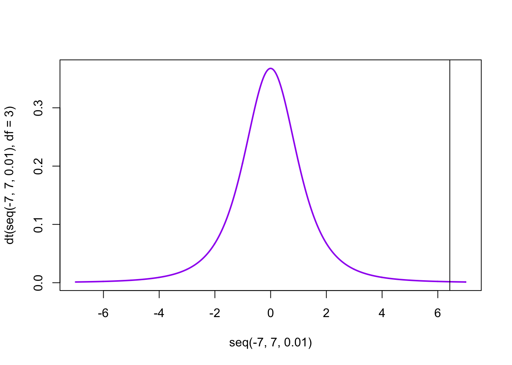
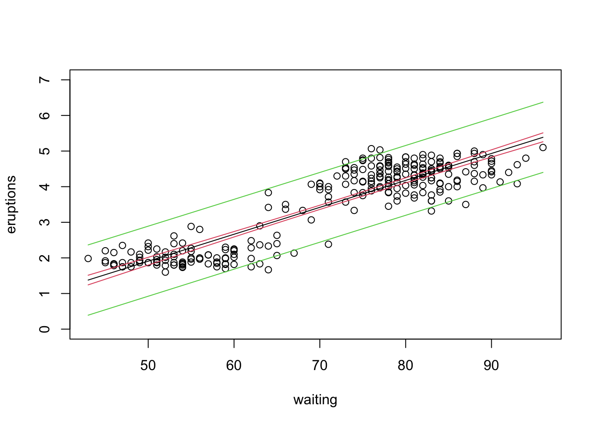
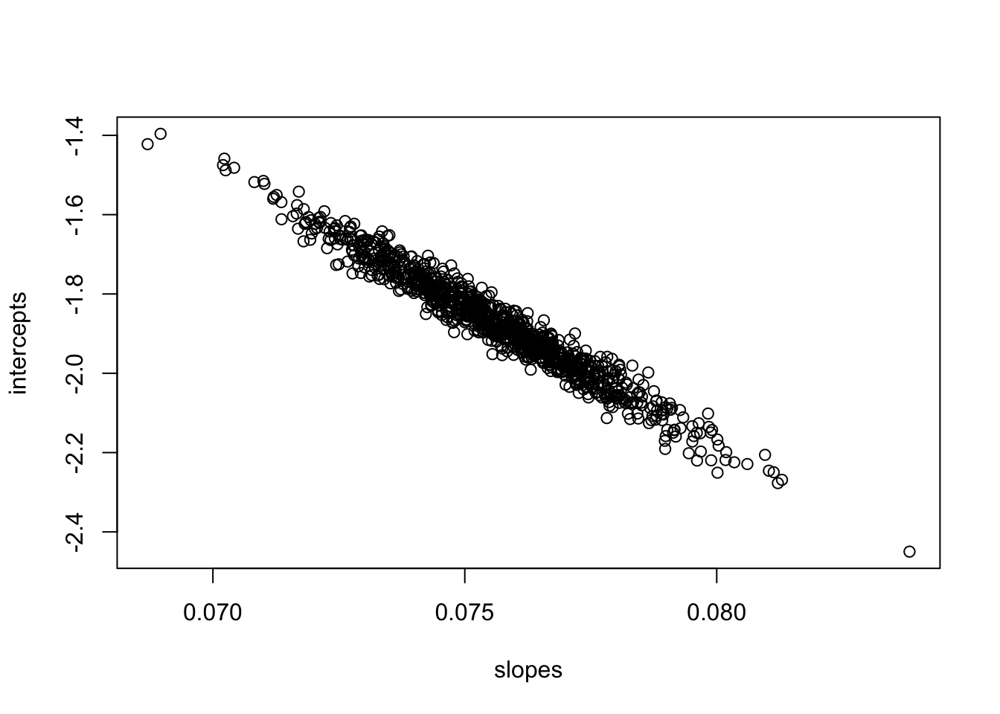
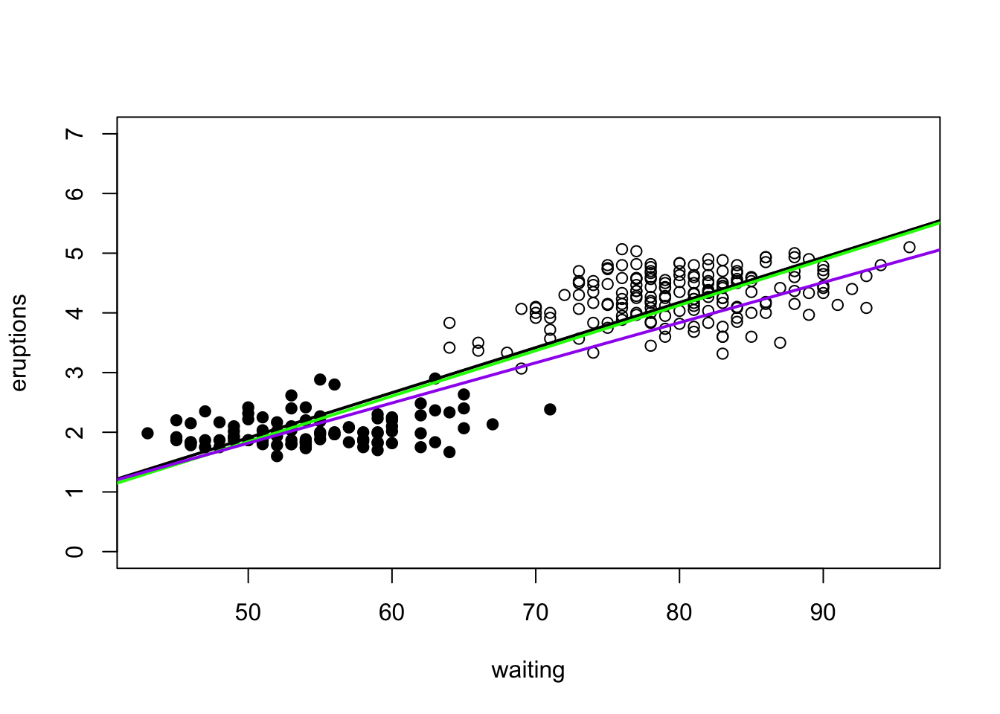

Week 9 Lab
=============

We will need 4 packages for this week's lab, so we might as well load them all in now.


```r
library(MASS)
library(car)
```

```
## Loading required package: carData
```

```r
library(boot)
```

```
## 
## Attaching package: 'boot'
```

```
## The following object is masked from 'package:car':
## 
##     logit
```

```r
library(smatr)
```

Correlation
-------------

We will first go over how to test for correlation between two variables. We will use a dataset of July mean temperatures at an Alaskan weather station (Prudhoe Bay) over a period of 12 years.


```r
Temperature<-c(5.1,5.6,5.7,6.6,6.7)
Year<-c(1979,1982,1985,1988,1991)
```

First we will plot the data to get a sense for whether the correlation coefficient is likely to be positive or negative.


```r
plot(Year,Temperature,pch=16)
```


We can test the correlation between Temperature and Year using the R function 'cor.test'


```r
ans<-cor.test(Temperature,Year)
ans
```

```
## 
## 	Pearson's product-moment correlation
## 
## data:  Temperature and Year
## t = 6.4299, df = 3, p-value = 0.007626
## alternative hypothesis: true correlation is not equal to 0
## 95 percent confidence interval:
##  0.5625553 0.9978118
## sample estimates:
##      cor 
## 0.965581
```

'cor' is the correlation coefficient - we see there is a strongly positive (and statistically significant) correlation between year and temperature. 

Let's make sure we understand every part of this output.

Part 1: This is just spitting back what two variables are being correlated.

Part 2: t=6.4299
How do we get this? Remember:

$$
t_{s} = r\sqrt{\frac{n-2}{1-r^{2}}}
$$

We can calculate this by pulling out various elements of the variable 'ans'.


```r
names(ans)
```

```
## [1] "statistic"   "parameter"   "p.value"     "estimate"    "null.value" 
## [6] "alternative" "method"      "data.name"   "conf.int"
```

```r
r<-as.numeric(ans$estimate) #as.numeric supresses labels
df<-as.numeric(ans$parameter)
r*sqrt(df/(1-(r^2)))
```

```
## [1] 6.429911
```

This gives us the same as 


```r
ans$statistic
```

```
##        t 
## 6.429911
```

Part 3:
Why is df=3? For a correlation coefficient, you have n-2 degrees of freedom - you lose one degree of freedom for the mean of each variable.

Part 4: 
How do we get p-value = 0.007626? First, lets start with a plot of the t-distribution with three d.o.f.


```r
plot(seq(-7,7,0.01),dt(seq(-7,7,0.01),df=3),typ="l",col="purple",lwd=2)
abline(v=6.4299)
```




We can ask P(t>6.4299)=1-P(t<6.4299) by


```r
pt(6.4299,df=3,lower.tail=F)*2
```

```
## [1] 0.007625665
```

Why multiple by 2? Because we want a two-tailed test, so we want to consider correlations larger in magnitude that are either positive or negative.

Part 5: 95 percent confidence interval (0.5625553,0.9978118).

$$
z=\frac{1}{2}ln(\frac{1+r}{1-r})=arctanh(r)
$$


```r
z<-(1/2)*log((1+r)/(1-r))
z
```

```
## [1] 2.022468
```

$$
P(z-\frac{t_{[1-\alpha/2](\infty)}}{\sqrt{n-3}}\leq arctanh(\rho) \leq z+\frac{t_{[1-\alpha/2](\infty)}}{\sqrt{n-3}})=1-\alpha
$$

$$
P(tanh(z-\frac{t_{[1-\alpha/2](\infty)}}{\sqrt{n-3}})\leq \rho \leq tanh(z+\frac{t_{[1-\alpha/2](\infty)}}{\sqrt{n-3}}))=1-\alpha
$$


```r
n<-5
LL.z<-z-(1/sqrt(n-3))*qnorm(0.975)
LL.r<-tanh(LL.z)
LL.r
```

```
## [1] 0.5625553
```

```r
UL.z<-z+(1/sqrt(n-3))*qnorm(0.975)
UL.r<-tanh(UL.z)
UL.r
```

```
## [1] 0.9978118
```

Notice that I can extract the LL and the UL by taking the tanh of the limits for the transformed variable.

In class we discussed several different ways of testing for a correlation. We can see these by querying the help page for 'cor' and 'cor.test':

```
?cor.test
```

Notice that under the method option there are three options. The "pearson" is the first (default). We can change the default by trying


```r
cor.test(Temperature,Year, method="kendall")
```

```
## 
## 	Kendall's rank correlation tau
## 
## data:  Temperature and Year
## T = 10, p-value = 0.01667
## alternative hypothesis: true tau is not equal to 0
## sample estimates:
## tau 
##   1
```

Does it make sense why Kendall's tau=1.0?

Now that we have some practice with correlations, let play a game! Each member of your group should visit [this site](https://www.rossmanchance.com/applets/2021/guesscorrelation/GuessCorrelation.html) and play a few rounds. Click the "Track Performance" check box to track your performance over time. **<span style="color: green;">Checkpoint #1: Who in your group is doing the best?</span>**

Linear modelling
-----------------

Linear modeling in R occurs primarily through two functions 'lm' and 'glm'. The first is reserved for linear regression in the form we have been discussing this week. The second function is for generalized linear models; we will discuss these in the next few weeks.

**Fitting simulated data**

Before working with real data, let's play around with a simulated dataset, so you can see how the values used to simulate the data are reflected in the parameter estimates themselves.


```r
n<-30
X<-seq(1,n) #a stand in for some covariate
value<-c()
intercept<-0.15
slope<--2.2
sigma<-10
for (i in 1:length(X))
{
  value<-c(value,rnorm(1,mean=intercept+slope*X[i],sd=sigma))
}
fit<-lm(value~X)
summary(fit)
```

```
## 
## Call:
## lm(formula = value ~ X)
## 
## Residuals:
##     Min      1Q  Median      3Q     Max 
## -18.004  -6.847  -1.099   5.598  20.518 
## 
## Coefficients:
##             Estimate Std. Error t value Pr(>|t|)    
## (Intercept)   0.1862     3.7181   0.050     0.96    
## X            -2.0450     0.2094  -9.764 1.63e-10 ***
## ---
## Signif. codes:  0 '***' 0.001 '**' 0.01 '*' 0.05 '.' 0.1 ' ' 1
## 
## Residual standard error: 9.929 on 28 degrees of freedom
## Multiple R-squared:  0.773,	Adjusted R-squared:  0.7649 
## F-statistic: 95.34 on 1 and 28 DF,  p-value: 1.626e-10
```

Copy this script into R and r-run it several times. Notice how the estimates for slope and intercept bounce around, but they should be correct *on average* and also the scale of variation from one run to the next should make sense given the estimate of the standard error. (Their standard deviation should be the standard error.) Notice also that as you increase sigma, the R2 goes down because now you are increasing the variation that is *not* explained by the covariate. Try changing the number of samples drawn, either by extending the vector of the covariates or by drawing multiple times for each value (you will have to modify the code to make this latter change work). Notice how the standard errors on the intercept and slope coefficients gets smaller as the data set gets larger but the estimate for sigma (which is listed as the residual standard error near the bottom) does not. The parameter sigma is a property of the underlying population, not a property of the sample drawn, so it does not get smaller as you increase the number of samples in the dataset. (If this does not make sense, ask me!)

We can use this simple model to define some common (and often confusing) terms used in regression (and later, ANOVA), which will require using the function "residuals" to pull out the difference between each point and the best-fit line.

The *mean squared error* is usually defined as


```r
mean(residuals(fit)^2)
```

```
## [1] 92.01191
```

which is the same as 


```r
sum(residuals(fit)^2)/n
```

```
## [1] 92.01191
```

while the *root mean squared error* is


```r
sqrt(mean(residuals(fit)^2))
```

```
## [1] 9.592284
```

which is just the square-root of the mean squared error above. Note that some authors (like Aho) will divide by the degrees of freedom to get an unbiased estimate of the population variance $\sigma^{2}_{\epsilon}$ and call that the mean squared error (or MSE). Just be careful with these terms to know whether the calculation is a description of the residuals observed (in which case the denominator is $n$) or whether the calculation is being used as an unbiased estimate of the larger population of residuals (in which case the denominator should be the degrees of freedom).

The *residual sum of squares* is actually better thought of as the "sum of residuals squared", i.e.


```r
sum(residuals(fit)^2)
```

```
## [1] 2760.357
```

and the *residual standard error* is


```r
sqrt(sum(residuals(fit)^2)/(n-2))
```

```
## [1] 9.928957
```

Note that this last term uses the degrees of freedom in the numerator. The residual standard error is taking the data you have as a sample from the larger population and trying to estimate the standard error from the larger population. So it takes the residual sum of squares, divides that by the degrees of freedom (we have 30 data points, we lost 2 degrees of freedom, so we are left with 28 degrees of freedom for the estimation of the residual standard error) and then takes the square root. We can think of the mean squared error as being the population variance (i.e. the variance of the residuals if the dataset represented the entire population, see [our discussion in Week 1](#pop_vs_sample_var)) but this underestimates the variance if all we have is a sample from the larger population, so in this case we want to calculate the *sample variance* (i.e. our estimate of the population variance if all we have is a sample)


```r
mean(residuals(fit)^2)*(n/(n-2))
```

```
## [1] 98.58419
```

This should come close to what we used to generate the data ($\sigma=10$ so $\sigma^{2}=100$). (If you go back and change the code to use a larger number of data points, the estimate will be closer.)

There is a function called sigma() is the R package 'stats' that may be loaded by default in your workspace. sigma(fit) will grab that residual standard error value, which is helpful if you need to extract an estimate of $\sigma$ (a.k.a. $\hat{\sigma}$, which is really estimated as $\sqrt{\widehat{\sigma^2}}$ ) from the model fit.


```r
sigma(fit)
```

```
## [1] 9.928957
```

Notice that this is note quite the same (and is always slightly larger) than this alternative estimate of $\sigma$.


```r
fitdistr(residuals(fit),"normal")$estimate[2]
```

```
##       sd 
## 9.592284
```

This takes your residuals, uses fitdistr to fit a Normal distribution to them, and then reports the standard deviation of the residuals. This should give you a measure of the spread of the residuals, which should be the same as the residual standard error extracted from sigma(fit).

**Question: Why does this method always underestimate $\sigma$ (which you know here because you used a known value to simulate the data)?** 

<details>
  <summary>Click for Answer</summary>
<span style="color: blueviolet;">Because fitdistr() uses MLE to estimate the parameters of the Normal fit to the residuals, and the MLE for $\sigma^2$ are **biased** estimates. Keep in mind that MLE estimates are not guaranteed to be unbiased.
</span>
</details> 

**Fitting real data**

Now that we've gained some intuition, we can dive into fitting a real dataset. The syntax of 'lm' is straightforward. We will run through some examples using a dataset on Old Faithful eruptions. The dataset is built into the MASS library, so we just have to load it.


```r
attach(faithful) #A rare exception to the rule of avoiding 'attach'
head(faithful)
```

```
##   eruptions waiting
## 1     3.600      79
## 2     1.800      54
## 3     3.333      74
## 4     2.283      62
## 5     4.533      85
## 6     2.883      55
```

```r
plot(waiting, eruptions,pch=16)
```


This dataset lists the times of an Old Faithful eruption as a function of the waiting time prior to the eruption.

We can see that as the waiting time increases, so does the length of the eruption. We can fit a linear regression model to this relationship using the R function 'lm'.


```r
eruption.lm<-lm(eruptions~waiting)
```

Model: y~x1                        
Meaning: y is explained by x1 only (intercept implicit) 

Model: y~x1-1                        
Meaning: y is explained by x1 only (no intercept)

Model: y~x1+x2                    
Meaning: y is explained x1 and x2

Model: x1+x2+x1:x2                      
Meaning: y is explained by x1,x2 and also by the interaction between them

Model: y~x1*x2               
Meaning: y is explained by x1,x2 and also by the interaction between them (this is an alternative way of writing the above)

We print out a summary of the linear regression results as follows:


```r
summary(eruption.lm)
```

```
## 
## Call:
## lm(formula = eruptions ~ waiting)
## 
## Residuals:
##      Min       1Q   Median       3Q      Max 
## -1.29917 -0.37689  0.03508  0.34909  1.19329 
## 
## Coefficients:
##              Estimate Std. Error t value Pr(>|t|)    
## (Intercept) -1.874016   0.160143  -11.70   <2e-16 ***
## waiting      0.075628   0.002219   34.09   <2e-16 ***
## ---
## Signif. codes:  0 '***' 0.001 '**' 0.01 '*' 0.05 '.' 0.1 ' ' 1
## 
## Residual standard error: 0.4965 on 270 degrees of freedom
## Multiple R-squared:  0.8115,	Adjusted R-squared:  0.8108 
## F-statistic:  1162 on 1 and 270 DF,  p-value: < 2.2e-16
```

*Question: In words, how would we interpret the coefficients for this model?*

Make sure you understand all of this output!

We can check the output on the residuals using either the R function 'residuals' which takes in the lm object and spits out the residuals of the fit


```r
quantile(residuals(eruption.lm),probs=c(0.0,0.25,0.5,0.75,1.0))
```

```
##          0%         25%         50%         75%        100% 
## -1.29917268 -0.37689320  0.03508321  0.34909412  1.19329194
```

or by using the R function 'predict' (which calculates the predicted y value for each x value) and calculating the residuals ourselves:


```r
residuals<-eruptions-predict(eruption.lm, data.frame(waiting))
# Note that predict wants a dataframe of values
quantile(residuals,probs=c(0.0,0.25,0.5,0.75,1.0))
```

```
##          0%         25%         50%         75%        100% 
## -1.29917268 -0.37689320  0.03508321  0.34909412  1.19329194
```

Now we can calculate the slope and its standard error:


```r
x<-waiting
y<-eruptions
SSXY<-sum((x-mean(x))*(y-mean(y)))
SSX<-sum((x-mean(x))*(x-mean(x)))
slope.est<-SSXY/SSX
#Also could have used slope.est<-cov(x,y)/var(x)
n<-length(x)
residuals<-residuals(eruption.lm)
var.slope<-(1/(n-2))*sum((residuals-mean(residuals))*(residuals-mean(residuals)))/SSX
s.e.slope<-sqrt(var.slope)
```


```r
slope.est
```

```
## [1] 0.07562795
```


```r
s.e.slope
```

```
## [1] 0.002218541
```

We calculate the t-value as:


```r
t.value<-slope.est/s.e.slope
p.value<-2*(1-pt(abs(t.value),n-2))
t.value
```

```
## [1] 34.08904
```

```r
p.value
```

```
## [1] 0
```

We can calculate the intercept and its standard error in a similar manner.

The residual standard error is:


```r
residual.se<-sqrt((1/(n-2))*sum((residuals-mean(residuals))*(residuals-mean(residuals))))
residual.se
```

```
## [1] 0.4965129
```

and the R2 as


```r
SST<-sum((y-mean(y))*(y-mean(y)))
SSR<-SST-sum(residuals*residuals)
R2<-SSR/SST
R2
```

```
## [1] 0.8114608
```

**<span style="color: green;">Checkpoint #2: Were you able to reproduce all of the output from cor.test covered so far?</span>** R also produces an "adjusted R2", which attempts to account for the number of parameters being estimated, and provides one way of comparing goodness of fit between models with different numbers of parameters. It is defined as

$$
R^{2}_{adj} = 1-(1-R^{2})\left(\frac{n-1}{n-p-1}\right)
$$

but we won't get into more details here.

Notice that the percentage of explained variation $R^{2}$ is just the square of the Pearson's product moment correlation coefficient.


```r
(cor(x,y))^2
```

```
## [1] 0.8114608
```

We will hold off on a discussion of the F statistic until we do ANOVA next week.

In lecture we distinguished between confidence intervals and prediction intervals. The former tells us our uncertainty about the *mean* of Y at a given X, whereas the latter gives us the interval within which we expect a new value of Y to fall for a given X. We can calculate both of these using the option 'interval' in the predict function.


```r
newdata<-data.frame(waiting=seq(min(waiting),max(waiting)))
confidence.bands<-predict(eruption.lm,newdata,interval="confidence")
prediction.bands<-predict(eruption.lm,newdata,interval="predict")
plot(waiting,eruptions,ylim=c(0,7))
lines(newdata[,1],confidence.bands[,1],col=1)
lines(newdata[,1],confidence.bands[,2],col=2)
lines(newdata[,1],confidence.bands[,3],col=2)
lines(newdata[,1],prediction.bands[,2],col=3)
lines(newdata[,1],prediction.bands[,3],col=3)
```



**<span style="color: green;">Checkpoint #3: Do you understand the difference in interpretation between a confidence interval and a prediction interval? Do you understand why the prediction interval is always wider? </span>**

What do we do if we want to force the intercept through the origin (i.e., set the intercept to zero)?


```r
eruption.lm2<-lm(eruptions~waiting-1)
summary(eruption.lm2)
```

```
## 
## Call:
## lm(formula = eruptions ~ waiting - 1)
## 
## Residuals:
##      Min       1Q   Median       3Q      Max 
## -1.54127 -0.57533 -0.00846  0.42257  1.25718 
## 
## Coefficients:
##          Estimate Std. Error t value Pr(>|t|)    
## waiting 0.0501292  0.0005111   98.09   <2e-16 ***
## ---
## Signif. codes:  0 '***' 0.001 '**' 0.01 '*' 0.05 '.' 0.1 ' ' 1
## 
## Residual standard error: 0.6084 on 271 degrees of freedom
## Multiple R-squared:  0.9726,	Adjusted R-squared:  0.9725 
## F-statistic:  9621 on 1 and 271 DF,  p-value: < 2.2e-16
```

Wait...look closely...what's strange about the model when we suppress the intercept?

Somehow we have gone from a bigger model (intercept and slope) to a smaller model (slope only) and R is telling us that the fit of the model has actually improved. Not possible! So what is going on?

Remember the definition of R2:

$$
R^{2} = \frac{SSR}{SST} = 1-\frac{SSE}{SST} = 1-\frac{\Sigma{(Y_{i}-\hat{Y_{i}})^{2}}}{\Sigma(Y_{i}-\bar{Y})^{2}}
$$

When there is no intercept, R (silently!) uses an alternative definition of R2

$$
R^{2} = 1-\frac{\Sigma{(Y_{i}-\hat{Y_{i}})^{2}}}{\Sigma{Y_{i}^{2}}}
$$

Why does R do that? In the first case, you have a slope and an intercept, and R is comparing the model you have against an alternate model which includes only an intercept. When you have an intercept-only model, that intercept is going to be the mean $\bar{Y}$. (Does it make sense why that is?) However, when you have supressed the intercept, the original alternate model (intercept only) no longer makes sense. So R chooses a new alternate model which is one of just random noise with $\bar{Y}=0$. If we look at the expression above, the effect of this is to increase the residuals going into SSE and the total sum of squares SST. However, the increase in SST is generally larger than the increase in SSE, which means that the R2 actually increases. The bottom line is that funny things happy when you suppress the intercept and while the output (effect sizes and standard errors) is still perfectly valid, the metrics of model fit become different and the with-intercept and without-intercept models can no longer be compared sensibly.

Weighted regression
---------------------

In lecture, we introduced the idea that ordinary least squares regression involves minimizing the sum-of-squares error

$$
SSE = \sum^{n}_{i=1}(Y_{i}-\hat{Y}_{i})^{2}
$$

where squared residuals are summed as a measure of model fit. Sometimes, however, you want to weight some residuals more or less than others. Often this is done to account for increased variability in the responses Y over a certain range of Xs. We can do this through weighted linear regression, i.e. by minimizing the weighted residuals

$$
SSE = \sum^{n}_{i=1}w_{i}(Y_{i}-\hat{Y}_{i})^{2}
$$

We can illustrate doing this by using the 'weights' option in lm. In this example, we will see what happens when we weight the short eruptions 2 and 10 as much as the long eruptions. The result of this will be that the best fit model will try and fit the short eruptions better because residuals for short eruptions are two or ten times as influential to SSE than residuals for long eruptions.


```r
plot(waiting,eruptions,ylim=c(0,7))
lines(newdata[,1],confidence.bands[,1])
short<-(eruptions<3)
points(waiting[short],eruptions[short],pch=16)
eruption.lm<-lm(eruptions~waiting,weights=rep(1,times=272))
abline(a=eruption.lm$coef[1],b=eruption.lm$coef[2],col="black",lwd=2)
eruption.lm.wt<-lm(eruptions~waiting,weights=rep(1,times=272)+as.numeric(short))
abline(a=eruption.lm.wt$coef[1],b=eruption.lm.wt$coef[2],col="green",lwd=2)
eruption.lm.wt<-lm(eruptions~waiting,weights=rep(1,times=272)+9*as.numeric(short))
abline(a=eruption.lm.wt$coef[1],b=eruption.lm.wt$coef[2],col="purple",lwd=2)
```



Robust regression
------------------

Weighted linear regression would be one method that could be used for downweighting the influence of certain data points. Robust regression is a another method for making sure that your linear model fit is not unduly influenced by outliers (points with large residuals).

We will use the Duncan occupational dataset  we used once before


```r
library(car) # for Duncan data and (later) data.ellipse)
library(MASS)
data(Duncan)
Duncan
```

```
##                    type income education prestige
## accountant         prof     62        86       82
## pilot              prof     72        76       83
## architect          prof     75        92       90
## author             prof     55        90       76
## chemist            prof     64        86       90
## minister           prof     21        84       87
## professor          prof     64        93       93
## dentist            prof     80       100       90
## reporter             wc     67        87       52
## engineer           prof     72        86       88
## undertaker         prof     42        74       57
## lawyer             prof     76        98       89
## physician          prof     76        97       97
## welfare.worker     prof     41        84       59
## teacher            prof     48        91       73
## conductor            wc     76        34       38
## contractor         prof     53        45       76
## factory.owner      prof     60        56       81
## store.manager      prof     42        44       45
## banker             prof     78        82       92
## bookkeeper           wc     29        72       39
## mail.carrier         wc     48        55       34
## insurance.agent      wc     55        71       41
## store.clerk          wc     29        50       16
## carpenter            bc     21        23       33
## electrician          bc     47        39       53
## RR.engineer          bc     81        28       67
## machinist            bc     36        32       57
## auto.repairman       bc     22        22       26
## plumber              bc     44        25       29
## gas.stn.attendant    bc     15        29       10
## coal.miner           bc      7         7       15
## streetcar.motorman   bc     42        26       19
## taxi.driver          bc      9        19       10
## truck.driver         bc     21        15       13
## machine.operator     bc     21        20       24
## barber               bc     16        26       20
## bartender            bc     16        28        7
## shoe.shiner          bc      9        17        3
## cook                 bc     14        22       16
## soda.clerk           bc     12        30        6
## watchman             bc     17        25       11
## janitor              bc      7        20        8
## policeman            bc     34        47       41
## waiter               bc      8        32       10
```

Let's identify any data points we think are outliers


```r
plot(Duncan$education,Duncan$income,ylim=c(0,100))
temp<-c(which(rownames(Duncan)=="RR.engineer"),which(rownames(Duncan)=="conductor"))
text(x=Duncan$education[temp]-8,y=Duncan$income[temp],labels=rownames(Duncan)[temp],cex=0.5)
```



```r
#identify(x=Duncan$education, y=Duncan$income, labels=rownames(Duncan))
```

Visually, we may think that conductors and railroad engineers may have a disproportionate influence on the linear regression of income and education. We will explore this by first doing a regular linear regression using 'lm' and then doing a robust linear regression using 'rlm'.


```r
Duncan.model.lm<-lm(income~education, data=Duncan)
summary(Duncan.model.lm)
```

```
## 
## Call:
## lm(formula = income ~ education, data = Duncan)
## 
## Residuals:
##     Min      1Q  Median      3Q     Max 
## -39.572 -11.346  -1.501   9.669  53.740 
## 
## Coefficients:
##             Estimate Std. Error t value Pr(>|t|)    
## (Intercept)  10.6035     5.1983   2.040   0.0475 *  
## education     0.5949     0.0863   6.893 1.84e-08 ***
## ---
## Signif. codes:  0 '***' 0.001 '**' 0.01 '*' 0.05 '.' 0.1 ' ' 1
## 
## Residual standard error: 17.04 on 43 degrees of freedom
## Multiple R-squared:  0.5249,	Adjusted R-squared:  0.5139 
## F-statistic: 47.51 on 1 and 43 DF,  p-value: 1.84e-08
```

Let's compare the fit with the one in which we remove the two potential outliers.


```r
outliers<-c(which(rownames(Duncan)=="RR.engineer"),which(rownames(Duncan)=="conductor"))
Duncan.model2<-lm(income[-outliers]~education[-outliers],data=Duncan)
```

We see that removing these two professions changes the slope and intercept, as expected. **<span style="color: green;">Checkpoint #4: Does the change in slope and intercept when you remove those outliers make sense intuitively?</span>** Let's try doing a robust regression now. First, let's remind ourselves that robust regression minimizes some function of the errors.

$$
\sum^{n}_{i=1}f(Y_{i}-\hat{Y}_{i})
$$

Let's look at the help file for 'rlm':

```
?rlm
```

The default robust weighting scheme is Huber's method.


```r
Duncan.model.rlm<-rlm(income~education,data=Duncan)
summary(Duncan.model.rlm)
```

```
## 
## Call: rlm(formula = income ~ education, data = Duncan)
## Residuals:
##      Min       1Q   Median       3Q      Max 
## -40.8684  -9.8692   0.8085   7.8394  56.1770 
## 
## Coefficients:
##             Value  Std. Error t value
## (Intercept) 6.3002 4.4943     1.4018 
## education   0.6615 0.0746     8.8659 
## 
## Residual standard error: 13.06 on 43 degrees of freedom
```

The residuals are much more similar to what we got from 'lm' when we excluded the outlying datapoints. Robust methods are generally preferred over removing outliers.

Bootstrapping standard errors for robust regression
---------------

The standard errors reported by 'rlm' rely on asymptotic approximations that may not be particularly reliable in this case because our sample size is only 45. We will use bootstrapping to construct more appropriate standard errors.

There are two ways to do bootstrapping for calculating the standard errors of regression model parameters.

1. We can sample with replacement (X,Y) pairs from the original dataset.          
2. We can sample with replacement residuals from the original model and use the same predictor variables, i.e. we use 

$$
(x_{1},\hat{y_{1}}+\epsilon^{*}_{1})
$$
$$
(x_{2},\hat{y_{2}}+\epsilon^{*}_{2})
$$
$$
(x_{3},\hat{y_{3}}+\epsilon^{*}_{3})
$$

You might use this latter approach if the predictor variables were fixed by the experimentor (they do not reflect a larger population of fixed values), so they should really remain fixed in calculating the standard errors.

Today I will only go through the mechanics of the first approach, called "random x resampling". Although writing the bootstrap script yourself is straightforward, we will go through the functions available in the package 'boot'.


```r
library(boot)
boot.huber<-function(data,indices,maxit)
  {
  data<-data[indices,] #select observations in bootstrap sample
  mod<-rlm(income~education,data=data,maxit=maxit)
  coefficients(mod) #return the coefficient vector
  }
```

Note that we have to pass the function the data and the indices to be sampled. I've added an additional option to increase the number of iterations allowed for the rlm estimator to converge.


```r
duncan.boot<-boot(Duncan,boot.huber,1999,maxit=100)
duncan.boot
```

```
## 
## ORDINARY NONPARAMETRIC BOOTSTRAP
## 
## 
## Call:
## boot(data = Duncan, statistic = boot.huber, R = 1999, maxit = 100)
## 
## 
## Bootstrap Statistics :
##      original       bias    std. error
## t1* 6.3002197  0.326333489  4.61377987
## t2* 0.6615263 -0.007344477  0.07501418
```

**<span style="color: green;">Checkpoint #5: How would we know if the bias is significant (i.e., how would we calculate the standard error of the bias)?</span>**

Type I vs. Type II regression: The 'smatr' package
------------------

The two main functions in the smatr package are 'sma' and 'ma' regression for doing standardized major axis regression. Look at the help file for sma to see what some of the options are.

```
?sma
```

Let's say we wanted to look at the Duncan dataset again, but instead of asking whether we can use income to predict education, we can ask instead simply whether the two are correlated.


```r
Duncan.model.sma<-sma(income~education, data=Duncan)
Duncan.model.sma
```

```
## Call: sma(formula = income ~ education, data = Duncan) 
## 
## Fit using Standardized Major Axis 
## 
## ------------------------------------------------------------
## Coefficients:
##              elevation     slope
## estimate     -1.283968 0.8210480
## lower limit -11.965282 0.6652483
## upper limit   9.397345 1.0133356
## 
## H0 : variables uncorrelated
## R-squared : 0.5249182 
## P-value : 1.8399e-08
```

This gives us a very different result from what we got from 'lm'. Let's plot the data, and the best-fit lines to see why this makes sense.


```r
plot(Duncan$education,Duncan$income)
abline(a=coef(Duncan.model.lm)[1],b=coef(Duncan.model.lm)[2])
abline(a=coef(Duncan.model.sma)[1],b=coef(Duncan.model.sma)[2],col="red")
```


The SMA line is closer to what you would probably draw by eye as going through the 'cloud' of points, since our instinct is to draw a line through the principle axis of variation and not through the regression line, which has a smaller slope.

$$
\mbox{SMA slope} = \frac{\mbox{OLS slope}}{|\mbox{correlation r}|}
$$

The SMA slope is the OLS slope divided by the absolute value of the Pearson's product moment correlation coefficient and is always, therefore, steeper than the OLS slope.

So, how do we use the 'smatr' package?

sma(y~x) will fit a SMA for y vs. x, and report confidence intervals for the slope and elevation (a.k.a., the intercept).

sma(y~x,robust=T) will fit a robust SMA for y vs. x using Huber's M estimation, and will report (approximate) confidence intervals for the slope and elevation.

ma(y~x*groups-1) will fit MA lines for y vs. x that are forced through the origin (because we explicitly removed the intercept) with a separate MA line fit to each of several samples as specifed by the argument groups. It will also report results from a test of the hypothesis that the true MA slope is equal across all samples.
