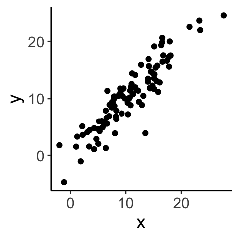
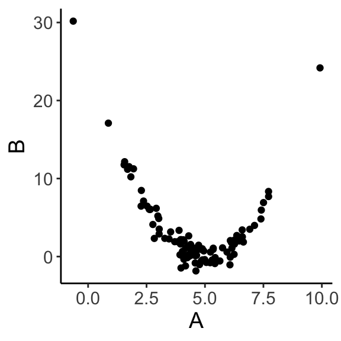

Week 9 Lecture
=============


## Week 9 Readings

For this week, I suggest reading Aho Chapters 8 and 9 up to and including Section 9.16, as well as Logan Chapter 8. I also want to share [a classic paper on how to model "scaling-type" relationships - I'm looking at you morphometrics folks!](https://github.com/hlynch/Biometry2023/tree/master/_data/Warton_etal_2006.pdf), though this is just a recommended reading and not something we will cover in Biometry.

## Correlation

Correlation and regression are two ways of looking at the relationship between two continuous variables. Correlation is testing the null hypothesis that the two variables are uncorrelated, and there is complete symmetry between the two variables. On the other hand, regression is concerned with using one variable to PREDICT another, and there is an asymmetry between the predictor and the response variable. A regression model for $Y \sim X$ is different than $X \sim Y$.

Regression and correlation are not the same.

Let’s take two paired samples A and B and introduce a quantity called the correlation coefficient r:

$$
r = \frac{Cov(A,B)}{\sqrt{Var(A) \times Var(B)}}
$$

More precisely, this is called “Pearson’s product moment correlation”.

We know from before that the sample variance of A (a.k.a. Var(A)) is given by

$$
Var(A) = \frac{1}{n-1}\sum_{i=1}^{n}(A_{i}-\bar{A})(A_{i}-\bar{A})
$$
Sample variance is the squared deviation of a random variable from its expected value, scaled by the number of data points. When we use squared deviations, our values are always positive.

Let's say $A_1 = 12$ and $\bar{A} = 14$. The squared deviation is then $(12 - 14)^2 = 4$. Now let's say $A_2 = 30$. The squared deviation is then $(30 - 14)^2 = 256$. When using squared deviations, values far away from the mean contribute greatly to the variance (they have a large influence).

By extension, the sample covariance of A and B (i.e. Cov(A,B)) is given by

$$
Cov(A,B) = \frac{1}{n-1}\sum_{i=1}^{n}(A_{i}-\bar{A})(B_{i}-\bar{B})
$$
Why do we only lose 1 degree of freedom when we have to estimate the mean of both the A group and the B group? So as not to distract from the main thread here, I have answered that below in the [FAQ](#W9FAQ).

Why does this expression make sense? The covariance measures how much two things go up and down together. 


```r
A <- c(1, 2, 3, 4)
B <- c(5, 6, 7, 8)
(1 / (length(A) - 1)) * sum((A - mean(A)) * (B - mean(B))) 
```

```
## [1] 1.666667
```

```r
B <- c(5, 4, 3, 2)
(1 / (length(A) - 1)) * sum((A - mean(A)) * (B - mean(B)))
```

```
## [1] -1.666667
```

However, the covariance isn’t meaningful by itself because it depends on the absolute scale of variability in A and B, so it has to be divided by some aggregate measure of variability in the two samples (i.e. the geometric mean). We can see this by scaling everything by a factor of 10 and recalculating Covariance:


```r
(1 / (length(A) - 1)) * sum((A - mean(A)) * (B - mean(B)))
```

```
## [1] -1.666667
```

```r
A <- A * 10
B <- B * 10
(1 / (length(A) - 1)) * sum((A - mean(A)) * (B - mean(B))) 
```

```
## [1] -166.6667
```

This is why to calculate $r$ we scale the covariance by the geometric mean of the product of the variances for the two samples. 

$$
r = \frac{Cov(A,B)}{\sqrt{Var(A) \times Var(B)}}
$$
Pearson's product moment correlation is bounded between -1 and 1. Correlation coefficients of 1 or -1 occur when you set deviations in sample $B$ to be exactly matched in sample $A$. These measures are unitless. 

Let's look at a few examples...


```
## [1] 0.07439396
```



```
## [1] 0.8736022
```

## Hypothesis testing - Pearson's *r*

Before getting into hypothesis testing, some terminology:

$\rho$=true (population) correlation coefficient of A and B

$r$=empirical (sample) correlation coefficient of A and B

How can we test hypotheses about correlation?

1. Parametric approach using distribution theory

2. Nonparametric approaches: bootstrap or randomization

We'll start with 1. If $\rho$ is the population (true) correlation coefficient of $A$ and $B$ and $r$ is the sample (empirical) correlation coefficient of $A$ and $B$, we will test whether $\rho$ is significantly different from zero.

How do we assess whether our estimate of $\rho$ (which, following our notation from earlier in the semester, we will call $\hat{\rho}$) is significantly different from zero? 

Note before we begin that calculating Pearson's correlation coefficient itself does not require that the data (what we've been calling *A* and *B*) are bivariate normal, but hypothesis testing/constructing CIs based on distribution theory does.

If $A$ and $B$ are from a bivariate normal distribution and $\rho = 0$, the sample correlation coefficient is normally distributed (for large sample sizes):

$$
r | (H_0: \rho = 0) \sim \mathrm{N} {\left( 0, \frac{1 - r^2}{n - 2} \right)}
$$

and therefore we use the following test statistic:

Then we convert this to the following test statistic: 
$$
T^* = r \sqrt{\frac{n - 2}{1 - r^2}} | (H_0: \rho = 0) \sim \mathrm{N}(0, 1)
$$

Actually, it is more precise to say that under the null hypothesis, 

$$
T^* = r \sqrt{\frac{n - 2}{1 - r^2}} | (H_0: \rho = 0) \sim t_{n-2}
$$

**Question: How did we generate this test statistic, $T^*$ from the original test statistic, *r*?**
<details>
  <summary>Click for Answer</summary>
<span style="color: blueviolet;">
By standardizing the distribution of $r | H_0$ so that the normal distribution has a standard deviation/variance of 1
</span>
</details> 

**Question: Why did we use this test statistic instead of *r*?**

<details>
  <summary>Click for Answer</summary>
<span style="color: blueviolet;">
The standard normal distribution and the t-distribution are conventional distributions with associated tables of quantiles that were used before computing was as powerful and widespread. Also, the t-distribution is more appropriate for small sample sizes (it has fatter tails).
</span>
</details> 


**Question: Where did we lose two degrees of freedom?**

<details>
  <summary>Click for Answer</summary>
<span style="color: blueviolet;">
To estimate *r*, we calculated the mean of sample A and sample B
</span>
</details> 

The Pearson's product moment correlation assumes the following about the two samples:

1. The joint distribution $(A, B)$ is bivariate normal (necessary for hypothesis testing using distribution theory)

2. The relationship between $A$ and $B$ is linear (always necessary)

3. Data are independent samples from the joint distribution.


```r
library(ggplot2)
A <- rnorm(n = 100, mean = 5, sd = 2)
A <- A[order(A)]
df <- data.frame(A = A, B = (A - 5)^2 + rnorm(n = 100, mean = 0, sd = 1))
ggplot(data = df, aes(x = A, y = B)) + geom_point() + theme_classic() + theme(text = element_text(size = text.size))
```




```r
cor(df$A, df$B)
```

```
## [1] -0.4414343
```

Even though *A* and *B* clearly have a strong relationship, correlation is only effective if the relationship is **linear**.

Other considerations:

What if the data are not bivariate normal? If sample size is large, you're probably okay.

Pearson's $r$ is also very sensitive to outliers, what can you do in that case? Robust correlation measures (Spearman's or Kendall's $r$) are robust to deviations from bivariate normality and outliers. Confidence intervals on $r$ can also be derived using bootstrap and permutation methods. As these are far more intuitive, require no assumptions, and (with modern computers) are fast, it is often better to use these other methods (which may be slightly less powerful, another topic to be covered later).

**Question: How could you bootstrap the correlation coefficient given that the samples (*A* and *B*) are paired?**

<details>
  <summary>Click for Answer</summary>
  <span style="color: blueviolet;">You need to sample (with replacement) A-B pairs. This will preserve the correlated structure of the data while allowing you to resample a "new" dataset with which to calculate a confidence interval. In other words, sample with replacement from the **row indices**, preserving the relationship between the two samples


```r
iterations <- 1000
A <- rnorm(n = 100, mean = 5, sd = 2)
B <- A - rnorm(n = 100, mean = 0, sd = 1)
cor.obs <- cor(A, B)
dat <- data.frame(A, B)
cor.boot <- c()
for (i in 1:iterations) {
  index.boot <- sample(1:nrow(dat), size = 100, replace = TRUE)
  dat.boot <- dat[index.boot, ]
  cor.boot[i] <- cor(x = dat.boot$A, y = dat.boot$B)
}
paste("The 95% confidence interval for the estimated correlation coefficient, ", round(cor.obs, digits = 3), " is (", round(quantile(cor.boot, 0.025), digits = 3), ", ", round(quantile(cor.boot, 0.975), digits = 3), ")", sep = "")
```

```
## [1] "The 95% confidence interval for the estimated correlation coefficient, 0.916 is (0.88, 0.942)"
```
</span>
</details> 

**Question: How would we conduct a permutation test for the correlation coefficient (with $H_0: \rho = 0$)?**

<details>
  <summary>Click for Answer</summary>
<span style="color: blueviolet;">
Shuffle *A* independently of *B* and calculate the correlation of the shuffled data to create a null distribution of correlations. Compare the observed correlation to this distribution.
</span>
</details> 

## Fisher's $z$

If you have large sample sizes, you can test other null hypotheses (i.e. $H_{0}: \rho=\rho_{0}$) and put confidence intervals on $\rho$ using what is called “Fisher’s transformation”. Using Fisher's $z$ transformation, we convert a statistic with a bounded distribution to an unbounded (normal) distribution. This is useful for calculating confidence intervals. Also with this method, we can test hypotheses other than $\rho = 0$. We can transform $r$ to $z$ using the the inverse hyperbolic tangent:

$$
z = 0.5 \ln \left( \frac{1 + r}{1 - r} \right) = \tanh^{-1} (r)
$$

With this transformation, $z$ is approximately normally distributed for all values of $\rho$:

$$
z \sim \mathrm{N} {\left( 0.5 \ln \left( \frac{1 + \rho}{1 - \rho} \right), \frac{1}{n - 3} \right)}
$$
Now, the test statistic that we can use to test the null hypothesis $H_0: \rho = \rho_0$ is:

$$
T^* = \frac{z - 0.5 \ln \left( \frac{1 + \rho_0}{1 - \rho_0} \right)}{\sqrt{1 / (n - 3)}} \approx \mathrm{N}(0, 1)
$$

Why did we rewrite a new test statistic (what was wrong with $z$)? The null distribution for $z$ is more difficult to reference (compared to the quantiles of the standard normal, for example). For a bit of evidence showing that both ways of writing the test statistic are fine, see the following code:


```r
A <- rnorm(n = 100, mean = 5, sd = 2)
B <- A - rnorm(n = 100, mean = 0, sd = 1)
r.obs <- cor(A, B)
# using z as test statistic
z.obs <- 0.5 * log((1 + r.obs) / (1 - r.obs)) # note that z under the null distribution is 0
pnorm(q = z.obs, mean = 0, sd = sqrt(1 / (100 - 3)), lower.tail = FALSE)
```

```
## [1] 3.744388e-58
```

```r
# using transformed test statistic, T*
test.stat <- z.obs / sqrt(1 / (100 - 3))
pnorm(q = test.stat, lower.tail = FALSE)
```

```
## [1] 3.744388e-58
```

To simply the notation, let us define

$$
\zeta_{0} = \frac{1}{2}ln\left(\frac{1+\rho_{0}}{1-\rho_{0}}\right)
$$

We can also use this to construct confidence intervals for $\zeta_{0}$:

$$
P \left( z - \frac{t_{[1 - \alpha / 2](\infty)}}{\sqrt{n - 3}} \leq \zeta_{0} \leq z + \frac{t_{[1 - \alpha / 2](\infty)}}{\sqrt{n - 3}} \right) = 1 - \alpha
$$

(Note that we need to do some back-transforming to get from here to a confidence interval on $\rho$.)

Implicit in the calculation of the correlation coefficient is that the quantities being compared are either interval or ratio variables. If this is not the case, then you need to use a more general statistical test which uses only the ranks of the data. The underlying principle is that you rank the data in each sample and then compare ranks. There are two common ones:

1.	Spearmans rank correlation: Similar to above except instead of using raw values, the data are first transformed into ranks (separately for each sample) before calculating $r$.

$$
r_{s} = \frac{Cov(ranks_A,ranks_B)}{\sqrt{Var(ranks_A) \times Var(ranks_B)}}
$$

where $ranks_A$ and $ranks_B$ are the ranks of the two datasets.

$$
r_s | H_0 \sim \sqrt{\frac{1}{n - 1}} \mathrm{N} (0, 1)
$$
Ties are dealt with in a different way (see Aho 8.3.1.1 for more detail).


```r
A <- c(2, 3, 5, 4)
B <- c(5, 6, 2, 3)
cov(rank(A), rank(B)) / sqrt(var(rank(A)) * var(rank(B)))
```

```
## [1] -0.8
```

```r
cor.test(A, B, method = "spearman")
```

```
## 
## 	Spearman's rank correlation rho
## 
## data:  A and B
## S = 18, p-value = 0.3333
## alternative hypothesis: true rho is not equal to 0
## sample estimates:
##  rho 
## -0.8
```

Q: What information is lost when using Spearman's rather than Pearson's $r$?

2.	Kendall’s $\tau$ or “Kendall’s coefficient of rank correlation”: 

The basic idea is that for sample X, you can compare all possible combinations of $X_{i}$ to see which values are larger. For a second sample Y, you can do the same. Kendall’s tau tallies how many pairs share the same relationship. If ($X_{i}$> $X_{j}$ and $Y_{i} > Y_{j}$) OR ($X_{i}< X_{j}$ and $Y_{i}< Y_{j}$), then X and Y are considered concordant for that combination. If ($X_{i}> X_{j}$ and $Y_{i}< Y_{j}$) OR ($X_{i}< X_{j}$ and $Y_{i}> Y_{j}$), then X and Y are considered disconcordant for that combination.

This is easier to describe in practice:


```r
set.seed(4306)
total <- sample(x = 1:15, size = 8)
dat <- data.frame(A = total[1:4], B = total[5:8])
dat
```

```
##    A B
## 1 10 8
## 2 15 6
## 3 14 2
## 4  3 1
```

$$
\tau = \frac{\#\text{concordant pairs} - \#\text{discordant pairs}}{0.5 n (n - 1)}
$$
where the denominator is simply the number of possible combinations.

Once we calculate $\tau$, how do we know if that value is significant or not? One method would be to do a randomization test. We can also use the following approximation for the test statistic for large (n>10) sample sizes:

$$
\tau | H_0 \sim \mathrm{N} \left( 0, \frac{2(2n + 5)}{9n (n - 1)} \right)
$$
In other words, 

$$
\frac{\tau}{\sqrt{\frac{2(2n + 5)}{9n (n - 1)}}} \sim N(0,1)
$$
so we can use the quantiles of the standard normal we are so familiar with. In practice, Pearson’s and Kendall’s rank correlation tests often give very very similar results (if not in the actual value, certainly in the inference derived from them).

## Regression

Regression is a linear model (in the vein of those we introduced last week) in which a continuous response is modeled by one or more continuous predictors. (If we have only discrete predictors we call this ANOVA...the names are silly since they are all just linear models.)

Linear regression simply finds the straight line that “best fits” a scatterplot of (x,y) data.
We will note at the outset that there are two distinct kinds of regression. 

“Type I” regression assumes that the purpose of the analysis is to use x to predict y. Therefore, we assume x is without uncertainty and we want to minimize the error with which we predict y given x.

“Type II” regression, or major axis regression (or standardized major axis regression), assumes a symmetry between X and Y and that the goal is in finding a correlation between them. Type II regression is often used when X (as well as Y) is measured with error, although see Smith (2009) for a full discussion of this interpretation.

We will start by talking about “Type I” regression which is much more common, and come back to discussing Type II regression later. I have assigned a reading for this week that goes over all of this is some more detail. Before discussing regression, it is important to note that there is a distinction between **regression** and **correlation**. In regression, you are using one or more variables to predict another variable because you believe there is a cause-and-effect relationship (X causes Y). Correlation does not imply the same cause-and-effect type relationship, it just addresses whether two variables are associated with one another (X and Y covary).

**Remember correlation does not imply causation. To address causation, you usually need to do some kind of a manipulative experiment.**

As a first start, we will discuss linear regression (We introduced this model briefly when we introduced linear models last week.)

$$
Y_{i} = \beta_{0}+\beta_{1}X_{i} + \epsilon_{i} \mbox{, where } \epsilon_{i} \sim N(0,\sigma^{2})
$$

where $\beta_{0}$ is the **intercept** and $\beta_{1}$ is the **slope**. Note that each data point $Y_{i}$ is associated with its own value of the corresponding covariate predictor ($X_{i}$) and its own sample for the residual $\epsilon_{i}$. Before we get into some more math, let's just draw some data and visualize what the slope and intercept represent. Note that we are usually just interested in the line ($\beta_{0}+\beta_{1}X$) that represents the effect of the covariate on the response variable and therefore our focus is on estimating the parameters $\beta_{0}$ and $\beta_{1}$. We are often less interested in the variance associated with $\epsilon$ but keep in mind that $\sigma$ is a third parameter of this model and also must be estimated from the data.

How do we find the line that best fits the data? Maximum likelihood!

## Estimating the slope and intercept in linear regression
The traditional "no calculus" explanation for estimating regression slope and intercept is included below for completeness, but I will bypass this more convoluted approach for now in favor of using maximum likelihood, which we already know how to do. 

Remember back to the Week 4 lab, the joint likelihood for $n$ i.i.d. Normally distributed data $Y \sim N(\mu,\sigma^{2})$ was given by:

$$
L(\mu,\sigma|Y_{1},Y_{2},...,Y_{n}) = \prod^{n}_{i=1}\frac{1}{\sqrt{2\pi\sigma^{2}}} \exp{\left(-\frac{1}{2}\frac{(Y_{i}-\mu)^{2}}{\sigma^{2}}\right)}
$$
(Before, we were calling the response variable X, but now we will switch to calling the response variable Y since we will use X for the covariates.) Here we are making one tiny change, we are replacing $\mu$ with $\beta_{0}+\beta_{1}X_{i}$ to fit the model $Y \sim N(\beta_{0}+\beta_{1}X_{i},\sigma^{2})$.

$$
L(\beta_{0},\beta_{1},\sigma|Y_{1},Y_{2},...,Y_{n}) = \prod^{n}_{i=1}\frac{1}{\sqrt{2\pi\sigma^{2}}} \exp{\left(-\frac{1}{2}\frac{(Y_{i}-(\beta_{0}+\beta_{1}X_{i}))^{2}}{\sigma^{2}}\right)}
$$

Great! Now we have a joint likelihood for the new linear regression model, and we can find the MLE for $\beta_{0}$ and $\beta_{1}$ just like we did before, by setting

$$
\frac{\partial NLL}{\partial \beta_{0}} =0
$$
and

$$
\frac{\partial NLL}{\partial \beta_{1}} =0
$$

The values of $\beta_{0}$ and $\beta_{1}$ that satisfy this equation are the maximum likelihood estimators for these two parameters. (Note that we will use this approach [writing down the joint likelihood and then minimizing with respect to the parameters] when we come to generalized linear models in another week.)

**If** these conditions are met, then the OLS estimators we just derived are the best linear unbiased estimators (BLUE) and the sampling distributions for the slope and intercept are as follows:

$$
\hat{\beta_0} \sim \mathrm{N}\left( \beta_0, \frac{\sigma_\epsilon^2 \sum_{i = 1}^n X_i^2}{n \sum_{i = 1}^n (X_i - \bar{X})^2}\right) \text{, where } \sigma_\epsilon^2 = \mathrm{E}(\epsilon_i^2)
$$
$$
\hat{\beta_1} \sim \mathrm{N}\left( \beta_1, \frac{\sigma_\epsilon^2}{\sum_{i = 1}^n (X_i - \bar{X})^2}\right) \text{, where } \sigma_\epsilon^2 = \mathrm{E}(\epsilon_i^2)
$$

*FYI:* these distributions for $\beta$ can be derived using the second derivatives of the NLL (but you don't need to be able to do this).

These equations may look complex, but there are some features that should make sense. One: The expected value of $\hat{\beta_{0}}$ is $\beta_{0}$, as you would expect for an unbiased estimator. Moreover, if $\sigma_\epsilon^2$ goes to zero, the uncertainty in the estimates go to zero. In other words, if there is no variation in the data (all data points lie exactly on the regression line), than there is no uncertainty in the value of the parameters. Also, note that as $n \rightarrow \infty$, the uncertainty goes to zero as well (again, as we would expect).

Because we do not know the population (true) error variance $\sigma_\epsilon^2$, we estimate it from the data using:

$$
s_\epsilon^2 = \frac{1}{n - p} \sum_{i = 1}^n (Y_i - \hat{Y_i})^2
$$

We substitute $s_\epsilon^2$ for $\sigma_\epsilon^2$. This is an unbiased and maximally efficient estimator for $\sigma_\epsilon^2$. $p$ is the number of parameters required to estimate $\sigma_\epsilon^2$. Note that Aho calls this mean squared error (MSE) but most sources reserve that term for the actual mean of the squared errors, whereas here we want an unbiased estimate of the variance from the large pool of residuals our own sample of residuals are drawn from. (In other words, we have $n$ data points and so our model yields $n$ residuals; these $n$ values are just a sample from a larger population of residuals and **that's** the variance we want to estimate here, so we have to divide by the degrees of freedom, which is $n-p$. There is a bit more discussion of this terminology in the lab.)

**Question: How many degrees of freedom do we have for $s_\epsilon^2$ in a simple linear regression?**

<details>
  <summary>Click for Answer</summary>
<span style="color: blueviolet;">
$n - p = n - 2$. This is because $\hat{Y}$ involves $\bar{Y}$ and $\bar{X}$. This will be different with multiple regression (regression with more than one covariate).
</span>
</details> 

**Question: What is our null hypothesis for the parameter $\beta_0$? What does it mean?**

<details>
  <summary>Click for Answer</summary>
<span style="color: blueviolet;">
$\beta_0 | H_0 = 0$. When $X = 0$ the estimated value for $Y$ is 0.
</span>
</details> 

**Question: What about for $\beta_1$?**

<details>
  <summary>Click for Answer</summary>
<span style="color: blueviolet;">
$\beta_1 | H_0 = 0$. The slope of the regression equals 0, $X$ has no linear effect on $Y$.
</span>
</details> 


The test statistic and standard error for estimating $\beta_1$:

$$
T^* = \frac{\hat{\beta_1} - \beta_{1 | H_0}}{\text{SE}_{\hat{\beta_1}}} \sim t_{n - p}
$$

$$
\text{SE}_{\hat{\beta_1}} = \sqrt{\frac{\frac{1}{n - p} \sum_{i = 1}^n (Y_i - \hat{Y_i})^2}{\sum_{i = 1}^n (X_i - \bar{X})^2}} = \sqrt{\frac{s_\epsilon^2}{\sum_{i = 1}^n (X_i - \bar{X})^2}}
$$
Note that usually we are interested in $\beta_{1|H_{0}}=0$.

We construct confidence intervals as we always have

$$
P {\left( \hat{\beta_1 } - t_{(1 - \frac{\alpha}{2}) [n - p]} \text{SE}_{\hat{\beta_1}} \leq \beta_1 \leq \hat{\beta_1 } + t_{(1 - \frac{\alpha}{2}) [n - p]} \text{SE}_{\hat{\beta_1}} \right)} = 1 - \alpha
$$

You can use similar methods to estimate the CI for $\beta_0$. We can use bootstrapping to calculate the standard error of the regression slope as well. We demonstrate this with an example on Thursday.

**Question: I've called this value $\text{SE}_{\hat{\beta_1}}$. Aho refers to it as ${\hat{\sigma}_{\hat{\beta_1}}}$. Why are these names interchangeable?**

<details>
  <summary>Click for Answer</summary>
<span style="color: blueviolet;">
The standard deviation of an estimated parameter (here, $\hat{\beta}_1$) is equal to the standard error of the parameter.
</span>
</details> 

## OK, now the "other" derivation for slope and intercept

Here I present an alternative method for estimating the slope and intercept values that does not require knowing about maximum likelihood. As you will see, it is a little convoluted, but it does define some key vocabulary along the way, so here goes...

It probably makes intuitive sense that the mean value of X should be associated with the mean value of Y and this is in fact true. The best fit line passes through ($\bar{X}$,$\bar{Y}$). \textcolor{red}{What are all the possible lines that could pass through this point?}

First, we will go over the notation for linear models (and regression specifically) we'll be using for the next couple of weeks.

| Notation | Meaning        |
| ----------- |:--------------------------------------------:|
| $Y$ | data/response variable/dependent variable | 
| $Y_i$ | value of $i^\text{th}$ data point | 
| $\bar{Y}$ | mean of data | 
| $\hat{Y}_i$ | estimate from the model for point $i$. In regression, this is $\hat{Y}_i = \beta_0 + \beta_1 X_i$ |

To make any further progress with this question, we need to “partition the variance”. We will not tackle this seriously until we get to ANOVA next week, but the basic idea is fairly straightforward.


To determine how to specifically fit slope and intercept parameters, we need to talk about partitioning variance (a goal of modeling in general, and a major part of ANOVA). When modeling, variation is either explained or unexplained. 
Let's start from the beginning with this dataset of the relative length of spider webs. Of course, our data are not all exactly the same value, there is some variation:


```r
data(webs)
ggplot(data = webs, aes(x = 1, y = length)) + geom_point(col = "gray37") + labs(x = "", y = "Relative length of spider webs") + theme_classic() +  theme(axis.title.x = element_blank(), axis.text.x = element_blank(), axis.ticks.x = element_blank(), text = element_text(size = text.size))
```


Next, we fit a model with two parameters, one parameter to describe the mean behavior of the system and one parameter to describe the amount of variation around that mean, e.g., $Y \sim \mathrm{N}(\mu, \sigma^2)$, where we estimate $\mu$ using $\overline{Y}$ (there are two parameters, but only $\mu$ describes the mean). Using this parameter $\mu$, we have explained some of that variation in our data.


```r
y.bar <- mean(webs[, 2])
ggplot(data = webs, aes(x = 0, y = length)) + geom_point(col = "gray37") + 
  geom_hline(aes(yintercept = mean(length)), col = "dodgerblue1") + 
  annotate('text', x = 0.01, y = y.bar+0.0001, label = "bar(Y)", parse = TRUE, size = 5, col ="dodgerblue1") +
  labs(x = "", y = "Relative length of spider webs") + theme_classic() +
  theme(axis.title.x = element_blank(), axis.text.x = element_blank(), axis.ticks.x = element_blank(), text = element_text(size = text.size))
```


Now, we might be able to explain more of this variation in the data if we add a covariate to the mean, so as to allow the mean to vary. This will "capture" some of the variability in the data and will leave less unexplained variation to be assigned to $\sigma$. There are three total parameters in this more complicated model, two that describe the mean and one to describe the **residual variation**. (The parameter $\sigma^2$ is playing the same role in the model as before, but because we hope that at least some of the variation is explained by the covariate, we now refer to whats left as **residual variation**.)


```r
web.fit <- lm(formula = length ~ temp.C, data = webs)
ggplot(data = webs, aes(x = temp.C, y = length)) + geom_point(col = "gray37") + 
  geom_hline(aes(yintercept = mean(length)), col = "dodgerblue1") + 
  geom_abline(intercept = web.fit$coefficients[1], slope = web.fit$coefficients[2], col = "palegreen1") +
  annotate('text', x = 12, y = y.bar, label = "bar(Y)", parse = TRUE, size = 5, col ="dodgerblue1") +
  labs(x = "Temperature (in C)", y = "Relative length of spider webs") + theme_classic() + theme(text = element_text(size = text.size))
```


The total amount of variation to be explained is called the "SST" for "sums of squares total". 

$$
\text{Sums of squares total} = \sum_{i = 1}^n (Y_i - \bar{Y})^2
$$

($n$ is the total number of data points.)

We can partition this total sums of squares into the component explain by the regression model and that which is left over as unexplained variation (which we often refer to as "error", but it is "error" in the sense that it is not explained in the model and not "error" in the sense that we have done something wrong). Note that different sources/books will use different acronyms for partitioning variation and you should not be too invested in the notation I am presenting here. The important thing is to remember the equations and the idea behind partitioning variation. The **sum of squares regression** is the amount of variation expained by the regression line, or the squared deviations from the points estimated in the regression $\hat{Y}_i$, which is described by $\hat{Y}_i = \hat{\beta_0} + \hat{\beta_1} X_i$, and the estimated mean $\bar{Y}$:

$$
\text{SSR} = \sum_{i = 1}^n{(\hat{Y}_i - \bar{Y})^2}
$$

You can think of the sum of squares regression as the amount of variation explained when going from a one parameter model describing the mean behavior ($\mu$ only) to the regression model (here, two parameters describing the mean behavior of the model, $\beta_0$ and $\beta_1$).


```r
x.i <- webs[36, 3]
y.i.hat <- web.fit$coefficients[1] + web.fit$coefficients[2] * x.i
ggplot(data = webs, aes(x = temp.C, y = length)) + geom_point(col = "gray37") + 
  geom_point(x = x.i, y = y.i.hat, col = "palegreen3", size = 3) + 
  annotate(geom = "text", x = x.i + 1.5, y = y.i.hat, label = "hat(Y[i])", parse = TRUE, col = "palegreen3", size = 5) +
  geom_hline(aes(yintercept = mean(length)), col = "dodgerblue1") + 
  geom_abline(intercept = web.fit$coefficients[1], slope = web.fit$coefficients[2], col = "palegreen1") +
  annotate("text", x = 12, y = 0.9987, label = "bar(Y)", parse = TRUE, size = 5, col ="dodgerblue1") +
  labs(x = "Temperature (in C)", y = "Relative length of spider webs") + theme_classic() + theme(text = element_text(size = text.size))
```


The **sum of squares error** is the amount of variation *not* expained by the regression line, or the squared deviations from the actual data points themselves, $Y_i$, and the points estimated by the regression $\hat{Y}_i$:

$$
\text{SSE} = \sum_{i = 1}^n{(Y_i - \hat{Y}_i)^2}
$$

The sum of squares error is the remaining (unexplained, residual) error after modeling.

Again, $\hat{Y}_i = \beta_0 + \beta_1 X_i$, or the *Y* value predicted by the regression model. The best fit line minimizes the sum of squares error. All errors (residuals) are the **vertical** distances from the data points to the points estimated in the regression. This is because all error exists with respect to the response variable (here, $Y$) only. *Note that there all alternatives to minimizing the sum of squares error that we will briefly discuss later.*


To estimate $\beta_0$ and $\beta_1$, we could use multiple approaches. We could use the method we have been discussing, minimizing the sums of squares error, which is called **ordinary least squares** (OLS). We could also use maximum likelihood. As long as the assumptions of regression are met, these two methods are equivalent.

The best fit line will pass through $(\bar{X}, \bar{Y})$ because this is the "center mass" of the data and because we assumed the expected value of the errors is zero. We use this fact (and some algebra) to show:

$$
\bar{Y} = \hat{\beta_0} + \hat{\beta_1} \bar{X}
$$

$$
\hat{\beta_0} = \bar{Y} - \hat{\beta_1} \bar{X}
$$

Then, we solve for $\hat{\beta_1}$ by plugging in what we know back into the equation for SSE:

$$
\text{SSE} = \sum_{i = 1}^n{(Y_i - \hat{Y}_i)^2} = \sum_{i = 1}^n{(Y_i - \hat{\beta_0} - \hat{\beta_1} X_i)^2} = \sum_{i = 1}^n{(Y_i - \bar{Y} + \hat{\beta_1} \bar{X} - \hat{\beta_1} X_i)^2}
$$

Then we only have one unknown left $\text{SSE} = f(\hat{\beta_1})$, so we can minimize the function by taking the derivative with respect to $\hat{\beta_1}$ and set it equal to 0.

$$
\frac{\partial \text{SSE}}{\partial \hat{\beta_1}} = 0
$$

After working this out,

$$
\hat{\beta_1} = \frac{\sum_{i = 1}^n (X_i - \bar{X})(Y_i - \bar{Y})}{\sum_{i = 1}^n (X_i - \bar{X})^2}
$$

Try this derivation yourself and then check your work [here](http://seismo.berkeley.edu/~kirchner/eps_120/Toolkits/Toolkit_10.pdf).

## Assumptions of regression

$$
Y_{i} = \beta_{0}+\beta_{1}X_{i} + \epsilon_{i} \mbox{, where } \epsilon_{i} \sim N(0,\sigma^{2})
$$

1.	A linear model appropriately described the relationship between X and Y.
2.	For any given value of X, the sampled Y values are independent with normally distributed errors.
We can express this assumption as follows:

$E[\epsilon_{i}]=0$

$E[(\epsilon_{i})^{2}]=\sigma_{\epsilon}^{2}$

$E[(\epsilon_{i})(\epsilon_{j})]=0 \mbox{, where } i \neq j$

3.	Variances are constant along the regression line.  (Non-constant variances are an example of heteroskedacity. More on this in a second.)
4.	An implicit assumption is that the regression fit is only valid over the range of X represented in the original data. It is very dangerous to extrapolate outside the range over which the regression line was originally fit.


Our model allows us to make a prediction about the response expected for any given value of X, which may be a value of X in the original dataset or it may be a value of X **not** in the original dataset. (The model is only valid for X values contained within the range of the original data; more on this later.) We will refer to a new X value as $X^{*}$ and the corresponding estimates for Y as $\hat{Y}$. Don't forget that the fitted $\hat{Y}$ values are also estimated quantities, and as such come with uncertainty (i.e. standard errors and confidence intervals). It turns out there are really two ways to express “confidence”: one of which we call a "confidence interval", the other we call a "prediction interval". 

## Confidence vs. Prediction intervals

One way is to ask about variability in our predicted values is: “What are the 1-$\alpha$ confidence intervals on the **mean** value of Y given $X^{*}$”? Equivalently, confidence intervals for $\hat{Y}$ mean, "there is a 95% chance that my 95th percentile CIs include the true underlying population parameter value, which is the **mean value** of $\hat{Y}$ ($\mathrm{E}[Y|X^{*}]$)."

We calculate the CIs using

$$
\hat{Y^*} \pm t_{(1 - \frac{\alpha}{2}) [n - p]} \sqrt{s_\epsilon^2 {\left(\frac{1}{n} + \frac{(X^* - \bar{X})^2}{\sum_{i = 1}^n (X_i - \bar{X})^2}\right)}}
$$

Note the notation here. The above equation represents the confidence intervals on $Y$ associated with the value $X^*$. The "hat" on Y reflects the fact that Y is an estimate based on the data, and the "star" is just meant to remind you that this interval is associated with the specific X value $X^*$.

However, there is a second way to think about uncertainty in the response value. In stead of wanting to know our uncertainty in the MEAN predicted value, we may want an estimate for the variation expected for a future value of $Y$ for a given $X^{*}$. Our estimates of uncertainty for the predicted values take into account both the mean of $\hat{Y_h}$ (uncertainty in the regression line itself) as well as the variance in $\hat{Y_h}$. These are called **prediction intervals** (PIs).

We calculate PIs using

$$
\hat{Y^*} \pm t_{(1 - \frac{\alpha}{2}) [n - p]} \sqrt{s_\epsilon^2 {\left( 1 + \frac{1}{n} + \frac{(X^* - \bar{X})^2}{\sum_{i = 1}^n (X_i - \bar{X})^2}\right)}}
$$

**Question: What is the difference between these two formulas? Does it make sense why they are different?**

<details>
  <summary>Click for Answer</summary>
<span style="color: blueviolet;">
The formula for the prediction interval has a 1 in the parenthesis, which is associated with the addition of $s^{2}_{\epsilon}$. This should make sense because it is the residual uncertianty that is being added to the uncertainty in the best fitting line itself. Prediction intervals are always wider than confidence intervals.
</span>
</details> 


```r
webs$CIl <- predict(web.fit, interval = "confidence")[, 2]
webs$CIu <- predict(web.fit, interval = "confidence")[, 3]
webs$PIl <- predict(web.fit, interval = "prediction")[, 2]
webs$PIu <- predict(web.fit, interval = "prediction")[, 3]
ggplot(data = webs, aes(x = temp.C, y = length)) + geom_point(col = "gray37") + 
  geom_line(aes(x = temp.C, y = CIl), linetype = "dashed", col = "dodgerblue1") +
  geom_line(aes(x = temp.C, y = CIu), linetype = "dashed", col = "dodgerblue1") +
  geom_line(aes(x = temp.C, y = PIl), linetype = "dotted", col = "slateblue1") +
  geom_line(aes(x = temp.C, y = PIu), linetype = "dotted", col = "slateblue1") +
  geom_abline(intercept = web.fit$coefficients[1], slope = web.fit$coefficients[2], col = "palegreen1") +
  labs(x = "Temperature (in C)", y = "Relative length of spider webs") + theme_classic() + theme(text = element_text(size = text.size))
```


Remember: Confidence intervals represent our uncertainty about where the line should be (the mean behavior). Prediction intervals represent our certainty about the predicted values you could expect (the mean behavior + the variance).

We can confirm the interpretation of the confidence interval by bootstrapping our data and refitting a line each time.


```r
webs$CIl <- predict(web.fit, interval = "confidence")[, 2]
webs$CIu <- predict(web.fit, interval = "confidence")[, 3]
webs$PIl <- predict(web.fit, interval = "prediction")[, 2]
webs$PIu <- predict(web.fit, interval = "prediction")[, 3]
p<-ggplot(data = webs, aes(x = temp.C, y = length)) + geom_point(col = "gray37") + 
    geom_line(aes(x = temp.C, y = CIl), linetype = "dashed", col = "dodgerblue1") +
    geom_line(aes(x = temp.C, y = CIu), linetype = "dashed", col = "dodgerblue1") +
    geom_line(aes(x = temp.C, y = PIl), linetype = "dotted", col = "slateblue1") +
    geom_line(aes(x = temp.C, y = PIu), linetype = "dotted", col = "slateblue1") +
    labs(x = "Temperature (in C)", y = "Relative length of spider webs") + theme_classic() + theme(text = element_text(size = text.size))
for (i in 1:100)
{
  selection<-sample(1:nrow(webs),replace=T)
  webs.bootstrapped<-webs[selection,]
  web.fit.new <- lm(formula = length ~ temp.C, data = webs.bootstrapped)
  p<-p+geom_abline(intercept = web.fit.new$coefficients[1], slope = web.fit.new$coefficients[2], col = "palegreen1")
}
p<-p+ geom_line(aes(x = temp.C, y = CIl), linetype = "dashed", col = "dodgerblue1") +
  geom_line(aes(x = temp.C, y = CIu), linetype = "dashed", col = "dodgerblue1")  +
  geom_line(aes(x = temp.C, y = PIl), linetype = "dotted", col = "slateblue1") +
  geom_line(aes(x = temp.C, y = PIu), linetype = "dotted", col = "slateblue1") 
plot(p)
```


Notice that the confidence intervals "capture" the range of possible regression lines created by fitting a linear model to the bootstrapped datasets (each "playing the role"" of a re-do of the original data collection.)


**Question: Why are confidence and prediction intervals "bow-tie" shaped, i.e. wider further away from the middle of the line?**

<details>
  <summary>Click for Answer</summary>
<span style="color: blueviolet;">
Mathematically, the squared deviation from $\bar{X}$ is greater as you move away from $\bar{X}$, which increases $\text{SE}_{\hat{Y}}$. Intuitively, we can think about it this way: Because the best fitting line *has* to go through ($\bar{X},\bar{Y}$), the confidence interval is narrowest at this point. Away from ($\bar{X},\bar{Y}$), we have the additional uncertainty about what the slope should be moving away from ($\bar{X},\bar{Y}$), and so the intervals "grow" as you move away from this point.
</span>
</details> 

## How do we know if our model is any good?

Earlier we determined that we fit our regression by minimizing the sum of squares error (SSE). However, SSE depends on the units of the dependent variable, so that doesn't help us decide if the model fits "well" (e.g., the model could be a best fit line, but still not very good). However, we can use the total variation, partitioned into 1) the explained variation in the regression, SSR, and 2) the unexplained residual variance, SSE, to create a useful metric of model fit.

$$
\sum_{i = 1}^n (Y_i - \bar{Y})^2 = \sum_{i = 1}^n (\hat{Y_i} - \bar{Y})^2 + \sum_{i = 1}^n (Y_i - \hat{Y}_i)^2
$$
On the left side is the total sum of squares (SST), or how much each data point differs from the mean. The first term on the right is the sum of squares regression (SSR), or the amount of variation explained by the regression. The final term on the right is the sum of squares error (SSE), or how much each data point deviates from the best fit line.

The **coefficient of determination** $R^2$ is the proportion of variation in $Y$ explained by the regression model. Think of it like the ratio of variance explained relative to the total amount of variation in the data.

$$
R^2 = \frac{\text{SSR}}{\text{SST}}
$$

The coefficient of determination ranges from 0 to 1. It is equivalent to the square of Pearson's $r$. High $R^2$ means that the model has explanatory power. However, it is not evidence that the relationship is causal.

Lets go back to our calculations, and think about how many degrees of freedom we had for each

1.	Total sum of squares = SST = $\sum_{i=1}^{n}(Y_{i}-\bar{Y})(Y_{i}-\bar{Y})$. This required one parameter $\bar{Y}$, be estimated from the data, so there remain n-1 degrees of freedom.

2. Sum of squared error = SSE = $\sum_{i=1}^{n}(Y_{i}-\hat{Y_{i}})(Y_{i}-\hat{Y_{i}})$. This required estimation of $\hat{Y_{i}}$, which used two estimated parameters (slope and intercept) $\rightarrow$ n-2 d.o.f. remain.

3. Regression model sum of squares SSR: The regression d.o.f. reflect the number of *extra* parameters involved in going from the null model ($\bar{Y}$) to the regression model, which in this case is 1. 

##Robust regression

Ordinary Least Squares regression as defined above is fairly sensitive to outliers, which can be seen in the definition of SSE:

$$
SSE = \sum_{i=1}^{n}(Y_{i}-\hat{Y_{i}})^{2}
$$
Because we square the residuals, points that are far off the regression line have more influence on the estimates of intercept and slope than points that are much closer to the best fit line. There are several methods that are more robust against outliers. Not surprisingly, these fall under the heading of “robust regression”.

The most common robust regression approach is called M-estimation. **M-estimation** minimizes any monotonic function of the error, allowing for methods other than squared error. These functions may associate less of a "cost" with having a large residual, or they may even have a saturation point which defines the maximum influence any point can have.

In other words, the metric that is being minimized can be any function f() of the difference between each point and the best-fit line:

$$
\sum_{i = 1}^n f(Y_i - \hat{Y_i})
$$
Visualizing M-estimation (these are four functions, $\rho$, that can be used to model the error, $x$):

<div class="figure" style="text-align: center">

<p class="caption">(\#fig:unnamed-chunk-18)Possible shapes for the weighting function in robust regression. Source: Wikimedia Commons</p>
</div>

We won't get into the mathematics, because they are complex (another benefit of least squares is simpler math) but it's an avenue you may use in the future and is good to know about.

## Robust regression
Sometimes the relationship between X and Y is not linear and cannot be made linear using a transformation of the variables. In this case, you can carry out a non-parametric test for regression. Here we will discuss Kendall’s robust line fitting method.

Step 1 – Order the x and y values in order of increasing $X$ value
Step 2 – Compute the slope between every pair of $X$ values

$$
\mbox{Slope between i and j} = \frac{Y_{j}-Y_{i}}{X_{j}-X_{i}}
$$
Step 3 –

$$
\widehat{\mbox{Slope}}_{non-parameteric} = \mbox{median of slopes}
$$
$$
\widehat{\mbox{Intercept}}_{non-parameteric} = \mbox{median of } Y_{i}-\widehat{\mbox{Slope}}_{non-parametric}X_{i}
$$
**Question: How to know if the slope is significant?** 

<details>
  <summary>Click for Answer</summary>
<span style="color: blueviolet;">Use Kendall’s rank correlation test.
</span>
</details> 

## Type I and Type II Regression

We have only discussed Type I regression up to this point. With Type I regression, we use $X$ to predict $Y$, and have only minimized the error in $Y$. This means that we have assumed that there is no error in $X$ ($X$ is fixed and not random). 

However, in many cases there could be error in $X$.  **Major axis regression** and **standardized major axis regression** (Type II or Model II regressions) model variance in both the explanatory and response variables. Importantly, however, these methods to not strictly predict $Y$ from $X$, but rather calculate the major axis of variation in the bivariate dataset $X$ and $Y$. This means Type II regression models are not suggested for prediction.

Major axis regression places equal weight on deviations in the $X$ and $Y$ directions and minimizes the sum of squared **perpendicular distances** to the best fit line. The major axis regression line is the first principal component from PCA (stay tuned). This requires that $X$ and $Y$ are measured on the same scale, using the same units. 

Standardized major axis regression standardizes each variable by its own variance and then fits a best fit line, so that deviations in $X$ and $Y$ are weighted accordingly.

When is MA and SMA used? (1) In tests of isometry, allometry, stoichiometry (is the relationship between X and Y 1? Is the ratio of C:N 1?), (2) Testing if two methods of measurement agree.


## Week 9 FAQ {#W9FAQ}

**Question: Why do we divide by n-1 in the denominator of the sample covariance?**

The sample covariance is given by

$$
Cov(A,B) = \frac{1}{n-1}\sum_{i=1}^{n}(A_{i}-\bar{A})(B_{i}-\bar{B})
$$
The best way of thinking about this is as follows: We start with 2n degrees of freedom, n for the A data and n for the B data. Where we lose degrees of freedom may be seen by re-writing the product in the sum as follows:

$$
\sum_{i=1}^{n}(A_{i}-\bar{A})(B_{i}-\bar{B})=\sum_{i=1}^{n}A_{i}(B_{i}-\bar{B})-\sum_{i=1}^{n}\bar{A}(B_{i}-\bar{B})
$$

We have terms on the left hand side, and lose one degree of freedom for the use of $\bar{B}$ in each term (for a total of $n$ d.o.f. lost) and we lose one additional d.o.f. for the one use of ̅$\bar{B}$ in the second term. Therefore we end up with $2n-n-1=n-1$ degrees of freedom for the whole product.
